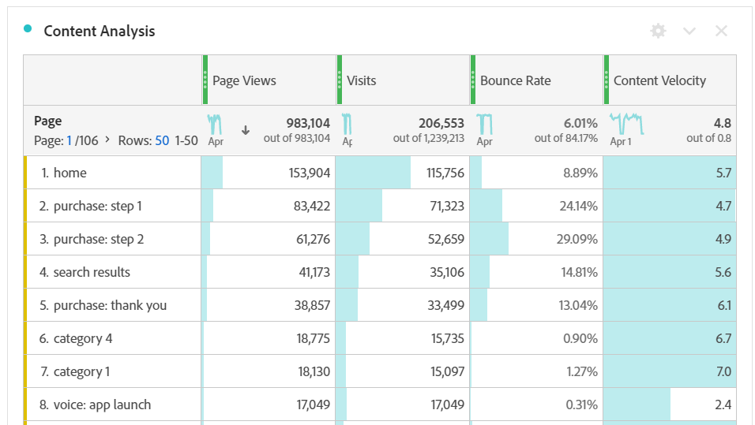

# Innehållshastighet

Med det beräknade innehållshastighetsmätningen kan du mäta hur en dimension (vanligtvis [[!UICONTROL Page]](/help/components/dimensions/page.md)) bidrar till att användarna spenderar tid på din webbplats eller app.

Det här måttet använder [Deltagandeattribuering](/help/analyze/analysis-workspace/attribution/models.md) på måttet för [sidvisningar](page-views.md) som en del av beräkningen. När man träffar en sida vid besöket får alla sidor som tidigare träffats under samma besök också poäng för sidvisningen. Den här formeln innebär vanligtvis att ju tidigare en sida trycks ned under ett besök, desto mer kredit får den. (Se [Sidvyer (deltagande) | Mer information finns på ) eller &#39;Besök deltagandet&#39;](#page-views-participation--visit-or-visit-participation) .)

## Beräkning

Innehållshastighet är en standardberäknad [metrisk](overview.md) och formeln `Page views (Visit participation)` dividerad med `Visits` används.

## Vanliga användningsområden

[!UICONTROL Content Velocity] används vanligtvis i innehållsanalys tillsammans med andra nyckelmått som [!UICONTROL Page Views], [!UICONTROL Visits] och [!UICONTROL Bounce Rate].

## Exempel

I följande exempel bryts de två delarna av innehållets hastighet: &quot;Sidvyer (deltagande) | Besök) och Besök.

### Sidvyer (deltagande | Besök) eller Besök deltagandet

Tänk på följande exempel på hur besöksdeltagandet påverkar attribuering:

På en webbplats besöker en användare följande sidor i den här ordningen:

* Sida A
* Sida B
* Sida C
* Sida D

I exemplet ovan skulle Page A få en belöning för 4 träffar, Page B för 3 träffar, Page C för 2 träffar och Page D för 1 träffar.

I följande exempel visas samma princip, men vissa sidor besöktes mer än en gång.

* Sida A
* Sida B
* Sida C
* Sida B
* Sida D
* Sida A

I exemplet ovan får sida A krediter för 7 träffar, sida B för 8 träffar, sida C för 4 träffar och sida D för 2 träffar.

### Besök

Efter det att besökets deltagande har beräknats delas resultatet av antalet besök.
