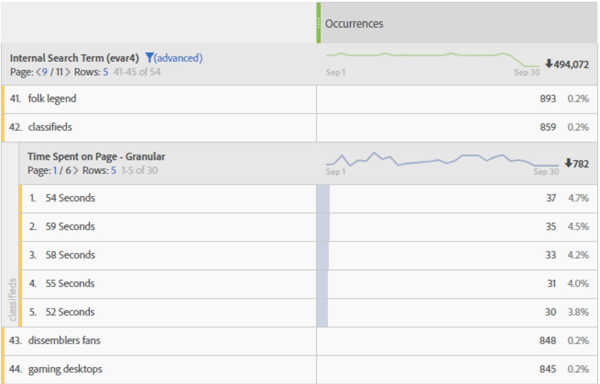

# Tidsåtgång - översikt

Olika [!UICONTROL 'time spent'] [mått ](overview.md) och dimensioner erbjuds för alla Adobe Analytics-produkter. Den här sidan kan hjälpa dig att tolka den dimension eller det mått som du vill ha.

## Mätvärden för hur lång tid som har tillbringats

| Mått | Definition | Finns i |
|---|---|---|
| [[!UICONTROL Total seconds spent]](total-seconds-spent.md) | Representerar den totala tiden som besökare interagerar med en viss dimensionspost. Inkluderar förekomsten av ett värde och beständighet i alla efterföljande träffar. När det gäller proppar räknas även den tid som tillbringats över efterföljande länkhändelser. | Analysis Workspace, Report Builder (kallas&quot;total tid spenderad&quot;), Data Warehouse |
| [[!UICONTROL Time spent per visit] (sekunder)](time-spent-per-visit.md) | Ungefär *Totalt antal sekunder som använts/besöksgränser*  Representerar den genomsnittliga tiden som besökare interagerar med en viss dimensionspost under varje besök. **Obs!**: Det här måttet kan inte beräknas separat eftersom nämnaren för den här funktionen är ett internt mått. | Analysis Workspace |
| [[!UICONTROL Time spent per visitor] (sekunder)](time-spent-per-visitor.md) | Ungefär *Totalt antal sekunder per besökare*  Representerar den genomsnittliga tiden som besökare interagerar med ett visst dimensionsobjekt under besökarens livstid (längden på deras cookie). **Obs!**: Det här måttet kan inte beräknas separat eftersom nämnaren för den här funktionen är ett internt mått. | Analysis Workspace |
| [!UICONTROL Time Spent/User (State)] | Ungefär *Totalt antal sekunder av mobilappar/unika besökare av mobilappar*  Representerar den genomsnittliga tiden som mobilappsbesökare interagerar med ett visst dimensionsobjekt under besökarens livstid (längden på deras cookie). **Obs!**: Det här måttet kan inte beräknas separat eftersom nämnaren för den här funktionen är ett internt mått. | Analysis Workspace |
| [[!UICONTROL Average time spent on site] (sekunder)](average-time-on-site.md) | Representerar den totala tiden som besökare interagerar med en viss dimensionspost, per sekvens med en dimensionspost. Det är inte bara begränsat till &quot;webbplats&quot;-medelvärden som namnet antyder. Mer information om sekvenser finns i avsnittet &quot;Hur tidsåtgången beräknas&quot;. **Obs!**: Det här måttet skiljer sig med största sannolikhet från Tidsåtgång per besök på en dimensionspostnivå på grund av skillnaderna i nämnaren i beräkningen. | Analysis Workspace, Report Builder (visas på några minuter) |
| [[!UICONTROL Average time on site]](average-time-on-site.md) | Detta är samma mått som *Genomsnittlig tid på platsen (sekunder)*, utom formaterad som Tid (`hh:mm:ss`) | Analysis Workspace |
| [!UICONTROL Average time spent on page] | Undertryckt mätvärde.  I stället rekommenderar Adobe att du använder [[!UICONTROL Average time spent on site]](average-time-on-site.md) om medeltiden för ett dimensionsobjekt behövs. | Report Builder (när det finns en dimension i begäran) |

## Dimensioner för använd tid

| Dimension | Definition | Finns i |
| --- | --- | --- |
| [[!UICONTROL Time spent per visit - granular]](../dimensions/time-spent-per-visit.md) | Den totala tid som tillbringats under besöket trunkerades till närmaste sekund och tillämpades på varje träff som ingick i besöket. Detta är en besöksnivådimension. | Analysis Workspace |
| [[!UICONTROL Time spent per visit - bucketed]](../dimensions/time-spent-per-visit.md) | Det granulerade måttet inkapslat i 9 olika intervall. Detta är en besöksnivådimension. Intervall:<ul><li>Mindre än 1 minut</li><li>1-5 minuter</li><li>5-10 minuter</li><li>10-30 minuter</li><li>30-60 minuter</li><li>1-2 timmar</li><li>2-5 timmar</li><li>5-10 timmar</li><li>10-15 timmar</li></ul>**Obs!**: Det kan inte finnas fler bucklor än detta, eftersom ett besök förfaller efter 12 timmars aktivitet. | Analysis Workspace, Report Builder |
| [[!UICONTROL Time spent on page - granular]](../dimensions/time-spent-on-page.md) | Total tid som tillbringats för varje träff, trunkerad till närmaste sekund. Det här är en träffnivådimension och innehåller både sidvyer och länkhändelser. Trots sitt namn är det inte begränsat till siddimensionen. | Analysis Workspace |
| [[!UICONTROL Time spent on page - bucketed]](../dimensions/time-spent-on-page.md) | Den granulerade dimensionen är inkapslad i 10 olika intervall, men den blockerade dimensionen räknar bara sidvyer (och utelämnar länkarhändelser). Det här är en träffnivådimension. Intervall:<ul><li>mindre än 15 sekunder</li><li>15 till 29 sekunder</li><li>30 till 59 sekunder</li><li>1 till 3 minuter</li><li>3 till 5 minuter</li><li>5 till 10 minuter</li><li>10 till 15 minuter</li><li>15 till 20 minuter</li><li>20 till 30 minuter</li><li>mer än 30 minuter</li></ul> | Analysis Workspace |

## Hur&quot;Tidsåtgång&quot; beräknas

Adobe Analytics använder explicita värden (inklusive länkhändelser och videovyer) för att beräkna hur lång tid som läggs på.

>[!NOTE]
>
>Utan länkhändelser som [!UICONTROL Video Views] eller [!UICONTROL Exit Links] går det inte att känna till hur lång tid som har ägnats åt det senaste besöket. Av liknande anledningar har [!UICONTROL Bounce Visits] (dvs. besök med en enda träff) inte heller någon associerad tid.

**Täljaren** i beräkningar för all tid är antalet sekunder som har använts.

**nämnaren** är inte tillgänglig som ett separat mått i Adobe Analytics. Nämnaren är sekvenser för&quot;tidsåtgången&quot; på träffnivå. En sekvens är en sekvens med träffar där en viss variabel innehåller samma värde (antingen genom att den ställs in, sprids framåt eller beständig). &quot;Sprid framåt&quot; avser varaktigheten för avtryck mellan sidvyer (dvs. över efterföljande länkhändelser) för beräkning av hur lång tid som läggs på.

* Om det till exempel gäller [!UICONTROL Page Name] eller andra dimensioner på träffnivån är nämnaren i stort sett [!UICONTROL 'Instances'] eller [!UICONTROL 'Page Views'], men med omladdningar och borttagna värden (t.ex. länkhändelser) räknade som en enda interaktion (en sekvens).

* Studs- och exit-träffar tas också bort från nämnaren eftersom &quot;tidsåtgången&quot; inte kan identifieras.

## Vanliga frågor

+++Kan alla mått för hur lång tid som spenderas användas på alla dimensioner?

De tidsmått som kan användas för alla dimensioner är:

* [[!UICONTROL Total seconds spent]](total-seconds-spent.md)

* [[!UICONTROL Time spent per visit] (sekunder)](time-spent-per-visit.md)

* [[!UICONTROL Time spent per visitor] (sekunder)](time-spent-per-visitor.md)

* [[!UICONTROL Average time spent on site] (sekunder)](average-time-on-site.md)

+++

+++Vilken tid används bäst för indelning med andra dimensioner?

Dimensionen [[!UICONTROL Time Spent on Page – granular]](../dimensions/time-spent-on-page.md) är en dimension på träffnivå. Om du delar upp det här med en annan dimension kommer du att se i vilka sekunder en träff varade där även nedbrytningsdimensionen fanns.
I exemplet nedan associeras söktermen&quot;klassificeringar&quot; med träfftider på 54 sekunder, 59 sekunder osv., vilket kanske anger att besökarna spenderar tid på att läsa innehåll som returnerats för den perioden.

+++

+++Vilket mått är lämpligt för dimensionen för [!UICONTROL Time Spent on Page – granular]?

Alla mätvärden. Dimensionen visar hur lång tid som har ägnats åt den exakta träffen där händelsen inträffade. Högre tidsåtgång innebär att en besökare stannar längre på en sida (träff) där händelsen inträffade.

+++

+++Hur skiljer sig [!UICONTROL Average Time Spent on Site] från [!UICONTROL Time Spent per Visit]?

Skillnaden är nämnaren i måttet:

* [[!UICONTROL Average time spent on site]](average-time-on-site.md) använder sekvenserna som innehåller en dimensionspost.

* [[!UICONTROL Time spent per visit]](time-spent-per-visit.md) använder antalet besök

Därför kan dessa mått ge liknande resultat på besöksnivå, men skiljer sig åt på en träffnivå.

+++

+++Varför matchar inte summorna med [!UICONTROL Average Time Spent on Site] det överordnade radobjektet?

Eftersom [!UICONTROL Average Time Spent on Site] är beroende av obrutna sekvenser av en dimension, och den inre rapporten inte är beroende av den yttre rapporten när de här körningarna beräknas.

Ta till exempel följande besök.

| Träff # | 1 | 2 | 3 |
|---|---|---|---|
| **Sekunder** | 30 | 100 | 10 |
| **Sidnamn** | Startsida | Produkt | Startsida |
| **Datum** | 1 januari | 1 januari | 1 januari |

Vid beräkning av den tid som tillbringats för hemsidan skulle det vara (30+10)/2=20, men om du delar upp den per dag skulle det ge (30+10)/1=40 eftersom dagen har en enda obruten serie som börjar den 1 januari.

Därför kan dessa mått ge liknande resultat på besöksnivå, men skiljer sig åt på en träffnivå.

+++

## Exempel på [!UICONTROL Time Spent]-beräkningar

Anta att följande uppsättning serversamtal är för en enskild besökare vid ett enda besök:

| Besök träffnummer | 1 | 2 | 3 | 4 | 5 | 6 | 7 |
|---|---|---|---|---|---|---|---|
| **Besök förfluten tid (i sek)** | 0 | 30 | 80 | 180 | 190 | 230 | 290 |
| **Sekunder** | 30 | 50 | 100 | 10 | 40 | 60 | - |
| **Träff-typ** | Sida | Länk | Sida | Sida | Sida | Sida | Sida |
| **Sidnamn** | Startsida | - | Produkt | Startsida | Hem (ladda om) | Kundvagn | Orderbekräftelse |
|  |  |  |  |  |  |  |  |
| **prop1** | A (uppsättning) | A (Sprid över) | inte inställd | B (ange) | B (ange) | A(set) | C (ange) |
| **prop1 sekunder som använts** | 30 | 50 | - | 10 | 40 | 60 | - |
|  |  |  |  |  |  |  |  |
| **eVar1** | Röd (ange) | Röd (beständig) | (utgången) | Blå (ange) | Blå (ange) | Blå (beständig) | Röd (ange) |
| **eVar1 sekunder som använts** | 30 | 50 | - | 10 | 40 | 60 | - |

Baserat på tabellen ovan beräknas tidsåtgången enligt följande:

| prop1 | Totalt antal sekunder som använts | Tid per besök | Tid per besökare | Antal sekvenser | Genomsnittlig tid på webbplatsen |
|---|---|---|---|---|---|
| A | 30+50+60=140 | 140/1=140 | 140/1=140 | 2 | 140/2=70 |
| B | 10+40=50 | 50/1=50 | 50/1=50 | 1 | 50/1=50 |
| C | 0 | 0 | 0 | 0 | 0 |
| Otilldelad tid | 100 | - | - | - | - |

| eVar1 | Totalt antal sekunder som använts | Tid per besök | Tid per besökare | Antal sekvenser | Genomsnittlig tid på webbplatsen |
|---|---|---|---|---|---|
| Röd | 30+50=80 | 80/1=80 | 80/1=80 | 1 | 80/1=80 |
| Blå | 10+40+60=110 | 110/1=110 | 110/1=110 | 1 | 110/1=110 |
| Otilldelad tid | 100 | - | - | - | - |

Tidsåtgång per besök (i korthet): 290
Tid som använts på sidan (granulärt): 10, 30, 40, 50, 60, 100

Ytterligare några kommentarer som stöder exemplet:

* Alla tidsberäkningar baseras på den tid som förflutit, som börjar vid noll första besöket.

* &quot;Sekunder som har använts&quot; är skillnaden mellan tidsstämpeln för den aktuella träffen och tidsstämpeln för nästa träff. Därför har den senaste besöksträffen (och studenterna) ingen tid tillbringats.

* En &quot;sekvens&quot; är en sekventiell uppsättning träffar där en viss variabel innehåller samma värde (antingen genom att den ställs in, sprids framåt eller beständig). Exempel: prop1 &quot;A&quot; har två sekvenser: träffar 1 och 2 och trycker på 6. Värden för den senaste träffen av besöket startar inte en ny sekvens eftersom den senaste träffen inte har någon tid. Genomsnittlig tid som använts på webbplatsen använder sekvenser i nämnaren.

   * För den tid som används är props&quot;spridda framåt&quot; från sidträffar till efterföljande länkträffar som visas ovan för prop1 vid träff 2. Detta gör att det värde som ställdes in för prop1 vid träff 1 (&quot;A&quot;) kan samla tiden som användes för träff 2.

   * eVars ackumulerar tid som tillbringats på en träff där eVarna är inställd eller bestående. eVarnas beständighet definieras av inställningarna för eVar i Analytics > Admin.
