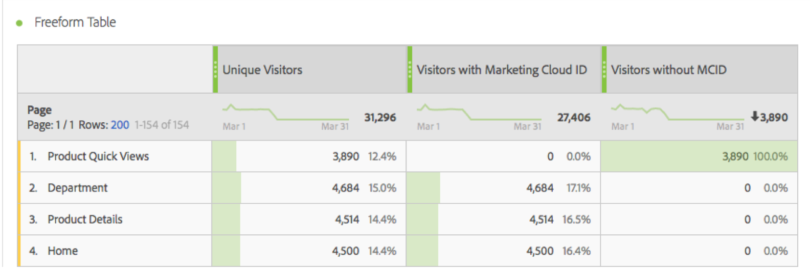

# Besökare med Experience Cloud ID

Besökarna med Experience Cloud-ID [måttet](overview.md) visar antalet unika besökare som identifieras av Adobe med hjälp av [Experience Cloud-ID-tjänsten](https://experienceleague.adobe.com/docs/id-service/using/home.html). Det här måttet är användbart om du vill jämföra med [Unika besökare](unique-visitors.md) för att se till att de flesta besökare på webbplatsen använder ID-tjänsten. Om en stor del av besökarna inte använder ID-tjänstens cookies kan det tyda på ett problem i implementeringen.

>[!NOTE]
>
>Detta mått är särskilt viktigt vid felsökning om du använder flera Experience Cloud-tjänster, som Adobe Target eller Adobe Audience Manager. Segment som delas mellan olika Experience Cloud-produkter innehåller inte besökare utan ett Experience Cloud-ID.

## Hur det här måttet beräknas

Det här måttet är baserat på [Unika besökare](unique-visitors.md)-måttet, förutom att det endast omfattar individer som identifieras med frågesträngen `mid` (baserat på cookien [`s_ecid`](https://experienceleague.adobe.com/docs/core-services/interface/ec-cookies/cookies-analytics.html)).

## Felsöka konfigurationen av ditt Experience Cloud ID

Mätvärdet &quot;Besökare med Experience Cloud ID&quot; kan vara användbart vid felsökning av Experience Cloud-integreringar eller vid identifiering av områden på webbplatsen som inte har tillgång till ID-tjänsten.

Dra&quot;Besökare med Experience Cloud ID&quot; sida vid sida med unika besökare för att jämföra dem:

I det här exemplet ska du lägga märke till att varje sida har samma antal unika besökare som besökare med ett Experience Cloud-id. Det totala antalet unika besökare är dock större än det totala antalet besökare med Experience Cloud ID. Du kan skapa ett [beräknat mått](../calculated-metrics/cm-overview.md) för att ta reda på vilka sidor som inte ställer in ID-tjänsten. Du kan använda följande definition:

Genom att lägga till det beräknade måttet i rapporten kan du sortera sidrapporten så att sidor med det högsta antalet besökare utan ett MCID visas:

Observera att dimensionsobjektet&quot;Produktsnabbvyer&quot; inte har implementerats korrekt med identitetstjänsten. Du kan samarbeta med lämpliga team inom organisationen för att uppdatera dessa sidor så snart som möjligt. Du kan skapa en liknande rapport med alla typer av dimensioner, till exempel [webbläsartyp](../dimensions/browser-type.md), [webbplatsavsnittet](../dimensions/site-section.md) eller någon annan [eVar](../dimensions/evar.md).
