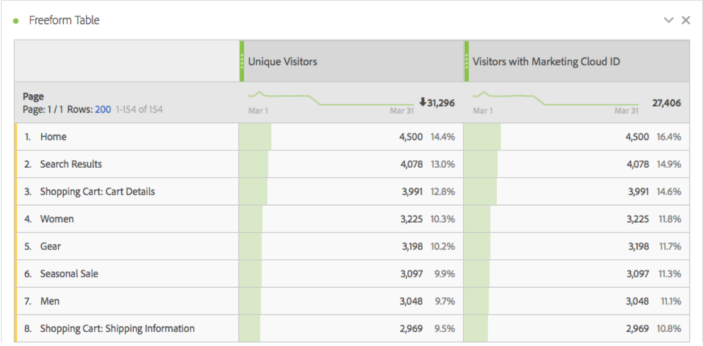

# Besökare med Experience Cloud ID

Mätvärdet &#39;Besökare med Experience Cloud ID&#39; visar antalet unika besökare som identifierats av Adobe med hjälp av [Experience Cloud ID-tjänsten](https://docs.adobe.com/content/help/en/id-service/using/home.html). Den här dimensionen är användbar vid jämförelse med [unika besökarmått](unique-visitors.md) för att säkerställa att de flesta besökare på din webbplats använder ID-tjänsten. Om en stor del av besökarna inte använder ID-tjänstens cookies kan det tyda på ett problem i implementeringen.

>[!NOTE] Detta mått är särskilt viktigt för felsökning om du använder flera Experience Cloud-tjänster, till exempel Adobe Target eller Adobe Audience Manager. Segment som delas mellan Experience Cloud-produkter inkluderar inte besökare utan ett Experience Cloud ID.

## Hur det här måttet beräknas

Det här måttet baseras på [unika besökares](unique-visitors.md) mått, förutom att det endast omfattar individer som identifieras med `mid` frågesträngen (baserat på [`s_ecid`](https://docs.adobe.com/content/help/en/core-services/interface/ec-cookies/cookies-analytics.html) cookien).

## Felsök konfigurationen av Experience Cloud ID

Mätvärdet &#39;Besökare med Experience Cloud ID&#39; kan vara användbart vid felsökning av Experience Cloud-integreringar eller vid identifiering av områden på din webbplats som inte har tillgång till ID-tjänsten.

Dra besökarna med Experience Cloud ID sida vid sida med unika besökare för att jämföra dem:

I det här exemplet ska du lägga märke till att varje sida har samma antal unika besökare som besökare med ett Experience Cloud ID. Det totala antalet unika besökare är dock större än det totala antalet besökare med Experience Cloud ID. Du kan skapa ett [beräknat mått](../c-calcmetrics/cm-overview.md) för att ta reda på vilka sidor som inte ställer in ID-tjänsten. Du kan använda följande definition:

Genom att lägga till det beräknade måttet i rapporten kan du sortera sidrapporten så att sidor med det högsta antalet besökare utan ett MCID visas:

Observera att dimensionsvärdet &quot;Produktsnabbvyer&quot; inte implementeras korrekt med identitetstjänsten. Du kan samarbeta med lämpliga team inom organisationen för att uppdatera dessa sidor så snart som möjligt. Du kan skapa en liknande rapport med vilken typ av dimension som helst, till exempel [webbläsartyp](../dimensions/browser-type.md), [platsavsnitt](../dimensions/site-section.md)eller [eVar](../dimensions/evar.md).
