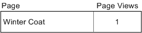
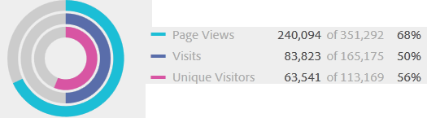

# Segmentbehållare

Ett segment anger villkor för att filtrera en besökare baserat på besökarens attribut eller interaktioner med din plats. Om du vill ange villkor i ett segment anger du regler för att filtrera besökare baserat på besökarens egenskaper och/eller navigeringsegenskaper. Om du vill dela upp besöksdata ytterligare kan du filtrera baserat på specifika besök och/eller sidvisningsträffar för varje besökare. I Segment Builder finns en enkel arkitektur som du kan använda för att skapa dessa delmängder och tillämpa regler som kapslade, hierarkiska besökar-, besöks- eller träbehållare.

Behållararkitekturen som används i segmentbyggaren definierar

-  **[!UICONTROL Visitor]** som den yttersta behållaren, som innehåller övergripande data som är specifika för besökaren vid besök och sidvisningar.
-  en kapslad **[!UICONTROL Visit]** kan du ange regler för att dela upp besökarens data baserat på besök, och
-  en kapslad **[!UICONTROL Hit]** kan du dela upp besökarinformation baserat på enskilda sidvyer.

Med varje behållare kan du rapportera över en besökares historik, interaktioner uppdelade efter besök eller dela upp individuella träffar.

<table style="table-layout: fixed; border: none;">

<tr>
<td style="background-color: #FFFFFF; border: 0; " colspan="5">
</tr>

<tr style="border: none;">
<td style="background-color: #FFFFFF; border: 0;"></td>
<td style="background-color: #E5E4E2;" colspan="3" width="200" height="100"> Besökare</td>
<td></td>
</tr>

<tr>
<td></td>
<td style="background-color: #E5E4E2;" width="200"></td>
<td style="background-color: #D3D3D3;" colspan="2" width="200" height="100"> Besök</td>
<td></td>
</tr>

<tr>
<td></td>
<td style="background-color: #E5E4E2;" width="200" height="100"></td>
<td style="background-color: #D3D3D3;" width="200" height="100"></td>
<td style="background-color: #C0C0C0;" width="200" height="100" colspan="1"> Träffar</td>
<td></td>
</tr>

<tr>
<td colspan="5">
<tr>
</table>


Här är en videoöversikt över segmentbehållare:

>[!VIDEO](https://video.tv.adobe.com/v/25401/?quality=12)

## Besökarbehållare

Besökarbehållaren innehåller alla besök och sidvisningar för besökare inom en viss tidsperiod. Ett segment på besökarnivå returnerar den sida som uppfyller villkoret plus alla andra sidor som visas av besökaren (och som bara begränsas av definierade datumintervall). Rapporterna som genereras på besökarbehållarnivå är den mest definierade behållaren och returnerar sidvisningar för alla besök. Du kan generera en flerbesöksanalys. Det innebär att besökarbehållaren är den som kan ändras mest baserat på definierade datumintervall.

Besökarbehållare kan innehålla värden som baseras på besökarens övergripande historik:

- Dagar före första köp
- Ursprunglig startsida
- Ursprungliga referensdomäner

## Besök container

Med besöksbehållaren kan du identifiera sidinteraktioner, kampanjer eller konverteringar för en viss webbsession. Ett segment på besöksnivå returnerar den sida som uppfyller villkoret plus alla andra sidor som visas som en del av besökssessionen (och som endast begränsas av definierade datumintervall). Behållaren Visit är den vanligaste behållaren eftersom den fångar upp beteenden för hela besökssessionen när regeln har uppfyllts. Med besöksbehållaren kan du definiera vilka besök du vill inkludera eller exkludera när du skapar och använder ett segment. Det kan hjälpa er att besvara frågan om hur många besökare som har sett nyhetsavsnittet och sportavsnittet vid samma besök? Eller sidor som härrör från en lyckad konvertering till en försäljning?

Besöksbehållarna innehåller värden som baseras på förekomsten per besök:

- Besöksnummer
- Startsida
- Återbesöksfrekvens
- Deltagandemått
- Linjärt allokerade mätvärden

## Träffbehållare

Träffbehållaren definierar vilka sidträffar du vill ta med eller utesluta från ett segment. Träff-behållaren är den mest smala av de tillgängliga behållarna så att du kan identifiera specifika klick och sidvy där ett villkor är uppfyllt. Du kan visa en enskild spårningskod eller isolera beteenden i ett visst avsnitt på platsen. Du kanske också vill hitta ett specifikt värde när en åtgärd inträffar, till exempel marknadsföringskanalen när en beställning har gjorts.

Träffbehållare innehåller värden som är baserade på en sidindelning:

- Produkter
- Visa utkast
- List eVars
- Merchandising eVars (i samband med händelser)

   >[!NOTE]
   >
   >Om du använder den här behållaren på ett värde som kvarstår, t.ex. en evar, hämtas den i varje träff där värdet kvarstår. Om det finns en spårningskod som slutar gälla efter en vecka, kan det värdet bli bestående för flera besök.

## Behållare för logikgrupp

Med Logic Group-behållaren kan du tillhandahålla en separat behållare inom segmentreglerna för att filtrera enheter som inte är baserade på hierarkin. Du kanske vill skapa en behållare som är kapslad i segmentet och som filtreras baserat på Visitor. Den här typen av logik kräver att du bryter hierarkin (eftersom du redan har använt en besöksbehållare på den översta nivån) för att filtrera enbart efter valda besökare. Se [Exempel på logikgrupper](/help/components/segmentation/segmentation-workflow/seg-sequential-build.md) för ytterligare information.

## Kapslade behållare {#nest-containers}

När du skapar segmentbehållare i andra behållare skapar du i princip ett segment i ett segment. Följande logik används med kapslade behållare:

1. Avgör vilka data som ska inkluderas med den yttersta behållaren. Alla data som inte matchar den här yttre regeln tas bort i den segmenterade rapporten.
1. Använd den kapslade regeln på återstående data. Den kapslade regeln gäller INTE för träffar som den första regeln genererar.
1. Upprepa tills alla kapslade behållarregler har beräknats. Resterande data inkluderas sedan i den resulterande rapporten.

Du kan använda kapsling mellan behållare och mellan regler i en behållare. Här är vad du kan kapsla i varje behållare:

| Behållarnamn | Vad du kan kapsla inuti |
|---|---|
| Träff | Endast händelser |
| Gå in på | Träffbehållare, händelser |
| Besökare | Besök behållare, Träff-behållare, Händelser |
| Logikgrupp | Besökarbehållare, Besöksbehållare, Träff-behållare |

### Inkludera flera behållare i en enda definition

Om du inkluderar flera segment i ett nytt sammansatt segment kan du förfina data ännu mer. Om du drar ihop två befintliga segment fungerar det som en&quot;OR&quot;-sats när du filtrerar besökare. Alla behållare på arbetsytan granskas mot alla data, och alla data som matchar någon av behållarna inkluderas i rapporteringen.

Du kan till exempel dra en besöksbehållare där Land = USA med en besöksbehållare där Order = True,

```
Country = United States + Order = True
```

skapar ett segment som beter sig i den här ordningen:

1. Det här segmentet skulle först granska alla era data och identifiera alla besökare i USA.
2. Segmentet skulle då granska alla era data igen och söka efter om någon besökare gjort en beställning.
3. Båda datauppsättningarna tillämpas sedan på rapporten.

## Behållare för sekventiella segment {#containers-sequential}

Sekventiell segmentering använder samma grundläggande behållare, inklusive [!UICONTROL Visitors], [!UICONTROL Visits]och [!UICONTROL Hits] (inklusive sidvyer och andra dimensioner) kapslade hierarkiskt.

<table style="table-layout:fixed;">
<tr>
<td style="background-color: #FFFFFF; " colspan="5">
<tr>
<tr style="border: 0;">
<td style="background-color: #FFFFFF; border: 0;"></td>
<td style="background-color: #E5E4E2;" colspan="3" width="200" height="100"> Besökare</td>
<td></td>
</tr>
<tr>
<td></td>
<td style="background-color: #E5E4E2;" width="200"></td>
<td style="background-color: #D3D3D3;" colspan="2" width="200" height="100"> Besök</td>
<td></td>
</tr>
<tr>
<td></td>
<td style="background-color: #E5E4E2;" width="200" height="100"></td>
<td style="background-color: #D3D3D3;" width="200" height="100"></td>
<td style="background-color: #C0C0C0;" width="200" height="100" colspan="1"> Träffar</td>
<td></td>
</tr>
<tr>
<td colspan="5">
<tr>
</table>


[!UICONTROL Visitors] utgöra den högsta orderbehållaren i sekventiell segmentering, med [!UICONTROL Visits] som finns i [!UICONTROL Visitors] behållare, och [!UICONTROL Hits] som finns i [!UICONTROL Visitors] eller [!UICONTROL Visits] behållare. Detta [behållarhierarki](/help/components/segmentation/seg-overview.md#section_7FDF47B3C6A94C38AE40D3559AFFAF70) måste upprätthållas för att bygga välordnade sekventiella segment.

**Skapa sekventiella segment**, kapslas behållare och sekventiell logik förenas med [!UICONTROL THEN] operator som kräver att varje behållare `true` baserat på besökarens ordningsföljd.

<table style="table-layout:fixed;">
<tr>
<td style="background-color: #FFFFFF; " colspan="5">
<tr>
<tr style="border: 0;">
<td style="background-color: #FFFFFF; border: 0;"></td>
<td style="background-color: #E5E4E2;" colspan="3" width="200" height="100"> Besökare</td>
<td></td>
</tr>
<tr>
<td></td>
<td style="background-color: #E5E4E2;" width="200"></td>
<td style="background-color: #D3D3D3;" colspan="2" width="200" height="100"> Besök</td>
<td></td>
</tr>
<tr>
<td></td>
<td style="background-color: #E5E4E2;" width="200" height="100"></td>
<td style="background-color: #D3D3D3;" width="200" height="100"></td>
<td style="background-color: #C0C0C0;" width="200" height="100" colspan="1"> Träffar</td>
<td></td>
</tr>
<tr><td ></td><td style="background-color: #E5E4E2;"></td><td colspan="2">SEDAN</td></td><td></td></tr>
<tr>
<td></td>
<td style="background-color: #E5E4E2;" width="200"></td>
<td style="background-color: #D3D3D3;" colspan="2" width="200" height="100"> Besök</td>
<td></td>
</tr>
<tr>
<td></td>
<td style="background-color: #E5E4E2;" width="200" height="100"></td>
<td style="background-color: #D3D3D3;" width="200" height="100"></td>
<td style="background-color: #C0C0C0;" width="200" height="100" colspan="1"> Träffar</td>
<td></td>
</tr>
<tr>
<td colspan="5">
<tr>
</table>


Det enda undantaget till den här behållarhierarkin är när [Behållare för logikgrupp](/help/components/segmentation/segmentation-workflow/seg-sequential-build.md). The [!UICONTROL Logic Group] Med -behållare kan du kapsla in en träff i en behållare utan ordning för att fånga händelser och dimensioner, men utanför en sekventiell ordning.

<table style="table-layout:fixed;">
<tr>
<td style="background-color: #FFFFFF; " colspan="5">
<tr>
<tr style="border: 0;">
<td style="background-color: #FFFFFF; border: 0;"></td>
<td style="background-color: #E5E4E2;" colspan="3" width="200" height="100"> Besökare</td>
<td></td>
</tr>
<tr>
<td></td>
<td style="background-color: #E5E4E2;" width="200"></td>
<td style="background-color: #D3D3D3;" colspan="2" width="200" height="100"> Besök</td>
<td></td>
</tr>
<tr>
<td></td>
<td style="background-color: #E5E4E2;" width="200" height="100"></td>
<td style="background-color: #D3D3D3;" width="200" height="100"></td>
<td style="background-color: #C0C0C0;" width="200" height="100" colspan="1"> Träffar</td>
<td></td>
</tr>
<tr><td ></td><td style="background-color: #E5E4E2;"></td><td colspan="2">SEDAN</td></td><td></td></tr>
<tr>
<td></td>
<td style="background-color: #E5E4E2;" width="200"></td>
<td style="background-color: #D3D3D3;" colspan="2" width="200" height="100"> Grupp</td>
<td></td>
</tr>
<tr>
<td></td>
<td style="background-color: #E5E4E2;" width="200" height="100"></td>
<td style="background-color: #D3D3D3;" width="200" height="100"></td>
<td style="background-color: #C0C0C0;" width="200" height="100" colspan="1"> Träffar</td>
<td></td>
</tr>
<tr>
<td></td>
<td style="background-color: #E5E4E2;" width="200" height="100"></td>
<td style="background-color: #D3D3D3;" width="200" height="100"></td>
<td style="background-color: #C0C0C0;" width="200" height="100" colspan="1"> Besök</td>
<td></td>
</tr>
<tr>
<td colspan="5">
<tr>
</table>


## Rapporter baserade på behållardata {#reports}

Med behållare kan du filtrera olika data på olika sätt baserat på rapportvärden när du delar upp segment och tillämpar dem på rapporter.

Data som samlas in på varje nivå i hierarkin Besök > Träff-behållare påverkar hur du skapar dina segment. Om du använder samma segment för samma rapport med samma datauppsättning får du olika värden baserat på den behållare som du genererar rapporten från. Faktorer som behållarrapporteringsnivå och värdenas beständighet över träffar kan medföra betydande förändringar i rapportens noggrannhet.

### Grunderna för behållardata {#container-data}

Besökaren som visas nedan besökte till exempel en plats på det första besöket, landade på hemsidan och besökte sedan ytterligare tre sidor och bytte besök till en försäljning. Vid ett separat besök landade besökaren den här gången via produktsidan, sedan till hemsidan, tillbaka till produktsidan och stängde sedan sessionen efter att ha tittat på Winter Hats. Olika värden visas i rapporten baserat på de data som samlats in för varje behållare för segmentet.

The *Sidor är lika med vinter-katt* segmentet nedan används på **Sidrapport**.


Baserat på vald behållare visar rapporten olika resultat.

<table style="table-layout:fixed;">
<tr>
<td style="background-color: #FFFFFF; " colspan="7">
</tr>
<tr>
<td></td>
<td style="background-color: #E5E4E2;"></td>
<td style="background-color: #E5E4E2;"colspan="5"><b>Besök 1</b></td>
</tr>
<tr>
<tr style="border: 0;">
<td style="background-color: #FFFFFF; border: 0;"></td>
<td style="background-color: #E5E4E2;">

</td>
<td style="background-color: #FFFFFF; "><br/>Start</td>
<td style="background-color: #FFFFFF;"><br/>Vinterkläder</td>
<td style="background-color: #FFFFFF;"><br/>Vinter</td>
<td style="background-color: #FFFFFF;"><br/>Köp 100 dollar</td>
<td></td>
</tr>
<tr>
<td colspan="7">
</tr>
<tr>
<td></td>
<td style="background-color: #E5E4E2;"></td>
<td style="background-color: #E5E4E2;"colspan="5"><b>Besök 2</b></td>
</tr>
<tr>
<tr style="border: 0;">
<td style="background-color: #FFFFFF; border: 0;"></td>
<td style="background-color: #E5E4E2;">

</td>
<td style="background-color: #FFFFFF; "><br/>Vinterkläder</td>
<td style="background-color: #FFFFFF;"><br/>Vintern - starter</td>
<td style="background-color: #FFFFFF;"><br/>Vinterkläder</td>
<td style="background-color: #FFFFFF;"><br/>Vinter-hattar</td>
<td></td>
</tr>
<tr>
<td colspan="7">
</tr>
</table>


### Rapportering från träff-behållaren

När det här villkoret finns i en Träff-behållare listas endast de sidor där *Sida = Vinter* är sant. Eftersom bara en sida matchar det här villkoret i en behållare för endast en sida, visas endast sidan Vinter-slag.

| Sida | Sidvisningar |
|---|--:|
| Vinter | 1 |



Om du rapporterar från träff-behållaren kan du se hur rapporter från olika behållare påverkar de totala rapportvärdena. När du tittar på segmentrapporten ser du att sidvyerna är ungefär lika många som besöken (cirka 2 000 besökare såg dubblettsidor vid ett besök, vilket ökar det totala antalet sidvisningar). Och unika besökare är ungefär lika många som antalet besök (cirka 2 000 unika besökare besöktes mer än en gång).


>[!IMPORTANT]
>
>Oavsett hur du visar data (från Träff-, Visit- eller Visitor-behållare) har de alla samma antal besökare, 63 541, i det här exemplet. Oberoende av hur du skapar rapporten förblir det inledande besökarvillkoret (besökare som visade sidan för vintertäckta) oförändrat. Det är den delmängd av data som du rapporterar från på olika nivåer.

### Rapportering från besöksbehållaren

Om samma villkor gäller för en besöksbehållare listas alla sidor i besöket där *Sida är lika med vinterkatt* är sant. Den filtrerar sidan Vinter Coats, men hämtar även alla andra sidor vid besöket där villkoret är sant. Eftersom besökaren även besökte webbplatserna Hem, Produkt och Inköp vid besöket listas dessa ytterligare sidor i rapporten när de rapporteras med data om besöksbehållaren.

| Sida | Sidvisningar |
|---|--:|
| Start | 1 |
| Produkt | 1 |
| Vinter | 1 |
| Inköp | 1 |


Genom att visa segmentvärden från besöksbehållaren ser du att antalet sidvisningar har ökat avsevärt. Ökningen beror på att rapporter från besöksbehållaren identifierar alla sidor som uppfyller villkoren, plus alla andra sidor som visas i besöket (med alla sidvyer tagna i varje besöksbehållare).


### Rapportering från besökarbehållaren

Om samma villkor finns i en besökarbehållare listas alla sidor som visas av en besökare där *Sida är lika med vinterkatt* är sant. Det här villkoret innebär att om en besökare visar sidan Vinter Coats, listas alla sidor i besökarbehållaren (inklusive sidvyer i andra besök). Därför visas sidor som inte matchar villkoret också i rapporten eftersom besökaren visade dem vid en tidigare tidpunkt. Alla sidor i besökarbehållaren listas i rapporten, även om de förekommer tidigare och inte uppfyller villkoren specifikt.

| Besök 1<br/>Sida | <br/>Sidvisningar |
|---|--:|
| Start | 1 |
| Vinterkläder | 1 |
| Vinter | 1 |
| Inköp | 1 |

| Besök 2<br/>Sida | <br/>Sidvisningar |
|---|--:|
| Vinterkläder | 2 |
| Vintern - starter | 1 |
| Vinter-hattar | 1 |

| Besök 1 + Besök 2<br/>Sida | <br/>Sidvisningar |
|---|--:|
| Vinterkläder | 3 |
| Start | 1 |
| Vinter | 1 |
| Inköp | 1 |
| Vintern - starter | 1 |
| Vinter-hattar | 1 |


Om du visar segment från besökarbehållaren ser du att sidvyerna och besöken har ökat. Ökningen beror på att om besökaren bara besökt sidan Vinter Coats en gång (vilket gör villkoret sant) så kommer alla andra sidvisningar och alla andra besök som besökaren har tagit.



Sammanfattningsvis är en förståelse för hur segmentering fungerar på olika datauppdelningar avgörande för att tolka de data som returneras.

## Rapportering baserad på behållaren {#reporting}

Varje uppdelning av segmentdata har ett omfång som de tillämpas på. De flesta uppdelningar baseras på *Sidvyer* Men många värdefulla segment baseras på *Besök* och i mindre utsträckning *Besökare* behållare. Det är viktigt att förstå hur du rapporterar baserat på omfattningen av din behållare.

Använda *Sida = Vinter* Exempel på segment nedan är exempel på resultatet av det här segmentet baserat på hur behållardata används och hur omfattningen av data matchar segmenttypen.

### Segmentbehållare baserad på matchande segmentregel

Om segmentbehållaren används mot ett naturligt dataområde, förväntas resultatet när radobjekten matchar segmentregeln.

- **Träff-behållare där sidan är lika med &quot;Winter Coat&quot;**: Visa en *Sida* om rapporten med det här segmentet bara returnerar värden som är lika med &quot;Winter Coat&quot;. Alla andra sidor undantas från rapporteringen.
- **Besökscontainer där ingångssidan är lika med &quot;Winter Apparel&quot;**: Visa en *Startsida* rapporten med det här segmentet returnerar bara det andra besöket eftersom startsidan matchar segmentregeln.
- **Besök container där besöksnumret är lika med 1**: Om du visar en besökssida Alla sidvyer från det första besöket inkluderas rapporten eftersom den matchar segmentregeln.

### Sidvyer på behållarnivå för besök

Många segmentregler identifierar sidvisningar per besök. När den här identifieringen inträffar tillämpas hela besökarbehållaren om endast en träff matchar regeln. Den här segmentrapporten är särskilt värdefull eftersom sidvisningar baserade på besök ger insikter baserade på sidvisningar per besök.

- **Besök behållare där sidan är lika med sidan &quot;Winter Coat&quot;**: I en sidrapport på besökarbehållarnivå visas alla sidvisningar av besök som innehåller en vy av sidan &quot;Vinter-kläder&quot;. Om en sida matchar segmentregeln inkluderas alla sidvyer som är kopplade till det besöket i rapporten.
- **Besök behållare där sidan är lika med startsidan**: I en sidrapport med det här segmentet visas endast data från det första besöket, eftersom besökaren vid det andra besöket inte visade någon hemsida.
- **Besökarbehållare där sidan är lika med &quot;Vinter-kläder&quot;**: I en sidrapport hämtar det här segmentet alla data från båda besöken eftersom besökaren visade sidan &quot;Vinter-kläder&quot; i båda besöken.

### Segmentbehållare som identifierar träffar som är mindre än sidvyer

Om du använder segment med en mindre behållare än nedbrytningsområdet returneras oväntade data. Genom att använda en mindre uppdelning hämtas alla träffar från detta dataområde.

- **Träffbehållare där startsidan är lika med produktsidan**: Alla sidor är kopplade till besökets startsida, vilket gör det till en besöksbaserad uppdelning. När du använder det här segmentet hämtas inte bara startsidan för produktsidan, utan även alla träffar på besöket.
- **Träffbehållare där List Var 1 innehåller ValueA**: Om flera värden har definierats i samma träff som listans var, inkluderas alla variabelvärden i segmentet. Det finns inget sätt att separera värden som förekommer i samma sidvy eftersom Träff-behållaren är den minsta segmentbehållaren för att bryta ned träffar.
- **Träffbehållare där sidan är lika med&quot;Inköp&quot;**: Om du använder sidvyer som mått visas bara sidan Inköp (som förväntat). Om du använder en Intäktsdeltagarrapport får alla sidor i det första besöket 100 dollar, eftersom deltagarstatistik är besöksbaserad.
- **Träffbehållare där sidan är lika med &quot;vinterkatt&quot;**: Om du använder sidvyer som mått visas bara sidan Vinter-katt (som förväntat). Om du använder en Intäktsdeltagarrapport får inga sidor krediter eftersom denna dimension kräver en beständig dimension. Sidvyn som faktiskt gjorde köpet (sidan Inköp) inkluderas inte i Träff-behållaren, så ingen intäktsandel ges till någon artikel. Om du kör en rapport från besöksbehållaren skulle dock alla sidvisningar ingå i besöket och vinsten skulle fördelas ($100) över alla sidor som visas i sessionen.

## Beständighet över behållare {#persistence}

Filtrering efter dimensioner som finns kvar på ett sidintervall, t.ex. en Campaign-eVar eller en referensdimension, påverkar data som samlas in på behållarnivå och måste förstås för att rapporteringen ska vara korrekt.

Segmentdata kan variera beroende på hur beständig en dimension eller en variabel som används på de valda sidorna är. Vissa dimensioner, till exempel siddimensionen, ger unika värden på sidnivå och filtreras baserat på data från Träff-behållaren. (Se [Rapporter baserade på behållardata](/help/components/segmentation/seg-overview.md) exempel). Andra dimensioner, till exempel dimensionen Refererande domän, finns kvar på flera sidor för ett besök. Vissa dimensioner eller tillämpade variabler, som Besök Varaktighet, spänner över en besökares hela historik.


I motsats till siddimensionen är referensdomänvärdet kopplat till varje sida i besöket. Besökaren nedan kommer till exempel till hemsidan från en refererad webbplats. Därför tilldelas alla sidor i besöket samma referensdomänvärde.

The *Refererande domän är lika med aol.com* segmentet nedan används på **Sidrapport**.

<table style="table-layout:fixed;">
<tr>
<td style="background-color: #FFFFFF; " colspan="7">
</tr>
<tr>
<td></td>
<td style="background-color: #E5E4E2;"></td>
<td style="background-color: #E5E4E2;"colspan="5"><b>Besök 1</b></td>
</tr>
<tr>
<tr style="border: 0;">
<td style="background-color: #FFFFFF; border: 0;"></td>
<td style="background-color: #E5E4E2;">
<br/>aol.com
</td>
<td style="background-color: #FFFFFF; "><br/>Start</td>
<td style="background-color: #FFFFFF;"><br/>Vinterkläder</td>
<td style="background-color: #FFFFFF;"><br/>Vinter</td>
<td style="background-color: #FFFFFF;"><br/>Köp 100 dollar</td>
<td></td>
</tr>
<tr>
<td colspan="7">
</tr>
<tr>
<td></td>
<td style="background-color: #E5E4E2;"></td>
<td style="background-color: #E5E4E2;"colspan="5"><b>Besök 2</b></td>
</tr>
<tr>
<tr style="border: 0;">
<td style="background-color: #FFFFFF; border: 0;"></td>
<td style="background-color: #E5E4E2;">
<br/>west.com
</td>
<td style="background-color: #FFFFFF; "><br/>Vinterkläder</td>
<td style="background-color: #FFFFFF;"><br/>Vintern - starter</td>
<td style="background-color: #FFFFFF;"><br/>Vinterkläder</td>
<td style="background-color: #FFFFFF;"><br/>Vinter-hattar</td>
<td></td>
</tr>
<tr>
<td colspan="7">
</tr>
</table>

<!---->

Vid ett nytt besök hänvisas besökaren till från en annan plats. Därför tilldelas alla sidor i det nya besöket det nya referensdomänvärdet för varje sidvy.

### Rapportering från träff-behållaren

Eftersom alla sidvyer inom samma besök tilldelas samma referensdomänvärde, rapporteras på träff-behållarnivå där *Refererande domän = &quot;aol.com&quot;* returnerar alla sidor i tabellen nedan.

| Refererande domän = &#39;aol.com&#39; | Sidvisningar |
|----|---:|
| Start | 1 |
| Vinterkläder | 1 |
| Vinter | 1 |
| Inköp | 1 |


Med data från Träff-behållaren visades drygt 92 000 sidvisningar i över 33 000 besök av drygt 32 000 besökare. I genomsnitt fanns det tre sidvisningar vid varje besök, och nästan alla besök gjordes av unika besökare.


### Rapportering från besöksbehållaren

Om samma villkor filtreras i besöksbehållaren för en sidrapport, ska alla sidor i besöket där *Refererande domän = &quot;aol.com&quot;* är sant. Eftersom värdet för den refererande domänen anges på besöksnivå är rapporterna på sidvynivå och besöksnivå desamma.

| Refererande domän = &#39;aol.com&#39; | Sidvisningar |
|----|---:|
| Start | 1 |
| Vinterkläder | 1 |
| Vinter | 1 |
| Inköp | 1 |


Eftersom alla sidor har samma referensdomänvärde baserat på besöket är rapporten från besöksbehållarnivån (nästan) densamma som rapporten från sidvisningsbehållaren. Det finns en liten förskjutning (98 234 mot 98 248) på grund av dataavvikelser.


### Rapportering från besökarbehållaren

Från besökarbehållaren visar sidrapporten alla sidor som visas av en besökare där *Refererande domän är lika med &quot;aol.com&quot;* är sant. Om en besökare hade *&quot;aol.com&quot;* som hänvisande domän när som helst i historiken (inom den definierade tidsperioden) listas alla sidor i besökarbehållaren (inklusive sidvisningar i andra besök). Även sidor som inte matchar det primära villkoret listas i rapporten eftersom de här sidorna inkluderas i besökarbehållaren. Alla sidor i besökarbehållaren listas i rapporten, även om de förekommer tidigare och inte uppfyller villkoren specifikt.

I en referensdomänrapport *Refererande domän = &quot;aol.com&quot;* är sant i fyra sidvyer, men *Refererande domän = &quot;west.com&quot;* är true på de andra sidorna besökaren träffar. I besökarbehållaren visas en lista med besökare där &quot;aol.com&quot; är true. Men det ger även dig sidor där den refererande domänen är&quot;wall.com&quot;, inte värdet som matchade din ursprungliga begäran i segmentet.

| Besök 1<br/>Refererande domän = &#39;aol.com&#39; | <br/>Sidvisningar |
|----|---:|
| Start | 1 |
| Vinterkläder | 1 |
| Vinter | 1 |
| Inköp | 1 |

| Besök 2<br/>Refererande domän = &#39;west.com&#39; | <br/>Sidvisningar |
|----|---:|
| Vinterkläder | 2 |
| Vinter | 1 |
| Inköp | 1 |

| Besökarbehållare<br/>Refererande domän = &#39;aol.com&#39; | Sidvisningar |
|----|---:|
| Vinterkläder<br/>Refererande domän = &#39;aol.com&#39; | 1 |
| Vinterkläder<br/>Refererande domän = &#39;west.com&#39; | 1 |
| Startsida <br/>Refererande domän = &#39;aol.com&#39; | 1 |
| Vinter <br/>Refererande domän = &#39;aol.com&#39; | 1 |
| Inköp<br/>Refererande domän = &#39;aol.com&#39; | 1 |
| Vintern - starter<br/>Refererande domän = &#39;west.com&#39; | 1 |
| Vinter-hattar<br/>Refererande domän = &#39;west.com&#39; | 1 |


När du visar data från besökarbehållaren, observera att sidvyerna har ökat avsevärt (från 98 248 till 112, 925). Ökningen beror på att alla sidvyer som besökaren har sparat (inklusive de sidor där andra referensdomänvärden har sparats på behållarnivån för besökaren) har listats. Och besökarens ytterligare besök, som ökade antalet besök från 33 203 till 43 448.


## Sammanfattning

- Besökarbehållaren returnerar alla sidor som visas av en besökare där minst en sida uppfyller villkoren. Om en sida bara visas på besök 1 dag 1, inkluderas alla sidor som besökaren visar vid flera besök i data.
- Besöksbehållaren returnerar alla sidor som visas vid ett besök, för vilka minst en sida uppfyller villkoren. Om en sida bara visas på besök 1 dag 1 inkluderas alla sidor som visas under hela besöket i informationen.
- Var noga med att basera villkoret som du använder för segmentering på en eVar eller annan typ av beständig variabel. Du kan till exempel använda villkoret&quot;där kampanjen innehåller e-post&quot; och det upphör att gälla efter sju dagar. Så om kampanjen sätts in vid det första besöket kvarstår den i ytterligare sju dagar. Varje besök ingår även om kampanjen bara var planerad vid det första besöket. De övriga besöken ingår också (så länge de ligger inom rapportens datumintervall). Om du vill ta bort beständiga värden från att inkluderas använder du antingen händelsen &quot;instance of&quot; eller en motsvarande Prop-variabel, om en sådan finns.
