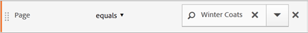
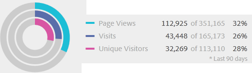

# Om segment och behållare

Med segment kan du identifiera undergrupper av besökare baserat på egenskaper eller webbplatsinteraktioner. Segmenten är utformade som kodade målgruppsinsikter som ni kan bygga för era specifika behov och sedan verifiera, redigera och dela med andra teammedlemmar eller använda i andra Adobe-produkter och Analytics-funktioner.

Segmenten baseras på en [!UICONTROL Visitor], [!UICONTROL Visit] och [!UICONTROL Hit] nivåhierarki med en kapslad behållarmodell. Med de kapslade behållarna kan du definiera besökarattribut och åtgärder baserat på regler mellan och inom behållarna. Analyssegment kan byggas, godkännas, delas, sparas och köras på flera produkter och funktioner i [!DNL Adobe Experience Cloud]. Segment kan genereras från en rapport, byggas in i en kontrollpanelrapport eller bokmärkas för snabb åtkomst.

Du kan skapa och spara segment i segmentbyggaren eller generera segment från en utfallsrapport (i  Analysis Workspace). Du kan också använda och utöka fördefinierade segment baserat på specifika regler mellan kapslade behållare, så att du kan filtrera resultaten och tillämpa dem på rapporter. Dessutom kan segment användas tillsammans som [staplade segment](/help/components/segmentation/segmentation-workflow/seg-workflow.md).

## Segment {#section_CC4EBA2A6CCB4F8BBB8437052A880657}

Segmenten identifierar vilka era besökare är (land, kön, kafé), vilka enheter och tjänster de använder (webbläsare, sökmotor, mobil enhet), var de navigerar (sökmotor, föregående avslutningssida, naturlig sökning), plus mycket annat.


Segment kan baseras på följande värden:

* Besökare baserade på attribut: webbläsartyp, enhet, antal besök, land, kön.
* Besökare baserade på interaktioner: kampanjer, sökord, sökmotor.
* Besökare baserade på utgångar och tävlingsbidrag: besökare från Facebook, en definierad landningssida, hänvisande domän.
* Besökare baserade på anpassade variabler: formulärfält, definierade kategorier, kund-ID.

När du skapar målgruppssegment i Segment Builder definierar du villkor med hjälp av [!UICONTROL AND] och [!UICONTROL OR] operatorer mellan behållare.


Den här typen av segment filtrerar datauppsättningar baserat på egenskaper som förenats med [!UICONTROL AND] och [!UICONTROL OR] operatorer.

## Sekventiella segment {#section_EE5B14287FC44E0B96E77679A2438948}

Med hjälp av sekventiella segment kan du identifiera besökare baserat på navigering och sidvisning på webbplatsen, vilket ger ett segment med definierade åtgärder och interaktioner. Sekventiella segment hjälper er att identifiera vad en besökare gillar och vad en besökare undviker. När du skapar sekventiella segment [!UICONTROL THEN] -operatorn används för att definiera och beställa besöksnavigering.


| Besök en | Besök två | Besök tre |
|---|---|---|
| Vid det första besöket gick besökaren till huvudlandningssidan (A), exkluderade kampanjsidan (B) och tittade sedan på produktsidan (C). | Vid det andra besöket gick besökaren åter till huvudlandningssidan (A), exkluderade kampanjsidan (B), gick tillbaka till produktsidan (C) och sedan till en ny sida (D). | Vid det tredje besöket gick besökaren in på och följde samma väg som vid det första och andra besöket och uteslöt sedan sidan F för att gå direkt till en riktad produktsida (G). |

Sekventiella segment kan baseras på följande träffvärden:

* Besökare baserade på sekvenser av sidträffar - sidvisningar vid ett och samma besök, sidvisningar vid olika besök, besök där sidvisningar utesluts.
* Besökare baserade på tiden mellan och efter sidvisningar - efter en tidsgräns, mellan träffar, efter en händelse.


Ett sekventiellt segment filtrerar datauppsättningar baserat på användaråtgärder med [!UICONTROL THEN] -operator.

## Videoinstruktion {#section_89D6184890AF4086A8056BFBB0B68C29}

Den här videon ger en kort översikt över vilka segmentbehållare som är och hur de används: [Segmentbehållare i Adobe Analytics](https://experienceleague.adobe.com/docs/analytics-learn/tutorials/components/segmentation/segment-containers.html)

## Om behållare {#section_AF2A28BE92474DB386AE85743C71B2D6}

Ett segment anger villkor för att filtrera en besökare baserat på hans eller hennes attribut eller interaktioner med din webbplats. Om du vill ange villkor i ett segment anger du regler för att filtrera besökare baserat på besökarens egenskaper och/eller navigeringsegenskaper. Om du vill dela upp besöksdata ytterligare kan du filtrera baserat på specifika besök och/eller sidvisningsträffar för varje besökare. I Segment Builder finns en enkel arkitektur som du kan använda för att skapa dessa delmängder och tillämpa regler som kapslade, hierarkiska besökar-, besöks- eller träbehållare.

Behållararkitekturen som används i segmentbyggaren definierar **[!UICONTROL Visitor]** som den yttersta behållaren, som innehåller övergripande data som är specifika för besökaren vid besök och sidvisningar. En kapslad **[!UICONTROL Visit]** kan du ange regler för att dela upp besökarens data baserat på besök och en kapslad **[!UICONTROL Hit]** kan du dela upp besökarinformation baserat på enskilda sidvyer. Med varje behållare kan du rapportera över en besökares historik, interaktioner uppdelade efter besök eller dela upp individuella träffar.


Här är en videoöversikt över segmentbehållare:

>[!VIDEO](https://video.tv.adobe.com/v/25401/?quality=12)

**Besökarbehållare**

Besökarbehållaren innehåller alla besök och sidvisningar för besökare inom en viss tidsperiod. Ett segment på besökarnivå returnerar den sida som uppfyller villkoret plus alla andra sidor som visas av besökaren (och som bara begränsas av definierade datumintervall). Som den mest väldefinierade behållaren kommer rapporter som genereras på besökarbehållarnivå att returnera sidvisningar för alla besök, vilket gör att du kan generera en flerbesöksanalys. Det innebär att besökarbehållaren är den som kan ändras mest baserat på definierade datumintervall.

Besökarbehållare kan innehålla värden som baseras på besökarens övergripande historik:

* Dagar före första köp
* Ursprunglig startsida
* Ursprungliga referensdomäner

**Besök container**

Med besöksbehållaren kan du identifiera sidinteraktioner, kampanjer eller konverteringar för en viss webbsession. Besöksbehållaren är den vanligaste behållaren eftersom den fångar upp beteenden för hela besökssessionen när regeln är uppfylld och låter dig definiera vilka besök du vill inkludera eller exkludera när du skapar och använder ett segment. Det kan hjälpa er att besvara frågan om hur många besökare som har sett nyhetsavsnittet och sportavsnittet vid samma besök? Eller sidor som härrör från en lyckad konvertering till en försäljning?

Besöksbehållarna innehåller värden som baseras på förekomsten per besök:

* Besöksnummer
* Startsida
* Återbesöksfrekvens
* Deltagandemått
* Linjärt allokerade mätvärden

**Träffbehållare**

Träffbehållaren definierar vilka sidträffar du vill ta med eller utesluta från ett segment. Det är den mest smala av de tillgängliga behållarna så att du kan identifiera specifika klick och sidvy där ett villkor är sant, så att du kan visa en enskild spårningskod eller isolera beteenden inom ett visst avsnitt på platsen. Du kanske också vill hitta ett specifikt värde när en åtgärd inträffar, till exempel marknadsföringskanalen när en beställning har gjorts.

Träffbehållare innehåller värden som är baserade på en sidindelning:

* Produkter
* Visa utkast
* List eVars
* Merchandising eVars (i samband med händelser)

   >[!NOTE]
   >
   >Om du använder den här behållaren på ett värde som kvarstår, till exempel en evar, kommer den att dras in i varje träff där värdet kvarstår. Om en spårningskod upphör att gälla efter en vecka, kan värdet bli bestående i flera besök.

**Behållare för logikgrupp**

Med Logic Group-behållaren kan du tillhandahålla en separat behållare inom segmentreglerna för att filtrera enheter som inte är baserade på hierarkin. Du kanske vill skapa en behållare som är kapslad i segmentet och som filtreras baserat på Visitor. Den här typen av logik kräver att du bryter hierarkin (eftersom du redan har en besöksbehållare på den översta nivån) för att bara filtrera efter valda besökare. Detta kan göras med hjälp av logikgruppsbehållaren. Se [Exempel på logikgrupper](/help/components/segmentation/segmentation-workflow/seg-sequential-build.md) för ytterligare information.

## Kapslade behållare {#section_7FDF47B3C6A94C38AE40D3559AFFAF70}

När du skapar segmentbehållare i andra behållare skapar du i princip ett segment i ett segment. Följande logik används med kapslade behållare:

1. Avgör vilka data som ska inkluderas med den yttersta behållaren. Alla data som inte matchar den här yttre regeln tas bort i den segmenterade rapporten.
1. Använd den kapslade regeln på återstående data. Den kapslade regeln gäller INTE för träffar som den första regeln genererar.
1. Upprepa tills alla kapslade behållarregler har beräknats. Resterande data inkluderas sedan i den resulterande rapporten.

Du kan använda kapsling mellan behållare och mellan regler i en behållare. Här är vad du kan kapsla i varje behållare:

| Behållarnamn | Vad du kan kapsla inuti |
|---|---|
| Träff | Endast händelser |
| Gå in på | Träffbehållare, händelser |
| Besökare | Besök behållare, Träff-behållare, Händelser |
| Logikgrupp | Besökarbehållare, Besöksbehållare, Träff-behållare |

**Inkludera flera behållare i en enda definition**

Om du inkluderar flera segment i ett nytt sammansatt segment kan du förfina data ännu mer. Om du drar ihop två befintliga segment fungerar det som en&quot;OR&quot;-sats när du filtrerar besökare. Alla behållare på arbetsytan granskas mot alla data, och alla data som matchar någon av behållarna inkluderas i rapporteringen.

Du kan till exempel dra en besöksbehållare där Land = USA med en besöksbehållare där Order = True

```
Country = United States + Order = True
```

skapar ett segment som fungerar i den här ordningen:

1. Det här segmentet skulle först granska alla era data och identifiera alla besökare i USA.
1. Segmentet skulle då granska alla era data igen och söka efter om någon besökare gjort en beställning.
1. Båda datauppsättningarna tillämpas sedan på rapporten.

## Behållare för sekventiella segment {#section_324AF503F51A4A62806151FE440F3B2E}

Sekventiell segmentering använder samma grundläggande behållare, inklusive [!UICONTROL Visitors], [!UICONTROL Visits]och [!UICONTROL Hits] (inklusive sidvyer och andra dimensioner) kapslade hierarkiskt.


[!UICONTROL Visitors] utgöra den högsta orderbehållaren i sekventiell segmentering, med [!UICONTROL Visits] som finns i [!UICONTROL Visitors] behållare, och [!UICONTROL Hits] som finns i [!UICONTROL Visitors] eller [!UICONTROL Visits] behållare. Detta [behållarhierarki](/help/components/segmentation/seg-overview.md#section_7FDF47B3C6A94C38AE40D3559AFFAF70) måste upprätthållas för att bygga välordnade sekventiella segment.

**Skapa sekventiella segment**, kapslas behållare och sekventiell logik förenas med [!UICONTROL THEN] -operator som kräver att varje behållare är true baserat på besökarens sekvens.


Det enda undantaget till den här behållarhierarkin är när [Behållare för logikgrupp](/help/components/segmentation/segmentation-workflow/seg-sequential-build.md). The [!UICONTROL Logic Group] Med -behållare kan du kapsla in en träff i en behållare utan ordning för att fånga händelser och dimensioner, men utanför en sekventiell ordning.


## Rapporter baserade på behållardata {#concept_BE822C12F87C4F07B7147D80BEFBAB87}

Med behållare kan du filtrera olika data på olika sätt baserat på rapportvärden när du delar upp segment och tillämpar dem på rapporter.

Data som samlas in på varje nivå i hierarkin Besök > Träff-behållare påverkar hur du skapar dina segment. Om du använder samma segment som används för samma rapport med samma datauppsättning får du olika värden baserat på den behållare som du genererar rapporten från. Faktorer som behållarrapporteringsnivå och värdenas beständighet i flera träffar kan medföra stora förändringar i noggrannheten.

## Grunderna för behållardata {#section_9576D970F912450191AFB5B83F7F1656}

Besökaren som visas nedan besökte till exempel en plats på det första besöket, landade på hemsidan och besökte sedan ytterligare tre sidor och bytte besök till en försäljning. Vid ett separat besök landade besökaren den här gången via produktsidan, sedan till hemsidan, tillbaka till produktsidan och stängde sedan sessionen efter att ha tittat på Winter Hats. Baserat på de data som har hämtats för varje behållare för segmentet visas olika värden i rapporten.

The *Sidor är lika med vinter-katt* segmentet nedan används på **Sidrapport**.



Baserat på vald behållare visar rapporten olika resultat.


**Rapportering från träff-behållaren**

När det här villkoret finns i en Träff-behållare listas endast de sidor där *Sida = Vinter* är sant. Eftersom bara en sida matchar det här villkoret i en behållare för endast en sida, visas endast sidan Vinter-slag.


Om du rapporterar från träff-behållaren kan du se hur rapportering från olika behållare påverkar de totala rapportvärdena. Om du tittar på segmentrapporten kan du se att sidvisningar är ungefär lika många som besök (cirka 2 000 besökare såg dubblettsidor i ett besök, vilket ökar antalet sidvisningar). Unika besökare är ungefär lika många som antalet besök (cirka 2 000 unika besökare besöktes mer än en gång.)


>[!IMPORTANT]
>
>Oavsett hur du visar data - från Träff-, Visit- eller Visitor-behållarna - har de alla samma antal besökare, 63, 541, i det här exemplet. Oberoende av hur du skapar rapporten förblir det inledande besökarvillkoret - besökare som visade Winter Coats-sidan - intakt. Det är den delmängd av data som du rapporterar från på olika nivåer.

**Rapportering från besöksbehållaren**

Om samma villkor gäller för en besöksbehållare listas alla sidor i besöket där *Sida är lika med vinterkatt* är sant. Den filtrerar sidan Vinter Coats, men hämtar även alla andra sidor vid besöket där villkoret är sant. Eftersom besökaren även besökte webbplatserna Hem, Produkt och Inköp vid besöket där villkoret var uppfyllt, listas dessa ytterligare sidor i rapporten när de rapporteras med data från Visitor-behållaren.


Genom att visa segmentvärden från besöksbehållaren ser du att antalet sidvisningar har ökat avsevärt. Detta beror på att rapporter från besöksbehållaren identifierar alla sidor som uppfyller villkoren, plus alla andra sidor som visas i besöket (med alla sidvyer tagna i varje besöksbehållare).


**Rapportering från besökarbehållaren**

Om samma villkor finns i en besökarbehållare listas alla sidor som visas av en besökare där *Sida är lika med vinterkatt* är sant. Det innebär att om en besökare visar sidan Vinter Coats kommer alla sidor i besökarbehållaren att listas - inklusive sidvyer i andra besök. Därför kommer sidor som inte matchar villkoret att listas i rapporten eftersom besökaren visade dem vid en tidigare tidpunkt. Alla sidor i besökarbehållaren listas i rapporten, även om de förekommer tidigare och inte specifikt uppfyller villkoren.


Om du visar segment från besökarbehållaren ser du att sidvyerna och besöken har ökat. Det beror på att om besökaren bara besökt sidan Vinter Coats en gång (vilket gör villkoret sant) så hämtas alla andra sidvyer och alla andra besök för besökaren.


Sammanfattningsvis är en förståelse för hur segmentering fungerar på olika datauppdelningar avgörande för att tolka de data som returneras.

## Rapportering baserad på behållaren {#section_D0604748F2794327B8C668617A31EC18}

Varje uppdelning av segmentdata har ett omfång som de tillämpas på. De flesta uppdelningar baseras på *Sidvyer* Men många värdefulla segment baseras på *Besök* och i mindre utsträckning *Besökare* behållare. Det är viktigt att förstå hur du rapporterar baserat på omfattningen av din behållare.

Baserat på *Sida = Vinter* I segmentexemplet ovan definierar problemen nedan andra aspekter av segmentet baserat på hur behållardata används och hur omfattningen av data ska matcha segmenttypen.

**Segmentbehållare baserad på matchande segmentregel**

Om segmentbehållaren används mot ett naturligt dataområde, förväntas resultatet när radobjekten matchar segmentregeln.

* **Träff-behållare där sidan är lika med &quot;Winter Coat&quot;**: Visa en *Sida* om rapporten med det här segmentet bara returnerar värden som är lika med &quot;Winter Coat&quot;. Alla andra sidor undantas från rapporteringen.
* **Besökscontainer där ingångssidan är lika med &quot;Winter Apparel&quot;**: Visa en *Startsida* rapporten med det här segmentet returnerar bara det andra besöket eftersom startsidan matchar segmentregeln.
* **Besök container där besöksnumret är lika med 1**: Om du visar en besökssida Alla sidvyer från det första besöket inkluderas rapporten eftersom den matchar segmentregeln.

**Sidvyer på behållarnivå för besök**

Många segmentregler identifierar sidvisningar per besök. När detta inträffar tillämpas hela besökarbehållaren om endast en träff matchar regeln. Den här segmentrapporten är särskilt värdefull eftersom sidvisningar baserade på besök ger insikter baserade på sidvisningar per besök.

* **Besök behållare där sidan är lika med sidan &quot;Winter Coat&quot;**: I en sidrapport på besökarbehållarnivå visas alla sidvisningar av besök som innehåller en vy av sidan &quot;Vinter-kläder&quot;. Om en sida matchar segmentregeln inkluderas alla sidvyer som är kopplade till det besöket i rapporten.
* **Besök behållare där sidan är lika med startsidan**: I en sidrapport med det här segmentet visas endast data från det första besöket. Detta beror på att besökaren inte såg hemsidan vid det andra besöket.
* **Besökarbehållare där sidan är lika med &quot;Vinter-kläder&quot;**: I en sidrapport hämtar det här segmentet alla data från båda besöken eftersom besökaren visade sidan &quot;Vinter-kläder&quot; i båda besöken.

**Segmentbehållare som identifierar träffar som är mindre än sidvyer**

Om du använder segment med en mindre behållare än nedbrytningsområdet returneras oväntade data. Genom att använda en mindre uppdelning hämtas alla träffar från detta dataområde.

* **Träffbehållare där startsidan är lika med produktsidan**: Alla sidor är kopplade till besökets startsida, vilket gör det till en besöksbaserad uppdelning. När du använder det här segmentet hämtas inte bara produktsidan på startsidan, utan även alla träffar på besöket.
* **Träffbehållare där List Var 1 innehåller ValueA**: Om flera värden har definierats i samma träff som listans var, inkluderas alla variabelvärden i segmentet. Det finns inget sätt att separera värden som förekommer i samma sidvy eftersom Träff-behållaren är den minsta segmentbehållaren för att bryta ned träffar.
* **Träffbehållare där sidan är lika med&quot;Inköp&quot;**: Om du använder sidvyer som mått visas bara sidan Inköp (som förväntat). Om du använder en Intäktsdeltagarrapport får alla sidor i det första besöket 100 dollar, eftersom deltagarstatistik är besöksbaserad.
* **Träffbehållare där sidan är lika med &quot;vinterkatt&quot;**: Om du använder sidvyer som mått visas bara sidan Vinter-katt (som förväntat). Om du använder en Intäktsdeltagarrapport får inga sidor krediter eftersom denna dimension kräver en beständig dimension. Sidvyn som faktiskt gjorde köpet (sidan Inköp) inkluderas inte i Träff-behållaren, så ingen intäktsandel ges till någon artikel. Om du kör en rapport från besöksbehållaren skulle dock alla sidvisningar ingå i besöket och vinsten skulle fördelas ($100) över alla sidor som visas i sessionen.

## Beständighet över behållare {#concept_E579D72B1C644AE9A4C4EAF6B47A4DCB}

Filtrering efter dimensioner som finns kvar på ett sidintervall, t.ex. en Campaign-eVar eller en referensdimension, påverkar de data som samlas in på behållarnivå och måste förstås för att rapporteringen ska vara korrekt.

Segmentdata kan variera beroende på hur beständig en dimension eller en variabel som används på de valda sidorna är. Vissa dimensioner, till exempel siddimensionen, ger unika värden på sidnivå och filtreras baserat på data från Träff-behållaren. (Se [Rapporter baserade på behållardata](/help/components/segmentation/seg-overview.md) exempel). Andra dimensioner, till exempel dimensionen Refererande domän, finns kvar på flera sidor för ett besök. Vissa dimensioner eller tillämpade variabler, som Besök Varaktighet, spänner över en besökares hela historik.


I motsats till siddimensionen är referensdomänvärdet kopplat till varje sida i besöket. Besökaren nedan kommer till exempel till hemsidan från en refererad webbplats. Följaktligen tilldelas alla sidor i besöket samma referensdomänvärde.

The *Refererande domän är lika med aol.com* segmentet nedan används på **Sidrapport**.


Vid ett nytt besök hänvisas besökaren till från en annan plats. Följaktligen tilldelas alla sidor i det nya besöket det nya referensdomänvärdet för varje sidvy.

**Rapportering från träff-behållaren**

Eftersom alla sidvyer inom samma besök tilldelas samma referensdomänvärde, rapporteras på träff-behållarnivå där *Refererande domän = &quot;aol.com&quot;* returnerar alla sidor i tabellen nedan.


Med data från Träff-behållaren visades drygt 92 000 sidvisningar i över 33 000 besök av drygt 32 000 besökare. I genomsnitt fanns det tre sidvisningar vid varje besök, och nästan alla besök gjordes av unika besökare.


**Rapportering från besöksbehållaren**

Om samma villkor filtreras i besöksbehållaren för en sidrapport, ska alla sidor i besöket där *Refererande domän = &quot;aol.com&quot;* är sant. Eftersom värdet för den refererande domänen anges på besöksnivå är rapporterna på sidvynivå och besöksnivå desamma.


I det här exemplet, eftersom alla sidor har samma referensdomänvärde baserat på besöket, är rapporten från besöksbehållarnivån (nästan) densamma som rapporten från sidvisningsbehållaren (med liten förskjutning - 98, 234 till 98 248 - på grund av dataavvikelser).


**Rapportering från besökarbehållaren**

Från besökarbehållaren visar sidrapporten alla sidor som visas av en besökare där *Refererande domän är lika med &quot;aol.com&quot;* är sant. Om en besökare hade *&quot;aol.com&quot;* som hänvisande domän när som helst i historiken (inom den definierade tidsperioden), kommer alla sidor i besöksbehållaren att listas - inklusive sidvisningar i andra besök. Även sidor som inte matchar det primära villkoret visas i rapporten eftersom de här sidorna inkluderas i besökarbehållaren. Alla sidor i besökarbehållaren listas i rapporten, även om de förekommer tidigare och inte specifikt uppfyller villkoren.

I en referensdomänrapport *Refererande domän = &quot;aol.com&quot;* är sant i fyra sidvyer, men *Refererande domän = &quot;west.com&quot;* är true på de andra sidorna besökaren träffar. Från besökarbehållaren får du en lista över besökare där &quot;aol.com&quot; är true, men den ger dig också sidor där den refererande domänen är &quot;wall.com&quot;, inte det värde som matchade din ursprungliga begäran i segmentet.


När du visar data från besökarbehållaren, observera att sidvyerna har ökat avsevärt (från 98 248 till 112, 925). Detta beror på att alla sidvisningar som besökaren har gjort - inklusive de med andra referensdomänvärden som har sparats på behållarnivån för besökaren - har listats (liksom besökarens ytterligare besök, vilket ökar antalet besök från 33 203 till 43 448).



Sammanfattningsvis

* Besöksbehållaren returnerar alla sidor som visas vid ett besök där minst en sida uppfyller kriterierna. Om en sida bara visas på besök 1 dag 1 inkluderas alla sidor som visas under hela besöket i informationen.
* Var försiktig när det villkor du segmenterar på är en eVar eller en annan typ av beständig variabel. Du kan till exempel använda villkoret&quot;där kampanjen innehåller e-post&quot; och det upphör att gälla efter 7 dagar. Så om kampanjen sätts in vid det första besöket kommer den att finnas kvar i ytterligare 7 dagar. Varje besök kommer att ingå även om kampanjen inte kunde genomföras förrän vid det första besöket. De övriga besöken kommer också att ingå (så länge de ligger inom rapportens datumintervall). Om du vill ta bort beständiga värden från att inkluderas använder du antingen händelsen &quot;instance of&quot; eller en motsvarande Prop-variabel, om en sådan finns.
