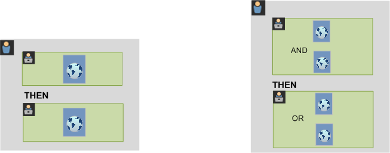

# Om segment

Med segment kan du identifiera undergrupper av besökare baserat på egenskaper eller webbplatsinteraktioner. Segmenten är utformade som målgruppsinsikter som ni kan bygga för era specifika behov och sedan verifiera, redigera och dela med andra teammedlemmar eller använda i andra Adobe-produkter och Analytics-funktioner.

Segmenten baseras på en [!UICONTROL Visitor], [!UICONTROL Visit] och [!UICONTROL Hit] nivåhierarki med en kapslad behållarmodell. Med de kapslade behållarna kan du definiera besökarattribut och åtgärder baserat på regler mellan och inom behållarna. Analyssegment kan byggas, godkännas, delas, sparas och köras på flera produkter och funktioner i [!DNL Adobe Experience Cloud]. Segment kan genereras från en rapport, byggas in i en kontrollpanelrapport eller bokmärkas för snabb åtkomst.

Du kan skapa och spara segment i segmentbyggaren eller generera segment från en utfallsrapport (i  Analysis Workspace). Du kan också använda och utöka fördefinierade segment baserat på specifika regler mellan kapslade behållare, så att du kan filtrera resultaten och tillämpa dem på rapporter. Dessutom kan segment användas tillsammans som [staplade segment](/help/components/segmentation/segmentation-workflow/seg-workflow.md).

Segmenten identifierar vilka era besökare är (land, kön, kafé), vilka enheter och tjänster de använder (webbläsare, sökmotor, mobil enhet), var de navigerar (sökmotor, föregående avslutningssida, naturlig sökning), plus mycket annat.

Segment kan baseras på följande värden:

* Besökare baserade på attribut: webbläsartyp, enhet, antal besök, land, kön.
* Besökare baserade på interaktioner: kampanjer, sökord, sökmotor.
* Besökare baserade på utgångar och tävlingsbidrag: besökare från Facebook, en definierad landningssida, hänvisande domän.
* Besökare baserade på anpassade variabler: formulärfält, definierade kategorier, kund-ID.

När du skapar målgruppssegment i Segment Builder definierar du villkor med hjälp av [!UICONTROL AND] och [!UICONTROL OR] operatorer mellan behållare.

Den här typen av segment filtrerar datauppsättningar baserat på egenskaper som förenats med [!UICONTROL AND] och [!UICONTROL OR] operatorer.

* Du kan [använda flera segment i en rapport eller ett projekt](/help/components/segmentation/segmentation-workflow/seg-workflow.md).
* Segmenten är universella för alla rapportsviter.
* The [Segment Builder](/help/components/segmentation/segmentation-workflow/seg-workflow.md) gör det enklare att skapa segment.
* The [Segmenthanteraren](/help/components/segmentation/segmentation-workflow/seg-workflow.md) låter dig konfigurera [arbetsflöden](/help/components/segmentation/segmentation-workflow/seg-workflow.md) med segmentdelning, taggning, verifiering och godkännandefunktioner.
* Du kan [taggsegment](/help/components/segmentation/segmentation-workflow/seg-workflow.md) om du vill ordna och söka senare i stället för att använda mappar.
* Du kan skapa [Sekventiella segment](/help/components/segmentation/segmentation-workflow/seg-sequential-build.md).
* The [!UICONTROL Page View] behållaren är nu [!UICONTROL Hit] behållare som anger att den här behållaren segmenterar alla typer av data och inte bara sidvyer. Till exempel tas alla anrop för länkspårning och trackAction-anrop från de mobila SDK:erna med eller utan av träffbehållaren.

## Segmentering i Analysis Workspace

Analysis Workspace innehåller följande funktioner:

* Du kan [jämföra segment](https://experienceleague.adobe.com/docs/analytics/analyze/analysis-workspace/panels/segment-comparison/segment-comparison.html).
* Använd [segment som dimensioner](https://experienceleague.adobe.com/docs/core-services/interface/audiences/audience-library.html) i en jämförelse.
* Använd segment i [bortfallsanalys](https://experienceleague.adobe.com/docs/analytics/analyze/analysis-workspace/visualizations/fallout/compare-segments-fallout.html).

## Segment som tillhandahålls av Adobe

Komponentspåret till vänster på skärmen visar segment som har skapats av dig och ditt företag, samt segment i Adobe som ingår i paketet. När du klickar **[!UICONTROL Show all]**, visas dessa segment oftast längst ned i listan och identifieras av Adobe-logotypen till höger. Detta är en del av en lista över segment som tillhandahålls av Adobe:

## Sekventiella segment {#sequential}

Med hjälp av sekventiella segment kan du identifiera besökare baserat på navigering och sidvisning på webbplatsen, vilket ger ett segment med definierade åtgärder och interaktioner. Sekventiella segment hjälper er att identifiera vad en besökare gillar och vad en besökare undviker. När du skapar sekventiella segment [!UICONTROL THEN] -operatorn används för att definiera och beställa besöksnavigering.

| Besök en | Besök två | Besök tre |
|---|---|---|
| Vid det första besöket gick besökaren till huvudlandningssidan (A), exkluderade kampanjsidan (B) och tittade sedan på produktsidan (C). | Vid det andra besöket gick besökaren åter till huvudlandningssidan (A), exkluderade kampanjsidan (B), gick tillbaka till produktsidan (C) och sedan till en ny sida (D). | Vid det tredje besöket gick besökaren in på och följde samma väg som vid det första och andra besöket och uteslöt sedan sidan F för att gå direkt till en riktad produktsida (G). |

Sekventiella segment kan baseras på följande träffvärden:

* Besökare baserade på sekvenser av sidträffar - sidvisningar vid ett och samma besök, sidvisningar vid olika besök, besök där sidvisningar utesluts.
* Besökare baserade på tiden mellan och efter sidvisningar - efter en tidsgräns, mellan träffar, efter en händelse.

Ett sekventiellt segment filtrerar datauppsättningar baserat på användaråtgärder med [!UICONTROL THEN] -operator.

## Video om hur man segmenterar {#segment-video}

Den här videon ger en kort översikt över vilka segmentbehållare som är och hur de används: [Segmentbehållare i Adobe Analytics](https://experienceleague.adobe.com/docs/analytics-learn/tutorials/components/segmentation/segment-containers.html)

## Åtkomst till segmenteringsverktygen {#access}

+++ **Hur når jag segmentbyggaren?**

Du kommer åt segmentbyggaren genom att:

* Visa en befintlig rapport och klicka på segmentikonen   i den vänstra navigeringen. Klicka på i segmentlisten som visas **[!UICONTROL Add]**, eller

* Överst i segmenthanteraren klickar du på **[!UICONTROL + Add]**.  

   eller

* Klicka på en befintlig segmenttitel i segmenthanteraren för att redigera segmentet i segmentbyggaren.

+++

+++ **Hur når jag segmenthanteraren?**

Öppna segmenthanteraren genom att:

* Går till  **[!UICONTROL Analytics]** > **[!UICONTROL Components]** i den övre navigeringen. Klicka sedan på **[!UICONTROL Segments]**, eller

* Visa en befintlig rapport och klicka på segmentikonen   i den vänstra navigeringen. Klicka sedan på **[!UICONTROL Manage]**, eller

* Tryck på snedstreckstangenten &#39;/&#39; var som helst i gränssnittet och sök efter segmenthanteraren.

+++

## Behörigheter {#section_648DFA3A882146C485A84ED014EEC707}

+++ **Vilka rättigheter och behörigheter behöver jag för att använda, skapa och hantera segment?**

Som standard kan alla användare skapa och redigera personliga segment. Administratörer kan dock bestämma vilka som ska ha [behörighet att skapa segment](https://experienceleague.adobe.com/docs/analytics/admin/user-product-management/user-groups/groups.html) och kan tilldela dem till specifika grupper. Dessa segment kan delas direkt med andra Analytics-användare.

Administratörer kan redigera alla segment och dela segment med grupper och med alla i organisationen. [Mer...](/help/components/segmentation/seg-reference/seg-rights.md)

+++

+++ **Kan jag se alla segment i mitt företag?**

Ja, administratörer kan se alla segment i [!DNL Analysis Workspace] och [!DNL Reports & Analytics] användargränssnitt.

Report Builder visar segment som du äger och segment som delas med dig.

+++

+++ **Kan jag hantera alla analyssegment i segmenthanteraren?**

Ja, alla segment kan hanteras i segmenthanteraren. Segmenthanteraren visar segment som är synliga för ägaren (den användare som skapade segmentet), delade användare och adminanvändare. Segmentväljaren visar segment som ägs av och delas med användaren.

Administratörer kan se alla segment inom Analysis Workspace och [!DNL Reports & Analytics] användargränssnitt.

I Report Builder visas endast segment som du har skapat eller segment som har delats specifikt med dig.

+++

+++ **Varför kan jag inte ta bort det här segmentet?**

Om segmentet var [publicerade i Experience Cloud](/help/components/segmentation/segmentation-workflow/seg-workflow.md)kan du inte ta bort eller redigera den. Du kan dock kopiera den och redigera den kopierade versionen.

+++
