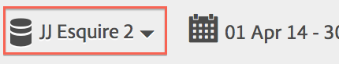
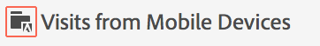
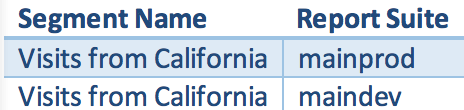

# Vanliga frågor

Svar på vanliga frågor om segmenteringsfunktioner, åtkomst, behörigheter, bästa praxis och hantering av äldre segment.

## Funktioner {#section_BD58629D1A9346BF879E229FA6BEC7A2}

* Segmentering i Analysis Workspace:

   * Du kan [jämföra segment](https://experienceleague.adobe.com/docs/analytics/analyze/analysis-workspace/panels/segment-comparison/segment-comparison.html).
   * Använd [segment som dimensioner](https://experienceleague.adobe.com/docs/core-services/interface/audiences/audience-library.html) i en jämförelse.
   * Använd segment i [bortfallsanalys](https://docs.adobe.com/help/en/analytics/analyze/analysis-workspace/visualizations/fallout/compare-segments-fallout.html).

* Du kan [använda flera segment i en rapport eller ett projekt](/help/components/segmentation/segmentation-workflow/seg-workflow.md).
* Segmenten är universella för alla rapportsviter.
* [Segmentbyggaren](/help/components/segmentation/segmentation-workflow/seg-workflow.md) förenklar skapandet av segment.
* Med [segmenthanteraren](/help/components/segmentation/segmentation-workflow/seg-workflow.md) kan du ställa in [arbetsflöden](/help/components/segmentation/segmentation-workflow/seg-workflow.md) med segmentdelning, taggning, verifiering och godkännandefunktioner.
* Du kan [tagga segment](/help/components/segmentation/segmentation-workflow/seg-workflow.md) och ordna och söka senare i stället för att använda mappar.
* Du kan skapa [sekventiella segment](/help/components/segmentation/segmentation-workflow/seg-sequential-build.md).
* Sidvisningsbehållaren har bytt namn till Träff-behållaren för att ange att den här behållaren segmenterar alla typer av data och inte bara sidvyer. Till exempel tas alla anrop för länkspårning och trackAction-anrop från de mobila SDK:erna med eller utan av träffbehållaren. Observera att det inte fanns någon förändring av hur behållaren fungerar - den döptes bara om.

Mer information finns i [Förbättra segmentering i Adobe Analytics](https://blogs.adobe.com/digitalmarketing/analytics/improving-segmentation-adobe-analytics/)-inlägget i bloggen för digital marknadsföring.

## Åtkomst till segmenteringsverktygen {#section_088AD0E4E21943DFA8CF7206AEC485DD}

**Hur når jag segmentbyggaren?**

Du kommer åt segmentbyggaren genom att:

* Visa en befintlig rapport och klicka på segmentikonen  i den vänstra navigeringen. Klicka på **[!UICONTROL Add]** eller

* Klicka på **[!UICONTROL + Add]** längst upp i segmenthanteraren.  

   eller

* Klicka på en befintlig segmenttitel i segmenthanteraren för att redigera segmentet i segmentbyggaren.

**Hur når jag segmenthanteraren?**

Öppna segmenthanteraren genom att:

* Gå till **[!UICONTROL Analytics]** > **[!UICONTROL Components]** i den översta navigeringen. Klicka sedan på **[!UICONTROL Segments]** eller

* Visa en befintlig rapport och klicka på segmentikonen  i den vänstra navigeringen. Klicka sedan på **[!UICONTROL Manage]** eller

* Tryck på snedstreckstangenten &#39;/&#39; var som helst i gränssnittet och sök efter segmenthanteraren.

**Vart gick listrutan för det äldre segmentet?**

Segmentlistrutan i Rapporter och analyser har ersatts av ett mycket mer funktionsrikt [Segment Builder](/help/components/segmentation/segmentation-workflow/seg-workflow.md)-gränssnitt som gör att du kan skapa&quot;universella&quot; segment som kan användas i alla rapportsviter och i alla Adobe Analytics-lösningar. Om du vill visa en lista över befintliga segment klickar du på segmentikonen 

till vänster navigering och segmentets skena.

**Vart gick listrutan för den äldre rapportsviten?**

Listrutan för rapportsviten har flyttats bredvid datumväljaren i det övre högra hörnet i varje rapport eller kontrollpanel.

## Behörigheter {#section_648DFA3A882146C485A84ED014EEC707}

**Vilka rättigheter och behörigheter behöver jag för att använda, skapa och hantera segment?**

Som standard kan alla användare skapa och redigera personliga segment. Administratörer kan dock bestämma vem som ska ha [behörighet att skapa segment](https://experienceleague.adobe.com/docs/analytics/admin/user-product-management/user-groups/groups.html) och kan tilldela dem till specifika grupper. Dessa segment kan delas direkt med andra Analytics-användare.

Administratörer kan redigera alla segment och dela segment med grupper och med alla i organisationen. [Mer...](/help/components/segmentation/seg-reference/seg-rights.md)

**Kan jag se alla segment i mitt företag?**

Ja, administratörer kan se alla segment i användargränssnitten [!DNL Analysis Workspace] och [!DNL Reports & Analytics].

Ad hoc-analyser och Report Builder visar segment som du äger och segment som delas med dig.

**Kan jag hantera alla analyssegment i segmenthanteraren?**

Ja, alla segment kan hanteras i segmenthanteraren. Segmenthanteraren visar segment som är synliga för ägaren (den användare som skapade segmentet), delade användare och adminanvändare. Segmentväljaren visar segment som ägs av och delas med användaren.

Administratörer kan se alla segment i Analysis Workspace och [!DNL Reports & Analytics] användargränssnitt.

I Report Builder visas endast segment som du har skapat eller segment som har delats specifikt med dig.

**Varför kan jag inte ta bort det här segmentet?**

Om segmentet [publicerades på Experience Cloud](/help/components/segmentation/segmentation-workflow/seg-workflow.md) kan du inte ta bort eller redigera det. Du kan dock kopiera den och redigera den kopierade versionen.

## Bästa praxis {#section_E2C3A1B4B4274D1B86CAA9C0359D049C}

**Vad ska jag göra med duplicerade segment som har samma namn men som kan ha olika definitioner?**
Nu när segment fungerar i flera rapportsviter kan det finnas flera segment med samma namn. Vi rekommenderar att du antingen

* Byt namn på segment som har samma namn men olika definitioner, eller
* Ta bort segment som inte längre behövs.

**Vad rekommenderar Adobe när det gäller att rensa upp segment?**

* Tagga alla segment med äldre tagg.
* Granska de segment du har.
* Lägg till dem i segmentbiblioteket där det är tillämpligt.
* Godkänn kanoniska segment.
* Tagga segment enligt [god praxis](/help/components/segmentation/segmentation-workflow/seg-workflow.md).

## Hantera äldre segment {#section_76CF47142D1A4FB6A0718AD9073049FE}

**Vad hände med mina befintliga segment?**

Befintliga segment fortsätter att fungera som tidigare. Alla rapporter som använder dessa segment fortsätter att fungera korrekt. [Mer...](/help/components/segmentation/seg-transition.md)

De flesta tidigare fördefinierade och suite-segment migreras som segmentmallar till segmentbyggaren. Segmentmallar används för att snabbt skapa anpassade segment med gemensamma målgrupper. Segmentmallar kan inte användas direkt i en rapport, men de kan enkelt sparas i ett anpassat segment.

Segmentmallar är markerade med en speciell ikon i Segment Builder:

**Vad hände med schemalagda rapporter som har segment tillämpade?**

Schemalagda rapporter fortsätter att fungera korrekt med de segment som du har definierat.

När du tar bort ett segment fortsätter schemalagda rapporter och instrumentpaneler som använder det här segmentet att fungera som vanligt, dvs. segmentet eller instrumentpanelen fortsätter att använda det borttagna segmentet.

Schemalagda rapporter uppdateras inte när du redigerar ett segment med samma namn. Här är ett exempel: Låt oss anta att du har två segment med samma namn i olika rapportsviter:

Du har ett bokmärke som refererar till segmentet för huvudprod-rapportsviten. Sedan tar du bort segmentet eftersom det är en dubblett. Bokmärket fortsätter att köras och refererar till definitionen för det borttagna segmentet. Om du ändrar segmentdefinitionen för maindev-segmentet till att omfatta Catalinön och Tijuana Mexico, ändras inte det segment som används för bokmärket. Den gamla definitionen kommer att användas. Du åtgärdar detta genom att uppdatera bokmärket så att det refererar till den nya definitionen. Om du är osäker på om ett bokmärke, en kontrollpanel eller en schemalagd rapport använder ett borttaget segment, kan du ändra namnet på det återstående segmentet så att det blir tydligare om bokmärket använder det återstående segmentet.

**Vad händer med Data warehouse segment?**

Alla segment i Data warehouse fungerar fortfarande i Data warehouse. De flesta segment i Data warehouse fungerar även i andra komponenter, som Analysis Workspace och Rapporter och analyser.

Du kan skapa eller redigera nya Data warehouse-segment i segmentbyggaren/hanteraren. Produktkompatibilitetsmekanismen i segmentbyggaren avgör automatiskt om ett segment är kompatibelt med Data warehouse.

**Vad händer med förkonfigurerade segment?**

* **Besök på en sida**
* **Besök från mobila enheter**
* **Besök från naturlig sökning**
* **Besök från betald sökning**
* **Besök med Visitor ID Cookie**

Dessa segment migreras som segmentmallar till segmentbyggaren. Befintliga rapporter som använder dessa segment fortsätter att fungera korrekt.

**Vad händer med Experience Cloud-segment (Suite):**

* Icke-köpare
* Inköpare
* Första gången du besöker
* Besök från sociala webbplatser
* Besök under mer än 10 minuter*
* Besök med 5+ tidigare besök*
* Besök från Facebook*

De flesta av dessa segment (utom de som är markerade med en asterisk *) migreras över som segmentmallar till segmentbyggaren. Dessutom har flera nya segmentmallar lagts till.

Befintliga rapporter som använder dessa segment fortsätter att fungera korrekt.

**Vad händer med administratörssegment (kallas även&quot;globala&quot; segment)?**

**Administrativa** segment migreras till det nya segmentgränssnittet och visas som segment som delas med alla.

Ägaren till dessa segment anges till den administratör som har det äldsta kontot i inloggningsföretagets lista över adminanvändare, men alla administratörer kan ta bort, redigera och dela dessa segment.

Segmenthanteringsgränssnittet i Admin Console där administratörer skapade och hanterade dessa globala segment är inte längre tillgängligt. Administratörer bör nu använda det nya segmentverktyget för att skapa segment och dela dem med lämpliga grupper eller individer eller med alla.

<!-- 

seg_definition.xml

 -->

Befintliga segment som använder logik som har ändrats enligt beskrivningen i det här dokumentet fortsätter att fungera korrekt, men de måste uppdateras innan de kan sparas igen. Om du till exempel har ett befintligt segment där USA innehåller &quot;New York&quot;, fortsätter det att fungera korrekt, även om du nästa gång du redigerar segmentet måste uppdatera det så att det använder den uppräknade typen med ett lika stort villkor.

**Migreringstips**

Följande tips hjälper dig att migrera gemensamma dimensioner:

* Geo-stad/region/land - sök efter och välj specifika städer, regioner eller länder i stället för att använda en partiell matchning.
* Webbläsare - använd dimensionen Webbläsartyper för att få alla webbläsare i en typ, t.ex. Google Chrome
* Operativsystem - Använd dimensionerna för OS-typer för att få alla operativsystem i en typ, t.ex. Microsoft Windows.

* [Nya och namnändrade Dimensioner](/help/components/segmentation/seg-transition.md#section_73CF121B64A24DEF8E6499F3167BF742)
* [Ändringar i Innehåller](/help/components/segmentation/seg-transition.md#section_1A9EDEE5CBC44B5AA6262560052ABE77)
* [Ändringar av mindre än och större än](/help/components/segmentation/seg-transition.md#section_84A8AAD0344148AD9F9211D3EB271903)

## Nya och namnändrade Dimensioner {#section_73CF121B64A24DEF8E6499F3167BF742}

Tabellen nedan innehåller en lista med dimensioner som har bytt namn i Segment Builder.

<table id="table_1A8C1940FD0446FA8414C6A7DE66E44C"> 
 <thead> 
  <tr> 
   <th colname="col1" class="entry"> Namn på ny Dimension </th> 
   <th colname="col2" class="entry"> Föregående namn </th> 
   <th colname="col3" class="entry"> Anteckningar </th> 
  </tr> 
 </thead>
 <tbody> 
  <tr> 
   <td colname="col1"> Operativsystemstyper </td> 
   <td colname="col2"> Nytt </td> 
   <td colname="col3"> Lades till våren 2015. </td> 
  </tr> 
  <tr> 
   <td colname="col1"> Webbläsarbredd - paketerad </td> 
   <td colname="col2"> Bredd på webbläsare </td> 
   <td colname="col3"> Den här dimensionen är kompatibel med alla gränssnitt och delas upp i en numrerad lista med intervall i stället för specifika heltalsvärden. Om du behöver segmentera specifika värden använder du den granulära versionen av den här dimensionen i ett data warehouse-segment. </td> 
  </tr> 
  <tr> 
   <td colname="col1"> Webbläsarhöjd - paketerad </td> 
   <td colname="col2"> Webbläsarhöjd </td> 
   <td colname="col3"> Den här dimensionen är kompatibel med alla gränssnitt och delas upp i en numrerad lista med intervall i stället för specifika heltalsvärden. Om du behöver segmentera specifika värden använder du den granulära versionen av den här dimensionen i ett data warehouse-segment. </td> 
  </tr> 
  <tr> 
   <td colname="col1"> Webbläsarbredd - Detaljerad </td> 
   <td colname="col2"> Bredd på webbläsare </td> 
   <td colname="col3"> 
Detta har bytt namn och är nu kompatibelt med endast data warehouse. När du definierar segment som är kompatibla med alla gränssnitt använder du den uppräknade typen Webbläsarbredd - Bucketed. 
 </td> 
  </tr> 
  <tr> 
   <td colname="col1"> Webbläsarhöjd - granulerad </td> 
   <td colname="col2"> Webbläsarhöjd </td> 
   <td colname="col3"> 
Detta har bytt namn och är nu kompatibelt med endast data warehouse. När du definierar segment som är kompatibla med alla gränssnitt ska du använda den uppräknade typen Webbläsarhöjd - Bucketed. 
 </td> 
  </tr> 
  <tr> 
   <td colname="col1"> Cookie-stöd </td> 
   <td colname="col2"> Cookies </td> 
   <td colname="col3"> - </td> 
  </tr> 
  <tr> 
   <td colname="col1"> Färgdjup </td> 
   <td colname="col2"> Skärmfärgdjup </td> 
   <td colname="col3"> - </td> 
  </tr> 
  <tr> 
   <td colname="col1"> - </td> 
   <td colname="col2"> "App - *" </td> 
   <td colname="col3"> Prefixen "App -" har tagits bort från ett antal dimensionstyper. Eftersom mobilappsdata vanligtvis samlas in i en rapportserie som inte innehåller webbdata var dessa prefix inte nödvändiga. </td> 
  </tr> 
  <tr> 
   <td colname="col1"> Inmatningssidans originalformat </td> 
   <td colname="col2"> Ursprunglig startsida </td> 
   <td colname="col3"> - </td> 
  </tr> 
  <tr> 
   <td colname="col1"> Java aktiverat </td> 
   <td colname="col2"> Java </td> 
   <td colname="col3"> - </td> 
  </tr> 
  <tr> 
   <td colname="col1"> Högsta URL-längd för mobil webbläsare </td> 
   <td colname="col2"> URL-längd för mobil webbläsare </td> 
   <td colname="col3"> - </td> 
  </tr> 
  <tr> 
   <td colname="col1"> Dekoration av mobilpost </td> 
   <td colname="col2"> Stöd för e-post för mobildekoration </td> 
   <td colname="col3"> - </td> 
  </tr> 
  <tr> 
   <td colname="col1"> Mobil enhet </td> 
   <td colname="col2"> Namn på mobil enhet </td> 
   <td colname="col3"> - </td> 
  </tr> 
  <tr> 
   <td colname="col1"> Max bokmärkeslängd för mobil </td> 
   <td colname="col2"> URL-längd för maximalt bokmärke för mobil </td> 
   <td colname="col3"> - </td> 
  </tr> 
  <tr> 
   <td colname="col1"> Maximal e-postlängd för mobil </td> 
   <td colname="col2"> Högsta URL-längd för mobil e-post </td> 
   <td colname="col3"> - </td> 
  </tr> 
  <tr> 
   <td colname="col1"> Mobiloperativsystem (inaktuellt) </td> 
   <td colname="col2"> Mobiloperativsystem </td> 
   <td colname="col3"> Använd operativsystemsdimensionen och lägg in besök från mobilsegmenten istället. </td> 
  </tr> 
  <tr> 
   <td colname="col1"> Mobil push to Talk </td> 
   <td colname="col2"> Mobil PTT </td> 
   <td colname="col3"> - </td> 
  </tr> 
  <tr> 
   <td colname="col1"> Undersökningsvisning </td> 
   <td colname="col2"> Totalt antal undersökningsvisningar </td> 
   <td colname="col3"> - </td> 
  </tr> 
  <tr> 
   <td colname="col1"> Undersökningssvar </td> 
   <td colname="col2"> Totalt antal undersökningssvar </td> 
   <td colname="col3"> - </td> 
  </tr> 
  <tr> 
   <td colname="col1"> Besöksdjup </td> 
   <td colname="col2"> Sökvägslängd </td> 
   <td colname="col3"> - </td> 
  </tr> 
  <tr> 
   <td colname="col1"> Postnummer </td> 
   <td colname="col2"> Postnummer </td> 
   <td colname="col3"> - </td> 
  </tr> 
 </tbody> 
</table>

## Ändrar till strängbaserade Dimensioner som har kända värden {#section_1A9EDEE5CBC44B5AA6262560052ABE77}

Strängbaserade dimensioner med en känd uppsättning värden ändrades till uppräknade typer. När du skapar ett segment med dessa mått fylls listan i med alla kända värden och den enda operatorn som stöds är lika med. På så sätt kan du snabbt segmentera de exakta värden som du sökte efter utan att välja oönskade värden när du använder mindre begränsande matchning.

Följande dimensioner ändrades till uppräknade listor:

| mobiltillverkare | mobil e-postlängd | färgdjup |
|---|---|---|
| mobilskärmstorlek | mobilenhetsnummer | bildskärmsupplösning |
| mobilskärmshöjd | mobilpush för att prata | plugin |
| stöd för mobilcookies | mobilmejldekoration | operativsystem |
| stöd för mobilbilder | mobilinformationstjänster | referenstyp |
| mobilfärgdjup | mobilenhetstyp | sökmotor |
| stöd för mobilljud | webbläsartyp | tillstånd |
| stöd för mobilvideo | webbläsare | land |
| mobil drm | anslutningstyp | geo-region |
| mobilnätsprotokoll | mobiloperatör | storstad |
| mobiler | cookie | geo dma |
| mobile java vm | kundlojalitet | beständig cookie |
| längd för mobilbokmärke | java aktiverat | betalsökningar |
| mobil URL-längd | språk |  |

## Ändrar till heltalsbaserade Dimensioner med kända värden {#section_84A8AAD0344148AD9F9211D3EB271903}

Heltalsbaserade dimensioner (till exempel webbläsarbredd) med en känd uppsättning värden delades upp i uppräknade intervall så att du snabbt kan definiera segment för ett visst intervall. Dessa uppräknade listor läggs till med &quot; - Bucketed&quot; efter dimensionsnamnet. På följande skärm visas hur de här dimensionerna segmenteras med hjälp av det föregående och nya segmentbyggargränssnittet:

Operatorerna för mindre än, större än och liknande är nu endast kompatibla med Data warehouse-segment. Segment som är avsedda att vara kompatibla med alla rapporteringsgränssnitt bör använda måttets &quot;Bucketed&quot;-version med likhetsoperatorn.
