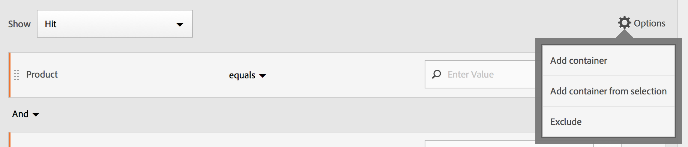

# Segment Builder

The [!UICONTROL Segment Builder] Med kan du skapa enkla eller komplexa segment som identifierar besökarattribut och -åtgärder över besök och sidträffar. Det ger en arbetsyta att dra och släppa mått, händelser eller andra segment för att segmentera besökare baserat på hierarkilogik, regler och operatorer.

Det finns flera sätt att komma åt segmentbyggaren:

* **Populär navigering i Analytics**: Klicka **[!UICONTROL Analytics]** > **[!UICONTROL Components]** > **[!UICONTROL Segments]**.
* **[!UICONTROL Analysis Workspace]**: Klicka **[!UICONTROL Analytics]** > **[!UICONTROL Workspace]**, öppna ett projekt och klicka på **[!UICONTROL + New]** > **[!UICONTROL Create Segment]**.
* **[!UICONTROL Reports & Analytics]**: Klicka **[!UICONTROL Analytics]** > **[!UICONTROL Reports]**, öppna en befintlig rapport och klicka på segmentikonen   i den vänstra navigeringen klickar du på **[!UICONTROL Add]**.
* **[!UICONTROL Report Builder]**: [Lägga till eller redigera segment i Report Builder](https://experienceleague.adobe.com/docs/analytics/analyze/report-builder/data-requests/segmentation.html).

## Builder-villkor {#section_F61C4268A5974C788629399ADE1E6E7C}

Du kan lägga till regeldefinitioner och behållare för att definiera segment.

1. **[!UICONTROL Title]**: Namnge segmentet.
1. **[!UICONTROL Description]**: Ange en beskrivning av segmentet.
1. **[!UICONTROL Tags]**: [Tagga segmentet](/help/components/segmentation/segmentation-workflow/seg-workflow.md) du skapar genom att välja från en lista med befintliga taggar eller skapa en ny tagg.
1. **[!UICONTROL Definitions]**: Här är du [bygga och konfigurera segment](/help/components/segmentation/segmentation-workflow/seg-workflow.md), lägger till regler och kapslar in och sekvensbehållare.
1. **[!UICONTROL Show]**: (Översta behållarväljare.) Välj den översta nivån [container](/help/components/segmentation/seg-overview.md) ( [!UICONTROL Visitor], [!UICONTROL Visit], [!UICONTROL Hit]). Standardbehållaren på den översta nivån är Träff-behållaren.
1. **[!UICONTROL Options]**: (kugghjulsikon)

   * **[!UICONTROL + Add container]**: Gör att du kan lägga till en ny behållare (under behållaren på den översta nivån) till segmentdefinitionen.
   * **[!UICONTROL Exclude]**: Gör att du kan definiera segmentet genom att utesluta en eller flera dimensioner, segment eller mått.

1. **[!UICONTROL Dimensions]**: Komponenter dras och tas bort från listan Dimensioner (orange sidofält).
1. **[!UICONTROL Operator]**: Du kan jämföra och begränsa värden med valda operatorer.
1. **[!UICONTROL Value]**: Värdet som du angav eller valde för dimensionen, segmentet eller mätvärdet.
1. **[!UICONTROL Attribution Models]**: Dessa modeller är bara tillgängliga för dimensioner och avgör vilka värden i en dimension som ska segmenteras. Dimensioner är särskilt användbara vid sekventiell segmentering.

   * **[!UICONTROL Repeating]** (standard): Inkluderar instanser och beständiga värden för dimensionen.
   * **[!UICONTROL Instance]**: Inkluderar instanser för dimensionen.
   * **[!UICONTROL Non-repeating instance]**: Inkluderar unika instanser (icke-upprepande) för dimensionen. Detta är den modell som används i Flow när upprepade instanser utesluts.

   

   **Exempel: Träffsegment där eVar1 = A**

   | Exempel | A | A | A (beständig) | B | A | C |
   |---|---|---|---|---|---|---|
   | Upprepande | X | X | X | - | X | - |
   | Instance | X | X | - | - | X | - |
   | Icke upprepande instans | X | - | - | - | X | - |
1. **[!UICONTROL And/Or/Then]**: Tilldelar [!UICONTROL AND/OR/THEN] mellan behållare eller regler. Operatorn THEN gör att du kan [definiera sekventiella segment](/help/components/segmentation/segmentation-workflow/seg-sequential-build.md).
1. **[!UICONTROL Metric]**: (Grönt sidofält) Mätvärden som har dragits och tagits bort från listan Metrisk.
1. **[!UICONTROL Comparison]** operator: Du kan jämföra och begränsa värden med valda operatorer.
1. **[!UICONTROL Value]**: Värdet som du angav eller valde för dimensionen, segmentet eller mätvärdet.
1. **[!UICONTROL X]**: (Ta bort) Du kan ta bort den här delen av segmentdefinitionen.
1. **[!UICONTROL Experience Cloud publishing]**: Genom att publicera ett Adobe Analytics-segment i Experience Cloud kan du använda segmentet för marknadsföringsaktiviteter i [!DNL Audience Manager] och i andra aktiveringskanaler. [Läs mer …](/help/components/segmentation/segmentation-workflow/seg-publish.md)
1. **[!UICONTROL Audience library]**: Adobe hanterar översättningen av besöksdata till målgruppssegmentering. Att skapa och hantera målgrupper liknar alltså att skapa och använda segment, med möjlighet att dela målgruppssegmentet till Experience Cloud. [Läs mer …](https://experienceleague.adobe.com/docs/core-services/interface/audiences/audience-library.html)
1. **[!UICONTROL Search]**: Söker i listan över dimensioner, segment eller mått.
1. **[!UICONTROL Dimensions]**: (Lista) Klicka på rubriken för att expandera.
1. **[!UICONTROL Metrics]**: Klicka på rubriken för att expandera.
1. **[!UICONTROL Segments]**: Klicka på rubriken för att expandera.
1. **[!UICONTROL Report suite selector]**: Här kan du välja den rapportsserie som det här segmentet ska sparas under. Du kan fortfarande använda segmentet i alla rapportsviter.
1. **[!UICONTROL Segment Preview]**: Här kan du förhandsgranska nyckelmåtten för att se om du har ett giltigt segment och hur brett segmentet är. Representerar den uppdelning av datauppsättningen som du kan förvänta dig att se om du använder det här segmentet. Visar 3 koncentriska cirklar och en lista som visar antalet och procentandelen matchningar för [!UICONTROL Hits], [!UICONTROL Visits]och [!UICONTROL Visitors] för ett segment som körs mot en datauppsättning. Diagrammet uppdateras omedelbart när du har skapat eller ändrat segmentdefinitionen.
1. **[!UICONTROL Product Compatibility]**: En lista över vilka Adobe Analytics-produkter (Analysis Workspace, [!UICONTROL Reports & Analytics], Data warehouse) med vilket segmentet du skapade är kompatibelt. De flesta segment är kompatibla med alla produkter. Alla operatorer och dimensioner är dock inte kompatibla med alla Analytics-produkter, särskilt [data warehouse](/help/components/segmentation/seg-reference/seg-compatibility.md). Diagrammet uppdateras omedelbart efter att du har gjort ändringar i segmentdefinitionen.
1. **[!UICONTROL Save]** eller **[!UICONTROL Cancel]**: Sparar eller avbryter segmentet. Efter klickning **[!UICONTROL Save]** kommer du till segmenthanteraren där du kan hantera segmentet.

Segment med inbäddade datumintervall fungerar fortfarande annorlunda i Analysis Workspace jämfört med [!UICONTROL Reports & Analytics]: I Arbetsyta åsidosätter ett segment med ett inbäddat datumintervall panelens datumintervall. I motsats till [!UICONTROL Reports & Analytics] ger dig skärningspunkten för rapportdatumintervallet och segmentets inbäddade datumintervall.

## Skapa segment {#build-segments}

1. Dra bara en Dimension, ett segment eller en metrisk händelse från den vänstra rutan till den [!UICONTROL Definitions] fält.

   

   Standardnivån på den översta nivån [!UICONTROL Hit] behållaren visas när du har dragit ett element till [!UICONTROL Definitions]. Du kan ändra behållartypen till Besök eller Besök på menyn **[!UICONTROL Show]** nedrullningsbar meny.

1. Ange [operator](/help/components/segmentation/seg-reference/seg-operators.md) i listrutan.
1. Ange eller välj ett värde för det markerade objektet.
1. Lägg till ytterligare behållare om det behövs, med **[!UICONTROL And]**, **[!UICONTROL Or]**, eller **[!UICONTROL Then]** regler.
1. När du har placerat behållarna och angett reglerna ser du resultatet av segmentet i valideringsdiagrammet längst upp till höger. Valideraren anger det procentuella och absoluta antalet sidvisningar, besök och unika besökare som matchar det segment som du skapade.
1. Under **[!UICONTROL Tags]**, [tag](/help/components/segmentation/segmentation-workflow/seg-tag.md) behållaren genom att markera en befintlig tagg eller skapa en ny.
1. Klicka **[!UICONTROL Save]** för att spara segmentet.

Du går nu till [Segmenthanteraren](/help/components/segmentation/segmentation-workflow/seg-manage.md), där du kan tagga, dela och hantera ditt segment på flera sätt.

## Lägg till behållare {#section_1C38F15703B44474B0718CEF06639EFD}

Du kan [skapa ett ramverk med behållare](/help/components/segmentation/seg-overview.md) och sedan placera logiska regler och operatorer mellan.

1. Klicka på **[!UICONTROL Options > Add Container]**.

   

   En ny [!UICONTROL Hit] behållaren öppnas utan [!UICONTROL Hit] (Sidvy) identifierad.

   

1. Ändra behållartypen efter behov.
1. Dra en Dimension, ett segment eller en händelse från den vänstra rutan till behållaren.
1. Fortsätt lägga till nya behållare på den översta nivån **[!UICONTROL Options]** > **[!UICONTROL Add container]** längst upp i definitionen eller lägg till behållare från en behållare till kapslingslogik.

   **ELLER**

   Markera en eller flera regler och klicka sedan på **[!UICONTROL Options]** > **[!UICONTROL Add container from selection]**. Detta gör om markeringen till en separat behållare.

## Använd datumintervall {#concept_252A83D43B6F4A4EBAB55F08AB2A1ACE}

Ni kan skapa segment som innehåller rullande datumintervall för att få svar på frågor om pågående kampanjer eller evenemang.

Du kan till exempel enkelt skapa ett segment som innehåller&quot;alla som har köpt något de senaste 60 dagarna&quot;.

Du skapar en besöksbehållare och i den lägger du till [!UICONTROL Last 60 days] tidsintervall och mått [!UICONTROL Orders is greater than or equal to 1], med operatorn AND:

Här är en video om hur du använder rullande datumintervall i segment:

>[!VIDEO](https://video.tv.adobe.com/v/25403/?quality=12)

## Stapla segment {#task_58140F17FFD64FF1BC30DC7B0A1B0E6D}

Stapla segment fungerar genom att kombinera villkoren i varje segment med hjälp av operatorn&quot;och&quot; och sedan använda de kombinerade kriterierna. Detta kan du göra i ett Workspace-projekt direkt eller i segmentbyggaren.

Om du till exempel staplar ett segment med&quot;mobilanvändare&quot; och ett&quot;USA-geografiskt&quot; segment returneras data endast för mobilanvändare i USA.

Tänk på dessa segment som byggstenar eller moduler som du kan inkludera i ett segmentbibliotek, så att användarna kan använda dem som de vill. På så sätt kan du dramatiskt minska antalet segment som behövs. Anta till exempel att du har 40 segment:

* 20 för mobilanvändare i olika länder (US_mobile, Germany_mobile, France_mobile, Brazil_mobile, osv.)
* 20 för surfplatteanvändare i olika länder (US_tablet, Germany_tablet, France_tablet, Brazil_tablet, osv.)

Genom att använda segmentstackning kan du minska antalet segment till 22 och stapla dem efter behov. Du måste skapa följande segment:

* ett segment för mobilanvändare
* ett segment för surfplattor
* 20 segment för de olika geografiska områdena

>[!NOTE]
>
>När du staplar två segment förenas de som standard med en AND-sats. Detta kan inte ändras till en OR-sats.

1. Gå till Segment Builder.
1. Ange en rubrik och beskrivning för segmentet.

   Stegresultat 1. Klicka **[!UICONTROL Show Segments]** för att visa listan över segment i den vänstra navigeringen.

   Stegresultat 1. Dra och släpp de segment som du vill stapla på segmentdefinitionsytan. Här är ett exempel på ett segment som staplar de befintliga segmenten &quot;Besök från surfplattor&quot; och &quot;US Geo&quot;:

   

1. Spara segmentet.

   Stegresultat

## Segmentmallar {#concept_5098446CC78D441E93B8E4D1D1EA6558}

Segmentmallar finns för vanliga användningsfall för segmentering, som&quot;förstagångsbesök&quot; eller&quot;besök från mobila enheter&quot;. De är tillgängliga i Workspace-projekt och i segmentbyggaren som byggstenar för nya segment.

Mallar betecknas med Adobe&quot;A&quot;-logotypen. Ett exempel på mallarna visas nedan:

<table id="table_98B87D807E9344C9BEBF072C65D87B1B"> 
 <thead> 
  <tr> 
   <th colname="col1" class="entry"> Mallnamn </th> 
   <th colname="col2" class="entry"> Definition </th> 
  </tr> 
 </thead>
 <tbody> 
  <tr> 
   <td colname="col1"> Abandon Cart </td> 
   <td colname="col2">Visa data för besökare som har lagt till artiklar i sina kundvagnar men inte beställt något. I segmentdefinitionen är behållaren Besök. Regeln för det här sekventiella segmentet är 
 Cart Additions är inte null 
 
Sedan 
 
Order är lika med 0. 
 </td> 
  </tr> 
  <tr> 
   <td colname="col1"> Första gången du besöker </td> 
   <td colname="col2">Visa data för besökare som har besökt högst en [1] gång. I segmentdefinitionen är behållaren Besök. Regeln är 
Besök Nummer är lika med 1. 
 </td> 
  </tr> 
  <tr> 
   <td colname="col1"> Icke-köpare </td> 
   <td colname="col2">Visa data för besökare som inte har deltagit i en orderhändelse. I segmentdefinitionen är behållaren Visitor. Det här segmentet använder exkluderingslogiken. Regeln är 
Beställningar är inte null. 
 </td> 
  </tr> 
  <tr> 
   <td colname="col1"> Besök ej enstaka sida (ej studsar) </td> 
   <td colname="col2">Visa data för besökare som har besökt mer än en gång. I segmentdefinitionen är behållaren Visitor. Det här segmentet använder exkluderingslogiken. Regeln är 
Enkel åtkomst är inte null. 
 </td> 
  </tr> 
  <tr> 
   <td colname="col1"> Betalsökning </td> 
   <td colname="col2">Visa data från besökare som kommer från en betald sökning. I segmentdefinitionen är behållaren Besök. Regeln är 
Betalsökning är lika med 1. 
 </td> 
  </tr> 
  <tr> 
   <td colname="col1"> Inköpare </td> 
   <td colname="col2">Visa data för besökare som har deltagit i en orderhändelse. I segmentdefinitionen är behållaren Visitor. Regeln är 
Beställningar är inte null. 
 </td> 
  </tr> 
  <tr> 
   <td colname="col1"> Återbesök </td> 
   <td colname="col2">Visa data från besökare som har besökt minst en gång. I segmentdefinitionen är behållaren Besök. Regeln är 
Besöksnumret är större än 1. 
 </td> 
  </tr> 
  <tr> 
   <td colname="col1"> Besök på en sida </td> 
   <td colname="col2"> Visa data från besök där du ser ett enda sidvärde, även om du kan skicka in flera sidvisningar under besöket. Enkelsidiga besök med avslutningslänkshändelser ingår i segmentet. I segmentdefinitionen är behållaren Besök. Regeln är 
Enkelsidiga besök är lika med 1. 
 </td> 
  </tr> 
  <tr> 
   <td colname="col1"> Den visade produkten lades inte till i kundvagnen </td> 
   <td colname="col2">Visa data för besökare som visade produkter men inte hade några kundvagnstillägg. I segmentdefinitionen är behållaren Besök. Regeln för det här sekventiella segmentet är 
Produktvyer är inte null 
 
Sedan 
 
 Cart Additions är lika med 0. 
 </td> 
  </tr> 
  <tr> 
   <td colname="col1"> Besök från Campaign </td> 
   <td colname="col2">Visa data från besökare som refereras av kampanjer. I segmentdefinitionen är behållaren Besök. Regeln är 
Spårningskod är inte null. 
 </td> 
  </tr> 
  <tr> 
   <td colname="col1"> Besök från mobila enheter </td> 
   <td colname="col2">Visa data från besökare som använder mobila enheter. I segmentdefinitionen är behållaren Besök. Regeln är 
Mobilenheten är inte null. 
 </td> 
  </tr> 
  <tr> 
   <td colname="col1"> Besök från naturlig sökning </td> 
   <td colname="col2">Visa data från besökare som inte kommer från en betald sökning. I segmentdefinitionen är behållaren Besök. Regeln är 
Betalsökning är lika med 0. 
 </td> 
  </tr> 
  <tr> 
   <td colname="col1"> Besök från icke-mobil enhet </td> 
   <td colname="col2">Visa data från besökare som inte använder mobila enheter. I segmentdefinitionen är behållaren Besök. Det här segmentet använder exkluderingslogiken. Regeln är 
Mobilenhetstyp är lika med mobiltelefon 
 
eller 
 
Mobilenhetstyp är lika med surfplatta. 
 </td> 
  </tr> 
  <tr> 
   <td colname="col1"> Besök från telefoner </td> 
   <td colname="col2">Visa data från besökare som använder telefoner. I segmentdefinitionen är behållaren Besök. Regeln är 
Enhetstypen är lika med mobiltelefonen. 
 </td> 
  </tr> 
  <tr> 
   <td colname="col1"> Besök från sökmotorer </td> 
   <td colname="col2">Visa data från besökare som sökmotorer refererar till. I segmentdefinitionen är behållaren Besök. Regeln är 
Refererartyp är lika med sökmotorer. 
 </td> 
  </tr> 
  <tr> 
   <td colname="col1"> Besök från sociala webbplatser </td> 
   <td colname="col2">Visa data från besökare som hänvisas till av sociala webbplatser. I segmentdefinitionen är behållaren Besök. Regeln är 
Refererartypen är lika med sociala nätverk. 
 </td> 
  </tr> 
  <tr> 
   <td colname="col1"> Besök från surfplattor </td> 
   <td colname="col2">Visa data från besökare med surfplattor. I segmentdefinitionen är behållaren Besök. Regeln är 
Enhetstyp är lika med surfplatta. 
 </td> 
  </tr> 
  <tr> 
   <td colname="col1"> Besök med Visitor ID Cookie </td> 
   <td colname="col2">Visa data från besökare till er webbplats, där en beständig cookie krävs. I segmentdefinitionen är behållaren Besök. Regeln är 
Beständig cookie är lika med 1. 
 </td> 
  </tr> 
 </tbody> 
</table>
