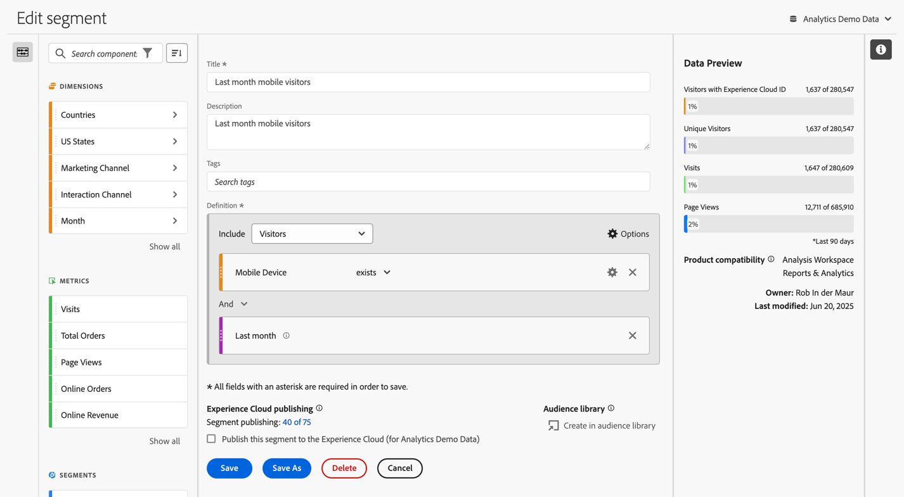
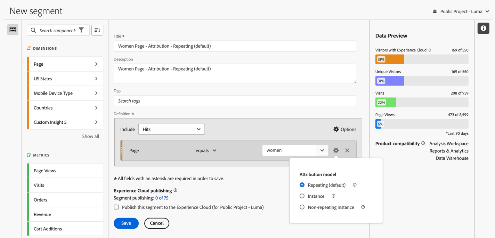

# Skapa segment {#build-segments}

>[!CONTEXTUALHELP]
>id="components_segments_productcompatibility"
>title="Produktkompatibilitet"
>abstract="Ett litet antal tillgängliga segmentkriterier är inte kompatibla med alla Adobe Analytics-verktyg. Verktyg som är kompatibla med segmentet visas i den här listan. Om du vill göra ett segment kompatibelt med alla Adobe Analytics-verktyg redigerar du villkoren."

>[!CONTEXTUALHELP]
>id="components_filters_createaudience"
>title="Skapa publik"
>abstract="Målgrupper kan skapas från ett segment och delas med Adobe Experience Platform för aktivering."

>[!CONTEXTUALHELP]
>id="components_filters_datapreview"
>title="Förhandsgranska data"
>abstract="Jämför data i det här segmentet med data i rapportsviten. Procentandelen för förhandsgranskning baseras på det totala antalet från de **senaste 90 dagarna**.  Om förhandsgranskningen inte läses in kan anslutningen fortfarande återfyllas."

Dialogrutan **[!UICONTROL Segment builder]** används för att skapa nya eller redigera befintliga segment. Dialogrutan heter **[!UICONTROL New segment]** eller **[!UICONTROL Edit segment]** för segment som du skapar eller hanterar från [[!UICONTROL Segment]-hanteraren ](/help/components/segmentation/segmentation-workflow/seg-manage.md).

>[!BEGINTABS]

>[!TAB Segmentbyggare]

>[!TAB Skapa eller redigera segment]

>[!ENDTABS]

1. Ange följande information ( krävs):

   | Element | Beskrivning |
   | --- | --- |
   | **[!UICONTROL Report suite]** | Du kan välja rapportsviten för segmentet. |
   | **[!UICONTROL Project-only segment]** | En informationsruta som förklarar att segmentet bara är synligt i det projekt där det skapades. Och att segmentet inte läggs till i komponentlistan. Aktivera **[!UICONTROL Make this segment available to all your projects and add it to your component list]** om du vill ändra den inställningen. Den här informationsrutan visas bara när du skapar ett [snabbsegment](seg-quick.md) och vrider snabbsegmentsinformationen till ett reguljärt segment med **[!UICONTROL Open builder]** från [!UICONTROL Quick segment]-gränssnittet. |
   | **[!UICONTROL Title]**  | Namnge segmentet, till exempel `Last month mobile visitors`. |
   | **[!UICONTROL Description]** | Ange en beskrivning av segmentet, till exempel `Segment to define the mobile customers for the last month`. |
   | **[!UICONTROL Tags]** | Organisera segmentet genom att skapa eller använda en eller flera taggar. Börja skriva för att hitta befintliga taggar som du kan markera. Eller tryck på **[!UICONTROL ENTER]** för att lägga till en ny tagg. Välj  om du vill ta bort en tagg. |
   | **[!UICONTROL Definition]**  | Definiera ditt segment med [Definitionsverktyget](#definition-builder). |

   {style="table-layout:auto"}

1. Använd den ständigt uppdaterade förhandsgranskningen av segmentets resultat högst upp till höger för att kontrollera om segmentdefinitionen är korrekt.
1. Om du vill publicera ditt segment på Experience Cloud väljer du **[!UICONTROL Publish this segment to the  Experience Cloud (for *rapportsviten *)]**. Mer information finns i [Publicera segment till Experience Cloud](/help/components/segmentation/segmentation-workflow/seg-publish.md).
1. Välj:
   * **[!UICONTROL Save]** om du vill spara segmentet.
   * **[!UICONTROL Save As]** om du vill spara en kopia av segmentet.
   * **[!UICONTROL Delete]** om du vill ta bort segmentet.
   * **[!UICONTROL Cancel]** om du vill avbryta ändringar som du har gjort i segmentet eller avbryta skapandet av ett nytt segment.

## Definition builder

Du använder Definitionsverktyget för att skapa segmentdefinitionen. I den konstruktionen använder du komponenter, behållare, operatorer och logik.

Du kan konfigurera typen och omfattningen av din definition:

1. Om du vill ange typen av definition anger du om du vill att definitionen ska vara inkluderad eller exkluderad. Välj  **[!UICONTROL Options]** och i listrutan **[!UICONTROL Include]** eller **[!UICONTROL Exclude]**.
1. Om du vill ange definitionens omfattning väljer du i listrutan **[!UICONTROL Include]** eller **[!UICONTROL Exclude]** om du vill att definitionens omfång ska vara **[!UICONTROL Hits]**, **[!UICONTROL Visits]** eller **[!UICONTROL Visitors]**.

Du kan alltid ändra de här inställningarna senare.

### Komponenter

En viktig del av arbetet med att skapa segmentdefinitionen är att använda mått, mätvärden, befintliga segment och datumintervall. Alla dessa komponenter är tillgängliga från komponentpanelen i segmentbyggaren.

{width=100%}

Så här lägger du till en komponent:

1. Dra och släpp en komponent från komponentpanelen till **[!UICONTROL Drag and drop Metric(s), Segment(s), and/or Dimensions here]**. Du kan använda  i komponentfältet för att söka efter specifika komponenter.
1. Ange information för komponenten. Välj till exempel ett värde från **[!UICONTROL Select value]**. Eller ange ett värde. Vad och hur du kan ange ett eller flera värden beror på komponenten och operatorn.
1. Om du vill kan du ändra standardoperatorn. Exempel: från **[!UICONTROL equals]** till **[!UICONTROL equals any of]**. Se [Operatorer](../seg-reference/seg-operators.md) för en detaljerad översikt över tillgängliga operatorer.

Så här redigerar du en komponent:

* Välj en ny operator för komponenten i den nedrullningsbara menyn operator.
* Välj eller ange ett annat värde för operatorn om det är lämpligt.
* Om komponenttypen är en dimension kan du definiera attribueringsmodellen. Mer information finns i [Attributmodell](#attribution).

Så här tar du bort en komponent:

* Välj  i en komponent.

### Behållare

Du kan gruppera flera komponenter i en eller flera behållare och definiera logik i och mellan behållare. Med behållare kan du skapa komplexa definitioner för ditt segment.

{Width=100%}

* Om du vill lägga till en behållare väljer du **[!UICONTROL Add container]** från  **[!UICONTROL Options]**.
* Om du vill lägga till en befintlig komponent i behållaren drar och släpper du komponenten i behållaren.
* Om du vill lägga till en annan komponent i behållaren drar och släpper du en komponent från komponentpanelen i behållaren. Använd den blå infogningslinjen som stödlinje.
* Om du vill lägga till en annan komponent utanför behållaren drar och släpper du en komponent från komponentpanelen utanför behållaren, men inuti huvuddefinitionsbehållaren. Använd den blå infogningslinjen som stödlinje.
* Om du vill ändra logiken mellan komponenterna i en behållare, mellan behållare eller mellan en behållare och en komponent, väljer du lämplig **[!UICONTROL And]**, **[!UICONTROL Or]**, **[!UICONTROL Then]**. När du väljer **[!UICONTROL Then]** förvandlar du segmentet till ett sekventiellt segment. Mer information finns i [Skapa sekventiellt segment](seg-sequential-build.md).
* Om du vill ändra behållarnivån väljer du  **[!UICONTROL Hits]**,  **[!UICONTROL Visits]** eller  **[!UICONTROL Visitors]**.

Du kan använda  i en behållare för följande åtgärder:

| Behållaråtgärd | Beskrivning |
|---|---|
| **[!UICONTROL Add container]** | Lägg till en kapslad behållare i behållaren. |
| **[!UICONTROL Exclude]** | Exkludera resultatet från behållaren i segmentdefinitionen. Ett tunt rött fält till vänster identifierar en exkluderingsbehållare. |
| **[!UICONTROL Include]** | Inkludera resultatet från behållaren i segmentdefinitionen. Inkludera är standard. Ett tunt grått fält till vänster identifierar en inkluderingsbehållare. |
| **[!UICONTROL Name container]** | Byt namn på behållaren från standardbeskrivningen. Skriv ett namn i textfältet. Om du inte anger några indata används standardbeskrivningen. |
| **[!UICONTROL Delete container]** | Ta bort behållaren från definitionen. |

## Datumintervall

Du kan skapa segment som innehåller rullande datumintervall. På så sätt kan ni besvara frågor om pågående kampanjer eller evenemang. Du kan till exempel skapa ett segment som innehåller *alla som har gjort ett onlineköp de senaste 60 dagarna*.

>[!BEGINSHADEBOX]

Se  [Rullande datumintervall i segment](https://video.tv.adobe.com/v/25403/?quality=12&learn=on){target="_blank"} för en demonstrationsvideo.

>[!ENDSHADEBOX]

## Stapla segment {#stack}

Du kan skapa ett segment med hjälp av segment. När du använder segment i ett segment kan du optimera segmentet och minska komplexiteten.

Tänk dig att du vill segmentera med en kombination av interaktionskanal (5) och delstater i USA (50). Du kan antingen skapa 250 segment, var och en för den unika kombinationen av enhetstyp (mobiltelefon kontra surfplatta) och USA. För att få surfplatteanvändare i Kalifornien använder du ett av de 250 segmenten:

Eller så kan ni definiera 55 segment: 50 segment för USA och 5 för möjliga interaktionskanaler. Sedan staplar du segmenten för att få samma resultat. För att få tag i mobilappsanvändarna i Kalifornien behöver du två segment:

## Tillskrivning {#attribution}

>[!CONTEXTUALHELP]
>id="components_filters_attribution_repeating"
>title="Upprepande"
>abstract="Inkluderar instanser och beständiga värden för dimensionen."

>[!CONTEXTUALHELP]
>id="components_filters_attribution_instance"
>title="Instance"
>abstract="Inkluderar instanser för dimensionen."

>[!CONTEXTUALHELP]
>id="components_filters_attribution_nonrepeatinginstance"
>title="Icke upprepande instans"
>abstract="Inkluderar unika (icke upprepande) instanser för dimensionen."

När du använder en dimension i segmentverktyget har du möjlighet att ange attribueringsmodellen för den dimensionen. Den attribueringsmodell du väljer avgör om data uppfyller villkoren som du har angett för dimensionskomponenten.

Välj  i dimensionskomponenten och välj en av attributmodellerna i popup-fönstret:

| Models | Beskrivning |
|---|---|
| **[!UICONTROL Repeating model (default)]** | Inkludera instans- och beständiga värden för dimensionen för att avgöra kvalificeringen. |
| **[!UICONTROL Instance]** | Inkludera endast instansvärden för dimensionen för att bestämma kvalificeringen. |
| **[!UICONTROL Non-repeating instance]** | Inkludera unika instansvärden (ej upprepade) för dimensionen för att fastställa kvalificeringen. |

### Exempel

Som en del av en segmentdefinition har du angett följande villkor: Sidnamn är lika med Kvinnor. Liknar exemplet ovan. Du upprepar den här segmentdefinitionen med två andra attribueringsmodeller. Ni har alltså tre segment var och en med sin egen attribueringsmodell:

* Kvinnors sida - Attribution - Upprepande (standard)
* Kvinnlig sida - Attribution - Instans
* Women Page - Attribution - Non-repeating instance

Tabellen nedan förklarar, för varje attribueringsmodell, vilka inkommande händelser som är kvalificerade  för det villkoret.

| Kvinnssida - Attribution -  *attribueringsmodell* | Händelse 1: Sidnamnet är lika med Kvinnor | Händelse 2: Sidnamnet är lika med Män | Händelse 3: Sidnamnet är lika med Kvinnor | Händelse 4: Sidnamnet är lika med Kvinnor (beständigt) | Händelse 5: Sidnamnet är lika med Utcheckning | Händelse 6: Sidnamnet är lika med Kvinnor | Händelse 7: Sidnamnet är lika med Hem |
|---|:---:|:---:|:---:|:---:|:---:|:---:|:--:|
| Upprepande (standard) |  |  |  |  |  |  |  |
| Instance |  |  |  |  |  |  |  |
| Icke upprepande instans |  |  |  |  |  |  |  |

En exempelrapport om händelser som använder de tre segmenten ser ut så här:

<!--

The [!UICONTROL Segment builder] lets you build simple or complex segments that identify visitor attributes and actions across visits and page hits. It provides a canvas to drag and drop metric dimensions, events, or other segments in order to segment visitors based on hierarchy logic, rules, and operators.

There are several ways to access the Segment builder:

* **Analytics top navigation**: Click **[!UICONTROL Analytics]** > **[!UICONTROL Components]** > **[!UICONTROL Segments]**.
* **[!UICONTROL Analysis Workspace]**: Click **[!UICONTROL Analytics]** > **[!UICONTROL Workspace]**, open a project and click **[!UICONTROL + New]** > **[!UICONTROL Create Segment]**.
* **[!UICONTROL Report Builder]**: [Add or edit segments in Report Builder](https://experienceleague.adobe.com/en/docs/analytics/analyze/report-builder/work-with-segments).

## Builder criteria {#section_F61C4268A5974C788629399ADE1E6E7C}

You can add rule definitions and containers to define your segments.

1. **[!UICONTROL Title]**: Name the segment.
1. **[!UICONTROL Description]**: Provide a description for the segment. 
1. **[!UICONTROL Tags]**: [Tag the segment](/help/components/segmentation/segmentation-workflow/seg-workflow.md) you are creating by picking from a list of existing tags or creating a new tag.
1. **[!UICONTROL Definitions]**: This is where you [build and configure segments](/help/components/segmentation/segmentation-workflow/seg-workflow.md), add rules, and nest and sequence containers. 
1. **[!UICONTROL Show]**: (Top Container selector.) Lets you select the top-level [container](/help/components/segmentation/seg-overview.md) ( [!UICONTROL Visitor], [!UICONTROL Visit], [!UICONTROL Hit]). The default top-level container is the Hit container.
1. **[!UICONTROL Options]**: (gear) icon

   * **[!UICONTROL + Add container]**: Lets you add a new container (below the top-level container) to the segment definition.
   * **[!UICONTROL Exclude]**: Lets you define the segment by excluding one or more dimensions, segments, or metrics.

1. **[!UICONTROL Dimensions]**: Components are dragged and dropped from the Dimensions list (orange sidebar).
1. **[!UICONTROL Operator]**: You can compare and constrain values using selected operators.
1. **[!UICONTROL Value]**: The value you entered or selected for the dimension or segment or metric.
1. **[!UICONTROL Attribution Models]**: Available for dimensions only, these models determine what values in a dimension to segment for. Dimension models are particularly useful in sequential segmentation.

   * **[!UICONTROL Repeating]** (default): Includes instances and persisted values for the dimension.
   * **[!UICONTROL Instance]**: Includes instances for the dimension.
   * **[!UICONTROL Non-repeating instance]**: Includes unique instances (non-repeating) for the dimension. This is the model applied in Flow when repeat instances are excluded.

   

   **Example: Hit segment where eVar1 = A** 

   |  Example  | A  | A  |  A (persisted) | B  | A  | C  |
   |---|---|---|---|---|---|---|
   |  Repeating  | X  | X  | X  | -  | X  | -  |
   |  Instance  | X  | X  | - | - | X | - |
   |  Non-repeating instance  | X | - | - | -  | X  | -  |

1. **[!UICONTROL And/Or/Then]**: Assigns the [!UICONTROL AND/OR/THEN] operators between containers or rules. The THEN operator lets you [define sequential segments](/help/components/segmentation/segmentation-workflow/seg-sequential-build.md).
1. **[!UICONTROL Metric]**: (Green sidebar) Metric that was dragged and dropped from the Metrics list.
1. **[!UICONTROL Comparison]** operator: You can compare and constrain values using selected operators.
1. **[!UICONTROL Value]**: The value you entered or selected for the dimension or segment or metric.
1. **[!UICONTROL X]**: (Delete) Lets you delete this part of the segment definition.
1. **[!UICONTROL Experience Cloud publishing]**: Publishing an Adobe Analytics segment to the Experience Cloud lets you use the segment for marketing activity in [!DNL Audience Manager] and in other activation channels. [Learn more...](/help/components/segmentation/segmentation-workflow/seg-publish.md)
1. **[!UICONTROL Audience library]**: Adobe's audience services manage the translation of visitor data into audience segmentation. As such, creating and managing audiences is similar to creating and using segments, with the added ability to share the audience segment to the Experience Cloud. [Learn more...](https://experienceleague.adobe.com/docs/core-services/interface/audiences/audience-library.html)
1. **[!UICONTROL Search]**: Searches the list of dimensions, segments, or metrics.
1. **[!UICONTROL Dimensions]**: (List) Click the header to expand.
1. **[!UICONTROL Metrics]**: Click the header to expand.
1. **[!UICONTROL Segments]**: Click the header to expand.
1. **[!UICONTROL Report suite selector]**: Lets you select the report suite that this segment will be saved under. You can still utilize the segment in all report suites.
1. **[!UICONTROL Segment Preview]**: Lets you preview the key metrics to see whether you have a valid segment and how broad the segment is. Represents the breakdown of the data set you can expect to see if you apply this segment. Shows 3 concentric circles and a list to show the number and percentage of matches for [!UICONTROL Hits], [!UICONTROL Visits], and [!UICONTROL Visitors] for a segment run against a data set. This chart is updated immediately after you create or make changes to your segment definition.
1. **[!UICONTROL Product Compatibility]**: Provides a list of which Adobe Analytics products (Analysis Workspace, Data Warehouse) with which the segment you created is compatible. Most segments are compatible with all products. However, not all operators and dimensions are compatible with all Analytics products, especially [Data Warehouse](/help/components/segmentation/seg-reference/seg-compatibility.md). This chart is updated immediately after you make changes to your segment definition.
1. **[!UICONTROL Save]** or **[!UICONTROL Cancel]**: Saves or cancels the segment. After clicking **[!UICONTROL Save]**, you are taken to the Segment manager where you can manage the segment.

## Build segments {#build-segments}

1. Simply drag a Dimension, Segment, or Metric Event from the left pane to the [!UICONTROL Definitions] field.

   

   The default top-level [!UICONTROL Hit] container is shown after dragging an element to [!UICONTROL Definitions]. You can change the container type to Visit or Visitor from the **[!UICONTROL Show]** drop-down menu.

1. Set the [operator](/help/components/segmentation/seg-reference/seg-operators.md) from the drop-down menu.
1. Enter or select a value for the item selected.
1. Add additional containers if needed, using **[!UICONTROL And]**, **[!UICONTROL Or]**, or **[!UICONTROL Then]** rules.
1. After placing the containers and setting the rules, see the results of the segment in the validation chart at the top right. The validator indicates the percentage and absolute number of page views, visits, and unique visitors that match the segment you created.
1. Under **[!UICONTROL Tags]**, [tag](/help/components/segmentation/segmentation-workflow/seg-tag.md) the container by selecting an existing tag or creating a new one.
1. Click **[!UICONTROL Save]** to save the segment.

You are now taken to the [Segment manager](/help/components/segmentation/segmentation-workflow/seg-manage.md), where you can tag, share, and manage your segment in multiple ways.

## Add containers {#section_1C38F15703B44474B0718CEF06639EFD}

You can [build a framework of containers](/help/components/segmentation/seg-overview.md) and then place logic rules and operators between.

1. Click **[!UICONTROL Options > Add Container]**.

   

   A new [!UICONTROL Hit] container opens without a [!UICONTROL Hit] (Page View) identified.

   

1. Change the container type as needed.
1. Drag a Dimension, Segment, or Event from the left pane to the container.
1. Continue to add new containers from the top-level **[!UICONTROL Options]** > **[!UICONTROL Add container]** button at the top of the definition, or add containers from within a container to nest logic.

   **OR**

   Select one or more rules and then click **[!UICONTROL Options]** > **[!UICONTROL Add container from selection]**. This turns your selection into a separate container.

## Use date ranges {#concept_252A83D43B6F4A4EBAB55F08AB2A1ACE}

You can build segments that contain rolling date ranges in order to answer questions about ongoing campaigns or events.

For example, you can easily build a segment that includes "everyone who has made a purchase over the past 60 days".

You create a Visit container and within it, add the [!UICONTROL Last 60 days] time range and the metric [!UICONTROL Orders is greater than or equal to 1], with an AND operator:

>[!BEGINSHADEBOX]

See  [Rolling date ranges in segments](https://video.tv.adobe.com/v/25403?quality=12&learn=on){target="_blank"} for a demo video.

>[!ENDSHADEBOX]

## Stack segments {#task_58140F17FFD64FF1BC30DC7B0A1B0E6D}

Stacking segments works by combining the criteria in each segment using an 'and' operator, and then applying the combined criteria. This can be done in a Workspace project directly or in segment builder. 

For example, stacking a "mobile phone users" segment and a "US geography" segment would return data only for mobile phone users in the US.

Think of these segments as building blocks or modules that you can include in a segment library, for users to use as they see fit. That way, you can dramatically reduce the number of segments needed. For example, assume you have 40 segments:

* 20 for mobile phone users in different countries (US_mobile, Germany_mobile, France_mobile, Brazil_mobile, etc.) 
* 20 for tablet users in different countries (US_tablet, Germany_tablet, France_tablet, Brazil_tablet, etc.)

By using segment stacking, you can reduce your segment count to 22 and stack them as needed. You would need to create these segments:

* one segment for mobile users 
* one segment for tablet users 
* 20 segments for the different geographies

>[!NOTE]
>
>When stacking two segments, they are by default joined by an AND statement. This cannot be changed to an OR statement.

1. Go to the Segment builder.
1. Provide a title and description for the segment.

   Step Result 1. Click **[!UICONTROL Show Segments]** to bring up the list of segments in the left navigation.

   Step Result 1. Drag and drop the segments you want to stack to the segment definition canvas. Here is an example of a segment that stacks the existing segments "Visits from Tablets" and "US Geo":

   

1. Save the segment.

   Step Result 

-->

## Segmentmallar {#concept_5098446CC78D441E93B8E4D1D1EA6558}

Segmentmallar tillhandahålls för vanliga användningsfall för segmentering, som **[!UICONTROL First-time Visits]** eller **[!UICONTROL Visits from Mobile Devices]**. De är tillgängliga i Workspace-projekt och i segmentbyggaren som byggstenar för nya segment.

En Adobe-logotyp  identifierar mallar. Ett exempel på de tillgängliga mallarna visas nedan:

<table id="table_98B87D807E9344C9BEBF072C65D87B1B"> 
 <thead> 
  <tr> 
   <th colname="col1" class="entry"> Mallnamn </th> 
   <th colname="col2" class="entry"> Definition </th> 
  </tr> 
 </thead>
 <tbody> 
  <tr> 
   <td colname="col1"> Abandon Cart </td> 
   <td colname="col2">Visa data för besökare som har lagt till artiklar i sina kundvagnar men inte beställt något. I segmentdefinitionen är behållaren Visit. </td> 
  </tr> 
  <tr> 
   <td colname="col1"> Första gången du besöker </td> 
   <td colname="col2">Visa data för besökare som har besökt högst en [1] gång. I segmentdefinitionen är behållaren Visit. 
 </td> 
  </tr> 
  <tr> 
   <td colname="col1"> Icke-köpare </td> 
   <td colname="col2">Visa data för besökare som inte har deltagit i en orderhändelse. </td> 
  </tr> 
  <tr> 
   <td colname="col1"> Besök som inte är en sida (ej studsar) </td> 
   <td colname="col2">Visa data för besökare som har besökt mer än en gång.
 </td> 
  </tr> 
  <tr> 
   <td colname="col1"> Betalsökning </td> 
   <td colname="col2">Visa data från besökare från en betald sökning.  </td> 
  </tr> 
  <tr> 
   <td colname="col1"> Inköpare </td> 
   <td colname="col2">Visa data för besökare som har deltagit i en orderhändelse.  </td> 
  </tr> 
  <tr> 
   <td colname="col1"> Returbesök </td> 
   <td colname="col2">Visa data från besökare som har besökt minst en gång.  </td> 
  </tr> 
  <tr> 
   <td colname="col1"> Besök på en sida </td> 
   <td colname="col2"> Visa data från besök där du ser ett enda sidvärde, även om du kan skicka in flera sidvisningar under besöket. Enkelsidiga besök med avslutningslänkshändelser ingår i segmentet.  </td> 
  </tr> 
  <tr> 
   <td colname="col1"> Den visade produkten lades inte till i kundvagnen </td> 
   <td colname="col2">Visa data för besökare som visade produkter men inte hade några kundvagnstillägg.  </td> 
  </tr> 
  <tr> 
   <td colname="col1"> Besök från Campaign </td> 
   <td colname="col2">Visa data från besökare som refereras av kampanjer. </td> 
  </tr> 
  <tr> 
   <td colname="col1"> Besök från mobila enheter </td> 
   <td colname="col2">Visa data från besökare som använder mobila enheter. </td> 
  </tr> 
  <tr> 
   <td colname="col1"> Besök från naturlig sökning </td> 
   <td colname="col2">Visa data från besökare som inte kommer från en betald sökning.  </td> 
  </tr> 
  <tr> 
   <td colname="col1"> Besök från icke-mobil enhet </td> 
   <td colname="col2">Visa data från besökare som inte använder mobila enheter. </td> 
  </tr> 
  <tr> 
   <td colname="col1"> Besök från telefoner </td> 
   <td colname="col2">Visa data från besökare som använder telefoner.  </td> 
  </tr> 
  <tr> 
   <td colname="col1"> Besök från sökmotorer </td> 
   <td colname="col2">Visa data från besökare som sökmotorer refererar till.</td> 
  </tr> 
  <tr> 
   <td colname="col1"> Besök från sociala webbplatser </td> 
   <td colname="col2">Visa data från besökare som hänvisas till av sociala webbplatser.</td> 
  </tr> 
  <tr> 
   <td colname="col1"> Besök från surfplattor </td> 
   <td colname="col2">Visa data från besökare med surfplattor.</td> 
  </tr> 
  <tr> 
   <td colname="col1"> Besök med Visitor ID Cookie </td> 
   <td colname="col2">Visa data från besökare till er webbplats, där en beständig cookie krävs.</td> 
  </tr> 
 </tbody> 
</table>

Om du vill visa definitionen för varje segment använder du . För mallen **[!UICONTROL iOS]**:

