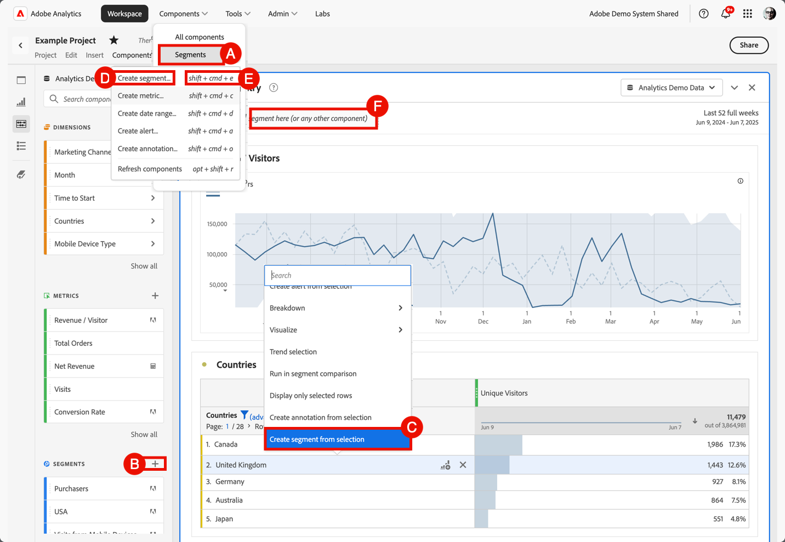

# Skapa segment

Du kan skapa olika typer av segment i Adobe Analytics.  Vilken typ du väljer beror på hur komplexa segmenten behöver vara och om segmenten bara ska gälla för det aktuella Workspace-projektet eller för alla projekt. Du kan skapa segment direkt i Adobe Analytics huvudgränssnitt eller när du arbetar i ett Workspace-projekt.

[Segmenträttigheter per roll](/help/components/segmentation/seg-reference/seg-rights.md) förklarar vem som kan skapa segment.

Du kan skapa ett segment på följande sätt:

* **A**. I huvudgränssnittet väljer du **[!UICONTROL Components]** och sedan **[!UICONTROL Segments]**. Välj  [!UICONTROL **[!UICONTROL Add]**] i [[!UICONTROL Segment] manager](seg-manage.md).
* **B**. I ett Workspace-projekt väljer du  vid  **Segment** från den vänstra panelen Komponenter.
* **C**. I ett Workspace-projekt väljer du **[!UICONTROL Create segment from selection]** på snabbmenyn i en visualisering.
* **D**. I ett Workspace-projekt väljer du **[!UICONTROL Components]** på menyn och sedan **[!UICONTROL Create segment]**.
* **E**. Använd genvägen **[!UICONTROL shift+cmd+e]** (macOS) eller **[!UICONTROL shift+ctrl+e]** (Windows) i ett Workspace-projekt.
* **F**. Välj  i ***Släpp ett segment här (eller någon annan komponent)***. Den här åtgärden skapar ett segment som bara innehåller projekt.

Om du vill definiera det nya segmentet använder du [segmentverktyget](seg-build.md).

När du arbetar i ett Workspace-projekt kan du även skapa ett segment snabbt med [snabbsegmentet](seg-quick.md).
