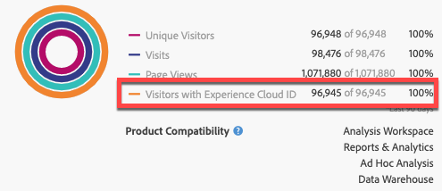

# Publicera segment till Experience Cloud

Genom att publicera ett Adobe Analytics-segment i Experience Cloud kan du använda segmentet för marknadsföringsaktiviteter i [!DNL Audience Manager] och i andra aktiveringskanaler, inklusive Adobe [!DNL Advertising Cloud], [!DNL Target] och [!DNL Campaign]. Nyligen har uppdateringarna optimerat publiceringsarbetsflödet avsevärt. Nu kan ni publicera Analytics-segment till Experience Cloud på mindre än 8 timmar. Använd dessa segment för att aktivera målgrupper i Audience Manager till alla destinationer i efterföljande led.

Vi har också ökat det maximala antalet publicerbara Adobe Analytics-segment till 75 (från 20). Du kan visa publicerade segment i [!UICONTROL Analytics > Components > Segments].

I den här videon finns mer information:

>[!VIDEO](https://video.tv.adobe.com/v/32842/?quality=12)

>[!NOTE]
>
>Adobe Campaign (Classic och Standard) beter sig annorlunda genom att det får ytterligare 24 timmars fördröjning utöver 8-timmars fördröjning.

## Förutsättningar

* Se till att rapportsviten som du sparar det här segmentet i är [aktiverat för Experience Cloud](https://experienceleague.adobe.com/docs/core-services/interface/audiences/t-publish-audience-segment.html). Annars kan du inte publicera den på Experience Cloud.
* Se till att din organisation använder Experience Cloud ID:n.
* Innan du kan publicera segment måste administratören tilldela [!UICONTROL Segment Publishing] behörighet till en produktprofil i [Admin Console](https://experienceleague.adobe.com/docs/core-services/interface/manage-users-and-products/admin-getting-started.html)och lägg till dig i produktprofilen.

## Överväganden

* **Gränser för Report Suite**: Du kan publicera upp till 75 segment per rapportserie. Den här gränsen gäller. Om du redan har 75 segment publicerade kan du inte publicera några ytterligare segment förrän du avpublicerar tillräckligt många segment för att komma under tröskelvärdet på 75 segment.
* **Medlemskapsbegränsningar**: Målgrupper som delas med [!DNL Experience Cloud] från Adobe Analytics får inte överstiga 20 miljoner unika medlemmar.
* **Dataintegritet**: Publiken filtreras inte baserat på besökarens autentiseringstillstånd. Om en besökare kan bläddra på webbplatsen i icke-autentiserade och autentiserade lägen, kan åtgärder som utförs när en besökare inte är autentiserad ändå göra att besökaren inkluderas i en målgrupp. Granska [Adobe Experience Cloud sekretess](https://www.adobe.com/privacy/experience-cloud.html) för att förstå hur målgruppsdelning påverkar integriteten.
* Om du vill ha en diskussion om **skillnader mellan segment i [!DNL Adobe Analytics] och[!DNL Audience Manager]**, go [här](https://experienceleague.adobe.com/docs/analytics/integration/audience-analytics/audience-analytics-workflow/aam-analytics-segments.html).

## Tidslinje för segmentpublicering

| Vad finns tillgängliga? | När det är tillgängligt | Var den finns |
|---|---|---|
| Metadata (segmenttitel och definition) | Omedelbart efter publicering | [!DNL Audience Manager], [!UICONTROL Experience Cloud Audience Library], [!DNL Target] |
| Användbart segment med medlemskap | ~ 8 timmar efter publicering | Visningsprogram för besökarprofiler i [!DNL Audience Manager] |
| Fackens- och medlemskapspopulation | Inom 24-48 timmar | [!DNL Audience Manager] |

>[!NOTE]
>En gång i veckan kommer alla data att synkroniseras helt för att ta hänsyn till eventuella deltavärden eller avvikelser som inte fångats in under föregående vecka.

## Publicera segment i [!UICONTROL Segment Builder]

1. Navigera till **[!UICONTROL Analytics > Workspace > Components > Segments]> +**
1. Skapa ett segment i [!UICONTROL Segment Builder].
1. Ange en rubrik och en beskrivning för segmentet - annars kan du inte spara det.
1. Kontrollera **[!UICONTROL Publish this segment to the Experience Cloud (for *rapportsvit *)]**.

>[!IMPORTANT]
>Se till att du använder&quot;Besökare med Experience Cloud-ID&quot; när du tittar på förhandsvisningar av segment i Analytics i stället för den totala förhandsgranskningen av segmentet&quot;unika besökare&quot; när du jämför Adobe Analytics-nummer med Audience Manager-nummer:
>
>

| Element | Beskrivning |
|---|---|
| **[!UICONTROL Publish this segment to the Experience Cloud (for *`<report suite>`*)]** | När det här alternativet är aktiverat delas segmentets namn och definition (dvs. gränssnittets målgrupp så ofta som den används i annonsplattformar) direkt med Experience Cloud, medan segmentmedlemskapet utvärderas och delas var fjärde timme.   När den målgruppen är kopplad till en aktivitet i [!DNL Target], till exempel [!DNL Analytics] börjar skicka ID:n för besökare som är kvalificerade för Experience Cloud och [!DNL Target] målgrupp. Då börjar målgruppsnamnet och motsvarande data visas på Experience Cloud Publiker-sidan.   |
| **[!UICONTROL Audience Creation Window]** | Den tidsram du väljer används för att skapa målgruppen baserat på rullande kalenderinformation. Exempel:&quot;De senaste 30 dagarna&quot; (standard) innehåller besökare som har kvalificerat sig för målgruppen under de senaste 30 dagarna från dagens datum (INTE från det ursprungliga datumet när segmentet skapades). |
| **[!UICONTROL Create in Audience Library]** | Segmenten som du skapar och publicerar kan göras tillgängliga utan fördröjning i Experience Cloud Audience Library. De är inte beroende av Analytics-uppdateringar. Dessa segment räknas inte av mot din gräns på 75 publicerade segment. |
| **[!UICONTROL x of 75 Published]** | Visar antalet segment som du har publicerat till Experience Cloud. Klicka på länken för att visa en lista över publicerade segment och deras associerade rapportsvit och ägare. |
| **[!UICONTROL Save]** | Sparar det här segmentet. |

## Avpublicera eller ta bort segment

Om du vill ta bort ett segment som har publicerats i Experience Cloud måste du först avpublicera det. Så här avpublicerar du ett segment: bara **avklicka** den kryssruta som du använde för att publicera den.

>[!NOTE]
>
>Du **inte** avpublicera ett segment som för närvarande används av någon av följande Adobe-lösningar: [!DNL Analytics] (in [!DNL Audience Analytics]), [!DNL Campaign], [!DNL Advertising Cloud] (for [!DNL Core Service] &amp; [!DNL Audience Manager] kunder) och alla andra externa partner (för [!DNL Audience Manager] kunder). Du **kan** avpublicera ett segment som används av [!DNL Target].

## Visa segmentpubliceringsstatus i [!UICONTROL Segment Manager]

1. Navigera till [!UICONTROL Analytics > Components > Segments].
1. Lägg märke till den nya [!UICONTROL Published] kolumn. Ja/Nej avser om segmentet har publicerats till Experience Cloud eller inte.

## Hämta [!DNL Audience Manager] UUID

Det finns två sätt att hämta det AAM UUID som är kopplat till webbläsaren:

* Adobe Experience Cloud Debugger
* Internt utvecklarverktyg i webbläsare (t.ex. Chrome Developer Tools)

I följande skärmbilder visas hur du hämtar AAM UUID i webbläsaren och använder det i profilvisningsprogrammet för Audience Manager Visitor för att validera trait &amp; segment-medlemskap.

### Metod 1: Använd Adobe Experience Cloud Debugger

1. Hämta och installera [Adobe Experience Cloud Debugger](/help/implement/validate/debugger.md) i Chrome Web Store.
1. Starta felsökaren när du läser in en sida.
1. Bläddra till sektionen Audience Manager och hitta AAM UUID som finns på den aktuella webbläsarsidan (`50814298273775797762943354787774730612` i exemplet nedan)

### Metod 2: Använd Chrome Developer Tools (eller andra verktyg för webbläsarutveckling)

1. Starta Chrome Developer Tools innan du läser in en sida
1. Läs in sidan och kontrollera Program > Cookies. AAM UUID ska anges i den tredje parts Demdex-cookie ([adobe.demdex.net](https://experienceleague.adobe.com/docs/audience-manager/user-guide/reference/demdex-calls.html) i exemplet nedan). Fältdemonstrationen är AAM UUID som angetts i webbläsaren (`50814298273775797762943354787774730612` i exemplet nedan).

## Använd Audience Manager [!UICONTROL Visitor Profile Viewer]

AAM-UUID i webbläsaren används som standard när [!UICONTROL Visitor Profile Viewer] har lästs in. Om du verifierar traits-implementeringar för andra användare anger du ett UUID i fältet UUID och klickar på [!UICONTROL Refresh]. Se [Visningsprogram för besökarprofiler](https://experienceleague.adobe.com/docs/audience-manager/user-guide/features/visitor-profile-viewer.html) för mer information.

## Visa segmentegenskaperna i [!DNL Audience Manager]

I AAM utvärderas listan över besökare med ECID för ett visst segment i direktuppspelning när Analytics delar segment med Experience Cloud.

1. I [!DNL Audience Manager], gå till [!UICONTROL Audience Data > Traits > Analytics Traits]. Du ser en mapp för varje Analytics-rapportssvit som mappas till din Experience Cloud-organisation. Dessa mappar (för Traits, Segments och Data Sources) skapas när huvudtjänsten Profiles and Audiences/People initieras eller etableras.
1. Välj mapp för den rapportserie i vilken du tidigare skapade segmentet som du vill dela med [!DNL Audience Manager]. Du ser segmentet/målgruppen som du skapade. När du delar ett segment händer två saker i [!DNL Audience Manager]:
   * Ett drag skapas först utan data. Cirka. 8 timmar efter att segmentet publicerats [!DNL Analytics], kommer listan över ECID:n att registreras och delas med [!DNL Audience Manager] och andra Experience Cloud-lösningar.

      

   * Ett entraitetssegment skapas. Den använder den datakälla som är associerad med rapportsviten där du publicerade segmentet.
   * Utgångsdatumet för trait är nu 16 dagar (tidigare två dagar).

## Visa segmentet i [!DNL Adobe Target]

The [!UICONTROL Publish this segment to the Experience Cloud] när du skapar segment i Adobe Analytics kan segmentet vara tillgängligt i Adobe Target anpassade målgruppsbibliotek. Ett segment som skapats i Analytics eller Audience Manager kan användas för aktiviteter i Target. Ni kan till exempel skapa kampanjaktiviteter baserat på analysstatistik och målgruppssegment som skapats i Analytics.

1. Klicka på [!UICONTROL Audiences].
1. På [!UICONTROL Audiences] sidan, hitta målgruppen som kommer från [!DNL Experience Cloud]. Dessa målgrupper kan användas i [!DNL Target] verksamhet.
