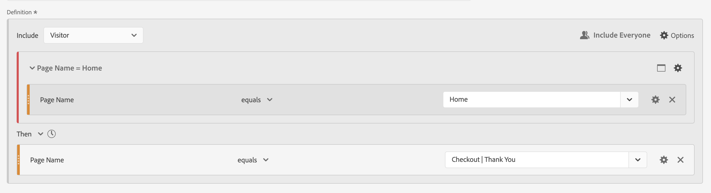
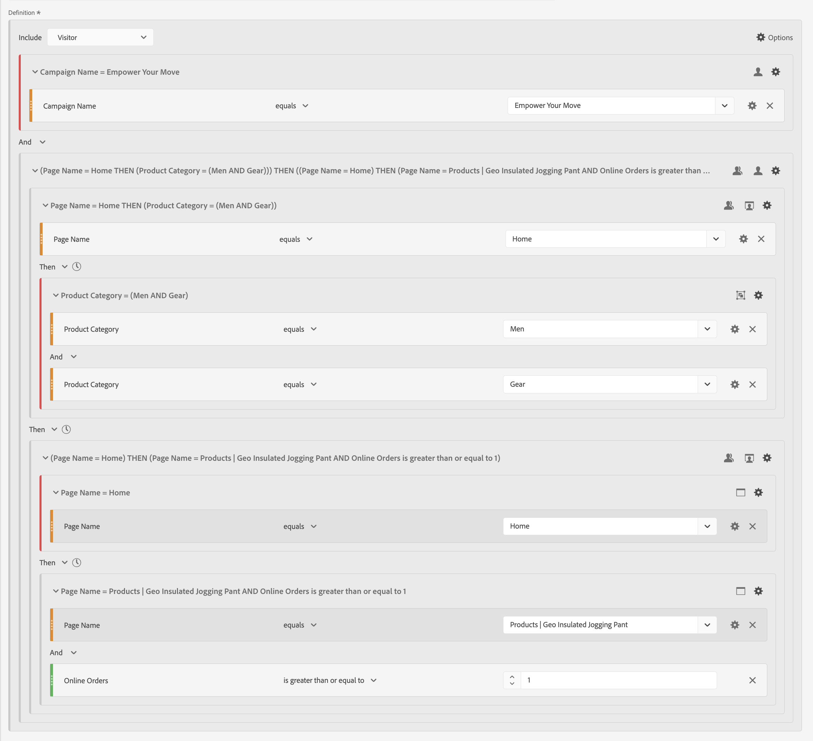

# Sekventiella segment

Du skapar sekventiella segment med den logiska operatorn [!UICONTROL Then] mellan komponenter, behållare och komponenter, eller behållare. Den logiska operatorn [!UICONTROL Then] indikerar att ett segmentvillkor inträffar, följt av ett annat.

Dessutom kan du begränsa sekventiella segment till en viss tidslängd, granularitet och antal mellan kontrollpunkterna med hjälp av **[!UICONTROL After]** och **[!UICONTROL Within operators]**.

>[!BEGINSHADEBOX]

Se  [Sekventiell segmentering](https://video.tv.adobe.com/v/25405?quality=12&learn=on){target="_blank"} för en demonstrationsvideo.

>[!ENDSHADEBOX]

Ett sekventiellt segment har [grundläggande funktioner](#basics) och ytterligare alternativ som du kan konfigurera för att göra det sekventiella segmentet mer komplext:

## Grunderna

Grunderna för att skapa ett sekventiellt segment skiljer sig inte från att skapa ett reguljärt segment med hjälp av [segmentverktyget](seg-build.md). Ett reguljärt segment blir ett sekventiellt segment automatiskt så snart du väljer operatorn **[!UICONTROL Then]** i huvuddefinitionen eller i någon av behållarna som du använder i [segmenteringsbyggaren](seg-build.md).

### Exempel

Exemplen nedan visar hur du använder sekventiella segment i olika användningsfall.

#### Enkel sekvens

Identifiera besökare som visade en sida och sedan visade en annan sida. Data på träffnivå segmenteras med den här sekvensen. Oberoende av tidigare, tidigare eller tillfälliga besöksbesök eller tidpunkten eller antalet sidvisningar mellan besöken.

#### Sekvens mellan besök

Identifiera besökare som visade en sida på ett besök och sedan visade en annan sida på ett annat besök. Använd behållare för att skapa sekvensen och definiera nivån  **[!UICONTROL Visit]** för varje behållare om du vill skilja mellan besöken.

#### Sekvens på blandnivå

Identifiera besökare som ser två sidor på ett obestämt antal besök och visa sedan en tredje sida vid ett separat besök. Använd behållare igen för att skapa sekvensen och definiera nivån  **[!UICONTROL Visit]** i behållaren som definierar det separata besöket.

#### Sammanställd sekvens

Identifiera besökare som vid första besöket besökte en viss sida och sedan besökte några andra sidor. Om du vill skilja på sekvensen av träffar använder du behållare för att separera logiken på en  **[!UICONTROL Visit]** -behållarnivå.

#### Kapsla en sekvens

Identifiera alla besök där en besökare besöker en sida före en annan och sedan har uppföljningsbesök som omfattar två andra sidor. Exempel: identifiera alla besök där en besökare först besöker hemsidan, sedan en sida i kategori 1 och därefter andra besök där man besöker sidan i kategori 2 och kategori 3.

## [!UICONTROL After] och [!UICONTROL Within]

Du kan använda operatorn  **[!UICONTROL After]** och  **[!UICONTROL Within]** **[!UICONTROL Then]** för att definiera ytterligare [tidsbegränsningar](#time-constraints) eller [begränsningar för träffar, besök eller dimensioner](#event-session-and-dimension-constraints).

### Tidsbegränsningar

Så här använder du tidsbegränsningar för operatorn **[!UICONTROL Then]**:

1. Välj .
1. Välj **[!UICONTROL Within]** eller **[!UICONTROL After]** på snabbmenyn.
1. Ange en tidsperiod (**[!UICONTROL Minute]**, **[!UICONTROL Hour]**, fram till **[!UICONTROL Years]**).
1. Välj  **[!UICONTROL *number *]**&#x200B;för att öppna ett popup-fönster där du kan skriva in eller ange ett nummer med **[!UICONTROL -]**&#x200B;eller **[!UICONTROL +]**.

Använd  om du vill ta bort en tidsbegränsning.

I tabellen nedan förklaras i detalj operatorerna för tidsbegränsning.

| Operatorer | Beskrivning |
|--- |--- |
| **[!UICONTROL After]** | Operatorn [!UICONTROL After] används för att ange en minimigräns för hur lång tid det tar mellan två kontrollpunkter. När du anger After-värdena börjar tidsgränsen när segmentet används. Om operatorn [!UICONTROL After] till exempel är inställd på en behållare för att identifiera besökare som besöker sida A, men inte återvänder till sida B förrän efter en dag, börjar den dagen när besökaren lämnar sida A.  För att besökaren ska kunna inkluderas i segmentet måste minst 1440 minuter (en dag) visas efter att sidan A har lämnat sidan A för att sidan B ska kunna visas. |
| **[!UICONTROL Within]** | Operatorn [!UICONTROL Within] används för att ange en maximal tidsgräns mellan två kontrollpunkter. Om operatorn [!UICONTROL Within] till exempel är inställd på en behållare för att identifiera besökare som besöker sida A och sedan återvänder till sida B inom en dag, börjar den dagen när besökaren lämnar sida A. För att inkluderas i segmentet har besökaren högst en dag innan sidan B öppnas. För att besökaren ska kunna inkluderas i segmentet måste öppningssida B visas inom högst 1440 minuter (en dag) efter att sidan A har lämnat sidan B. |
| **[!UICONTROL After but Within]** | När du använder både operatorn [!UICONTROL After] och operatorn [!UICONTROL Within] börjar och slutar båda operatorerna parallellt, inte sekventiellt.  Du kan till exempel skapa ett segment med behållaren inställd på: `After = 1 Week(s) and Within = 2 Week(s)`. Villkoren för att identifiera besökare i det här segmentet uppfylls endast mellan en och två veckor. Båda villkoren tillämpas från och med den första sidvyn. |

#### Exempel

Några exempel på hur du använder tidsbegränsningar.

##### operatorn [!UICONTROL After]

Identifiera besökare som besökte en sida och sedan en annan sida först efter två veckor. Till exempel besökare som har besökt hemsidan, men kvinnorna | Shoes page only after two week.

Om en sidvy för hemsidan inträffar den 1 juni 2024, kl. 00:01, visas sidan Women | Shoes kommer att matchas så länge som den sidvyn visas efter 15 juni 2024 00:01.

##### operatorn [!UICONTROL Within]

Identifiera besökare som besökt en sida och sedan en annan inom fem minuter. Till exempel besökare som besökte hemsidan och sedan Kvinnorna | Shoes page within 5 minutes.

Om en sidvy för hemsidan inträffar den 1 juni 2024, kl. 12:01, visas sidan Women | Shoes kommer att matchas så länge som sidvyn visas före 15 juni 2024 12:16.

##### Operatorn [!UICONTROL After] men [!UICONTROL Within]

Identifiera besökare som besökt en sida och sedan besökt en annan sida efter två veckor, men inom en månad. Till exempel besökare som besökte hemsidan och sedan efter två veckor och inom en månad | Shoes page.

Besökare som besöker startsidan den 1 juni 2024 och som återvänder för att besöka damerna | Shoes page after 15 juni 2019 00:01, but before juli1, 2019 eligible for the segment.

### Begränsningarna [!UICONTROL Hit], [!UICONTROL Visit] och [!UICONTROL Dimension]

Med begränsningarna  **[!UICONTROL After]** och  **[!UICONTROL Within]** kan du inte bara ange en tidsbegränsning utan även en träff-, besök- eller dimensionsbegränsning. Välj **[!UICONTROL Hit(s)]**, **[!UICONTROL Visit(s)]** eller **[!UICONTROL Other dimensions]**  **[!UICONTROL *Dimension name *]**. Du kan använda fältet [!UICONTROL *Sök*] för att söka efter en dimension.

#### Exempel

Nedan visas ett exempel på ett sekventiellt segment som letar efter besökare som besökt en produktkategorisida (Kvinnor | Showen), följt av en utcheckningssida (utcheckning) | Tack) på en sida.

Följande exempelsekvenser matchar eller matchar inte:

| Sekvens |  |
|--- | :---: |
| Sidan `Women \| Shoes` följt av sidan `Checkout \| Thank You` |  |
| Sidan `Women \| Shoes` följt av sidan `Women \| Tops` följt av sidan `Checkout \| Thank You` |  |

## [!UICONTROL Include]

Du kan ange vilka data som ska inkluderas i ditt sekventiella segment eller i en sekventiell behållare som ingår i ditt sekventiella segment.

### [!UICONTROL Everyone] {#include_everyone}

Om du vill skapa ett sekventiellt segment som innehåller alla väljer du alternativet  **[!UICONTROL Include Everyone]**.

Det sekventiella segmentet identifierar data som matchar det angivna mönstret som helhet.  Nedan visas ett exempel på ett grundläggande sekvenssegment som letar efter besökare som besökt en produktkategorisida (Kvinnor | Showen), följt av en utcheckningssida (utcheckning) | Tack). Segmentet är inställt på  **[!UICONTROL Include Everyone]**.

Följande exempelsekvenser matchar eller matchar inte:

| | Sekvens |  |
|---:|--- | --- |
| 1 | `Women \| Shoes` sedan `Checkout \| Thank You` på samma besök |  |
| 2 | `Women \| Shoes` sedan `Men \| Shoes` sedan `Checkout \| Thank You` (mellan olika besök) |  |
| 3 | `Checkout \| Thank You` och sedan `Women \| Shoes` |  |

### [!UICONTROL Only Before Sequence] och [!UICONTROL Only After Sequence]

Alternativen  **[!UICONTROL Only Before Sequence]** och  **[!UICONTROL Only After Sequence]** segmenterar data till en delmängd före eller efter den angivna sekvensen.

*  **Endast före sekvens**: Inkluderar alla data före en sekvens och de första data i själva sekvensen. Om en sekvens visas flera gånger som en del av data, inkluderar [!UICONTROL Only Before Sequence] den första träffen av den sista förekomsten av sekvensen och alla tidigare träffar.
*  **Endast efter sekvens**: Inkluderar alla träffar efter en sekvens och de sista data som finns i själva sekvensen. Om en sekvens visas flera gånger som en del av data, inkluderar [!UICONTROL Only After Sequence] den senaste träffen av den första förekomsten av sekvensen och alla efterföljande träffar.

Överväg en definition som specificerar en sekvens av en komponent med kriterier som identifieras av B, följt (därefter) av en komponent med kriterier som identifieras av D. De tre alternativen identifierar data enligt följande:

| B, sedan D | A | B | C | D | E | F |
|---|:---:|:---:|:---:|:---:|:---:|:---:|
| Inkludera alla |  |  |  |  |  |  |
| Endast före sekvens |  |  |  |  |  |  |
| Endast efter sekvens |  |  |  |  |  |  |

| B och sedan D (inträffar flera gånger) | A | B | C | D | B | C | D | E |
|---|:---:|:---:|:---:|:---:|:---:|:---:|:---:|:---:|
| Inkludera alla |  |  |  |  |  |  |  |  |
| Endast före sekvens |  |  |  |  |  |  |  |  |
| Endast efter sekvens |  |  |  |  |  |  |  |  |

#### Exempel

Du har definierat tre versioner av ett sekventiellt segment för webbplatsavsnitt. En med alternativet  **[!UICONTROL Include Everyone]**, en med alternativet  **[!UICONTROL Only Before Sequence]** och en med alternativet  **[!UICONTROL Only After Sequence]** . Du namngav de tre segmenten därefter.

När du rapporterar på webbplatsavsnitt med dessa tre segment ser exempelutdata i en friformstabell ut så här:

## [!UICONTROL Exclude]

Segmentdefinitioner inkluderar alla data såvida du inte uttryckligen utesluter  [!UICONTROL Person]-,  [!UICONTROL Visit] - eller  [!UICONTROL Hit] -data med **[!UICONTROL Exclude]**.

Med [!UICONTROL Exclude] kan du ignorera vanliga data och skapa segment med mer fokus. Med Exkludera kan du även skapa segment utan särskilda grupper av besökare. Om du till exempel vill definiera ett segment som anger besökare som har gjort beställningar och sedan exkluderar den gruppen med besökare för att identifiera *icke-köpare*. Ett tips är att skapa regler som använder en bred definition i stället för att använda [!UICONTROL Exclude] för att rikta in sig på specifika besökare som matchar specifika inkluderingsvärden.

Exempel på uteslutningsdefinitioner är:

* **Uteslut sidor**. Använd en segmentdefinition om du vill ta bort en viss sida (till exempel *Hemsida*) från en rapport, skapa en Träff-regel där sidan är lika med `Home Page` och exkludera sedan regeln. Den här definitionen inkluderar automatiskt alla sidor utom *hemsidan*.
* **Uteslut refererande domäner**. Använd en definition som endast innehåller refererande domäner från Google.com och utesluter alla andra.
* **Identifiera icke-köpare**. Identifiera när order är större än noll och exkludera sedan [!UICONTROL Person].

[!UICONTROL Exclude] kan användas för att identifiera en sekvens där besökarna inte är en del av specifika besök eller utför specifika träffar. [!UICONTROL Exclude] kan också inkluderas i en [!UICONTROL Logic Group] (se nedan).

Du kan exkludera behållare, inte komponenter.

### Exempel

Nedan finns exempel på [!UICONTROL Exclude].

#### [!UICONTROL Exclude] inom

Identifiera besökare som besökt en sida, inte besökt en annan sida och sedan besökt ytterligare en sida. Du utelämnar behållaren med  [!UICONTROL Exclude]. Ett tunt rött streck till vänster identifierar en utesluten behållare.

#### [!UICONTROL Exclude] vid start

Identifiera besökare som besökt en sida utan att någonsin gå till en annan. Exempel: personer som checkat ut ett köp utan att någonsin besökt hemsidan.

#### [!UICONTROL Exclude] i slutet

Identifiera besökare som besökt en sida men aldrig besökt andra sidor. Till exempel besökare som besökte din hemsida men aldrig någon av dina utcheckningssidor.

## [!UICONTROL Logic Group]

>[!NOTE]
>
>[!UICONTROL Logic Group] kan bara definieras i ett sekventiellt segment, vilket innebär att operatorn [!UICONTROL Then] används i behållaren.

Med Logic Group kan du gruppera villkor i en enda kontrollpunkt för sekventiella segment. Som en del av sekvensen utvärderas logiken som definieras i behållaren som identifieras som logikgrupp efter en sekventiell kontrollpunkt och före efterföljande sekventiell kontrollpunkt.

Villkoren inom logikgruppen kan uppfyllas i vilken ordning som helst. Icke-sekventiella behållare (träff, besök, besökare) kräver däremot inte att deras villkor uppfylls i den övergripande sekvensen, vilket ger möjliga ointuitiva resultat om de används med en **[!UICONTROL Then]**-operator.

[!UICONTROL Logic Group] har utformats för att behandla *flera villkor som en grupp, utan någon ordning* bland de grupperade villkoren. I annat fall anges att ordningen för villkoren i en logikgrupp inte är relevant.

Här följer några tips om hur du använder logikgruppen:

* Om du vill gruppera sammanhängande kontrollpunkter.
* Att förenkla skapandet av sekventiella segment.

### Exempel

Här är några exempel på hur du använder logikgruppsbehållaren.

#### Alla beställningar

Identifiera besökare som besökte en sida och sedan visade varje sida från en annan uppsättning sidor i valfri ordning. Besökare som till exempel besökte hemsidan, besökte sedan varje sida för män, sidan för kvinnor och sidan för barn, oavsett ordningen.

Du kan skapa det här segmentet utan en [!UICONTROL Logic Group], men konstruktionen kommer att bli komplex och krånglig. Ange varje sidsekvens som besökaren kan visa. För tydlighetens skull bör det endast vara den första behållaren som öppnas  och de andra behållarna stängs . Du kan härleda innehållet i de andra behållarna med hjälp av rubrikerna.

Du kan använda [!UICONTROL Logic Group] för att förenkla skapandet av det här segmentet, vilket visas nedan. Se till att du väljer  **[!UICONTROL Logic Group]** för behållaren.

#### Första matchningen

Identifiera besökare som besökt en sida eller en annan sida och sedan besökt ytterligare en sida. Besökare som till exempel besökte sidan Kvinnor eller sidan Män, besökte sedan utcheckningen | Tack.

#### [!UICONTROL Exclude] [!UICONTROL And]

Identifiera besökare som besökt en sida och som då uttryckligen inte besökt en uppsättning andra sidor, men som besökt ytterligare en sida. Till exempel besökte besökare som besökte hemsidan och inte sidan Män eller Kvinnor, men däremot barnsidan.

#### [!UICONTROL Exclude] [!UICONTROL Or]

Identifiera besökare som besökt en sida och som då uttryckligen inte besökt någon sida i en uppsättning sidor, men som besökt ännu en sida. Till exempel besökte besökare som besökte hemsidan och inte sidan Män och Kvinnor, men däremot barnsidan.

<!--
An example of a complex sequential segment if you want to find the visitors that 

| visit One | visit Two | visit Three |
| --- | --- | --- |
| The visitor went to the main landing page A, excluded the campaign page B, and then viewed the Product page C.| The visitor again went to the main landing page A, excluded the campaign page B, and went again to the Product page C, and then to a new page D. | The visitor entered and followed that same path as in the first and second visits, then excluded page F to go directly to a targeted product on page G. |
-->

## Ett exempel

Det sista exemplet är att ni vill identifiera besökare som har lärt sig om en viss produktsida, utan att dessa besökare någonsin påverkas av er Empower Your Move-kampanj. Och vid sitt första besök i din webbutik tittade de på hemsidan men inte närmare på några friskvårdsprodukter (kugghjulsprodukter) från kategorin Män. Vid sitt nästa besök direkt efter det beställde de en produkt på webben utan att gå via startsidan först.

>[!MORELIKETHIS]
>
> * [Mastering Sequential Logic in AA &amp; CJA: Introduction to THEN](https://experienceleaguecommunities.adobe.com/t5/adobe-analytics-blogs/mastering-sequential-logic-in-aa-amp-cja-introduction-to-then/ba-p/738131)
