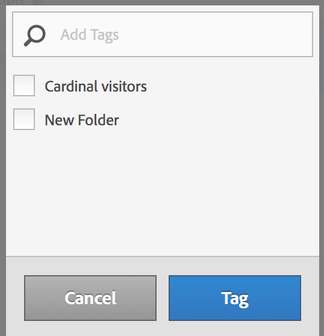

# Tagga segment

I segmenthanteraren kan du ordna segment med taggning.

Alla användare kan skapa taggar för segment och använda en eller flera taggar för ett segment. Men du kan bara se taggar för de segment som du äger eller som har delats med dig. Vilka typer av taggar ska du skapa? Här följer några förslag på användbara taggar:

* Taggar baserade på **teamnamn**, som Social Marketing, Mobile Marketing.
* **** Projectags (analystaggar), t.ex. Entry-page analysis.
* **** Kategoritaggar: Män geografi.
* **** Arbetsflödestaggar: För godkännande. Kuraterad för (en specifik affärsenhet)

1. Markera kryssrutan bredvid segmentet som du vill tagga i segmenthanteraren. Verktygsfältet för segmenthantering visas:

   

1. Klicka på **[!UICONTROL Tag]** och antingen

   * välj bland befintliga taggar, eller
   * lägg till en ny tagg och tryck på **[!UICONTROL Enter]**.

      

1. Klicka på **[!UICONTROL Tag]** igen för att tagga segmentet.

Taggen ska nu visas i kolumnen Taggar. (Klicka på kugghjulsikonen uppe till höger för att hantera kolumnerna.)

Du kan också filtrera på taggar genom att gå till **[!UICONTROL Filters]** > **[!UICONTROL Tags]**.
