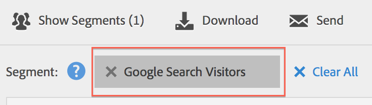

# Använd segment

Om du vill använda segment i hela Analysis Workspace drar du bara ett eller flera segment från **[!UICONTROL Segments]** i komponentspåret och släpper på:

* En [panel](/help/analyze/analysis-workspace/c-panels/panels.md) i Analysis Workspace som segmenterar alla visualiseringar i panelen.
* En rubrikrad i en [friformstabell](/help/analyze/analysis-workspace/visualizations/freeform-table/freeform-table.md) i Analysis Workspace som ersätter dimensionen.
* En rad i en [friformstabell](/help/analyze/analysis-workspace/visualizations/freeform-table/freeform-table.md) i Analysis Workspace för att initiera en nedbrytning.
* En kolumn i en [friformstabell](/help/analyze/analysis-workspace/visualizations/freeform-table/freeform-table.md) i Analysis Workspace som lägger till eller ersätter en kolumn, eller som startar ett filter.
* Konfigurationspaneler för visualisering eller paneler som gör det möjligt att släppa segment. I en [segmentjämförelsepanel](/help/analyze/analysis-workspace/c-panels/c-segment-comparison/segment-comparison.md) eller [nyckelmätningsvisualisering](/help/analyze/analysis-workspace/visualizations/key-metric.md)
* Definitionsbyggaren [för ett segment](/help/components/segmentation/segmentation-workflow/seg-build.md#definition-builder), så du tar med ett segment i segmentdefinitionen.
* Definitionsbyggaren [ för ett beräknat mått ](/help/components/calculated-metrics/workflow/c-build-metrics/cm-build-metrics.md#definition-builder), så du inkluderar ett segment i din beräknade måttdefinition.

<!--
How to apply one or more segments to a report from the segment rail.

1. Bring up the report to which you want to apply a segment, for example the [!UICONTROL Pages Report].
1. Click **[!UICONTROL Show Segments]** above the report. The segment rail opens.

   

1. Mark the checkbox next to one or more of the segments or **[!UICONTROL Search Segments]** to find the right segment.

   >[!NOTE]
   >
   >You can apply more than one segment to a report (this is called segment stacking). When multiple segments are applied, the criteria in each segment is combined using an 'and' operator and then applied. There is no limit to how many segments you can stack.

   >[!NOTE]
   >
   >Clicking the Information icon (i) next to the segment name lets you preview the key metrics to see whether you have a valid segment and how broad the segment is.

1. You can filter by report suite by selecting the **[!UICONTROL (Only) `<report suite name>`]** check box. This will show only those segments that were last saved in that report suite.
1. Click **[!UICONTROL Apply Segment]** and the report will refresh. The segment or segments that are applied now display at the top of the report:

   

-->
