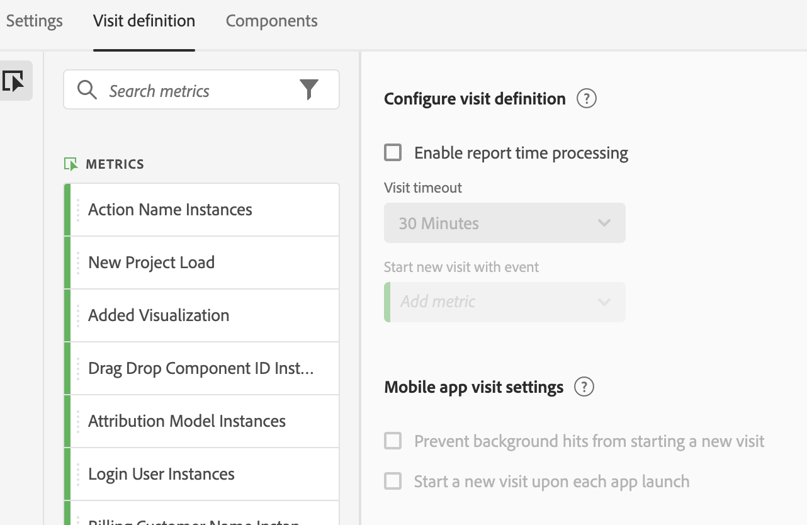

# Skapa virtuella rapportsviter

Innan du börjar skapa virtuella rapportsviter bör du tänka på några saker.

* Användare som inte är administratörer kan inte se Virtual Report Suite Manager.
* Virtuella rapportsviter kan inte delas. Delning görs via grupper/behörigheter.
* I Virtual Report Suite Manager kan du bara se dina egna virtuella rapportsviter. Du måste klicka på &quot;visa alla&quot; för att se alla andras.

1. Navigera till **[!UICONTROL Components]** > **[!UICONTROL Virtual Report Suites]**.
1. Klicka på **[!UICONTROL Add +]**.

   

## Definiera inställningar

På [!UICONTROL Settings] -fliken, definiera dessa inställningar och klicka sedan på **[!UICONTROL Continue]**.

| Element | Beskrivning |
| --- |--- |
| Namn | Namnet på den virtuella rapportsviten ärvs inte från den överordnade rapportsviten och ska vara distinkt. |
| Beskrivning | Lägg till en bra beskrivning för dina företagsanvändare. |
| Taggar | Du kan lägga till taggar för att ordna dina rapportsviter. |
| Källa | Rapportsviten som den här virtuella rapportsviten ärver följande inställningar. De flesta tjänstenivåer och funktioner (till exempel eVar, bearbetningsregler, klassificeringar och så vidare) ärvs. Om du vill ändra de här ärvda inställningarna för ett VRS-system måste du redigera den överordnade rapportsviten (Admin > Rapportsviter). |
| Tidszon | Det är valfritt att välja en tidszon. Om du väljer en tidszon sparas den tillsammans med VRS. Om du inte väljer någon tidszon används den överordnade rapportsvitens tidszon.  När du redigerar ett VRS-system visas den tidszon som har sparats med VRS i den nedrullningsbara väljaren. Om VRS skapades innan tidszonsstödet lades till visas den överordnade rapportsvitens tidszon i den nedrullningsbara väljaren. |
| Segment | Du kan bara lägga till ett segment eller stapla segment.   Obs! När du staplar två segment förenas de med en AND-programsats. Detta kan inte ändras till en OR-sats. När du försöker ta bort eller ändra ett segment som för närvarande används i en virtuell rapportserie visas en varning. |

## Definiera besöksdefinition

På [!UICONTROL Visit Definition] -fliken, definiera dessa inställningar och klicka sedan på **[!UICONTROL Continue]**.

Här är en video om hur du justerar en besöksdefinition i en virtuell rapportserie:

>[!VIDEO](https://video.tv.adobe.com/v/23545/?quality=12)

| Element | Beskrivning |
| --- |--- |
| **Konfigurera besöksdefinition** |  |
| Aktivera bearbetning av rapporttid | Använd rapporttidsbearbetning för att ändra standardlängden för besökstidsgränsen. De här inställningarna är icke-förstörande och gäller endast i Analysis Workspace. [Läs mer](/help/components/vrs/vrs-report-time-processing.md) |
| Besök timeout | Definierar hur mycket inaktivitet en unik besökare måste ha innan ett nytt besök startas automatiskt. Detta påverkar besöksmått, besökssegmentbehållare och eVars som förfaller vid besök. |
| Starta nytt besök med event | Startar en ny session när någon av de angivna händelserna utlöses, oavsett om en session har uppnått tidsgränsen eller inte. |
| **Besöksinställningar för mobilappar** | Ändra hur besök definieras för mobilappsträffar som samlas in av Adobe SDK:er för mobiler. De här inställningarna är icke-förstörande och gäller endast i Analysis Workspace. |
| Förhindra bakgrundstömningar från att starta ett nytt besök | Förhindrar att bakgrundstötningar startar ett nytt besök och ökar antalet besök och unika besökarmått. |
| Starta ett nytt besök varje gång appen startas | Startar en ny session när en app startas. [Läs mer](/help/components/vrs/vrs-mobile-visit-processing.md) |

## Inkludera och byta namn på komponenter

1. På [!UICONTROL Components] markerar du kryssrutan för att tillämpa urval för att inkludera, exkludera och byta namn på komponenter för den här virtuella rapportsviten i Analysis Workspace.
Mer information om VRS-kurser finns i [Komponenturval för Virtual Report Suite](https://experienceleague.adobe.com/docs/analytics/components/virtual-report-suites/vrs-components.html#virtual-report-suites).

1. Dra komponenter (dimensioner, mått, segment eller datumintervall) som du vill inkludera i VRS till [!UICONTROL Included Components] -avsnitt.

1. När du är klar klickar du på **[!UICONTROL Save]**.

## Förhandsgranska data

Till höger på varje flik kan du förhandsgranska det totala antalet träffar, antalet besök och det totala antalet besökare i den här virtuella rapportsviten, jämfört med det ursprungliga rapportpaketet.

## Visa produktkompatibilitet

Vissa funktioner i Virtual Report Suites stöds inte av alla Adobe Analytics-produkter. Med produktkompatibilitetslistan kan du se vilka produkter i Adobe Analytics som stöds baserat på dina aktuella inställningar för Virtual Report Suite.
