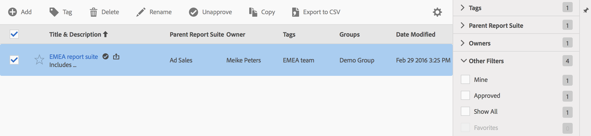

# Hantera virtuella rapportsviter

Med Virtual Report Suite Manager kan administratörer redigera, lägga till, tagga, ta bort, byta namn på, godkänna, kopiera, exportera och filtrera virtuella rapportsviter. Den är inte synlig för användare som inte är administratörer.

**[!UICONTROL Analytics]** > **[!UICONTROL Components]** > **[!UICONTROL Virtual Report Suites]**

>[!NOTE]
>
>I Virtual Report Suite Manager kan du bara se dina egna virtuella rapportsviter. Du måste klicka **[!UICONTROL Show All]** för att se alla andras.

| Uppgift | Beskrivning |
| --- | --- |
| Lägg till | Tar dig till den virtuella rapportsviten där du kan skapa nya virtuella rapportsviter. |
| Tagg | Alla användare kan skapa taggar för virtuella rapportsviter och använda en eller flera taggar för en virtuell rapportserie. Men du kan bara se taggar för de virtuella rapportsviter som du äger. Vilka typer av taggar ska du skapa? Här följer några förslag på användbara taggar:<ul><li>Taggar baserade på teamnamn, som social marknadsföring, mobilmarknadsföring</li><li>Projekttaggar (analystaggar), t.ex. analys på ingångssidan</li><li>Kategoritaggar: Män geografi</li><li>Arbetsflödestaggar: Kuraterad för (en specifik affärsenhet). Godkänd</li></ul> |
| Ta bort | Om du tar bort en virtuell rapportserie fortsätter schemalagda rapporter och instrumentpaneler som använder den här virtuella rapportsviten att fungera som vanligt. Rapporten eller kontrollpanelen fortsätter att använda den borttagna virtuella rapportsviten tills du sparar den schemalagda rapporten igen.  Schemalagda rapporter uppdateras inte när du redigerar en virtuell rapportsvit med samma namn. Till exempel: Anta att du har två virtuella rapportsviter med samma namn och olika överordnade rapportsviter: Du har ett bokmärke som refererar till den virtuella rapportsviten för huvudprogramsviten. Sedan tar du bort den virtuella rapportsviten eftersom den är en dubblett. Bokmärket fortsätter att köras och refererar till definitionen för det borttagna VRS. Om du ändrar definitionen för återstående VRS ändras inte det VRS som används för bokmärket. Den gamla definitionen används. Du åtgärdar detta genom att uppdatera bokmärket så att det refererar till den nya definitionen. Om du är osäker på om ett bokmärke, en instrumentpanel eller en schemalagd rapport använder ett borttaget VRS kan du ändra namnet på det återstående VRS så att det blir tydligare om bokmärket använder det återstående VRS. |
| Byt namn | Överallt där den virtuella rapportsviten visas, som i rapportsvitväljaren, visas det nya namnet. |
| Godkänn/Avgodkänn | Godkänn virtuella rapportsviter för att göra dem&quot;officiella&quot; eller&quot;kanoniska&quot;. Du kan ångra processen genom att avgodkänna. |
| Kopiera | Skapar en distinkt kopia med sitt eget nya rapportpaket-ID, men med samma namn och definition. |
| Exportera till CSV | Exportera den virtuella rapportsvitens definition till en CSV-fil. |
| Filter | Filtrera efter taggar, överordnad rapportserie, ägare och andra filter (Visa alla, Min, Favoriter och Godkänd). |
