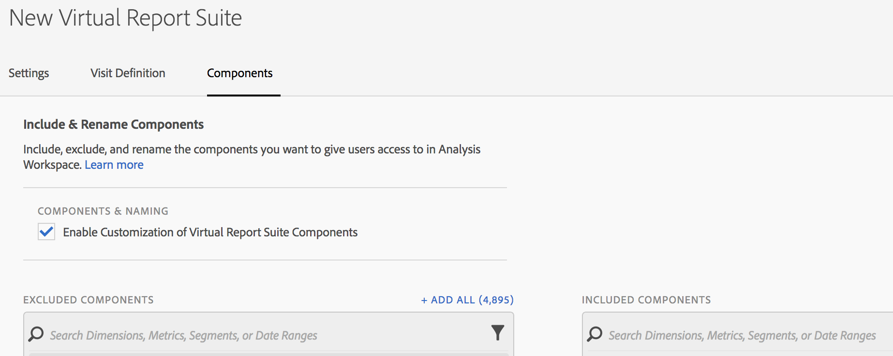
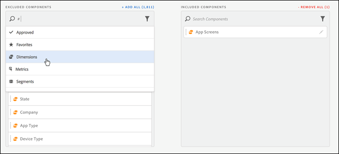

# Komponentstrukturering för virtuell rapportserie

Virtuella rapportsviter kan struktureras så att de inkluderar och exkluderar komponenter.i Analysis Workspace.

Här är en video om komponenturval:

>[!VIDEO](https://video.tv.adobe.com/v/23544/?quality=12)

>[!NOTE]
>
>Ändringar har gjorts som komponentadministratörer och icke-administratörer kan se i förvaltade Workspace-projekt och utvalda virtuella rapportsviter. Tidigare kunde vem som helst se komponenter som inte är kuraterade genom att klicka på **[!UICONTROL Show all Components]**. Den [uppdaterade kurationsfunktionen](/help/analyze/analysis-workspace/curate-share/curate.md) ger mer detaljerad kontroll över vilka komponenter som är synliga.

Om du vill aktivera komponenturval

1. Gå till **[!UICONTROL Analytics]** > **[!UICONTROL Components]** > **[!UICONTROL Virtual report suites]** > **[!UICONTROL Create new virtual report suite]**.
1. När du har definierat **[!UICONTROL Settings]** klickar du på fliken **[!UICONTROL Components]**.

1. Markera kryssrutan **[!UICONTROL Enable Customization of Virtual report suite components]**:

   

   >[!NOTE]
   >
   >Om komponentanpassning är aktiverat är den virtuella rapportsviten tillgänglig **endast i Analysis Workspace** och är inte tillgänglig i följande:
   >
   >* [!UICONTROL Data Warehouse]
   >* [!UICONTROL Report Builder]
   >* [!UICONTROL Activity Map]
   >* API för analysrapportering

   När du har markerat det här alternativet kan du lägga till de komponenter som du vill ska ingå i den virtuella rapportsviten genom att dra de tillämpliga komponenterna från kolumnen&quot;Uteslutna komponenter&quot; till kolumnen&quot;inkluderade komponenter&quot;. De komponenter som kan inkluderas och exkluderas är:

   * Mått
   * Mätvärden
   * Segment
   * Datumintervall

   >[!NOTE]
   >
   >Du behöver inte *dela* kuraterade komponenter (segment, beräknade värden, datumintervall). De visas alltid i Analysis Workspace om de har kuraterats för den virtuella rapportsviten, även om de inte delas.

1. Dessutom kan du filtrera eller söka efter komponenterna och lägga till hela den filtrerade markeringen i den inkluderade kolumnen genom att klicka på **[!UICONTROL Add All]**.

   

## Byt namn på komponenter {#section_0F7CD9F684FE4765BC00A2AFED56550E}

Du kan ändra visningsnamnen för inkluderade komponenter som är specifika för den virtuella rapportsviten. Om du till exempel vill inkludera Sidnamn i den virtuella rapportsviten, men vill byta namn på den till en mer mobilvänlig kontext, kan du ändra den till App Screens. Det nya namnet visas i Analysis Workspace när den här virtuella rapportsviten används.

I Analysis Workspace klickar du på informationsikonen för någon av komponenterna för att visa det ursprungliga namnet för den nya komponenten:

## Komponentgrupper {#section_483BEC76F49E46ADAAA03F0A12E48426}

Använd komponentgrupper för att göra satsvis komponenttillägg i din virtuella rapportsserie. Om du till exempel vill importera en standarduppsättning med komponenter som är specifika för mobilappsanalys väljer du mobilappsgruppen. En motsvarande uppsättning dimensioner och mått (som redan har bytt namn) läggs automatiskt till i listan med inkluderade virtuella rapportsviter.

## Workspace Behavior {#section_6C32F8B642804C0097FCB14E21028D4A}

Mer information om kurering i Analysis Workspace finns i [Kuratera och dela ett projekt](https://experienceleague.adobe.com/docs/analytics/analyze/analysis-workspace/curate-share/curate.html).
