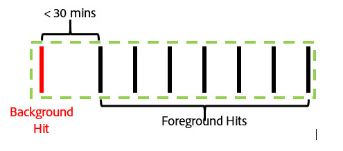
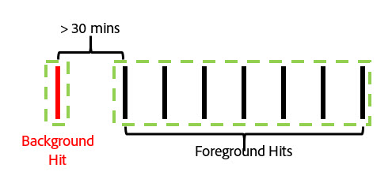
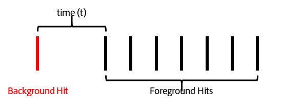
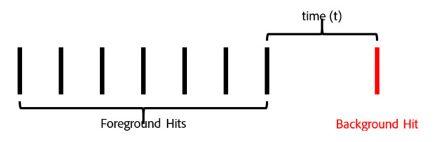
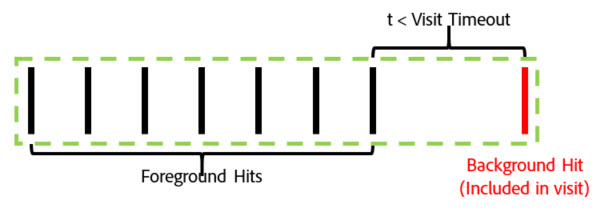
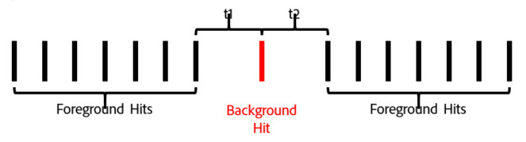
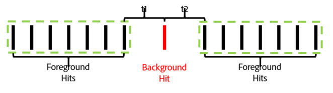
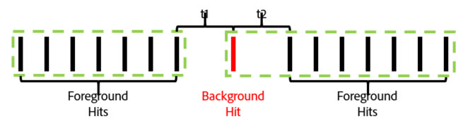

# Sammanhangsberoende sessioner

Sammanhangsberoende sessioner i virtuella rapportsviter ändrar hur Adobe Analytics beräknar besök från alla enheter. I den här artikeln beskrivs också hur bakgrundstödsträffar och appstarthändelser (som båda anges av SDK för mobiler) påverkar hur mobilbesök definieras.

Ni kan definiera ett besök som ni vill utan att ändra underliggande data, så att det matchar hur besökarna interagerar med era digitala upplevelser.

>[!BEGINSHADEBOX]

Se  [Kontextmedvetna sessioner](https://video.tv.adobe.com/v/23545?quality=12&learn=on){target="_blank"} för en demonstrationsvideo.

>[!ENDSHADEBOX]

## URL-parameter för kundperspektiv

Med Adobe Analytics datainsamlingsprocess kan du ange en frågesträngsparameter som anger kundperspektivet (anges som frågesträngsparametern&quot;cp&quot;). I det här fältet anges tillståndet för slutanvändarens digitala program. Detta hjälper dig att veta om en träff genererades när en mobilapp befann sig i bakgrundsläge.

## Bearbetning av bakgrundsträff

En bakgrundträff är en typ av träff som skickas till Analytics från Adobe Mobile SDK version 4.13.6 och senare när appen gör en spårningsbegäran i bakgrundsläge. Typiska exempel på detta är:

* Data som skickas under en geofästning
* En push-meddelandeinteraktion

I följande exempel beskrivs logiken som används för att avgöra när ett besök startar och avslutas för en besökare när inställningen&quot;Förhindra bakgrundstötningar från att starta ett nytt besök&quot; är aktiverad eller inte är aktiverad för en virtuell rapportserie.

**Om alternativet Förhindra bakgrundstötningar från att starta ett nytt besök inte är aktiverat:**

Om den här funktionen inte är aktiverad för ett virtuellt rapportpaket behandlas bakgrundstötningar som alla andra träff, vilket innebär att de startar nya besök och fungerar på samma sätt som förgrundstötningar. Om till exempel en bakgrundsträff inträffar mindre än 30 minuter (standardsessionstimeout för en rapportsvit) före en uppsättning förgrundsträffar, är bakgrundsträffen en del av sessionen.

Om bakgrundstöten inträffar mer än 30 minuter före några förgrundstötningar skapar bakgrundstötningen ett eget besök, med ett totalt besöksantal på 2.

**Om alternativet Förhindra bakgrundstötningar från att starta ett nytt besök är aktiverat:**

Följande exempel visar hur bakgrundstötningar fungerar när den här funktionen är aktiverad.

Exempel 1: En bakgrundsträff inträffar en viss tidsperiod (t) före en serie förgrundsträffar.

I det här exemplet, om *t* är större än den virtuella rapportsvitens konfigurerade tidsgräns för besök, utesluts bakgrundskompensationen från besöket som utgörs av förgrundsträffarna. Om tidsgränsen för besöket i den virtuella rapportsviten var inställd på 15 minuter och *t* var 20 minuter, kommer besöket som utgörs av den här serien träffar (visas med den gröna konturen) att utesluta bakgrundsträffen. Det innebär att alla eVars-variabler som har en &quot;besök&quot;-förfallotid på bakgrundsträffen **inte** kommer att finnas kvar på följande besök, och en besökssegmentbehållare kommer endast att innehålla förgrundsträffarna inuti den gröna konturen.

Om *t* är mindre än den konfigurerade tidsgränsen för besöket i den virtuella rapportsviten, inkluderas bakgrundsträffen som en del av besöket som om det var en förgrundsträff (visas med den gröna konturen):

Detta innebär att

* Alla eVars-variabler som har &quot;besök&quot; som förfallodatum i bakgrunden fortsätter att visa sina värden på de andra träffarna i det här besöket.
* Alla värden som ställs in i bakgrundsträffen inkluderas i logikutvärderingen för besöksnivåsegmentets behållare.

I båda fallen blir det totala antalet besök 1.

Exempel 2: Om en bakgrundsträff inträffar efter en serie förgrundsträffar fungerar det ungefär så här:

Om bakgrundsträffen inträffar efter att den virtuella rapportsvitens konfigurerade tidsgräns har uppnåtts, är bakgrundsträffen inte en del av en session (anges i grönt):

Om tidsperioden *t* var kortare än den konfigurerade tidsgränsen för den virtuella rapportsviten, inkluderas även bakgrundsträffen i det besök som skapades av de föregående förgrundsträffarna:

Detta innebär att

* Alla eVars-variabler med förfallodatum för besök på föregående förgrundsträffar behåller sina värden på bakgrundsträffen i det här besöket.
* Alla värden som ställs in i bakgrundsträffen inkluderas i logikutvärderingen för besöksnivåsegmentets behållare.

Som tidigare är det totala antalet besök i båda fallen 1.

Exempel 3: I vissa fall kan en bakgrundstöt få två separata besök att kombineras till ett enda besök. I följande scenario föregås och följs en bakgrundsträff av en serie förgrundsträffar:

Om både *t1* och *t2* i det här exemplet är mindre än tidsgränsen för konfigurerade besök för den virtuella rapportsviten kombineras alla dessa träffar till ett enda besök, även om *t1* och *t2* tillsammans är större än tidsgränsen för besök:

Om *t1* och *t2* är större än den konfigurerade tidsgränsen för den virtuella rapportsviten, delas dessa träffar upp i två skilda besök:

Om *t1* är mindre än tidsgränsen och *t2* är större än tidsgränsen (som i våra tidigare exempel), skulle även bakgrundsträffen ingå i det första besöket:

Om *t1* är större än tidsgränsen och *t2* är mindre än tidsgränsen inkluderas bakgrundsträffen i det andra besöket:

Exempel 4: I scenarier där en serie bakgrundsträffar inträffar inom tidsgränsen för besöket i den virtuella rapportsviten utgör träffarna ett osynligt&quot;bakgrundsbesök&quot; som inte räknas in i antalet besök och inte är tillgängligt med en besökssegmenteringsbehållare.

Även om detta inte betraktas som ett besök kvarstår värdena för de eVars-uppsättningar som har en förfallotid för besök i bakgrunden i det här bakgrundsbesöket.

Exempel 5: För scenarier där flera bakgrundstötningar inträffar i följd efter en serie förgrundstötningar är det möjligt (beroende på timeoutinställningen) att ett besök i bakgrunden håller längre än tidsgränsen för besöket. Om till exempel *t1* och *t2* tillsammans var större än tidsgränsen för besöket i den virtuella rapportsviten, men var och en mindre än tidsgränsen, skulle besöket ändå omfatta båda bakgrundsträffarna:

Om en serie bakgrundstötningar inträffar före en serie förgrundshändelser händer samma sak:

Bakgrundsstötarna beter sig på det här sättet för att bevara eventuella attribueringseffekter från eVars eller andra variabler som angetts under bakgrundstötningar. Detta gör att konverteringshändelser för förgrundskonvertering kan kopplas till åtgärder som vidtas när en app befinner sig i bakgrundsläge. Det gör också att en besökssegmentbehållare kan innehålla bakgrundstötar som resulterat i en efterföljande förgrundssession, vilket är användbart för att mäta effekten av push-meddelanden.

## Besök metrisk beteende

Besöken baseras endast på antalet besök som omfattar minst en förgrundsträff. Det innebär att eventuella överblivna bakgrundstötningar eller &quot;bakgrundsbesök&quot; inte räknas in i besöksmätningen.

## Tidsåtgång per besök, mätenhets beteende

Tidsåtgången beräknas fortfarande på ett liknande sätt som den är utan bakgrundstötningar med hjälp av tiden mellan träffarna. Även om ett besök omfattar bakgrundstötar (eftersom de inträffade så nära förgrundsträffarna), inkluderas dessa träffar i den tid som läggs på per besök som om de vore en förgrundsträff.

## Bearbetningsinställningar för bakgrundsträff

Eftersom träffbearbetning i bakgrunden endast är tillgänglig för virtuella rapportsviter som använder Report Time Processing, stöder Adobe Analytics två sätt att bearbeta bakgrundsträffar för att bevara antalet besök i basrapportsviten som inte använder Report Time Processing. Om du vill komma åt den här inställningen går du till Adobe Analytics Admin Tools och väljer basrapportsviten, går till menyn Mobile Management och sedan till undermenyn Mobile Application Reporting.

1. &quot;Äldre bearbetning på&quot;: Det här är standardinställningen för alla rapportsviter. Att lämna äldre bearbetning på processens bakgrundsträffar som vanliga träffar i vår bearbetningsprocess när det gäller rapportsviten som inte är Report Time Attribution base. Det innebär att eventuella bakgrundstötningar som visas i basrapportsvitens stegvisa ökningar blir en normal träff. Om du inte vill att bakgrundsträffar ska visas i din basrapportsserie ändrar du den här inställningen till Av.
1. &quot;Äldre bearbetning av&quot;: Med äldre bearbetning för bakgrundstötlar inaktiverat ignoreras alla bakgrundstötningar som skickas till basrapportsviten av rapportsviten och är bara tillgängliga när en virtuell rapportsserie som skapats med den här basrapportsviten har konfigurerats för att använda Report Time Processing. Det innebär att alla data som har hämtats av bakgrundsträffar som skickas till den här basrapportsviten bara visas i en virtuell rapportserie som har aktiverats för Report Time Processing.

   Den här inställningen är avsedd för kunder som vill dra nytta av den nya bakgrundsbearbetningen utan att behöva ändra antalet besök i sina basrapporter.

I båda fallen faktureras bakgrundstötarna till samma kostnad som andra träffar som skickas till Analytics.

## Starta nya besök vid varje appstart

Förutom träffbearbetning i bakgrunden kan virtuella rapportsviter tvinga ett nytt besök att starta varje gång mobilen SDK skickar en app-starthändelse. När den här inställningen är aktiverad tvingas ett nytt besök att påbörjas när en appstart-händelse skickas från SDK, oavsett om ett öppet besök har nått sin tidsgräns eller inte. Den träff som innehåller applanseringshändelsen inkluderas som den första träffen vid nästa besök, och ökar antalet besök och skapar en tydlig besöksbehållare för segmentering.
