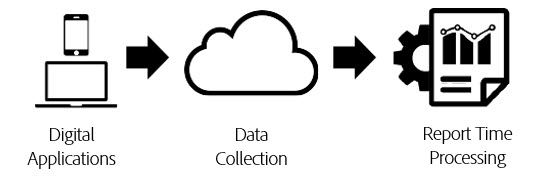

# Bearbetning av rapporttid

[!UICONTROL Report time processing] är en virtuell rapportsvitsinställning som gör att data i Analysis Workspace kan bearbetas på ett icke-förstörande, retroaktivt sätt.

[!UICONTROL Report Time Processing] påverkar bara data i den virtuella rapportsviten och påverkar inte data eller datainsamling i basrapportsviten. Skillnaden mellan [!UICONTROL Report Time Processing] och traditionell Analytics-bearbetning tolkas bäst med följande diagram:

Under databearbetningen i Analytics flödar data genom datainsamlingsflödet och in i ett förbearbetningssteg, som förbereder data för rapportering. I det här förbearbetningssteget används bl.a. logik för förfallodatum och beständighetslogik för eVar på data som samlas in. Den främsta nackdelen med den här förbehandlingsmodellen är att den kräver att all konfiguration görs i förväg innan data samlas in. Det innebär att ändringar i förbehandlingsinställningarna bara gäller för nya data från den tidpunkten och framåt. Det här är problematiskt om data kommer i fel ordning eller om inställningarna är felkonfigurerade.

[!UICONTROL Report Time Processing] är ett helt annat sätt att bearbeta Analytics-data för rapportering. I stället för att förbestämma bearbetningslogiken innan data samlas in, ignorerar Analytics datauppsättningen under förbearbetningssteget och använder den här logiken varje gång en rapport körs:

Denna bearbetningsarkitektur möjliggör mycket mer flexibla rapporteringsalternativ. Du kan till exempel ändra besökets tidsgräns till hur länge du vill på ett icke-förstörande sätt och dessa ändringar återspeglas i eVarnas beständighet och segmentbehållare under hela rapporteringsperioden. Dessutom kan du skapa ett valfritt antal virtuella rapportsviter, där vart och ett har olika alternativ för bearbetning av rapporttid som baseras på samma basrapportserie, utan att ändra några data i basrapportsviten.

[!UICONTROL Report Time Processing] tillåter även Analytics att förhindra bakgrundstötningar från att starta nya besök och tillåter [Adobe Experience Platform Mobile SDK](https://experienceleague.adobe.com/docs/mobile.html) att starta ett nytt besök när en appstartshändelse utlöses.

## Konfigurationsalternativ

Följande konfigurationsalternativ är tillgängliga för virtuella rapportsviter med rapporttidsbearbetning aktiverat:

* **[!UICONTROL Visit Timeout]:** Inställningen för tidsgräns för besök anger hur mycket inaktivitet en unik besökare måste ha innan ett nytt besök startas automatiskt. Standardvärdet är 30 minuter. Om du till exempel anger tidsgränsen för besök till 15 minuter skapas en ny besöksgruppering för varje sekvens av träffar som samlats in, åtskilda med 15 minuters inaktivitet. Den här inställningen påverkar inte bara antalet besök, utan även hur besökssegmentens behållare utvärderas och besökets förfallologik för eVars som förfaller vid besök. Om du minskar tidsgränsen för besöket ökar troligen det totala antalet besök i din rapportering, medan tidsgränsen för besöket minskar det totala antalet besök i din rapportering.
* **[!UICONTROL Mobile App Visit Settings]:** Ytterligare besöksinställningar finns tillgängliga för rapportsviter som innehåller data som genererats av mobilappar via [Adobe Mobile SDK](https://experienceleague.adobe.com/docs/mobile.html). De här inställningarna är icke-förstörande och påverkar bara träffar som samlats in via Mobile SDK:er. De här inställningarna påverkar inte data som samlats in utanför Mobile SDK.
* **[!UICONTROL Prevent Background Hits from starting a new Visit]:** Bakgrundsträffar samlas in av SDK:n för mobiler när appen är i bakgrundsläge.
* **[!UICONTROL Start a New Visit upon each App Launch]:** Förutom tidsgränsen för besök kan du tvinga ett besök att börja när en Appstart-händelse har spelats in från Mobile SDK:er oavsett inaktivitetsfönstret. Den här inställningen påverkar besöksmåtten och besökssegmentbehållaren, liksom logiken för besökets förfallodatum på eVars.
* **[!UICONTROL Start New Visit with Event]:** En ny session startar när en händelse utlöses, oavsett om en session har uppnått tidsgränsen eller inte. Den nyligen skapade sessionen innehåller händelsen som startade den. Dessutom kan du använda flera händelser för att starta en session och en ny session utlöses om någon av dessa händelser observeras i data. Den här inställningen påverkar antalet besök, besökssegmenteringsbehållaren och besökets förfallologik på eVars.

Här är en video om hur du startar ett nytt besök med eventet:

>[!VIDEO](https://video.tv.adobe.com/v/23129/?quality=12)

## Bearbetningsbegränsningar för rapporttid

Rapporttidsbearbetningen stöder inte alla mått och mått som är tillgängliga i traditionella analysrapporter. Virtuella rapportsviter som använder Report Time Processing är bara tillgängliga i Analysis Workspace och är inte tillgängliga i Data Warehouse, Report Builder, Data Feeds eller API:t för rapportering.

Dessutom bearbetas endast data som kommer från rapportens datumintervall (kallas datumfönster nedan). Det innebär att eVar-värden som angetts som&quot;aldrig förfaller&quot; för en besökare före rapportdatumintervallet inte bevaras i rapportfönstren och inte visas i rapporter. Detta innebär också att kundlojalitetsmätningarna enbart baseras på data som finns i rapporteringsdatumintervallet och inte på hela historiken före rapportens datumintervall.

Följande dimensioner och mått stöds inte för bearbetning av rapporttid:

* **Analyser för mål**
* **Analyser för Advertising Cloud-dimensioner/mått**
* **Counter eVars**
* [**Dagar före första köp**](/help/components/dimensions/days-before-first-purchase.md)
* [**Dagar sedan senaste köp**](/help/components/dimensions/days-since-last-purchase.md)
* [**Dagar sedan senaste besök**](/help/components/dimensions/days-since-last-visit.md)
* **Startsida, original**
* **Linjär eVars för allokering**
* **Listvariabler**
* [**Dimensioner för marknadsföringskanaler**](/help/components/dimensions/marketing-channel.md)
* [**Ursprunglig referensdomän**](/help/components/dimensions/original-referring-domain.md)
* [**Returfrekvens**](/help/components/dimensions/return-frequency.md)
* [**Enkel åtkomst**](/help/components/metrics/single-access.md)
* **Datakällor för transaktions-ID**
* [**Besök nummer**](/help/components/dimensions/visit-number.md)

## Påverkade mått och mätvärden

Nedan visas en lista över mått och mått som påverkas beroende på vilka inställningar för Tidsbearbetning för rapport som har valts:

* Om alternativet Förhindra att bakgrundstötningar startar ett nytt besök är aktiverat inträffar följande ändringar. Mer information finns i [Kontextmedveten session](vrs-mobile-visit-processing.md).
   * [**Studsfrekvens**](/help/components/metrics/bounces.md) / [**Studsfrekvens:**](/help/components/metrics/bounce-rate.md) Bakgrundsträffar som inte följs av en förgrundsträff betraktas inte som studsande och bidrar inte till studsfrekvensen.
   * [**Antal sekunder per besök:**](/help/components/metrics/time-spent-per-visit.md) Endast besök som innehåller förgrundsträffar bidrar till det här måttet.
   * **Tid per besök:** Endast besök som innehåller förgrundsträffar bidrar till det här måttet.
   * [**Inmatningsmått**](/help/components/metrics/entries.md) / [**Avsluta mätvärde:**](/help/components/metrics/exits.md) Endast inmatningar och utträden från besök med förgrundsträffar visas i den här dimensionen.
   * [**Ingångsdimension**](/help/components/dimensions/entry-dimensions.md) / [**Avsluta dimensioner:**](/help/components/dimensions/exit-dimensions.md) Endast inmatningar och utträden från besök med förgrundsträffar visas i den här dimensionen.
   * [**Unikt besökarmått:**](/help/components/metrics/unique-visitors.md) Unika besökare inkluderar inte besökare som bara hade bakgrundsträffar i rapportens datumintervall.
* [**Besök:**](/help/components/metrics/visits.md) Besök återspeglar de inställningar som den virtuella rapportsviten har konfigurerat, vilket kan skilja sig från basrapportsviten.
* **Serialiserade händelser med händelse-ID:n:** Händelser som använder händelseserialisering med ett händelse-ID dedupliceras bara för händelser som inträffar inom rapportdatumintervallet för en besökare. Dessa händelser dedupliceras inte för alla datum eller besökare globalt på grund av fönstret för rapporttidsbearbetning.
* **Inköp** / [**Inkomster**](/help/components/metrics/revenue.md) / [**Beställningar**](/help/components/metrics/orders.md) / [**Enheter:**](/help/components/metrics/units.md) När inköps-ID används dedupliceras dessa värden endast för dubbletter av inköps-ID:n som inträffar inom rapportdatumintervallet för en besökare i stället för för för alla datum eller för besökare globalt på grund av att rapporttidsbearbetningsdatumet har valts.
* [**Icke-försäljningsrelaterade eVars**](/help/components/dimensions/evar.md) / **reserverade eVars:** Värden som angetts i en eVar kvarstår bara om värdet angavs inom rapportdatumintervallet på grund av fönstret för rapporttidsbearbetning. Dessutom kan tidsbaserade förfallodatum förfalla en timme tidigt eller en timme sent om beständigheten sträcker sig över en sommartid.
* [**Merchandising eVars**](/help/components/dimensions/evar-merchandising.md) / **reserverade eVars:** Se ovan. För konverteringssyntax, där bindningen är inställd på &quot;any event&quot;, används &quot;any hit&quot; i stället.
* [**Träffyp:**](/help/components/dimensions/hit-type.md) Den här dimensionen anger om en träff är för- eller bakgrundsbild.
* **Dimensioner med (låg trafik) eller &quot;normal trafik har överskridits&quot;:** Radobjektet (låg trafik) bestäms något annorlunda vid bearbetning av rapporttid och är inte garanterat för att matcha det som observeras vid rapportering på basrapportsviten. Det är inte säkert att radobjekt som inte ingår i lågtrafik motsvarar 100 % av Dimensionen för det radobjektet. Dessa skillnader kan bli mer uttalade ju högre antal unika värden som finns i en dimension.
