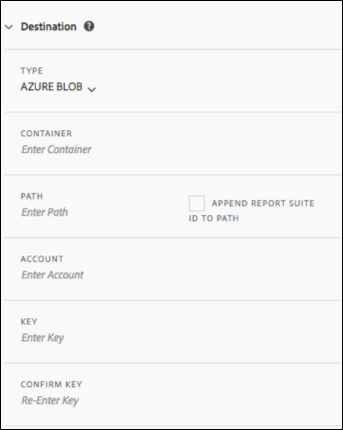

# Skapa eller redigera en datafeed

Genom att skapa en datafeed kan Adobe veta var rådatafiler ska skickas och vad du vill inkludera i varje fil. På den här sidan visas enskilda inställningar som du kan anpassa när du skapar en datafeed.

Grundläggande kunskap om dataflöden rekommenderas innan du läser den här sidan. Se [Översikt över dataflöden](data-feed-overview.md) för att kontrollera att du uppfyller kraven för att skapa en datafeed.

## Fält för matningsinformation

* **Namn**: Dataflödets namn. Måste vara unikt i den valda rapportsviten och får innehålla upp till 255 tecken.
* **Rapportsvit:** Rapportsviten som dataflödet baseras på. Om flera dataflöden skapas för samma rapportserie måste de ha olika kolumndefinitioner. Endast källrapportsviter stöder dataflöden. virtuella rapportsviter stöds inte.
* **Mejla när det är klart**: E-postadressen som ska meddelas när en feed har bearbetats. E-postadressen måste vara korrekt formaterad.
* **Feedintervall**: Timmatningar innehåller en timmes data. Dagliga matningar innehåller en hel dags data. de innehåller data från midnatt till midnatt i rapportsvitens tidszon.
* **Fördröjningsbearbetning**: Vänta en viss tid innan du bearbetar en datafeedfil. En fördröjning kan vara användbar för att ge mobila implementeringar möjlighet att komma online och skicka data på offlineenheter. Den kan också användas för att hantera serverprocesser i organisationen när tidigare bearbetade filer hanteras. I de flesta fall behövs ingen fördröjning. En feed kan fördröjas med upp till 120 minuter.
* **Start- och slutdatum**: Startdatumet anger det första datum då du vill ha en datafeed. Ange det här datumet i det förflutna för att omedelbart börja bearbeta dataflöden för historiska data. Bearbetningen av feeds fortsätter tills de når slutdatumet. Start- och slutdatumen baseras på rapportsvitens tidszon.
* **Löpande matning**: Den här kryssrutan tar bort slutdatumet, vilket gör att en feed kan köras på obestämd tid. När en feed har avslutat bearbetningen av historiska data väntar en feed på data för att slutföra insamlingen under en given timme eller dag. När den aktuella timmen eller dagen är slut börjar bearbetningen efter den angivna fördröjningen.

## Målfält

Vilka fält som är tillgängliga under målfält beror på måltypen.

### FTP

Data från dataflöden kan levereras till en FTP-plats som är värd för Adobe eller kund. Kräver FTP-värd, användarnamn och lösenord. Använd sökvägsfältet för att placera feed-filer i en mapp. Mappar måste redan finnas; feeds genererar ett fel om den angivna sökvägen inte finns.


### SFTP

SFTP-stöd för dataflöden finns tillgängligt. Kräver att en SFTP-värd, ett användarnamn och målplatsen innehåller en giltig offentlig RSA- eller DSA-nyckel. Du kan hämta lämplig offentlig nyckel när du skapar flödet.


### S3

Du kan skicka feeds direkt till Amazon S3-butiker. Kräver ett Bucket-namn, ett Access Key ID och en Secret Key. Mer information finns i [Amazon S3 bucket naming requirements](https://docs.aws.amazon.com/awscloudtrail/latest/userguide/cloudtrail-s3-bucket-naming-requirements.html) i Amazon S3 docs.


Följande 16 AWS-standardregioner stöds (med lämplig signaturalgoritm där det behövs):

* us-east-2
* us-east-1
* us-west-1
* us-west-2
* ap-Southern-1
* ap-northeast-2
* ap-southeast-1
* ap-southeast-2
* ap-northeast-1
* ca-central-1
* eu-central-1
* eu-west-1
* eu-west-2
* eu-west-3
* eu-nord-1
* sa-east-1

>[!NOTE]
>
>Regionen cn-North-1 stöds inte.

### Azure Blob

Datamatningar stöder Azure Blob-mål. Kräver en behållare, ett konto och en nyckel. Amazon krypterar automatiskt vilande data. När du hämtar data dekrypteras de automatiskt. Mer information finns i [Skapa ett lagringskonto](https://docs.microsoft.com/en-us/azure/storage/common/storage-quickstart-create-account?tabs=azure-portal#view-and-copy-storage-access-keys) i Microsoft Azure-dokumenten.



>[!NOTE]
>
>Du måste implementera en egen process för att hantera diskutrymme på matningsmålet. Adobe tar inte bort några data från servern.

## Datakolumdefinitioner

Alla kolumner är tillgängliga, oavsett om de har data. En datafeed måste innehålla minst en kolumn.

* **Ta bort escape-tecken**: När du samlar in data kan vissa tecken (till exempel nya rader) orsaka problem. Markera den här rutan om du vill att dessa tecken ska tas bort från feed-filerna.
* **Komprimeringsformat**: Den typ av komprimering som används. Gzip skickar filer i `.tar.gz`-format. Zip skickar filer i `.zip`-format.
* **Pakettyp**: En enda fil skickar  `hit_data.tsv` filen i en enda, potentiellt enorm fil. Flera filer sidnumrerar data i 2 GB-segment (okomprimerade). Om flera filer är markerade och okomprimerade data för rapportfönstret är mindre än 2 GB, skickas en fil. Adobe rekommenderar att du använder flera filer för de flesta dataflöden.
* **Manifest**: Om Adobe ska leverera en  [manifestfil ](c-df-contents/datafeeds-contents.md#feed-manifest) till målet när inga data samlas in för ett feed-intervall. Om du väljer Manifest File får du en manifestfil som liknar följande när inga data samlas in:

```text
   Datafeed-Manifest-Version: 1.0
    Lookup-Files: 0
    Data-Files: 0
    Total-Records: 0
```

* **Kolumnmallar**: När du skapar många dataflöden rekommenderar Adobe att du skapar en kolumnmall. Om du väljer en kolumnmall inkluderas automatiskt de angivna kolumnerna i mallen. Adobe har också flera mallar som standard.
* **Tillgängliga kolumner**: Alla tillgängliga datakolumner i Adobe Analytics. Klicka på [!UICONTROL Add all] om du vill ta med alla kolumner i en datafeed.
* **Inkluderade kolumner**: De kolumner som ska inkluderas i en datafeed. Klicka på [!UICONTROL Remove all] om du vill ta bort alla kolumner från en datafeed.
* **Hämta CSV**: Hämtar en CSV-fil som innehåller alla inkluderade kolumner.
