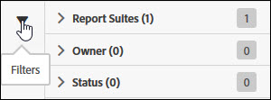

# Hantera dataflöden

Med dataflödeshanteraren kan du skapa, redigera och ta bort dataflöden för din organisation. Om du har behörighet att komma åt dataflödeshanteraren kan du hantera dataflöden för alla rapportsviter som är synliga för dig.

Få åtkomst till dataflödeshantering genom att följa dessa steg:

1. Logga in på [experienceCloud.adobe.com](https://experiencecloud.adobe.com).
2. Klicka på menyn med nio rutnät i det övre högra hörnet och klicka sedan på [!UICONTROL Analytics].
3. Klicka på [!UICONTROL Admin] > [!UICONTROL Data Feeds]i den övre menyn.

## Navigera i gränssnittet

Gränssnittet ser ut ungefär så här när du kommer till sidan för dataflödeshanteraren:

Om inga feeds har konfigurerats visas en [!UICONTROL Create New Data Feed] knapp på sidan.

### Filter och sökning

Använd filter och sök för att hitta exakt den feed du letar efter.

Klicka på filterikonen längst till vänster om du vill visa eller dölja filteralternativen. Filter ordnas efter kategori. Klicka på avrivningen om du vill komprimera eller utöka filterkategorierna. Klicka i kryssrutan för att använda det filtret.

Använd sökning för att hitta en feed efter namn.

### Feeds och jobb

Klicka på fliken Jobb för att visa enskilda jobb som var och en av dina feeds skapar. Se [Hantera dataflödesjobb](df-manage-jobs.md).

### Lägg till

I närheten av flikarna för feeds och jobb klickar du på +- [!UICONTROL Add] knappen för att skapa en ny feed. Mer information finns i [Lägga till en feed](create-feed.md) .

### Kolumner

Varje feed som skapas visar flera kolumner med information om den. Klicka på en kolumnrubrik om du vill sortera den i stigande ordning. Klicka på en kolumnrubrik igen för att sortera den i fallande ordning. Om du inte kan se en viss kolumn klickar du på kolumnikonen i det övre högra hörnet.

* **Feednamn**: Obligatorisk kolumn. Visar feed-namnet.
* **Feed-ID**: Visar feed-ID:t, en unik identifierare.
* **Report Suite**: Rapportsviten innehåller de data som matningen refererar till.
* **Report Suite-ID**: Rapportsvitens unika identifierare.
* **Datakolumner**: Vilka datakolumner som är aktiva för feeden. I de flesta fall finns det för många kolumner att visa i det här formatet.
* **Intervall**: Indikerar om matningen är timme eller dag.
* **Måltyp**: Måltypen för feeden. Exempel: FTP, Amazon S3 eller Azure.
* **Målvärd**: Platsen där filen placeras. Exempel, `ftp.example.com`.
* **Ägare**: Användarkontot som skapade feeden.
* **Status**: Status för feeden.
   * Aktiv: Matningen är i drift.
   * Väntande godkännande: I vissa fall måste en feed godkännas av Adobe innan den kan börja generera jobb.
   * Borttagen: Matningen tas bort.
   * Fullständigt: Flödet avslutade bearbetningen. En ifylld feed kan redigeras, stoppas eller avbrytas.
   * Väntande: Flödet skapas men är ännu inte aktivt. Feeds finns kvar i detta tillstånd under en kort övergångsperiod.
   * Inaktiv: Motsvarar ett pausat eller spärrat tillstånd. När feeden återaktiveras fortsätter den att leverera jobb från och med när den stoppas.
* **Senast ändrad**: Det datum då feeden senast ändrades. Datum och tid visas i rapportsvitens tidszon med GMT-förskjutning.
* **Startdatum**: Datumet för det första jobbet för denna feed. Datum och tid visas i rapportsvitens tidszon med GMT-förskjutning.
* **Slutdatum**: Datum för det senaste jobbet för denna feed. Pågående dataflöden har inget slutdatum.

## Åtgärder för datafeed

Klicka i kryssrutan bredvid en datafeed för att visa tillgängliga åtgärder.

* **Jobbhistorik**: Visa alla jobb som är kopplade till dessa dataflöden. Tar dig automatiskt till gränssnittet Hantera jobb.
* **Ta bort**: Tar bort datafeeden och anger dess status till [!UICONTROL Deleted].
* **Copy**: Tar dig till att [skapa en ny feed](create-feed.md) med alla inställningar för den aktuella feeden. Du kan inte kopiera en datafeed om mer än en har valts.
* **Pausa**: Stoppar bearbetningen för feeden och anger status till [!UICONTROL Inactive].
* **Aktivera**: Endast tillgängligt för inaktiva feeds. Hämtar databearbetning där den slutade, fyller i eventuella datum om det behövs.
