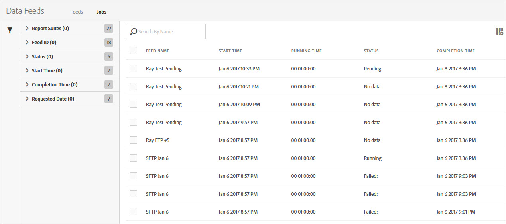

# Hantera datafeedjobb

Jobb är enskilda uppgifter som returnerar en komprimerad fil. De skapas och styrs av feeds.

Få åtkomst till jobbhantering för datafeed genom att följa dessa steg:

1. Logga in på [ExperienceCloud.adobe.com](https://experiencecloud.adobe.com).
2. Klicka på menyn med nio rutnät i det övre högra hörnet och klicka sedan på [!UICONTROL Analytics].
3. Klicka på [!UICONTROL Admin] > [!UICONTROL Data Feeds] på den översta menyn.
4. Klicka på fliken Jobb uppe.

## Navigera i gränssnittet

Ett datafeedjobb är en enda instans där Adobe bearbetar och returnerar en komprimerad fil för ett visst rapportfönster. Jobbhanteraren ger en förfinad vy för att se status för enskilda jobb.

### Filter och sökning

Använd filter och sök för att hitta exakt det jobb du letar efter.

Klicka på filterikonen längst till vänster om du vill visa eller dölja filteralternativen. Filter ordnas efter kategori. Klicka på avrivningen om du vill komprimera eller utöka filterkategorierna. Klicka i kryssrutan för att använda det filtret.

Använd sökning för att hitta ett jobb efter namn.

### Feeds och jobb

Klicka på fliken Feeds för att visa överliggande feeds som skapar dessa jobb. Se [Hantera datafeeds](df-manage-feeds.md).

### Kolumner

Varje jobb visar flera kolumner med information om det. Klicka på en kolumnrubrik om du vill sortera den i stigande ordning. Klicka på en kolumnrubrik igen för att sortera den i fallande ordning. Om du inte kan se en viss kolumn klickar du på kolumnikonen i det övre högra hörnet.

* **Feed-ID**: Visar feed-ID:t, en unik identifierare. Jobb som skapas av samma feed har samma feed-ID.
* **Jobb-ID**: En unik identifierare för jobbet. Alla jobb har ett annat jobb-ID.
* **Feed-namn**: Obligatorisk kolumn. Visar feed-namnet. Jobb som skapas av samma feed har samma flödesnamn.
* **Rapportsviten**: Rapportsviten som jobbet refererar till data från.
* **Report Suite-ID**: Rapportsvitens unika identifierare.
* **Starttid**: Den tidpunkt då jobbet startades. Datum och tid visas i rapportsvitens tidszon med GMT-förskjutning. Dagliga matningar börjar vanligtvis nära midnatt i rapportsvitens tidszon.
* **Status**: Status för feeden.
   * Väntar på data: Jobbet är i drift och data för rapportfönstret samlas in.
   * Bearbetning: Jobbet skapar datafilerna och förbereder att skicka dem.
   * Slutförd: Jobbet slutfördes utan problem.
   * Misslyckades: Jobbet slutfördes inte. Se [Felsöka datafeeds](troubleshooting.md) för att fastställa orsaken till felet.
   * Väntar på export: Data för rapportfönstret har ännu inte bearbetats fullständigt.
   * Inga data: Det finns inga data i rapportsviten för det begärda rapportfönstret.
* **Slutförandetid**: Tiden när jobbet slutfördes. Datum och tid visas i rapportsvitens tidszon med GMT-förskjutning.
* **Begärt datum**: Filens rapportfönster. Dagliga matningar visar vanligtvis 00:00 - 23:59 med en GMT-förskjutning, vilket anger en heldag baserat på rapportsvitens tidszon. Timmatningar visar den individuella timmen jobbet är avsett för.
