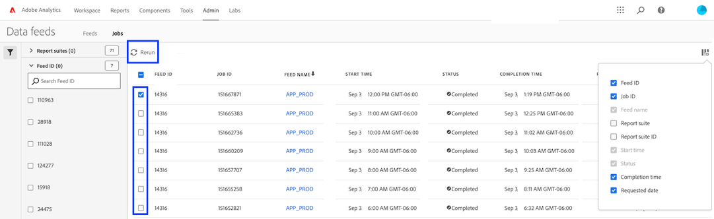

# Felsöka dataflöden

Fastställ möjliga orsaker till varför ett jobb kanske inte kan bearbetas eller levereras.

## Felsöka en befintlig datafeed

Om du har en datafeed som fungerar timvis eller dagligen men som nyligen har misslyckats ska du kontrollera följande:

* Använd [Statusverktyget i Adobe](https://status.adobe.com/en/experience_cloud) för att avgöra om det finns schemalagda underhållsperioder eller tillgänglighetsproblem. Om det finns ett känt fel bearbetar Adobe automatiskt schemalagda dataflöden när tjänsten har återställts.
* Kontrollera att det finns tillräckligt med ledigt utrymme på FTP-platsen. Om diskutrymmet tar slut för FTP-platsen tar du bort några filer från servern för att frigöra utrymme för nya filer.
* Om det inte finns några kända problem och FTP-platsen har tillräckligt med diskutrymme kan du skicka om dataflödet.

   1. Logga in på Adobe Analytics och navigera till **[!UICONTROL Admin]** > **[!UICONTROL Data feeds]**.
   2. Leta reda på dataflödena och klicka sedan i kryssrutan bredvid varje dataflöde som du vill köra igen.
   3. Klicka på **[!UICONTROL Rerun]**.

   

Om du fortfarande inte får dataflödesfilerna när du har startat om dem kontaktar du Kundtjänst.

## Felsöka en ny datafeed

Om ett nytt dataflöde genererar ett fel felsöker du problemet genom att manuellt överföra en testfil till FTP-platsen. I de flesta fall kan du ange felpunkten genom att använda dessa steg.

1. Logga in på FTP-platsen med Utforskaren (Windows) eller Finder (Mac). Se till att du använder FTP-protokollet (`ftp://`) och att du tillåter [Adobe](/help/technotes/ip-addresses.md) genom er brandvägg. Om du inte kan nå FTP-platsen bör du tillsammans med ägaren av FTP-platsen fastställa rätt mål.

   

2. Ett popup-fönster med en fråga om användarnamn och lösenord visas. Ange autentiseringsuppgifterna. Om inloggningsuppgifterna godkänns visas det aktuella innehållet på FTP-platsen i fönstret. Om inloggningsuppgifterna inte godkänns bör du samarbeta med FTP-ägaren för att kontrollera att användarnamnet och lösenordet är korrekta. Om du använder SFTP måste du följa varje steg i [SFTP-guide](../ftp-and-sftp/c-sftp/ftp-sftp.md). Observera att Adobe inte stöder alla SFTP-användningsfall.
3. Överför en fil till FTP-platsen genom att dra den till det autentiserade fönstret. Alla bilder och textdokument är tillräckliga. Om du får ett fel när du försöker montera en fil på FTP-platsen bör du tillsammans med FTP-ägaren kontrollera att det finns tillräckligt med diskutrymme och att användarnamnet har skrivbehörighet för FTP-platsen.
4. När du har bekräftat att filen finns på FTP-platsen kan du ta bort filen som överfördes i föregående steg.

Om alla ovanstående steg fungerar och du ändå får ett FTP-fel kontaktar du Kundtjänst.
