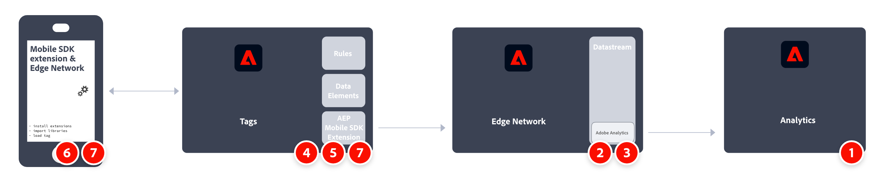

# Implementera Adobe Analytics med Adobe Experience Platform Mobile SDK

Adobe Experience Platform Mobile SDK hjälper er att driva lösningar och tjänster från Adobe Experience Cloud i era mobilappar. Det finns för Android™, iOS och olika plattformsoberoende utvecklingsramverk. Konfigurationen hanteras med Adobe Experience Platform Data Collection.

>[!IMPORTANT]
>
>Det finns även ett Adobe Analytics-tillägg i Adobe Experience Platform Data Collection. Om du installerar det här tillägget kan du inte utnyttja XDM eller Edge Network.

## Adobe Experience Platform SDK

Översikt över implementeringsuppgifterna på hög nivå:

<table style="width:100%">

<tr>
<th style="width:5%"></th><th style="width:60%"><b>Uppgift</b></th><th style="width:35%"><b>Mer information</b></th>
</tr>

<tr>
<td>1</td>
<td>Se till att du har <b>har definierat en rapportsvit</b>.</td>
<td><a href="../../../admin/admin/c-manage-report-suites/report-suites-admin.md">Report Suite Manager</a></td>
</tr>

<tr>
<td>2</td>
<td><b>Konfigurera scheman.</b>. För att standardisera datainsamlingen för användning i olika program som utnyttjar Adobe Experience Platform har Adobe skapat den öppna och offentligt dokumenterade standarden Experience Data Model (XDM).</td>
<td><a href="https://experienceleague.adobe.com/docs/experience-platform/xdm/ui/overview.html?lang=en">Översikt över schemaanvändargränssnittet</a></td>
</tr>

<tr>
<td>3</td>
<td><b>Konfigurera ett datastream</b>. En datastream representerar konfigurationen på serversidan när Adobe Experience Platform Web SDK implementeras.</td>
<td><a href="https://experienceleague.adobe.com/docs/experience-platform/edge/datastreams/configure.html?lang=en">Konfigurera ett datastream<a></td> 
</tr>

<td>4</td>
<td><b>Lägg till en Adobe Analytics-tjänst</b> till din datastream. Tjänsten styr om och hur data skickas till Adobe Analytics.</td>
<td><a href="https://experienceleague.adobe.com/docs/experience-platform/edge/datastreams/configure.html?lang=en#analytics">Lägg till Adobe Analytics-tjänst i ett datastream</a></td>
</tr>

<tr>
<td>5</td>
<td><b>Skapa en mobil egenskap</b>. En egenskap är en behållare som du fyller med tillägg, regler, dataelement och bibliotek.</td>
<td><a href="https://developer.adobe.com/client-sdks/documentation/getting-started/create-a-mobile-property/">Konfigurera en mobil egenskap</a></tr>

<tr>
<td>6</td>
<td><b>Installera Adobe Experience Platform Edge Network-tillägget</b> i egenskapen mobile-tagg och konfigurera datastream i tillägget.</td>
<td><a href="https://developer.adobe.com/client-sdks/documentation/edge-network/">Adobe Experience Platform Edge Network</a>
</tr>

<tr>
<td>7</td>
<td><b>Använd kod i din app</b> om du vill registrera nödvändiga tillägg och läsa in din taggkonfiguration.</td>
<td><a href="https://developer.adobe.com/client-sdks/documentation/user-guides/getting-started-with-platform/overview/#set-up-the-configuration">Konfigurera konfigurationen</a></td>
</tr>

<tr>
<td>8</td>
<td><b>Implementera och testa funktioner</b> med en kombination av taggens dataelement, regler, ytterligare tillägg och SDK API-anrop i din app. Inspect, validera och felsök datainsamling och upplevelser för er mobilapplikation.</td>
<td><a href="https://developer.adobe.com/client-sdks/documentation/user-guides/getting-started-with-platform/overview/#use-the-sample-application">Använda exempelprogrammet</a>
</tr>

<tr>
<td>9</td>
<td><b>Utöka och validera er mobilappsimplementering</b> innan det går till produktion.</td>
<td></td> 
</tr>

</table>

## Adobe Analytics.

Översikt över implementeringsuppgifterna på hög nivå:

<table style="width:100%">

<tr>
<th style="width:5%"></th><th style="width:60%"><b>Uppgift</b></th><th style="width:35%"><b>Mer information</b></th>
</tr>

<tr>
<td>1</td>
<td>Se till att du har <b>har definierat en rapportsvit</b>.</td>
<td><a href="../../../admin/admin/c-manage-report-suites/report-suites-admin.md">Report Suite Manager</a></td>
</tr>

<tr>
<td>2</td>
<td><b>Konfigurera scheman</b>. För att standardisera datainsamlingen för användning i olika program som utnyttjar Adobe Experience Platform har Adobe skapat den öppna och offentligt dokumenterade standarden Experience Data Model (XDM).</td>
<td><a href="https://experienceleague.adobe.com/docs/experience-platform/xdm/ui/overview.html?lang=en">Översikt över schemaanvändargränssnittet</a></td>
</tr>

<tr>
<td>3</td>
<td><b>Installera Adobe Analytics-tillägget</b> i egenskapen mobile tag och konfigurera tillägget så att det pekar på rapportsviten.</td>
<td><a href="https://developer.adobe.com/client-sdks/documentation/adobe-analytics/">Adobe Analytics-tillägg för mobil egendom</a>
</tr>

<tr>
<td>4</td>
<td><b>Använd kod i din app</b> om du vill registrera nödvändiga tillägg och läsa in din taggkonfiguration.</td>
<td><a href="https://developer.adobe.com/client-sdks/documentation/user-guides/getting-started-with-platform/overview/#set-up-the-configuration">Konfigurera konfigurationen</a></td>
</tr>

<tr>
<td>5</td>
<td><b>Implementera och testa funktioner</b> med en kombination av taggens dataelement, regler, ytterligare tillägg och SDK API-anrop i din app. Inspect, validera och felsök datainsamling och upplevelser för er mobilapplikation.</td>
<td><a href="https://developer.adobe.com/client-sdks/documentation/user-guides/getting-started-with-platform/overview/#use-the-sample-application">Använda exempelprogrammet</a>
</tr>

<tr>
<td>6</td>
<td><b>Utöka och validera er mobilappsimplementering</b> innan det går till produktion.</td>
<td></td> 
</tr>

</table>

## Ytterligare resurser

- [Dokumentation för taggar](https://experienceleague.adobe.com/docs/experience-platform/tags/home.html#)

- [Mobile SDK-dokumentation](https://developer.adobe.com/client-sdks/documentation/)
