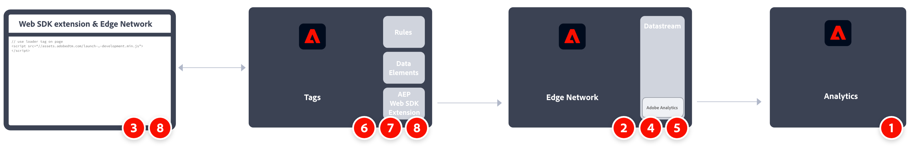

# Implementera Adobe Analytics med Adobe Experience Platform Web SDK

Du kan använda [Adobe Experience Platform Web SDK](https://experienceleague.adobe.com/docs/experience-platform/web-sdk/home.html) för att skicka data till Adobe Analytics. Den här implementeringsmetoden fungerar genom att översätta [Experience Data Model (XDM)](https://experienceleague.adobe.com/docs/experience-platform/xdm/home.html?lang=sv) till ett format som används av Analytics. Du kan skicka data till Adobe Experience Platform Edge Network med JavaScript-biblioteket för Web SDK eller taggtillägget för Web SDK.

## Webb-SDK

Översikt över implementeringsuppgifterna på hög nivå:

<table style="width:100%">

<tr>
<th style="width:5%"></th><th style="width:60%"><b>Uppgift</b></th><th style="width:35%"><b>Mer information</b></th>
</tr>

<tr>
<td>1</td>
<td>Se till att du har <b>har definierat en rapportsvit</b>.</td>
<td><a href="/help/admin/admin/c-manage-report-suites/report-suites-admin.md">Report Suite Manager</a></td>
</tr>

<tr>
<td>2</td>
<td><b>Konfigurera scheman</b>. För att standardisera datainsamlingen för användning i olika program som utnyttjar Adobe Experience Platform har Adobe skapat den öppna och offentligt dokumenterade standarden Experience Data Model (XDM).</td>
<td><a href="https://experienceleague.adobe.com/docs/experience-platform/xdm/ui/overview.html">Översikt över schemaanvändargränssnittet</a></td>
</tr>

<tr>
<td>3</td>
<td><b>Skapa ett datalager</b> för att hantera spårning av data på din webbplats.</td>
<td><a href="../../prepare/data-layer.md">Skapa ett datalager</a></td>
</tr>

<tr>
<td> 4</td>
<td><b>Installera den fördefinierade fristående versionen</b>. Du kan referera till biblioteket (<code>alloy.js</code>) på CDN direkt på din sida eller ladda ned och lagra den i din egen infrastruktur. Du kan också använda NPM-paketet.</td>
<td><a href="https://experienceleague.adobe.com/docs/experience-platform/web-sdk/install/library.html">Installera den fördefinierade fristående versionen</a> och <a href="https://experienceleague.adobe.com/docs/experience-platform/web-sdk/install/npm.html">Använda NPM-paketet</a></td>
</tr>

<tr>
<td>5</td>
<td><b>Konfigurera ett datastream</b>. En datastream representerar konfigurationen på serversidan när Adobe Experience Platform Web SDK implementeras.</td>
<td><a href="https://experienceleague.adobe.com/docs/experience-platform/edge/datastreams/configure.html">Konfigurera ett datastream<a></td> 
</tr>

<td>6</td>
<td><b>Lägg till en Adobe Analytics-tjänst</b> till din datastream. Tjänsten styr om och hur data skickas till Adobe Analytics och till vilka rapporteringsprogram.</td>
<td><a href="https://experienceleague.adobe.com/docs/experience-platform/edge/datastreams/configure.html#analytics">Lägg till Adobe Analytics-tjänst i ett datastream</a></td>
</tr>

<tr>
<td>7</td>
<td><b>Konfigurera Web SDK</b>. Se till att biblioteket som du installerade i steg 4 är korrekt konfigurerat med dataStream ID (kallades tidigare edge configuration id (<code>edgeConfigId</code>)), organisations-ID (<code>orgId</code>) och andra tillgängliga alternativ. Kontrollera att variablerna mappas korrekt. </td>
<td><a href="https://experienceleague.adobe.com/docs/experience-platform/web-sdk/commands/configure/overview.html">Konfigurera Web SDK</a> <a href="../xdm-var-mapping.md">Variabelmappning för XDM-objekt</a></td>
</tr>

<tr>
<td>8</td>
<td><b>Kör kommandon</b> och/eller <b>spåra händelser</b>. När baskoden har implementerats på webbsidan kan du börja köra kommandon och spåra händelser med SDK.
</td>
<td><a href="https://experienceleague.adobe.com/docs/experience-platform/web-sdk/commands/sendevent/overview.html">Skicka händelser</a></td>
</tr>

<tr>
<td>9</td><td><b>Utöka och validera implementeringen</b> innan det går till produktion.</td><td></td> 
</tr>
</table>

## Web SDK-tillägg

Översikt över implementeringsuppgifterna på hög nivå:

<table style="width:100%">

<tr>
<th style="width:5%"></th><th style="width:60%"><b>Uppgift</b></th><th style="width:35%"><b>Mer information</b></th>
</tr>

<tr>
<td>1</td>
<td>Se till att du har <b>har definierat en rapportsvit</b>.</td>
<td><a href="/help/admin/admin/c-manage-report-suites/report-suites-admin.md">Report Suite Manager</a></td>
</tr>

<tr>
<td>2</td>
<td><b>Konfigurera scheman</b>. För att standardisera datainsamlingen för användning i olika program som utnyttjar Adobe Experience Platform har Adobe skapat den öppna och offentligt dokumenterade standarden Experience Data Model (XDM).</td>
<td><a href="https://experienceleague.adobe.com/docs/experience-platform/xdm/ui/overview.html">Översikt över schemaanvändargränssnittet</a></td>
</tr>

<tr>
<td>3</td>
<td><b>Skapa ett datalager</b> för att hantera spårning av data på din webbplats.</td>
<td><a href="../../prepare/data-layer.md">Skapa ett datalager</a></td>
</tr>

<tr>
<td>4</td>
<td><b>Konfigurera ett datastream</b>. En datastream representerar konfigurationen på serversidan när Adobe Experience Platform Web SDK implementeras.</td>
<td><a href="https://experienceleague.adobe.com/docs/experience-platform/edge/datastreams/configure.html">Konfigurera ett datastream<a></td> 
</tr>

<tr>
<td>5</td> 
<td><b>Lägg till en Adobe Analytics-tjänst</b> till din datastream. Tjänsten styr om och hur data skickas till Adobe Analytics och till vilka rapporteringsprogram.</td>
<td><a href="https://experienceleague.adobe.com/docs/experience-platform/edge/datastreams/configure.html#analytics">Lägg till Adobe Analytics-tjänst i ett datastream</a></td>
</tr>

<tr>
<td>6</td>
<td><b>Skapa en taggegenskap</b>. Egenskaper är överliggande behållare som används för att referera till tagghanteringsdata.</td>
<td><a href="https://experienceleague.adobe.com/docs/experience-platform/tags/admin/companies-and-properties.html#for-web">Skapa eller konfigurera en taggegenskap för webben</a></td>
</tr>

<tr>
<td>7</td> 
<td><b>Installera och konfigurera Web SDK-tillägget</b> i taggegenskapen. Konfigurera Web SDK-tillägget för att skicka data till den dataström som konfigurerats i steg 4.</td>
<td><a href="https://experienceleague.adobe.com/docs/experience-platform/tags/extensions/client/sdk/overview.html">Adobe Experience Platform Web SDK-tillägg - översikt</a></td>
</tr>

<tr>
<td>8</td>
<td><b>Upprepa, validera och publicera</b> till produktion. Bädda in kod för att inkludera taggegenskapen på webbplatsens sidor. Använd sedan dataelement, regler och så vidare för att anpassa implementeringen.</td>
<td><a href="https://experienceleague.adobe.com/docs/experience-platform/tags/publish/environments/environments.html#embed-code">Bädda in kod</a> <a href="https://experienceleague.adobe.com/docs/experience-platform/tags/publish/overview.html">Översikt över publicering</a></td>
</tr>

</table>

## Ytterligare resurser

Taggar kan anpassas mycket. Läs mer om hur du får ut mesta möjliga av Adobe Analytics genom att inkludera rätt data i implementeringen.

- [Dokumentation för taggar](https://experienceleague.adobe.com/docs/experience-platform/tags/home.html#): Lär dig hur gränssnittet fungerar och vilka tillägg som är tillgängliga.

- [Adobe Experience Platform Web SDK-dokumentation](https://experienceleague.adobe.com/docs/web-sdk.html)
