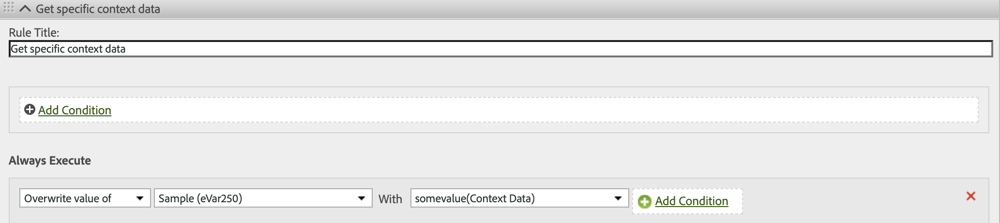

# XDM-objektvariabelmappning till Adobe Analytics

Följande tabell visar de XDM-variabler som Adobe Experience Platform Edge Network automatiskt mappar till Adobe Analytics. Om du använder dessa sökvägar för XDM-fält behövs ingen ytterligare konfiguration för att skicka data till Adobe Analytics. Dessa fält ingår i fältgruppen **[!UICONTROL Adobe Analytics ExperienceEvent Template]**. Du bör använda dessa fält om du tänker skicka data till både Adobe Analytics och Adobe Experience Platform.

Om din organisation planerar att gå över till Customer Journey Analytics rekommenderar Adobe att du i stället använder objektet `data` för att skicka data direkt till Adobe Analytics utan att följa ett schema. Med den här strategin kan din organisation använda ditt eget schema i stället för att använda [!UICONTROL Adobe Analytics ExperienceEvent Template] (som inte är tillämpligt för Customer Journey Analytics). En liknande mappningstabell finns i [Variabelmappning för dataobjekt till Adobe Analytics](data-var-mapping.md).

## Värdeprioriteringar

De flesta XDM-objektfält i den här tabellen sammanfaller med ett [dataobjektfält](data-var-mapping.md). Om du anger både ett givet XDM-objektfält och dess respektive dataobjektfält får dataobjektfältet prioritet. Om du använder både XDM-objektfältet och dataobjektfältet rekommenderar Adobe att du ställer in anpassade händelser med dataobjektfältet. Om fältet `data.__adobe.analytics.events` finns skriver det över alla XDM-objektfält som är relaterade till handel och anpassade händelser.

## Mappning av XDM-objektfält

Tidigare uppdateringar av den här tabellen finns på den här sidans [implementeringshistorik på GitHub](https://github.com/AdobeDocs/analytics.en/commits/main/help/implement/aep-edge/xdm-var-mapping.md).

| Sökväg till XDM-fält | Analysvariabel och beskrivning |
| --- | --- |
| `xdm.application.isClose` | Hjälper till att definiera den mobila livscykelns mått [Krascher](https://developer.adobe.com/client-sdks/home/base/mobile-core/lifecycle/metrics/). |
| `xdm.application.isInstall` | Hjälper till att avgöra när den mobila livscykelns mått [Första starten](https://developer.adobe.com/client-sdks/home/base/mobile-core/lifecycle/metrics/) ska höjas. |
| `xdm.application.closeType` | Avgör om en close-händelse är en krasch eller inte. Giltiga värden är `close` (en livscykelsession avslutas och en pause-händelse togs emot för föregående session) och `unknown` (en livscykelsession avslutas utan en pause-händelse). Hjälper dig att ställa in mätvärdet för mobil livscykel [kraschar](https://developer.adobe.com/client-sdks/home/base/mobile-core/lifecycle/metrics/). |
| `xdm.application.isInstall` | Det mobila livscykelmåttet [Installerar](https://developer.adobe.com/client-sdks/home/base/mobile-core/lifecycle/metrics/). |
| `xdm.application.isLaunch` | Det mobila livscykelmåttet [Startar](https://developer.adobe.com/client-sdks/home/base/mobile-core/lifecycle/metrics/). |
| `xdm.application.name` | Hjälper dig att ange den mobila livscykeldimensionen [Program-ID](https://developer.adobe.com/client-sdks/home/base/mobile-core/lifecycle/metrics/). |
| `xdm.application.isUpgrade` | Den mobila livscykelns mått [Uppgraderingar](https://developer.adobe.com/client-sdks/home/base/mobile-core/lifecycle/metrics/). |
| `xdm.application.version` | Hjälper dig att ange den mobila livscykeldimensionen [Program-ID](https://developer.adobe.com/client-sdks/home/base/mobile-core/lifecycle/metrics/). |
| `xdm.application.sessionLength` | Den mobila livscykelns mått [Tidigare sessionslängd](https://developer.adobe.com/client-sdks/home/base/mobile-core/lifecycle/metrics/). |
| `xdm.commerce.checkouts.id` | Tillämpar [händelseserialisering](../vars/page-vars/events/event-serialization.md) på måttet [Utcheckningar](/help/components/metrics/checkouts.md). |
| `xdm.commerce.checkouts.value` | Ökar måttet för [Utcheckningar](/help/components/metrics/checkouts.md) med önskad mängd. |
| `xdm.commerce.order.currencyCode` | Anger konfigurationsvariabeln [currencyCode](../vars/config-vars/currencycode.md). |
| `xdm.commerce.order.purchaseID` | Anger sidvariabeln [purchaseID](../vars/page-vars/purchaseid.md). |
| `xdm.commerce.order.payments[0].transactionID` | Anger sidvariabeln [transactionID](../vars/page-vars/transactionid.md). |
| `xdm.commerce.productListAdds.id` | Tillämpar [händelseserialisering](../vars/page-vars/events/event-serialization.md) på måttet för [kundvagnstillägg](/help/components/metrics/cart-additions.md). |
| `xdm.commerce.productListAdds.value` | Ökar måttet [Cart Additions](/help/components/metrics/cart-additions.md). |
| `xdm.commerce.productListOpens.id` | Tillämpar [händelseserialisering](../vars/page-vars/events/event-serialization.md) på måttet [Carts](/help/components/metrics/carts.md). |
| `xdm.commerce.productListOpens.value` | Ökar måttet [Carts](/help/components/metrics/carts.md). |
| `xdm.commerce.productListRemovals.id` | Tillämpar [händelseserialisering](../vars/page-vars/events/event-serialization.md) på måttet för [kundvagnsborttagningar](/help/components/metrics/cart-removals.md). |
| `xdm.commerce.productListRemovals.value` | Ökar måttet för [kundvagnsborttagningar](/help/components/metrics/cart-removals.md). |
| `xdm.commerce.productListViews.id` | Tillämpar [händelseserialisering](../vars/page-vars/events/event-serialization.md) på måttet för [kundvagnsvyer](/help/components/metrics/cart-views.md). |
| `xdm.commerce.productListViews.value` | Ökar måttet för [kundvagnsvyer](/help/components/metrics/cart-views.md). |
| `xdm.commerce.productViews.id` | Tillämpar [händelseserialisering](../vars/page-vars/events/event-serialization.md) på måttet för [produktvyer](/help/components/metrics/product-views.md). |
| `xdm.commerce.productViews.value` | Ökar måttet för [produktvyer](/help/components/metrics/product-views.md). |
| `xdm.commerce.purchases.value` | Ökar måttet [Beställningar](/help/components/metrics/orders.md). |
| `xdm.device.model` | Den mobila livscykeldimensionen [Enhetsnamn](https://developer.adobe.com/client-sdks/home/base/mobile-core/lifecycle/metrics/). |
| `xdm.device.colorDepth` | Hjälper dig att ange dimensionen [Färgdjup](/help/components/dimensions/color-depth.md). |
| `xdm.device.screenHeight` | Hjälper dig att ange dimensionen [Bildskärmsupplösning](/help/components/dimensions/monitor-resolution.md). |
| `xdm.device.screenWidth` | Hjälper dig att ange dimensionen [Bildskärmsupplösning](/help/components/dimensions/monitor-resolution.md). |
| `xdm.device.type` | Typ av mobil enhet. |
| `xdm.environment.browserDetails.acceptLanguage` | Hjälper dig att ange dimensionen [Språk](/help/components/dimensions/language.md). |
| `xdm.environment.browserDetails.cookiesEnabled` | Anger dimensionen [Cookie-stöd](/help/components/dimensions/cookie-support.md). Giltiga värden är `Y` (webbläsaren accepterar cookies) och `N` (webbläsaren avvisar cookies). |
| `xdm.environment.browserDetails.javaEnabled` | Anger dimensionen [Java aktiverad](/help/components/dimensions/java-enabled.md). Giltiga värden är `Y` (Java är aktiverat) och `N` (Java är inaktiverat). |
| `xdm.environment.browserDetails.userAgent` | Används som en identifieringsmetod för [unik besökare](/help/components/metrics/unique-visitors.md) som reservalternativ. Vanligtvis ifylld med HTTP-begärandehuvudet `User-Agent`. Du kan mappa det här fältet till en eVar om du vill använda det i rapporter. |
| `xdm.environment.browserDetails.viewportHeight` | Anger dimensionen [Webbläsarhöjd](/help/components/dimensions/browser-height.md). |
| `xdm.environment.browserDetails.viewportWidth` | Anger dimensionen [Webbläsarbredd](/help/components/dimensions/browser-width.md). |
| `xdm.environment.carrier` | Den mobila livscykeldimensionen [Transportföretagets namn](https://developer.adobe.com/client-sdks/home/base/mobile-core/lifecycle/metrics/). |
| `xdm.environment.connectionType` | Hjälper dig att ange dimensionen [Anslutningstyp](/help/components/dimensions/connection-type.md). |
| `xdm.environment.ipV4` | Används som en identifieringsmetod för [unik besökare](/help/components/metrics/unique-visitors.md) som reservalternativ. Vanligtvis ifylld med HTTP-huvudet `X-Forwarded-For`. |
| `xdm.environment._dc.language` | Mobildimensionen Locale. Används bara om xdm.environment.language inte har angetts. |
| `xdm.environment.language` | Mobildimensionen Locale. |
| `xdm.environment.operatingSystem` | Den mobila livscykeldimensionen [Operativsystem](https://developer.adobe.com/client-sdks/home/base/mobile-core/lifecycle/metrics/). |
| `xdm.environment.operatingSystemVersion` | Hjälper dig att ange den mobila livscykeldimensionen [Operativsystemversion](https://developer.adobe.com/client-sdks/home/base/mobile-core/lifecycle/metrics/). |
| `xdm._experience.analytics.customDimensions.`<br/>`eVars.eVar1`<br/>`[...]`<br/>`xdm._experience.analytics.customDimensions.`<br/>`eVars.eVar250` | Anger respektive [eVar](/help/components/dimensions/evar.md)-dimension. |
| `xdm._experience.analytics.customDimensions.`<br/>`hierarchies.hier1`<br/>`[...]`<br/>`xdm._experience.analytics.customDImensions.`<br/>`hierarchies.hier5` | Anger respektive [hierarkidimension](/help/components/dimensions/hierarchy.md). |
| `xdm._experience.analytics.customDimensions.`<br/>`listProps.prop1.delimiter`<br/>`[...]`<br/>`xdm._experience.analytics.customDimensions.`<br/>`listProps.prop75.delimiter` | Åsidosättning av avgränsare för listpropp. Det här fältet rekommenderas inte eftersom avgränsaren hämtas automatiskt från [Traffic Variable Admin](/help/admin/admin/c-manage-report-suites/c-edit-report-suites/c-traffic-variables/traffic-var.md) under rapportsvitens inställningar. Om du använder det här fältet kan det skapa en felmatchning mellan den avgränsare som används och den avgränsare som förväntas i Analytics. |
| `xdm._experience.analytics.customDimensions.`<br/>`listProps.prop1.values`<br/>`[...]`<br/>`xdm._experience.analytics.customDimensions.`<br/>`listProps.prop75.values` | En strängmatris som innehåller respektive [List Prop](../vars/page-vars/prop.md#list-props)-värden. |
| `xdm._experience.analytics.customDimensions.`<br/>`lists.list1.list[].value`<br/>`[...]`<br/>`xdm._experience.analytics.customDimensions.`<br/>`lists.list3.list[].value` | Sammanfogar alla `value`-strängar i respektive `list[]`-array till respektive [List-variabel](../vars/page-vars/list.md). Avgränsaren väljs automatiskt baserat på det värde som angetts i [Rapportsvitens inställningar](/help/admin/admin/c-manage-report-suites/c-edit-report-suites/conversion-var-admin/list-var-admin.md). |
| `xdm._experience.analytics.customDimensions.`<br/>`props.prop1`<br/>`[...]`<br/>`xdm._experience.analytics.customDimensions.`<br/>`props.prop75` | Anger respektive [Prop](/help/components/dimensions/prop.md)-dimension. |
| `xdm._experience.analytics.event1to100.`<br/>`event1.id`<br/>`[...]`<br/>`xdm._experience.analytics.event901to1000.`<br/>`event1000.id` | Tillämpar [händelseserialisering](../vars/page-vars/events/event-serialization.md) på respektive [anpassade händelser](/help/components/metrics/custom-events.md)-mått. Varje händelse-ID finns i dess överordnade 100-grupp. Om du till exempel vill använda serialisering på `event678` använder du `xdm._experience.analytics.event601to700.event678.id`. |
| `xdm._experience.analytics.event1to100.`<br/>`event1.value`<br/>`[...]`<br/>`xdm._experience.analytics.event901to1000.`<br/>`event1000.value` | Ökar respektive [anpassade händelser](/help/components/metrics/custom-events.md)-mått med önskad mängd. Varje händelse finns i dess överordnade 100-grupp. Fältet för `event567` är till exempel `xdm._experience.analytics.event501to600.event567.value`. |
| `xdm.identityMap.ECID[0].id` | [Adobe Experience Cloud ID för identitetstjänst](https://experienceleague.adobe.com/sv/docs/id-service/using/home). |
| `xdm.marketing.trackingCode` | Anger dimensionen [Spårningskod](/help/components/dimensions/tracking-code.md). |
| `xdm.media.mediaTimed.completes.value` | Mätvärdet för direktuppspelningsmedia [Slutför innehåll](https://experienceleague.adobe.com/sv/docs/media-analytics/using/implementation/variables/audio-video-parameters#content-complete). |
| `xdm.media.mediaTimed.dropBeforeStart.value` | `c.a.media.view`, `c.a.media.timePlayed`, `c.a.media.play` |
| `xdm.media.mediaTimed.federated.value` | Det direktuppspelade mediemått [Federated data](https://experienceleague.adobe.com/sv/docs/media-analytics/using/implementation/variables/audio-video-parameters#federated-data). |
| `xdm.media.mediaTimed.firstQuartiles.value` | Mätvärdet [Tjugofem % för direktuppspelningsmedia](https://experienceleague.adobe.com/sv/docs/media-analytics/using/implementation/variables/audio-video-parameters#twenty-five--progress-marker). |
| `xdm.media.mediaTimed.mediaSegmentView.value` | Det direktuppspelade mediemätverket [Vyer för innehållssegment](https://experienceleague.adobe.com/sv/docs/media-analytics/using/implementation/variables/audio-video-parameters#content-segment-views). |
| `xdm.media.mediaTimed.midpoints.value` | Mätvärdet [Femtio % förloppsindikator](https://experienceleague.adobe.com/sv/docs/media-analytics/using/implementation/variables/audio-video-parameters#progress-marker) för direktuppspelningsmedia. |
| `xdm.media.mediaTimed.pauseTime.value` | Mätvärdet för direktuppspelningsmedia [Total paustid](https://experienceleague.adobe.com/sv/docs/media-analytics/using/implementation/variables/audio-video-parameters#total-pause-duration). |
| `xdm.media.mediaTimed.pauses.value` | Det direktuppspelade mediemått [Pausa händelser](https://experienceleague.adobe.com/sv/docs/media-analytics/using/implementation/variables/audio-video-parameters#pause-events). |
| `xdm.mediaCollection.sessionDetails.assetID` | Direktuppspelningsmediedimensionen [Resurs-ID](https://experienceleague.adobe.com/sv/docs/media-analytics/using/implementation/variables/audio-video-parameters#asset-id). |
| `xdm.mediaCollection.sessionDetails.friendlyName` | Direktuppspelningsmediedimensionen [Videonamn](https://experienceleague.adobe.com/sv/docs/media-analytics/using/implementation/variables/audio-video-parameters#video-name). |
| `xdm.mediaCollection.sessionDetails.originator` | Direktuppspelningsmediedimensionen [Originator](https://experienceleague.adobe.com/sv/docs/media-analytics/using/implementation/variables/audio-video-parameters#originator). |
| `xdm.mediaCollection.sessionDetails.episode` | Direktuppspelningsmediedimensionen [Episod](https://experienceleague.adobe.com/sv/docs/media-analytics/using/implementation/variables/audio-video-parameters#episode). |
| `xdm.mediaCollection.sessionDetails.genre` | Direktuppspelningsmediedimensionen [Genre](https://experienceleague.adobe.com/sv/docs/media-analytics/using/implementation/variables/audio-video-parameters#genre). |
| `xdm.mediaCollection.sessionDetails.rating` | Den direktuppspelade mediedimensionen [Innehållsklassificering](https://experienceleague.adobe.com/sv/docs/media-analytics/using/implementation/variables/audio-video-parameters#content-rating). |
| `xdm.mediaCollection.sessionDetails.season` | Direktuppspelningsmediedimensionen [Säsong](https://experienceleague.adobe.com/sv/docs/media-analytics/using/implementation/variables/audio-video-parameters#season). |
| `xdm.mediaCollection.sessionDetails.name` | Den direktuppspelade mediedimensionen [Innehålls-ID](https://experienceleague.adobe.com/sv/docs/media-analytics/using/implementation/variables/audio-video-parameters#content-id). |
| `xdm.mediaCollection.sessionDetails.show` | Direktuppspelningsmediedimensionen [Visa](https://experienceleague.adobe.com/sv/docs/media-analytics/using/implementation/variables/audio-video-parameters#show). |
| `xdm.mediaCollection.sessionDetails.showType` | Direktuppspelningsmediedimensionen [Visa typ](https://experienceleague.adobe.com/sv/docs/media-analytics/using/implementation/variables/audio-video-parameters#show-type). |
| `xdm.mediaCollection.sessionDetails.length` | Direktuppspelningsmediedimensionen [Videolängd](https://experienceleague.adobe.com/sv/docs/media-analytics/using/implementation/variables/audio-video-parameters#video-length). |
| `xdm.media.mediaTimed.primaryAssetViewDetails.@id` | Direktuppspelningsmediedimensionen [Mediasession-ID](https://experienceleague.adobe.com/sv/docs/media-analytics/using/implementation/variables/audio-video-parameters#media-session-id). |
| `xdm.mediaCollection.sessionDetails.channel` | Den direktuppspelade mediedimensionen [Innehållskanal](https://experienceleague.adobe.com/sv/docs/media-analytics/using/implementation/variables/audio-video-parameters#content-channel). |
| `xdm.mediaCollection.sessionDetails.contentType` | Direktuppspelningsmediemätningen [Innehållstyp](https://experienceleague.adobe.com/sv/docs/media-analytics/using/implementation/variables/audio-video-parameters#content-type). |
| `xdm.mediaCollection.sessionDetails.network` | Direktuppspelningsmediedimensionen [Nätverk](https://experienceleague.adobe.com/sv/docs/media-analytics/using/implementation/variables/audio-video-parameters#network). |
| `xdm.media.mediaTimed.primaryAssetViewDetails.`<br/>`mediaSegmentView.value` | Den direktuppspelade mediedimensionen [Innehållssegment](https://experienceleague.adobe.com/sv/docs/media-analytics/using/implementation/variables/audio-video-parameters#content-segment). |
| `xdm.mediaCollection.sessionDetails.playerName` | Den direktuppspelade mediedimensionen [Namn på innehållsspelaren](https://experienceleague.adobe.com/sv/docs/media-analytics/using/implementation/variables/audio-video-parameters#content-player-name). |
| `xdm.mediaCollection.sessionDetails.appVersion` | Direktuppspelningsmediedimensionen [SDK version](https://experienceleague.adobe.com/sv/docs/media-analytics/using/implementation/variables/audio-video-parameters#sdk-version). |
| `xdm.mediaCollection.sessionDetails.feed` | Mediedimensionen [Mediefeedtyp](https://experienceleague.adobe.com/sv/docs/media-analytics/using/implementation/variables/audio-video-parameters#media-feed-type) för direktuppspelning. |
| `xdm.mediaCollection.sessionDetails.streamFormat` | Direktuppspelningsmediedimensionen [Strömformat](https://experienceleague.adobe.com/sv/docs/media-analytics/using/implementation/variables/audio-video-parameters#stream-format). |
| `xdm.media.mediaTimed.progress10.value` | Mätvärdet för direktuppspelningsmedia [10 % Progress Marker](https://experienceleague.adobe.com/sv/docs/media-analytics/using/implementation/variables/audio-video-parameters#ten--progress-marker). |
| `xdm.media.mediaTimed.progress95.value` | Mätvärdet [Nittiofem % för direktuppspelningsmedia ](https://experienceleague.adobe.com/sv/docs/media-analytics/using/implementation/variables/audio-video-parameters#ninety-five--progress-marker). |
| `xdm.mediaCollection.sessionDetails.hasResume` | Det direktuppspelade mediemått [Innehållet återupptas](https://experienceleague.adobe.com/sv/docs/media-analytics/using/implementation/variables/audio-video-parameters#content-resumes). |
| `xdm.media.mediaTimed.starts.value` | Det direktuppspelade mediemått [Media börjar](https://experienceleague.adobe.com/sv/docs/media-analytics/using/implementation/variables/audio-video-parameters#media-starts). |
| `xdm.media.mediaTimed.thirdQuartiles.value` | Mätvärdet [Sjuttiofem % för direktuppspelningsmedia](https://experienceleague.adobe.com/sv/docs/media-analytics/using/implementation/variables/audio-video-parameters#seventy-five--progress-marker). |
| `xdm.media.mediaTimed.timePlayed.value` | Det direktuppspelade mediemätverket [Content Time Spent](https://experienceleague.adobe.com/sv/docs/media-analytics/using/implementation/variables/audio-video-parameters#content-time-spent). |
| `xdm.media.mediaTimed.totalTimePlayed.value` | Det direktuppspelade mediemätverket [Medietid spenderad](https://experienceleague.adobe.com/sv/docs/media-analytics/using/implementation/variables/audio-video-parameters#media-time-spent). |
| `xdm.placeContext.geo._schema.latitude` | Besökarens latitud. Hjälper dig att ange [dimensioner för mobil livscykelplacering](/help/components/dimensions/lifecycle-dimensions.md). |
| `xdm.placeContext.geo._schema.longitude` | Besökarens longitud. Hjälper dig att ange [dimensioner för mobil livscykelplacering](/help/components/dimensions/lifecycle-dimensions.md). |
| `xdm.placeContext.geo.postalCode` | Dimensionen [Postnummer](/help/components/dimensions/zip-code.md). |
| `xdm.placeContext.geo.stateProvince` | Dimensionen [USA ](/help/components/dimensions/us-states.md). |
| `xdm.placeContext.localTime` | Visas som `t_time_info` i [Dataflöden](/help/export/analytics-data-feed/c-df-contents/datafeeds-reference.md). |
| `xdm.productListItems[]._experience.analytics.`<br/>`customDimensions.eVars.eVar1`<br/>`[...]`<br/>`xdm.productListItems[]._experience.analytics.`<br/>`customDimensions.eVars.eVar250` | Tillämpar [produktsyntax](../vars/page-vars/products.md) för eVars. |
| `xdm.productListItems[]._experience.analytics.`<br/>`event1to100.event1.value`<br/>`[...]`<br/>`xdm.productListItems[]._experience.analytics.`<br/>`event901-1000.event1000.value` | Tillämpar [produktsyntax](../vars/page-vars/products.md) för händelser. |
| `xdm.productListItems[].productCategories[].categoryID` | Dimensionen [Kategori](/help/components/dimensions/category.md). Se även sidvariabeln [products](../vars/page-vars/products.md). |
| `xdm.productListItems[].name` | Dimensionen [Produkt](/help/components/dimensions/product.md). Se även sidvariabeln [products](../vars/page-vars/products.md). Om både `xdm.productListItems[].SKU` och `xdm.productListItems[].name` innehåller data används värdet i `xdm.productListItems[].SKU`. |
| `xdm.productListItems[].priceTotal` | Hjälper till att fastställa måttet [Intäkter](/help/components/metrics/revenue.md). Se även sidvariabeln [products](../vars/page-vars/products.md). |
| `xdm.productListItems[].quantity` | Hjälper till att fastställa måttet [Enheter](/help/components/metrics/units.md). Se även sidvariabeln [products](../vars/page-vars/products.md). |
| `xdm.productListItems[].SKU` | Dimensionen [Produkt](/help/components/dimensions/product.md). Se även sidvariabeln [products](../vars/page-vars/products.md). Om både `xdm.productListItems[].SKU` och `xdm.productListItems[].name` innehåller data används värdet i `xdm.productListItems[].SKU`. |
| `xdm.web.webInteraction.URL` | Implementeringsvariabeln [linkURL](../vars/config-vars/linkurl.md). |
| `xdm.web.webInteraction.name` | Den [anpassade länken](/help/components/dimensions/custom-link.md), [Hämta länken](/help/components/dimensions/download-link.md) eller dimensionen [Avsluta länken](/help/components/dimensions/exit-link.md), beroende på värdet i `xdm.web.webInteraction.type` |
| `xdm.web.webInteraction.type` | Anger vilken typ av länk som klickas. Giltiga värden är `other` (anpassade länkar), `download` (hämtningslänkar) och `exit` (avsluta länkar). |
| `xdm.web.webPageDetails.URL` | Dimensionen för [sid-URL](/help/components/dimensions/page-url.md). |
| `xdm.web.webPageDetails.isErrorPage` | Flagga som hjälper till att identifiera [dimensionen](/help/components/dimensions/pages-not-found.md) och [måttet](/help/components/metrics/pages-not-found.md) för sidor som inte hittades. |
| `xdm.web.webPageDetails.name` | Dimensionen [Sida](/help/components/dimensions/page.md). |
| `xdm.web.webPageDetails.server` | Dimensionen [Server](/help/components/dimensions/server.md). |
| `xdm.web.webPageDetails.siteSection` | Dimensionen [Platsavsnitt](/help/components/dimensions/site-section.md). |
| `xdm.web.webReferrer.URL` | Dimensionen [Referent](/help/components/dimensions/referrer.md). |

{style="table-layout:auto"}

<!-- `environment.browserDetails.javaScriptVersion` and `web.webPageDetails.homePage` were included in the original table, but they no longer exist in Analytics. | -->

## Mappa andra XDM-fält till analysvariabler

Om det finns mått eller mätvärden som du vill lägga till i Adobe Analytics kan du göra det via [kontextdatavariabler](../vars/page-vars/contextdata.md).

### Implicit mappning

Alla XDM-fältelement som inte mappas automatiskt skickas till Adobe Analytics som kontextdata med prefixet `a.x.`. Du kan sedan mappa den här kontextdatavariabeln till den önskade Analytics-variabeln med [bearbetningsregler](/help/admin/admin/c-manage-report-suites/c-edit-report-suites/general/processing-rules/pr-overview.md). Om du till exempel skickar följande händelse:

```js
alloy("event",{
    "xdm":{
        "_atag":{
            "search":{
                "term":"Example search term"
            }
        }
    }
})
```

Webbdatavariabeln SDK skickar data till Adobe Analytics som kontextdatavariabel `a.x._atag.search.term`. Du kan sedan använda en bearbetningsregel för att tilldela det kontextdatavariabelvärdet till den önskade Analytics-variabeln, till exempel en `eVar`:


## Explicit mappning

Du kan också mappa XDM-fältelement explicit som kontextdata. Alla XDM-fältelement som uttryckligen mappas med elementet `contextData` skickas till Adobe Analytics som kontextdata utan prefix. Du kan sedan mappa den här kontextdatavariabeln till den önskade Analytics-variabeln med [bearbetningsregler](/help/admin/admin/c-manage-report-suites/c-edit-report-suites/general/processing-rules/pr-overview.md). Om du till exempel skickar följande händelse:

```js
alloy("event",{
    "xdm":{
        "_atag":{
            "analytics": {
                "contextData" : {
                    "someValue" : "1"
                }
            }
        }
    }
})
```

Web SDK skickar dessa data till Adobe Analytics som kontextdatavariabeln `somevalue` med värdet `1`.  Du kan sedan använda en bearbetningsregel för att tilldela det kontextdatavariabelvärdet till den önskade Analytics-variabeln, till exempel en `eVar`:


