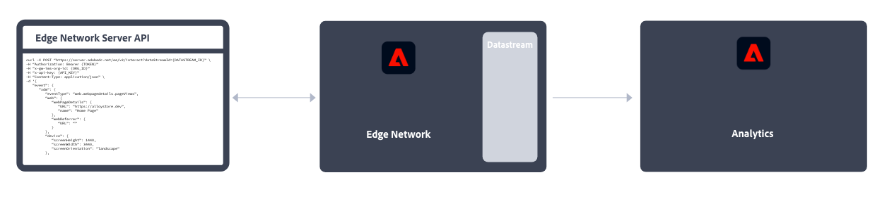

# Implementera Adobe Analytics

Adobe Analytics kräver kod på din webbplats eller i din mobilapp eller annat program för att kunna skicka data till datainsamlingsservrar. Det finns flera metoder för att implementera den här koden, beroende på plattform och organisationens behov.

## Implementeringsmetoder för webbplatser

Följande implementeringsmetoder är tillgängliga för din **webbplats**:

### Klientsidan

* **Web SDK-tillägg**: Den standardiserade och rekommenderade metoden för att implementera Adobe Analytics för nya kunder. Lägg till **Adobe Experience Platform Web SDK-tillägget** i Adobe Experience Platform Data Collection **Tags** och placera sedan en inläsartagg på varje sida. Taggen skickar data till Adobe Experience Platform **Edge Network** som vidarebefordrar dessa data till Adobe Analytics.
  
Se [Så här implementerar du Adobe Analytics med tillägget Adobe Experience Platform Web SDK.](./aep-edge/overview.md) om du vill ha mer information.

* **Web SDK**: Du kan läsa in Web SDK-bibliotek manuellt på webbplatsen om du inte vill använda Adobe Experience Platform Data Collection. Referera till Web SDK-biblioteket (`alloy.js`) på varje sida och skicka önskade spårningsanrop till Adobe Experience Platform **Edge Network** i ett format som passar din organisation. Edge Network vidarebefordrar dessa data till Adobe Analytics.
  
Mer information finns i [ Så här implementerar du Adobe Analytics med Adobe Experience Platform Web SDK ](./aep-edge/overview.md) .

* **Analystillägg**: Lägg till **Adobe Analytics-tillägget** i Adobe Experience Platform Data Collection **Tags** och placera sedan en inläsartagg på varje sida. Taggen skickar data direkt till Adobe Analytics. Använd den här implementeringsmetoden om du vill att taggar ska vara bekväma, men inte använda Edge Network-infrastrukturen.
  
Mer information finns i [ Så här implementerar du Adobe Analytics med Analytics-tillägget ](launch/overview.md) .

* **Äldre JavaScript:** Den gamla, manuella metoden för att implementera Adobe Analytics. Referera till AppMeasurementen bibliotek (`AppMeasurement.js`) på varje sida och ange sedan variabler och inställningar i JavaScript.
  
Den här implementeringsmetoden kan vara användbar för implementeringar med anpassad kod och är idealisk för implementeringstyper som inte finns någon annanstans, t.ex. för [AMP-sidor](other/amp.md).

Följande beslutsflöde kan hjälpa dig att välja en implementeringsmetod på klientsidan:

>[!TIP]
>
>Kontakta kontoteamet på Adobe för råd och bästa praxis för implementering baserat på din nuvarande situation.

### Serversidan

För att implementera Adobe Analytics serversida finns följande alternativ:

* **Edge Server-API**: Du implementerar kod på servern som använder Adobe Experience Platform Edge Server-API:t för att kommunicera med Adobe Analytics via en datastream.
  
Mer information finns i [ Implementera Adobe Analytics med API:t för Adobe Experience Platform Edge Network Server ](/help/implement/aep-edge/server-api/overview.md) .

* **(Bulk) API:t för datainfogning**: Du använder API:erna för datainmatning i Adobe Analytics (Bulk) för att samla in data på serversidan direkt till Adobe Analytics.
  
Mer information finns i [ API för datainfogning ](../import/c-data-insertion-api/c-data-insertion-api.md) .

## Implementeringsmetoder för mobilappar

Följande implementeringsmetoder är tillgängliga för din **mobilapp**:

* **Mobile SDK-tillägg**: Den standardiserade och rekommenderade metoden för att implementera Adobe Analytics i din mobilapp. Använd dedikerade bibliotek för att enkelt skicka data till Adobe inifrån mobilappen. Lägg till **Adobe Experience Platform Mobile SDK-tillägget** i Adobe Experience Platform Data Collection **Tags** och implementera sedan Mobile SDK-biblioteket i din app. Du kan använda SDK för att importera bibliotek, registrera tillägg och läsa in taggkonfigurationen. Skicka data till Adobe Experience Platform **Edge Network**; Edge vidarebefordrar sedan dessa data till Adobe Analytics.
  

  Mer information finns i [Implementera Adobe Analytics med Adobe Experience Platform Mobile SDK](../implement/aep-edge/mobile-sdk/overview.md).

* **Analystillägg**: Lägg till **Adobe Analytics-tillägget** i Adobe Experience Platform Data Collection **Tags** och implementera Mobile SDK-biblioteket i din app. Du kan använda SDK för att importera bibliotek, registrera tillägg och läsa in taggkonfigurationen. Implementeringsmetoden skickar data direkt till Adobe Analytics. Vi rekommenderar att du tar hjälp av Adobe Experience Platform Data Collection, men inte vill använda Adobe Experience Platform Edge-nätverksinfrastruktur.
  

  Mer information finns i [Implementera Adobe Analytics med Analytics-tillägget](../implement/aep-edge/mobile-sdk/overview.md).

>[!CAUTION]
>
>Mer information om stöd för äldre versioner av Adobe Mobile SDK finns i [SDK:s meddelanden om att supporten har upphört](https://developer.adobe.com/client-sdks/resources/sdks-end-of-support/).

## Viktiga artiklar om implementering av Analytics

* [Ta hand om en befintlig Adobe Analytics-implementering](/help/implement/prepare/existing-implementation.md)
* [Adobe Debugger](validate/debugger.md)
* [Skapa en taggegenskap i Experience Platform](launch/create-analytics-property.md)
* [AppMeasurement](appmeasurement-updates.md)
* [Konfigurera Adobe Analytics med Platform Web SDK, genomgång](https://experienceleague.adobe.com/docs/platform-learn/implement-web-sdk/applications-setup/setup-analytics.html)
* [Implementera Adobe Experience Cloud i mobilappar, självstudiekurs](https://experienceleague.adobe.com/docs/platform-learn/implement-mobile-sdk/overview.html)

## Viktiga Analytics-resurser

* [Kontakta kundtjänst](https://experienceleague.adobe.com/?support-solution=Analytics&amp;lang=sv#support)
* [Adobe Analytics Community på Experience League](https://experienceleaguecommunities.adobe.com/t5/adobe-analytics/ct-p/adobe-analytics-community)
* [Adobe Analytics-resurser](https://experienceleaguecommunities.adobe.com/t5/adobe-analytics-discussions/adobe-analytics-resources/m-p/276666)
* [Senaste versionsinformation](../release-notes/latest.md)
