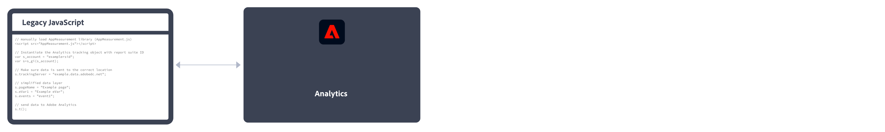

# Implementera Adobe Analytics

Adobe kräver kod på din webbplats eller i din app för att kunna skicka data till Adobes datainsamlingsservrar. Följande steg visar hur en vanlig implementering fungerar.

1. När en besökare kommer till din webbplats, skickas en begäran till din webbserver.
2. Webbplatsens webbserver skickar sidkodsinformationen och sidan visas i webbläsaren.
3. Sidan läses in och Analytics JavaScript-kod körs.
JavaScript-koden skickar en bildbegäran till Adobe datainsamlingsservrar. Siddata som du har definierat under implementeringen skickas som en del av en frågesträng i den här bildbegäran.

4. Adobe returnerar en transparent pixelbild.
5. Adobe-servrar lagrar insamlade data i en eller flera *rapportsviter*.
6. Rapportsvitens data fyller i de rapporter som du kan få åtkomst till i en webbläsare.

JavaScript-koden körs snabbt och påverkar inte sidinläsningstiden märkbart. På så sätt kan du räkna de sidor som visas när en besökare klickar på **[!UICONTROL Reload]** eller **[!UICONTROL Back]** för att komma till en sida, eftersom JavaScript-skriptet körs även när sidan hämtas från cache.

Adobe Analytics kräver kod på din webbplats eller i din mobilapp eller annat program för att kunna skicka data till datainsamlingsservrar. Det finns flera metoder för att implementera den här koden, beroende på plattform och organisationens behov.

## Implementeringsmetoder för webbplatser

För **webbplats**, finns följande implementeringsmetoder:

* **Web SDK-tillägg**: Den standardiserade och rekommenderade metoden för att implementera Adobe Analytics för nya kunder. Installera **AEP Web SDK-tillägg** i Adobe Experience Platform Data Collection **Taggar**, använder en loader-tagg på varje sida och skickar data till Adobe Experience Platform **Edge Network** i ett format som passar er. Edge Network skickar inkommande data till Adobe Analytics i rätt format.
   
Se [Implementera Adobe Analytics med tillägget Adobe Experience Platform Web SDK](./aep-edge/overview.md) för mer information.

* **Web SDK**: Du kan läsa in Web SDK-bibliotek manuellt på webbplatsen om du inte vill använda Adobe Experience Platform Data Collection. Referera till Web SDK-biblioteket (`alloy.js`) på varje sida och skicka önskade spårningsanrop till Adobe Experience Platform **Edge Network** i ett format som passar er. Edge Network skickar inkommande data till Adobe Analytics i rätt format.
   
Se [Implementera Adobe Analytics med Adobe Experience Platform Web SDK](./aep-edge/overview.md) för mer information.

* **Analystillägg**: Installera **Adobe Analytics-tillägg** i Adobe Experience Platform Data Collection **Taggar**. Placera en loader-tagg på varje sida och använd Adobe Analytics-tillägget för att bestämma hur varje variabel definieras. Använd den här implementeringsmetoden om du inte vill ha taggarnas bekvämlighet, men inte vill använda Edge Network-infrastrukturen.
   
Se [Implementera Adobe Analytics med Analytics-tillägget](launch/overview.md) för mer information.

* **Äldre JavaScript:** Den gamla, manuella metoden för att implementera Adobe Analytics. Referera till AppMeasurement-biblioteket (`AppMeasurement.js`) på varje sida och sedan ange variabler och inställningar som används i en implementering.
   
Den här implementeringsmetoden kan vara användbar för implementeringar med anpassad kod och rekommenderas fortfarande när du (vill) använder:

   * [aktivitetskarta på klicknivå](../analyze/activity-map/activity-map.md),

   * [mätning av direktuppspelningsmedia](https://experienceleague.adobe.com/docs/media-analytics/using/media-overview.html?lang=en),

   * [livs-API eller djurutlösare](https://github.com/AdobeDocs/analytics-1.4-apis/blob/master/docs/live-stream-api/getting_started.md),

   * [Spårning av AMP-sidor](./other/amp.md)
   Se [Implementera Adobe Analytics med AppMeasurement for JavaScript](js/overview.md) för mer information.

Följande beslutsflöde kan hjälpa dig att välja en implementeringsmetod:

>[!TIP]
>
>Kontakta Adobe för råd och bästa praxis om vilken implementering som ska väljas baserat på din nuvarande situation.

## Implementeringsmetoder för mobilappar

För **mobilapp**, finns följande implementeringsmetoder:

* **Mobile SDK-tillägg**: Den standardiserade och rekommenderade metoden för att implementera Adobe Analytics i din mobilapp. Använd dedikerade bibliotek för att enkelt skicka data till Adobe inifrån mobilappen. Installera **Adobe Experience Platform Mobile SDK-tillägg** i Adobe Experience Platform Data Collection **Taggar** och implementera rätt kod i appen för att importera bibliotek, registrera tillägg och läsa in taggkonfigurationen. Detta skickar data till Adobe Experience Platform **Edge Network** i ett format som passar er. Experience Edge vidarebefordrar inkommande data till Adobe Analytics i rätt format.
   

   Se [Implementera Adobe Analytics med Adobe Experience Platform Mobile SDK](../implement/aep-edge/mobile-sdk/overview.md) för mer information.

* **Analystillägg**: Installera **Adobe Analytics-tillägg** i Adobe Experience Platform Data Collection **Taggar**och implementera rätt kod i programmet för att importera bibliotek, registrera tillägg och läsa in taggkonfigurationen. Använd Analytics-tillägget för att bestämma hur varje variabel definieras. Använd den här implementeringsmetoden om du vill ha Adobe Experience Platform Data Collection, men inte vill använda Adobe Experience Platform Edge-nätverksinfrastruktur.
   

   Se [Implementera Adobe Analytics med Analytics-tillägget](../implement/aep-edge/mobile-sdk/overview.md) för mer information.

>[!CAUTION]
>
>Stöd för version 4 Mobile SDK upphörde den 31 augusti 2021. Mer information finns i [Vanliga frågor om att supporten ska upphöra för SDK:er för version 4 för mobila enheter](https://developer.adobe.com/client-sdks/documentation/v4-end-of-life-faq/).

## Viktiga artiklar om implementering av Analytics

* [Ta hand om en befintlig Adobe Analytics-implementering](/help/implement/prepare/existing-implementation.md)
* [Adobe Debugger](validate/debugger.md)
* [Skapa en taggegenskap i Experience Platform](launch/create-analytics-property.md)
* [AppMeasurement-uppdateringar](appmeasurement-updates.md)

## Fler användarhandböcker för Analytics

[Användarhandböcker för Analytics](https://experienceleague.adobe.com/docs/analytics.html)

## Viktiga Analytics-resurser

* [Kontakta kundtjänst](https://experienceleague.adobe.com/?support-solution=Analytics&amp;lang=sv#support)
* [Analytics-forum](https://experienceleaguecommunities.adobe.com/t5/adobe-analytics/ct-p/adobe-analytics-community)
* [Adobe Analytics-resurser](https://experienceleaguecommunities.adobe.com/t5/adobe-analytics-discussions/adobe-analytics-resources/m-p/276666)
