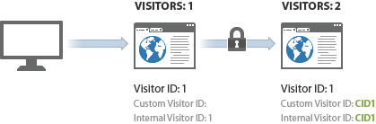

# Exempel på identifiering av besökare på olika enheter

>[!IMPORTANT]
>
>Den här metoden för att identifiera besökare på olika enheter rekommenderas inte längre. Se [Enhetsövergripande analys](/help/components/cda/overview.md) i användarhandboken för komponenter.

Följande exempel visar hur identifieringen av besökare på olika enheter fungerar med ett exempel på serversamtal som skickas i en gemensam kundinteraktion.

| Serversamtal | Åtgärd | Cookie för besökar-ID | Variabel för besökar-ID | Gällande besökar-ID | Besök sidnummer | Besök nummer |
|--- |--- |--- |--- |--- |--- |--- |
| 1 | En besökare klickar på en länk i ett marknadsföringsmejl och besöker er webbplats från hemdatorn. Den här besökaren har besökt din webbplats 7 gånger tidigare. | 1 | - | 1 | 1 | 8 |
| 2-8 | Besök ytterligare 7 sidor på din webbplats. | 1 | - | 1 | 2-8 | 8 |
| 9 | Autentiserar på hemdator. | 1 | CID1 | CID1 | 9  (Detta är CID1:s första träff någonsin, så det tar över och fortsätter på besökarprofilen från besökar-ID 1.) | 8 |
| 10 | Besök ytterligare 1 sida. | 1 | CID1 | CID1 | 10 | 8 |
| 11 | Öppnar webbplatsen från den bärbara datorn på kontoret. Den här besökaren har inte besökt din webbplats innan den här enheten användes. | 2 | - | 2 | 1 | 1 |
| 12 | Autentiserar på bärbar dator. | 2 | CID1 | CID1 | 1 | 9 |
| 13 | Vyer 1 sida till. | 2 | CID1 | CID1 | 2 | 9 |

## Besök inventeringen

Analytics räknar med ett besök varje gång de får en träff med ett besökssidnummer som är lika med 1.

I tabellen ovan räknades ett nytt besök fyra gånger: på träffar 1, 9, 11 och 12.

## Besökarinventering

Analyser räknar varje unikt effektivt besökar-ID som en unik besökare.

Med tabellen ovan räknades en ny besökare tre gånger: på träffar 1, 9 och 10.

När du använder besöksidentifiering på olika enheter kan antalet unika besökare som du ser öka. Besökaren kan räknas två gånger vid samma besök: en gång för det första besöket och en gång till efter att användaren har autentiserats.

Efter den första associationen återgår antalet besök till det normala eftersom besökaren är kopplad via sin webbläsarcookie. Om besökaren senare visar din webbplats och sedan autentiserar, fylls besökarantalet inte i eftersom det faktiska besökar-ID:t inte ändras efter autentiseringen.

Se till att ni är så enhetliga som möjligt när ni identifierar unika besökare. Använd till exempel alltid `visitorID` variabel när användaren autentiseras.
