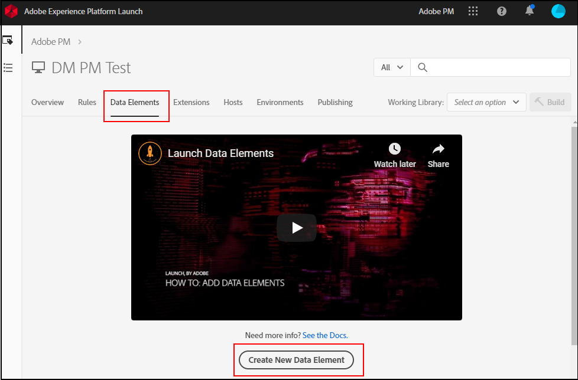

# Mappa datalagerobjekt till dataelement

När organisationen har etablerat och implementerat ett datalager på webbplatsen kan du mappa datalagerobjekt till dataelement inom taggar.

## Förutsättningar

[Skapa ett datalager](../prepare/data-layer.md): Kontrollera att det finns ett datalager på platsen. Även om du tekniskt kan mappa ett JavaScript-objekt eller skrapa CSS-element direkt från sidan, rekommenderar Adobe att detta görs som en sista utväg. Om platslayouten ändras slutar de CSS-väljare som används i -taggar att fungera, vilket orsakar dataförlust.

## Använd taggar för att skapa dataelement

[Dataelement](https://experienceleague.adobe.com/docs/experience-platform/tags/ui/data-elements.html) är komponenter i Adobe Experience Platform Data Collection som du kan använda i hela verktyget. Du kan tilldela variabelvärden i Adobe Analytics-tillägget med dataelement.

1. Logga in på [Adobe Experience Platform Data Collection](https://experience.adobe.com/data-collection) med inloggningsuppgifterna för ditt AdobeID.
1. Klicka på den önskade taggegenskapen.
1. Klicka på **[!UICONTROL Data Elements]** tabbtangenten och sedan klicka **[!UICONTROL Add Data Element]**.

   

1. Ange ett namn för dataelementet. Det kan vara en enkel etikett som motsvarar en JavaScript-variabel i datalagret som du vill spåra.
1. Under **[!UICONTROL Extension]** nedrullningsbar lista, välja **[!UICONTROL Core]**.
1. Under **[!UICONTROL Data Element Type]** nedrullningsbar lista, välja **[!UICONTROL JavaScript Variable]**. Ett textfält visas till höger där du kan ange JavaScript-variabeln som ska mappas till det här dataelementet.
1. Ange önskad JavaScript-variabel, vanligtvis i datalagret. Om t.ex. din organisations datalager överensstämmer med den praxis som rekommenderas av Adobe kan ett värde vara `digitalData.page.pageInfo.pageName`. Du kan använda webbläsarens konsol för att validera JavaScript-variabelsyntax och -värden.
1. Klicka på **[!UICONTROL Save]**.

## Nästa steg

[Mappa dataelement till analysvariabler](elements-to-variable.md): Tilldela dataelement till Analytics-variabler så att ni kan använda dem som dimensioner i Analysis Workspace.
