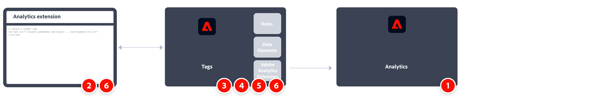

# Implementera Adobe Analytics med Analytics-tillägget

Under Adobe Analytics livstid har Adobe erbjudit flera olika metoder för att implementera kod på er webbplats för datainsamling. Den rekommenderade metoden för Adobe är via taggar i Adobe Experience Platform.

Taggar i Adobe Experience Platform är en tagghanteringslösning som gör att ni kan driftsätta Analytics-kod tillsammans med andra taggningskrav. Adobe erbjuder integreringar med andra lösningar och produkter och låter er driftsätta anpassad kod. Alla dessa uppgifter kan utföras utan att någon utvecklingsteam i organisationen behöver uppdatera koden på er webbplats.

Alla kunder som har ett aktivt Adobe Experience Cloud-kontrakt kan använda taggar. Om du är osäker på om du har åtkomst kan du kontakta någon av Experience Cloud systemadministratörerna i din organisation.

Översikt över implementeringsuppgifterna:

|

| Aktivitet | Mer information | |-| —|—| | 1 | Kontrollera att du har **har definierat en rapportserie**. | [Report Suite Manager](../../admin/admin/c-manage-report-suites/report-suites-admin.md) | | 2 | **Skapa ett datalager** för att hantera spårning av data på din webbplats. | [Skapa ett datalager](../prepare/data-layer.md) | | 3 | **Skapa en taggegenskap**. Egenskaper är överliggande behållare som används för att referera till tagghanteringsdata.| [Skapa en Adobe Analytics-taggegenskap](../launch/create-analytics-property.md) | | 4 | **Installera Analytics-tillägget** i taggegenskapen. Konfigurera Analytics-tillägget för att skicka data till Adobe Analytics. | [Översikt över Adobe Analytics-tillägg](https://experienceleague.adobe.com/docs/experience-platform/tags/extensions/client/analytics/overview.html?lang=en) | | 5 | **Distribuera till en utvecklingsmiljö**. Ha en miljö där du kan iterera om taggutveckling. | [Distribuera en analysimplementering till en utvecklingsmiljö](./deploy-dev.md) | | 6 | **Validera och publicera i produktion**. Lägg till taggegenskapen på din webbplats. Använd sedan dataelement, regler och så vidare för att anpassa implementeringen.| [Validera en utvecklingsimplementering och publicera till produktion](./validate-publish-prod.md) |

## Ytterligare resurser

Taggar kan anpassas mycket. Läs mer om hur du får ut mesta möjliga av Adobe Analytics genom att inkludera rätt data i implementeringen.

- [Dokumentation för taggar](https://experienceleague.adobe.com/docs/experience-platform/tags/home.html#): Lär dig hur gränssnittet fungerar och vilka tillägg som är tillgängliga.

- [Implementeringsvariabler](../vars/overview.md): Avgör vilka variabler du vill skicka till datainsamlingsservrar.
