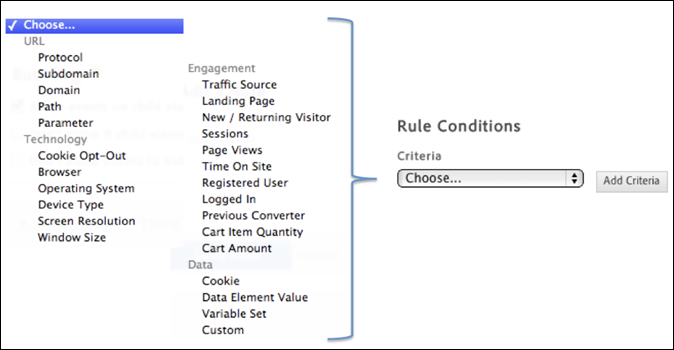

# Skapa villkor för händelsebaserade regler

Villkoren avgör när en händelsebaserad regel aktiveras.

1. Välj vilken typ av interaktion du vill spåra, till exempel musklick, eller skicka ett formulär.

   

   Mer information finns i [Händelsetyper](https://marketing.adobe.com/resources/help/en_US/dtm/event_types.html) i produktdokumentationen för Adobe Tag Management.

1. Aktivera följande alternativ efter behov:

   | Element | Beskrivning |
   |--- |--- |
   | Fördröj länkaktivering | Aktivera om händelsen aktiverar en länk och du vill att länken ska fördröjas tills händelsen får tid att utlösas. |
   | Tillämpa händelsehanterare direkt på elementet | Tillämpar händelsehanteraren på det specifika element som är mål. Den här inställningen är kopplad till bubblings- och lagerkonceptet i en webbläsare. |

   Om du till exempel klickar på en bild inuti en ankartagg som ``kanske du förväntar dig att klickningen kopplas till ankartaggen, eftersom taggen finns i bubbelströmmen. När du inspekterar klickningen i utvecklingsverktygen kan det dock hända att klickningen bara påverkar `` taggen. Om du vill vara säker på att händelsen hanteras korrekt associerar du klickningen med `` -taggen och är inte beroende av webbläsaren för att bubbla upp klickningen till ett överordnat element. En händelse som en klickning kan eventuellt bubbla upp till `<body>`. Det är viktigt att förstå var händelsen verkligen är bunden och inrikta den specifikt för att se till att regeln utlöses korrekt.

   *Bubbling* innebär att händelsen först fångas in och hanteras av elementet längst in och sedan sprids till yttre element.

1. Ange namnet på taggen som du vill spåra och ytterligare egenskaper som taggen har som du vill matcha.

   

   Mer information om hur du hittar rätt elementtagg finns i [Använda CSS-väljaren](https://marketing.adobe.com/resources/help/en_US/dtm/css-selector.html) i produktdokumentationen för dynamisk tagghantering.

1. Välj och ange eventuella ytterligare villkor eller villkorstyper som du vill binda till regeln.

   

1. Ange din inställning för händelsebubbling.

   Händelsebubbling är ett sätt att sprida händelser i HTML DOM.

   | Om du.. | Markera det här alternativet |
   |--- |--- |
   | Vill ha relaterade interaktioner på underordnade element för regelväljaren som du identifierade för att utlösa regeln. | Tillåt att händelser för underordnade element bubblar. |
   | Vill förhindra bubbling när det underordnade elementet redan utlöser sin egen händelse. | Tillåt inte om det underordnade elementet redan utlöser en händelse. |
   | Vill inte att händelserna för regelväljaren som du identifierade ska gå utanför själva elementet i händelsehierarkin. | Tillåt inte att händelser bubblar uppåt till föräldrar. |
