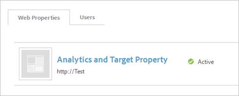

# Implementera Adobe Analytics manuellt (äldre)

Skapa ett Adobe Analytics-verktyg för distribution med [!UICONTROL Dynamic Tag Management]. Den här proceduren beskriver en manuell (äldre) implementering.

Mer information om automatisk implementeringshantering finns i [Lägg till Adobe Analytics Tool](/help/implement/other/dtm/c-aa-tool/analytics-dtm.md).

Om du vill ändra en manuell konfiguration till automatisk redigerar du ett verktyg och klickar på **[!UICONTROL Enable Automatic Configuration]**.

1. Hämta Analytics-mätningskod:
   1. Klicka på **[!UICONTROL Admin]** > **[!UICONTROL Code Manager]** i Analytics.
   1. Klicka **[!UICONTROL JavaScript (new)]** för att hämta koden lokalt.
1. I [!UICONTROL Dynamic Tag Management][skapar du en webbegenskap](/help/implement/other/dtm/t-create-web-property.md).

   

   När du har skapat webbegenskapen kan du redigera den på [!UICONTROL Web Properties] fliken på [!UICONTROL Dashboard]. Du behöver inte aktivera webbegenskapen.

1. Lägg till ett analysverktyg till egenskapen:
   1. Klicka på egenskapen på **[!UICONTROL Web Properties]** fliken.
   1. On the **[!UICONTROL Overview]** tab, click **[!UICONTROL Add a Tool]**.
   1. Välj på **[!UICONTROL Tool Type]** menyn **[!UICONTROL Adobe Analytics]**.

      

   1. Konfigurera följande fält:

      | Element | Beskrivning |
      |---|---|
      | Verktygstyp | Experience Cloud-lösningen, till exempel Analytics, Target, Social och så vidare. |
      | Verktygsnamn | Namnet på det här verktyget. Det här namnet visas på [!UICONTROL Overview] fliken under [!UICONTROL Installed Tools]. |
      | Produktionskonto-ID | Ett nummer för produktionskontot för datainsamling. Med Dynamic Tag Management installeras automatiskt rätt konto i produktions- och mellanlagringsmiljön. |
      | ID för mellanlagringskonto | Ett tal som används i utvecklings- eller testmiljön. Ett mellanlagringskonto håller testdata åtskilda från produktionen. |

1. Klicka på **[!UICONTROL Create Tool]**.

   Det installerade verktyget visas på [!UICONTROL Overview] fliken.

1. Konfigurera koden genom att klicka på **[!UICONTROL Settings]** .

   Klicka på **[!UICONTROL Cookies]** och konfigurera spårningsservern och SSL-spårningsservern.

1. Klicka **[!UICONTROL General]** och [infoga AppMeasurement-kärnkoden](/help/implement/other/dtm/c-aa-tool/t-appmeasurement-code.md).
1. Definiera en [sidinläsningsregel](/help/implement/other/dtm/c-rules/t-rules-create.md) för att samla in [!DNL Analytics]data.

   Du är nu redo att definiera regler för att samla in analysdata. Du kanske vill definiera några dataelement först. Med dataelement kan du extrahera data från sidan som du kan använda för att konfigurera regeln. För att komma igång kan du definiera en sidinläsningsregel som inte har några villkor för att samla in [!DNL Analytics] data på varje sida.
1. [Lägg till sidhuvuds- och sidfotskoden](/help/implement/other/dtm/c-headers-footers/t-header-footer-code.md) på fliken Bädda in.

   För testmiljöer kan du lämna standardvärdalternativet för Amazon. Du kan ändra den om det behövs innan produktionen lanseras.
1. (Valfritt) Klicka på **[!UICONTROL Settings]**  fliken Alternativ och konfigurera Adobe Analytics-koden.

   >[!NOTE]
   >
   >Inställningarna på [!UICONTROL Adobe Analytics] sidan (Allmänt, Cookies och så vidare) åsidosätter inställningarna i din `s_code`. Om dessa inställningar finns i din `s_code`webbplats behöver du inte upprepa dem här.

