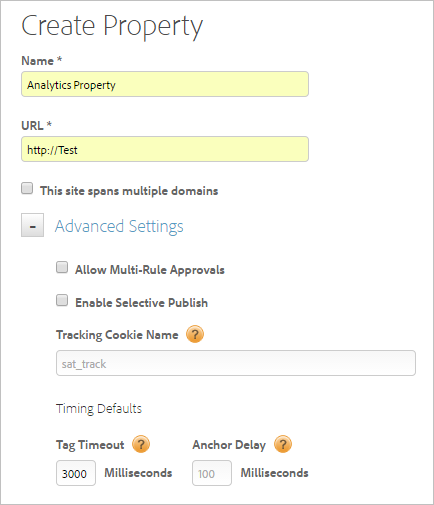

# Skapa webbegenskap

En webbegenskap kan vara vilken gruppering som helst av en eller flera domäner och underdomäner med ett regelbibliotek, som ingår i en inbäddningskod.

>[!NOTE]
>
>Endast en användare med administratörsbehörighet kan skapa en egenskap. Mer information om roller finns i [Skapa och hantera grupper i DTM](https://docs.adobe.com/content/help/en/dtm/using/admin/groups.html) i produktdokumentationen för Dynamic Tag Management.

Du kan hantera och spåra dessa resurser med DTM. Anta till exempel att du har flera webbplatser som är baserade på en mall och vill spåra samma resurser på alla dessa webbplatser. Du kan använda en webbegenskap på flera domäner.

Allmän information om webbegenskaper och metodtips finns i [Webbegenskaper](https://docs.adobe.com/content/help/en/dtm/using/admin/web-property.html) i produktdokumentationen för Dynamic Tag Management.

1. Navigera till din företagssida och klicka sedan på **[!UICONTROL Add Property]**.

   

1. Fyll i fälten:

   <table id="table_376D72251C4D4C4CA878D10C18D2532C"> 
    <thead> 
    <tr> 
    <th colname="col1" class="entry"> Element </th> 
    <th colname="col2" class="entry"> Beskrivning </th> 
    </tr> 
    </thead>
    <tbody> 
    <tr> 
    <td colname="col1">  Namn </td> 
    <td colname="col2"> 
Namnet på din egenskap. 
 </td> 
    </tr> 
    <tr> 
    <td colname="col1">  URL </td> 
    <td colname="col2"> 
Egenskapens bas-URL. 
 </td> 
    </tr> 
    <tr> 
    <td colname="col1">  Den här webbplatsen sträcker sig över flera domäner   </td> 
    <td colname="col2"> 
Du kan lägga till och ta bort domäner om du vill att besöksdata ska finnas kvar mellan domäner. Om det här alternativet är markerat kvarstår data för besöket i alla underdomäner. 
 
Med den här inställningen kan du ange hur du vill spåra trafik mellan dina associerade underdomäner eller domäner. Länkar till underdomäner behandlas som utgående länkar. Besök i underdomäner spåras separat. 
 </td> 
    </tr> 
    </tbody> 
    </table>

1. (Valfritt) Konfigurera [!UICONTROL Advanced Settings].

   <table id="table_6E687FBE6ACC4301BCCD837F4DCBB9C9"> 
    <thead> 
    <tr> 
    <th colname="col1" class="entry"> Element </th> 
    <th colname="col2" class="entry"> Beskrivning </th> 
    </tr> 
    </thead>
    <tbody> 
    <tr> 
    <td colname="col1">  Tillåt godkännande av flera regler </td> 
    <td colname="col2"> 
Tillåter flera regler för den här egenskapen att godkännas samtidigt. Standardgodkännandet tillåter endast godkännande med en regel. 
 </td> 
    </tr> 
    <tr> 
    <td colname="col1">  Aktivera selektiv publicering </td> 
    <td colname="col2"> 
Anger om användare ska kunna välja vilka godkända regler som ska publiceras. Det här är standardalternativet. 
 </td> 
    </tr> 
    <tr> 
    <td colname="col1">  Spårning av cookie-namn </td> 
    <td colname="col2"> 
Åsidosätter standardnamnet på spårningskakan. Du kan anpassa namnet som används i Dynamic Tag Management för att spåra din avanmälningsstatus för att ta emot andra cookies. 
 </td> 
    </tr> 
    <tr> 
    <td colname="col1">  Timeout för tagg </td> 
    <td colname="col2"> 
Anger hur länge Dynamic Tag Management väntar på att en tagg ska utlösas innan timeout inträffar och taggbegäran avbryts. 
 
 På grund av hur Dynamic Tag Management fungerar behöver du inte bekymra dig om att detta är ett högt antal. DTM har effektiva metoder som säkerställer att långsamma taggar inte påverkar användarupplevelsen. 
 </td> 
    </tr> 
    <tr> 
    <td colname="col1">  Fördröjning för ankarpunkt </td> 
    <td colname="col2"> 
Anger hur länge Dynamic Tag Management väntar på att taggar ska aktiveras på klickade länkar innan de flyttas till nästa sida. Standardvärdet är 100 millisekunder. 
 
Längre fördröjningar ger bättre spårbarhet. Adobe rekommenderar en fördröjning på 500 millisekunder eller mindre, som användaren inte kommer att uppfatta. 
 
Dynamisk tagghantering väntar upp till den angivna tiden, men om beacon utlöses tidigare förkortas fördröjningen. (Det innebär att användaren inte alltid väntar hela fördröjningen.) 
 </td> 
    </tr> 
    </tbody> 
    </table>

1. Klicka på **[!UICONTROL Create Property]**.
