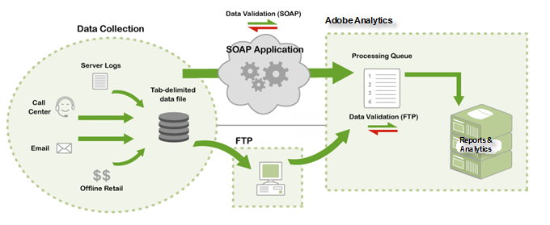

# Så fungerar datakällor

Information om hur Adobe ger åtkomst till datakällor.

> [!NOTE] När importerade data har skickats via datakällorna kan de inte särskiljas från rapportdata som samlats in med andra metoder (JavaScript-fyr, ActionSource, API för datainfogning osv.). Du kan inte ta bort data när de har importerats.

Det finns två metoder för att skicka data:

* [FTP](/help/import/c-data-sources/datasrc-how-data-sources-works.md#section_0E70022648F94061AF5B4AD6C7145243)
* [API](/help/import/c-data-sources/datasrc-how-data-sources-works.md#section_65DACC9CE00C437BBFDD02D19C25A4BD)

## FTP {#section_0E70022648F94061AF5B4AD6C7145243}

Du kan skapa och hantera FTP-baserade datakällor med hjälp av marknadsföringsrapporter, som använder FTP-filöverföring för att importera datafiler till datakällor. När du har skapat en datakälla får du en FTP-plats som du kan använda för att överföra datakällfiler. När datakällorna har överförts hittas och bearbetas de automatiskt av datakällor. När uppgifterna har bearbetats finns de tillgängliga för marknadsföringsrapporter.

## API {#section_65DACC9CE00C437BBFDD02D19C25A4BD}

Adobe erbjuder ett API för datakällor som gör att du kan koppla program till datakällor via programmering. Detta eliminerar behovet av en mellanliggande FTP-server och överför data via HTTP, SOAP och REST.

Se API-dokumentation för [datakällor](https://github.com/AdobeDocs/analytics-1.4-apis/tree/master/docs/data-sources-api).
