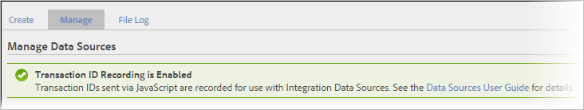

# Transaktions- och kundintegrering

Datakällor erbjuder två ytterligare sätt att integrera händelser som inträffar offline i dina onlinedata.

* [Aktivera registrering av transaktions-ID](/help/import/c-data-sources/datasrc-integrating-offline-data.md#section_30D6D47AEC0F4A36B87EBFE4C858F20C)
* [Transaktionsintegrering](/help/import/c-data-sources/datasrc-integrating-offline-data.md#section_B3F281CEFF9B47E9A07F9851D61D415D)
* [Kundintegrering](/help/import/c-data-sources/datasrc-integrating-offline-data.md#section_9F4AAD710D2543BDA834090A98115FBF)

Dessa integreringar kopplar offlinedata till en specifik onlinetransaktion eller till en onlinebesökare.

## Aktivera registrering av transaktions-ID {#section_30D6D47AEC0F4A36B87EBFE4C858F20C}

Transaktions-ID kan aktiveras/inaktiveras från användargränssnittet utan att ClientCare behöver aktiveras:

Gå till **[!UICONTROL Admin]** > **[!UICONTROL Report Suites]** > Välj rapportserie > **[!UICONTROL Edit Settings]** > **[!UICONTROL General]** > **[!UICONTROL General Account Settings]**.

<!-- 

When contacting Customer Care, be prepared to provide the following information: 
 
<ul id="ul_C425C7A074484650AFCCF0425E8E3F47"> 
 <li id="li_7640C0C4DF0C49749A3C37E5461DC22F">Report Suite ID of the data source for which you need transaction ID recording enabled. 
In Data Sources, the report suite ID is the first part of the login appended by a random number that identifies the specific data source that was set up. For example, <code> RSID-drmossdev5 Login-drmossdev5_0001343430</code>. 
 </li> 
 <li id="li_4FB0E3EC7BE94A2DBEE9063365A71C9C">The Transaction ID expiration window (described in <a href="/help/import/c-data-sources/datasrc-tid-visitor-profile.md"  > Transaction ID and Visitor Profiles</a>). By default this is 90 days, but it can be extended to up to 2 years. </li> 
</ul>

 -->

Om du vill se om registrering av transaktions-ID är aktiverat går du till **[!UICONTROL Analytics]** > **[!UICONTROL Admin]** > **[!UICONTROL All admin]** > **[!UICONTROL Data sources]**.

The [!UICONTROL Manage] fliken visar status för registrering av transaktions-ID.

## Kundintegrering {#section_9F4AAD710D2543BDA834090A98115FBF}

Kund-ID:n används för att ange en kunds offlineaktivitet och koppla den till onlineaktiviteten. Dessa bör användas när:

* Ett kund-ID fylls i i *`visitorID`* variabel.
* Det finns ingen plats där kundaktiviteten flyttas offline, som att skicka eller köpa leads.

Information om hur du konfigurerar den här typen av datakälla finns i [Besökar-ID](/help/import/c-data-sources/c-datasrc-types/datasrc-visitorid.md)

## Transaktionsintegrering {#section_B3F281CEFF9B47E9A07F9851D61D415D}

Transaktions-ID:n används för att registrera en besökares tillstånd vid en tidpunkt. Dessa bör användas när kunderna normalt flyttar sin upplevelse från online till offline, till exempel:

* Skicka ett lead så att en säljare kan kontakta kunden.
* Köper online, vilket senare kan returneras i butiken.
* Köper en produkt som de senare kanske behöver support för.

Kunden är ofta anonym när de går från online till offline.

Transaktions-ID-händelser ingår inte i statistik om besöks deltagande (de som visas i marknadsföringsrapporter). Detta beror på att transaktions-ID-data inte är kopplade till ett besök (eftersom offline-händelsen vanligtvis inte är en del av online-händelsen), men är kopplad till besökaren.

Se [Transaktions-ID](/help/import/c-data-sources/c-datasrc-types/datasrc-transactionid.md).
