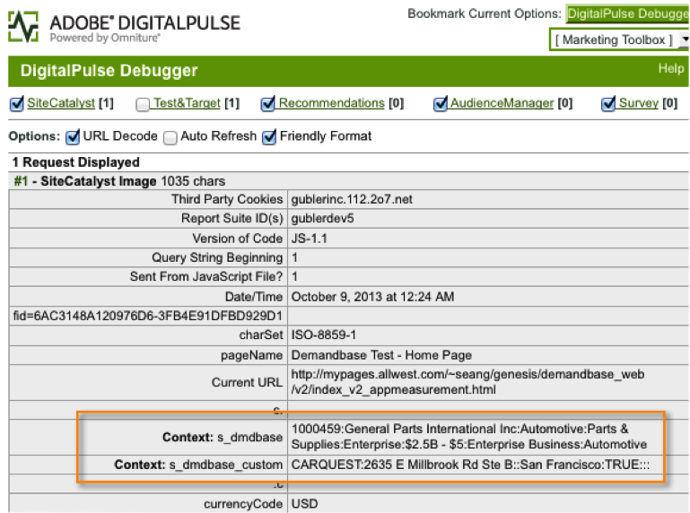

# Distribuera integreringen{#deploying-the-integration}

Distribuering av den här integreringen är en enkel process som kräver följande åtgärder.

## Slutför Adobe Integration Wizard{#completing-the-adobe-integration-wizard}

Om du vill aktivera integreringen måste du slutföra konfigurationsguiden i gränssnittet för Data Connectors.

1. Navigera till området Data Connectors (tidigare Genesis) i Adobe Experience Cloud.
1. Starta integreringsguiden för Demandbase 2.0.
1. Välj önskad Report Suite och ge integreringen ett namn.
1. Konfigurera följande objekt:

<table id="table_8D60DC7C48C144DC9934749E7F9F65FF"> 
 <thead> 
  <tr> 
   <th colname="col1" class="entry"> Objekt </th> 
   <th colname="col2" class="entry"> Beskrivning </th> 
  </tr>
 </thead>
 <tbody> 
  <tr> 
   <td colname="col1"> E-postadress </td> 
   <td colname="col2"> Den primära kontaktens e-postadress. </td> 
  </tr> 
  <tr> 
   <td colname="col1"> Beskrivning </td> 
   <td colname="col2"> (Valfritt) Beskrivning av den här integrationsinställningen. </td> 
  </tr> 
  <tr> 
   <td colname="col1"> API-nyckel för Demandbase </td> 
   <td colname="col2"> Du kan få detta från din Demandbase-representant. </td> 
  </tr> 
  <tr> 
   <td colname="col1"> Anpassad Demandbase-dimension #N </td> 
   <td colname="col2"> Detta är ID:n för de åtta valfria dimensionerna. Mer information finns i Anpassade dimensioner för Demandbase. </td> 
  </tr> 
  <tr> 
   <td colname="col1"> Skicka till Adobe Target </td> 
   <td colname="col2">Om värdet är "true" skickas Demandbase-dimensionerna också till Adobe Target med en dold mbox. <p>Obs!  En konfigurerad mbox.js-fil måste implementeras på webbsidan för att dimensionerna ska samlas in. </p> </td> 
  </tr> 
 </tbody> 
</table>

1. Konfigurera följande variabelmappningsobjekt:

   | Objekt | Beskrivning |
   |---|---|
   | Demandbase-dimensioner | Välj en tillgänglig eVar-variabel från rapportsviten. |
   | Anpassade dimensioner för Demandbase (tillval) | Välj en tillgänglig eVar-variabel från rapportsviten. |

1. Konfigurera namnen för den anpassade dimensionen (om tillämpligt).

   1. Om du valde att inkludera anpassade dimensioner i steg 4 och mappade den valfria eVar i steg 5, måste du ange egna namn för de dimensionerna. Om du till exempel väljer att ange &quot;stock_ticker&quot; som Egen dimension 1, bör du ändra rutan som innehåller &quot;Dimension 1&quot; till &quot;Stock Ticker&quot;.
   1. Ändra **INTE** namnen på de 8 standarddimensionerna (dvs. Demandbase SID, företagsnamn, bransch osv.).

1. Markera rutan om du vill att kontrollpanelen för integrering av Demandbase ska skapas automatiskt (rekommenderas).
1. Granska alla konfigurationsobjekt och klicka på **[!UICONTROL Activate Now]**.

## Distribuera integreringskoden{#deploying-the-integration-code}

När du har slutfört integreringsguiden måste du distribuera integreringskoden till din Adobe Analytics-distributionskod (s_code).

> [!NOTE] Om du använde Adobe TagManager eller Dynamic Tag Management för att distribuera Adobe Analytics kan du enkelt lägga till integreringskoden med något av dessa verktyg.

1. Gå till **[!UICONTROL Support]** fliken och hämta och spara `integration code v2_0_1` resursen från resursområdet i integreringen.

1. Gör eventuella nödvändiga ändringar i koden. Mer information finns i Ändra integreringskoden (på den här sidan).
1. Inkludera integreringsmodulen om den inte redan finns i din Adobe Analytics-distributionskod.
1. Distribuera koden på något av följande sätt:

   * Lägg till koden med Adobe TagManager eller Dynamic Tag Management.
   * Eller leverera koden till den organisationsresurs som ansvarar för att uppdatera din Adobe Analytics-distributionskod.

>[!IMPORTANT]
>
>Kontrollera att du testar distributionen för den här integreringen i en utvecklings-/staging-miljö innan du distribuerar den till en produktionsmiljö.

## Ändra integreringskoden{#modifying-the-integration-code}

I de flesta fall behöver du inte göra några ändringar i integreringskoden som skapas av guiden för dataanslutning.

Om du behöver göra justeringar beskrivs dock några av kodinställningarna nedan.

<table id="table_5405A73CEFD44466B3C39559F4A037C9"> 
 <thead> 
  <tr> 
   <th colname="col1" class="entry"> Kodinställning </th> 
   <th colname="col2" class="entry"> Beskrivning </th> 
  </tr>
 </thead>
 <tbody> 
  <tr> 
   <td colname="col1"> s.maxDelay </td> 
   <td colname="col2">Maximalt antal millisekunder som Adobe Analytics-bildbegäran ska vänta på Demandbase-data innan den skickas till analyssamlingsservern. <p>Obs!  Den här inställningen gäller för alla integreringar som kan köras via Integrate-modulen. </p> </td> 
  </tr> 
  <tr> 
   <td colname="col1"> db.tangent </td> 
   <td colname="col2"> Din API-nyckel för Demandbase. </td> 
  </tr> 
  <tr> 
   <td colname="col1"> db._apiURL </td> 
   <td colname="col2"> URL-mallen för Demandbase API. </td> 
  </tr> 
  <tr> 
   <td colname="col1"> db._delim </td> 
   <td colname="col2"> Avgränsaren som används för att separera Demandbase-dimensionsvärden när de skickas till Adobe Analytics. Om du ändrar den här inställningen kan det medföra att klassificeringsreglerna inte fungerar som de ska. </td> 
  </tr> 
  <tr> 
   <td colname="col1"> db._setTnt </td> 
   <td colname="col2">Om värdet är true försöker integreringskoden använda en dold mbox för att skicka Demandbase-dimensionerna till Adobe Target som profilparametrar. <p>Obs!  Detta kräver att koden mbox.js finns på sidan. </p> </td> 
  </tr> 
  <tr> 
   <td colname="col1"> db._tntVarPrefix </td> 
   <td colname="col2"> Strängen läggs till varje namn på Demandbase-dimensionen innan den skickas till Adobe Target. Om den här inställningen har värdet "db_" skickas dimensionen "industry" till Adobe Target som "db_industry". </td> 
  </tr> 
  <tr> 
   <td colname="col1"> db._dimensionsArray </td> 
   <td colname="col2"> De standardmått för Demandbase som skickas till Adobe Analytics. Du bör inte ändra den här inställningen. Egenskapen max_size är antalet tillåtna tecken för dimensionen innan trunkering sker. </td> 
  </tr> 
  <tr> 
   <td colname="col1"> db._dimensionsArrayCustom </td> 
   <td colname="col2"> De anpassade Demandbase-dimensionerna som skickas till Adobe Analytics. Egenskapen max_size är antalet tillåtna tecken för dimensionen innan trunkering sker. </td> 
  </tr> 
  <tr> 
   <td colname="col1"> db._cName </td> 
   <td colname="col2"> Namnet på den sessionscookie som används för att behålla tillståndet för Demandbase API-kommunikationen. </td> 
  </tr> 
  <tr> 
   <td colname="col1"> db._contextName </td> 
   <td colname="col2"> Namnet på variabeln contextData som används för att skicka standarddimensionerna till Adobe Analytics. Du bör inte ändra den här inställningen. </td> 
  </tr> 
  <tr> 
   <td colname="col1"> db._contextNameCustom </td> 
   <td colname="col2"> Namnet på variabeln contextData som används för att skicka anpassade dimensioner till Adobe Analytics. Du bör inte ändra den här inställningen. </td> 
  </tr> 
 </tbody> 
</table>

## Inkludera integreringsmodulen{#including-the-integrate-module}

Integrationskoden kräver att Integrate Module finns i Adobe Analytics-distributionen.

Om du inte redan har Integrate Module som en del av distributionen utför du följande steg beroende på vilken typ av implementering du har.

### För AppMeasurement v1.0+ {#section-f28d090bf2404cabaae34cd9c66fc575}

1. Zippa upp zip-filen AppMeasurement som du har laddat ned från **[!UICONTROL Analytics]** > **[!UICONTROL Admin]** > **[!UICONTROL CodeManager]**.

1. Öppna filen med namnet [!DNL AppMeasurement_Module_Integrate.js].
1. Kopiera och klistra in innehållet i den här filen i den primära [!DNL AppMeasurement.js] filen.

   >[!NOTE]
   >
   >Klistra in den precis före KOMMANDOT ÄNDRA INTE NÅGOT UNDER DEN HÄR RADEN i filen.

### För äldre kod (H-kod) {#section-bba8ad8c715e4f97883e7de3269f681a}

1. Hämta Integrera modul från området Resurser i användargränssnittet för Data Connectors (under fliken Support).

   

1. Kopiera och klistra in innehållet i filen i din [!DNL s_code] fil.

   >[!NOTE]
   >
   >Klistra in den precis före KOMMANDOT ÄNDRA INTE NÅGOT UNDER DEN HÄR RADEN i filen.

## Verifiera integreringen{#verifying-the-integration}

Verifiera att integreringen kan hämta in data genom att kontrollera live-spårning och rapportering.

### Direktuppföljning {#section-9c20e8ff6b404ae09387ee07d675c9e2}

Använd felsökningsverktyget DigitalPulse för att verifiera att Demandbase-dimensionsdata skickas vidare till Adobe Analytics. När du har tagit bort dina cookies läser du in en sida på webbplatsen där integreringskoden har distribuerats igen. Om du utgår ifrån att din nuvarande IP-adress mappar till en organisation som har identifierats av Demandbase bör du se resultat som liknar följande:

**Rapporter och analyser (tidigare SiteCatalyst) innehåller de två kontextdatavariablerna för Demandbase:**



**Target Mbox innehåller parametrarna för Demandbase-profilen:**
Det här visas bara om du har Target implementerat på sidan OCH du har den här integreringen konfigurerad för Adobe Target - se steg 4 i Adobes integreringsguide.


### Rapportering {#section-1792fe75dc3249d0ad063dfd87a89162}

Granska dina Demandbase-rapporter i Adobe Analytics med den Dashboard som automatiskt skapades för dig med hjälp av Adobe Integration Wizard (steg 7).

Du kan också navigera till Demandbase-rapporten i Adobe Analytics-menystrukturen - se skärmbilderna nedan.

> [!NOTE] Dessa data ska visas inom 24-48 timmar efter att distributionen lyckades.


### Frågor och svar {#section-d926b160a2ef4f07b43ea1bc67ac2a0a}

**Vad betyder&quot;[ingen]&quot;?**

Demandbase Data Connector anger när ett attribut är &quot;Inte tillgängligt&quot; genom att ange det här standardvärdet. Det finns två vanliga scenarier där standardinställningen är:

* Demandbase upptäcker att besökaren kommer från en IP-adress som inte tillhör ett företag.
* Ett Account Watch-attribut (som börjar med &quot;watch_list&quot;) används, men företaget finns inte med i din kontobevakningslista.

**Varför visas&quot;`[n/a]`&quot; oftare för vissa attribut?**

Demandbase klassificerar alla IP-adresser och tillhandahåller attributen målgrupp och målgrupp_segment även när besökaren inte kommer från ett företags-IP. När målgruppen returnerar värden som&quot;Bostadsvärde&quot;,&quot;Trådlöst&quot; och&quot;Hospitality&quot; är resten av attributen troligtvis inte tillgängliga.

Ibland blir besökarens målgrupp&quot;SMB&quot;, men andra attribut visas&quot;`[n/a]`&quot;. Detta innebär att Demandbase kan klassificera besökaren som ett litet företag, men att den fullständiga företagsprofilen inte är tillgänglig. Det här inträffar vanligtvis för de minsta företagen, när fler än ett litet företag använder samma tjänsteleverantör eller block med IP-adresser.

### Fundera på utvecklare {#section-d33fff55bc4b4db99f82dee418ef1bc2}

Uppdatera raden om du behöver justera standardvärdet i implementeringen:

```
_db._nonOrgMatchLabel = "[n/a]";
```
