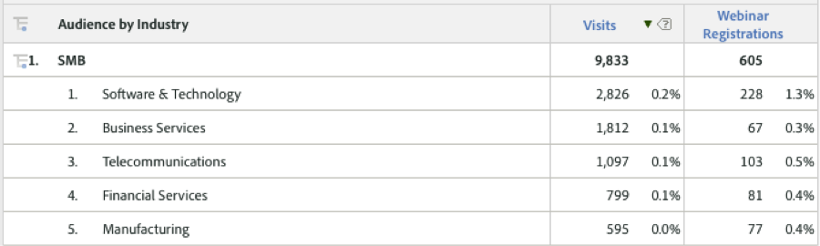

# Använda integreringen{#using-the-integration}

När integreringen har distribuerats kan du börja använda de extrafunktioner som den ger.

> [!NOTE] Det kan ta 24-48 timmar att börja se några av Demandbase-data i Adobe Analytics-rapporter.

Här är några åtgärder du kan vidta för att få ut mer av den här integreringen inifrån Adobe Analytics:

## Visa trafik- och konverteringsmått efter Demandbase-dimension{#viewing-traffic-and-conversion-metrics-by-demandbase-dimension}

Integreringen ger nya dimensioner som blir tillgängliga som Adobe Analytics-rapporter.

Rapporten nedan är ett exempel på hur både Besök och konverteringsmått (webbinarier Registrations) som har delats upp av både Audience-typen och sedan Bransch analyseras.

## Segmentering efter Demandbase-dimensioner{#segmenting-by-demandbase-dimensions}

En av de viktigaste funktionerna i den här integreringen är möjligheten att skapa Adobe Analytics-segment baserat på Demandbase-dimensionerna.

Du kan t.ex. skapa ett segment som endast innehåller besök från små och medelstora organisationer. Du kan ringa detta besök från små och medelstora företag. Definitionen skulle vara:

Målgruppen är lika med små och medelstora företag.

Mer information om hur du skapar segment finns i [segmenteringshandboken](https://marketing.adobe.com/resources/help/en_US/analytics/segment/)för analyser.

Det här segmentet kan sedan användas för praktiskt taget alla rapporter - ett exempel är den tidsåtgång per besök som visas här: 
