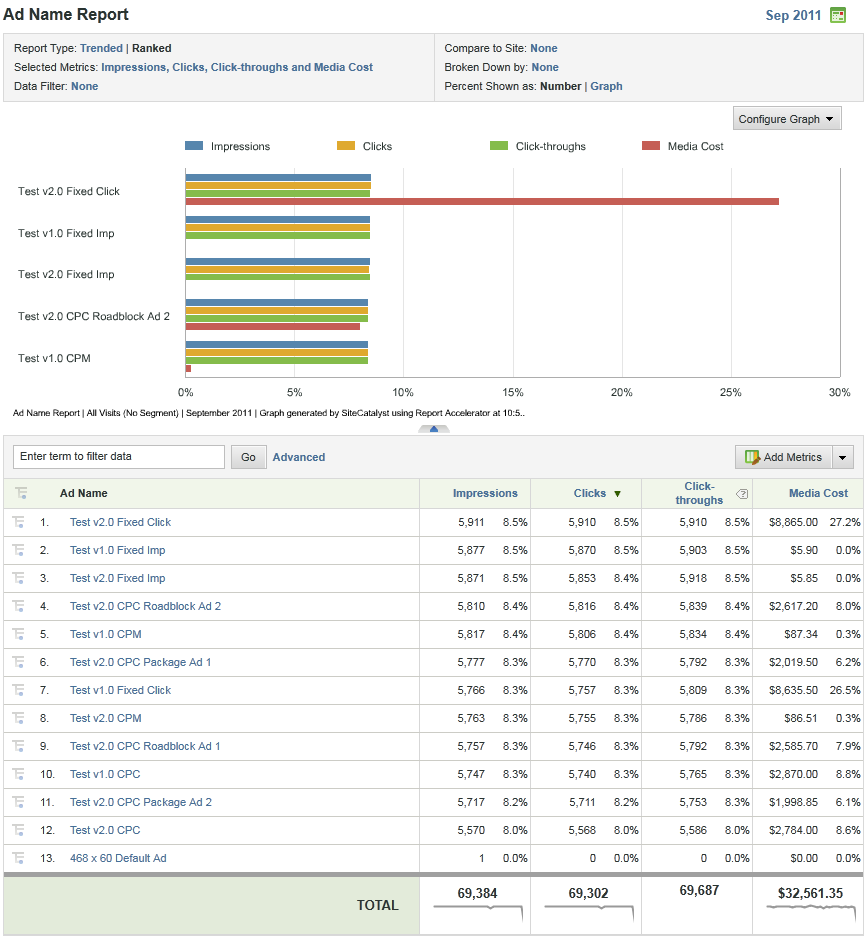

# Analytics-rapporter med DFA-data{#analytics-reports-using-dfa-data}

När DFA- och Adobe®-samlingsservrar kan kommunicera kan ni generera rapporter i rapporter och analyser som innehåller DFA-data.

Förpackade DFA-rapporter innehåller följande:

**Kanal**: Visar data som jämför bannerannonser med andra annonsalternativ online, som betald sökning och e-post.

**Leveransverktyg**: Visar data som jämför DoubleClick för annonsörer mot andra onlinetjänster.

**Platsnamn**: Visar data som jämför webbplatser där DFA-banners förekommer.

**Sidnamn**: Visar data som jämför enskilda webbsidor där DFA-banners förekommer.

**Annonsnamn**: Visar data som jämför specifika DFA-banners.

**Kampanjer**: Visar data som jämför olika DFA-annonskampanjer

Så här skapar du en DFA-rapport:

1. Logga in på Adobe Experience Cloud.
1. Gå till **[!UICONTROL Analytics]** > **[!UICONTROL Reports & Analytics]**. Kontrollera att du har valt den rapportsserie där du installerade DFA-integreringen.

1. I den vänstra navigeringen väljer du konverteringsvariabeln som hämtar DFA-klickdata och sedan önskad DFA-rapport.
1. Klicka på **[!UICONTROL Add Metrics]**. Dialogrutan Metrisk väljare öppnas.
1. Kontrollera Impressions and Clicks-måtten i listan **[!UICONTROL Available Metrics]** och klicka på **[!UICONTROL Apply]**.

   Den resulterande rapporten visar Impressions-, Click- och Revenue-data så att ni kan se hur era DFA-tjänster kan omsättas i intäkter från slutsumman.
En DFA Ad Name-rapport visar till exempel de visningar, klickningar och intäktsdata som direkt kan hänföras till specifika banners i din aktuella DFA-annonskampanj:

   

Den här rapporten har följande viktiga funktioner:

* Rapportrubriken, med namnet DFA_Ad Name Report, visar rapporttidsperioden (februari 2009) och anger att det här är en rankad rapport i ett vågrätt Bar-format.
* I själva diagrammet visas tre mätvärden (Impressions, Click, and Revenue) för varje DFA Ad i rapporten.
* I diagrammet visas data för varje mätvärde som en procentandel av den totala mätningen, i stället för att de faktiska siffrorna för varje mätvärde används. Du kan ändra detta i dialogrutan **[!UICONTROL Configure Report]**.
* Under diagrammet visar DFA_Ad-namnrapporten rapportinformationen för varje DFA-annons och visar både numeriska data och procentdata för annonsresultatet.
* Välj ett specifikt DFA-annonsnamn för att öppna en meny med alternativ för att få mer information om just den DFA-annonsen.
* Varje måttkolumn innehåller en färgnyckel som motsvarar måttets tilldelade färg i diagrammet.
* Rapporten beställs av intäktsmåtten med högsta intäkt högst upp. Du kan ändra rapportordningen genom att klicka på en annan kolumnetikett (metrisk).
