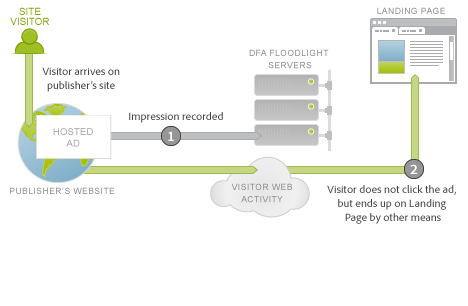

# DFA Data Connector för Adobe Analytics{#dfa-data-connector-for-adobe-analytics}

>[!IMPORTANT]
>
>Adobe Data Connector-tekniken upphör den 1 augusti 2021. [Läs mer …](/help/import/data-connectors/data-connectors-eol.md)

I dagens allt mer komplexa och konkurrensutsatta onlinemarknadsföring måste annonsörer och onlinebyråer kontinuerligt förbättra sin förståelse för onlinemarknadsföringsmiljön och avkastningen på sina reklamutgifter. Även om annonsörer, byråer och utgivare har individuella verktyg för att uppnå dessa mål, kan manuell sammanställning av data från olika datasystem och processer allvarligt hämma effektiviteten i onlinemarknadsföringskampanjer, vilket resulterar i mindre optimala kampanjresultat, diskrepanser och förvirring.

Integreringen med DoubleClick for Advertisers (DFA) löser det här problemet genom att använda Adobe® Data Connectors™ så att DoubleClick DFA automatiskt skickar data till Rapporter och analyser.

**[!UICONTROL Analytics]** > **[!UICONTROL Admin]** > **[!UICONTROL Data Connectors]**

## Viktiga fördelar{#key-benefits}

Viktiga fördelar med Data Connector - DFA-integrering omfattar:

* **Ökad konvertering**: Få riktade insikter för att optimera annonskampanjernas placering och konvertering på plats baserat på besökarnas beteende och önskemål efter klickningen.
* **Delad plats för data**: Kombinera dubbelklickning på DFA-klickning och genomskinlighetsdata med rapporter och analyser för att förbättra samarbetet mellan olika organisationer och för att fatta objektiva beslut.
* **Mervärdesanalys**: Automatisk integrering mellan DFA och Adobe Reports &amp; Analytics gör att annonsörer och byråer kan lägga mindre tid på att ta fram data och mer tid på att analysera rapporter och vidta åtgärder.
* **Djupare kundinsikter**: Få bättre insikt i var besökarna kommer ifrån och vad de gör på er webbplats.
* **Resultatstatistik** för livstid: Mät hur effektiva era kundvärvningskampanjer är under hela besökarens livscykel.
* **Integrerad rapportering**: Synkronisera automatiskt data mellan DFA och rapporter och analyser för smidiga affärsprocesser och rapporter.
* **Livstidsbesöksanalys**: Mät kampanjens effektivitet med hjälp av flera användardefinierade lyckade händelser och livstidsvärde.
* **Kostnadsmått**: Optimera avkastningen på investeringar genom att jämföra DFA-kostnadssiffror och intäkter från dessa kostnader i ett enda system.

## Integreringsöversikt för annonsservrar{#ad-serving-integration-overview}

Det finns flera sätt att använda den här integreringen för att samla in data om den annonsinriktade besökaren. Det första sättet är att klicka på en annons och gå vidare till en taggad landningssida som kallas ett klick igenom:

Besökaren kommer till en utgivares webbplats som är värd för annonsen. Den här annonsen har en unik identifierare som kallas annons-ID. Annonserna består av en praktik plus en kreativ som beskriver var annonsen finns på utgivarens webbplats och vilket innehåll som visades för besökaren. När besökaren hämtar annonsen, placeringen eller den kreativa informationen från DFA-innehållsservrarna spårar den en Impression till DFA-servern för Floodlight för den här besökaren (1).

Om besökaren klickar på annonsen (2) ställs en fråga till servern för FlowLight, som räknar ett klick, så dirigeras (3) besökaren om (3) till landningssidan. När besökaren har kommit till landningssidan kallas detta för en klickfrekvens. Den här sidan innehåller spårningskod för Adobe som efterfrågar data från DFA-servern för Floodlight.

Om besökaren inte faktiskt kommer till landningssidan efter att Floodlight Server har spårat ett klick, kallas detta inte en klickfrekvens. Vissa annonser och implementeringar kan inte få besökarens webbläsare att lyda 302-omdirigeringen. Mer information om det här avsnittet finns i [Avstämning av måttfel](../dfa-data-connector-analytics/dfa-reconciling-metric-discrepancies.md).

Nästa mätvärde som fångas upp av den här integreringen inträffar när besökaren får annonsinställningen, inte klickar, men ibland inom den närmaste framtiden kommer den vidare till landningssidan på ett annat sätt.

Detta scenario kallas genomgång. Skillnaden i det här scenariot med klickscenariot är att besökaren inte klickar på annonsen utan fortsätter till andra aktiviteter innan han kommer till landningssidan (2). I det enklaste fallet anger besökaren typ i landningssidans URL i webbläsaren. I andra fall fortsätter besökaren att surfa men använder senare en sökmotor som leder besökaren till landningssidan. I vilket fall som helst kommer användaren till landningssidan.

## Integrering med Adobe: Datainsamling i realtid{#adobe-integration-real-time-data-collection}

Följande bild visar hur datainsamling fungerar.

Datainsamlingsdelen av integreringen med Adobe börjar när besökaren kommer till landningssidan (1). Koden för datainsamling i Adobe som körs på landningssidan har ingen kunskap om besökarens historik med serverade annonser. Google DFA-teamet har samordnat en tjänst som körs på DFA Floodlight Server så att Adobe-koden kan söka annonsinformation om besökaren som finns på webbplatsen (2). För att få tillgång till dessa data fördröjs bildfyren tillfälligt i Adobe och data från FlowLight-servern begärs.

När data kommer, eller tar för lång tid, utlöses träffen till spårningsservrarna för Adobe (3).

Modulen Integrate är en särskild JavaScript-modul för Adobe som gör att Adobe-bildfyren fördröjs och väntar på en begäran från tredje part för en viss tid (`s.maxDelay`). `s.maxDelay` definierar hur länge Integrate-modulen ska vänta på data från DFA:s Floodlight Server innan bildtaggen aktiveras i besökarens webbläsare. Detta beteende är viktigt så att grundläggande besöksdata fortfarande samlas in, även när DFA-servern för Floodlight är nedladdad eller kraftigt inläst. Om flyttalsdata kommer innan `s.maxDelay` har gått ut, kommer spårningsdata för Adobe att aktiveras omedelbart och innehålla ytterligare DFA-data.

När en timeout inträffar kan sidkoden ange en Adobe-rapport- och analyshändelse som ska användas som en timeout-händelse. Den här händelsen är användbar när du vill diagnostisera problem med integreringen eller när du justerar `s.maxDelay`. Om det finns för många timeout ökar du `s.maxDelay`. `s.maxDelay` kan dock ställas in för högt, vilket innebär att besökare kan ha möjlighet att lämna webbplatsen innan  `s.maxDelay` tidsperioden går ut. .

Ibland kan servern svara med fel om besökaren. Detta inträffar vanligtvis när Floodlight-servern inte känner till något om besökaren, eftersom besökaren ännu inte har sett några annonser eller inte har någon DFA-besökarcookie. Sidkoden kan ange en anpassad konverteringsvariabel (eVar) som samlar in felen och kan vara till hjälp vid felsökning av implementeringsproblem eller vid framhävning av problem med Google-transaktionen. De vanligaste felen är Ingen historik, Ingen cookie, Frågefel och Vald ut enligt beskrivningen i följande tabell:

| Fel | Namn | Beskrivning |
|---|---|---|
| nh | Ingen historik | Besökaren har inte visat eller klickat på några annonser. |
| nc | Ingen cookie | Besökaren har ingen DFA-besöks-cookie. |
| qe | Frågefel | Det uppstod ett fel vid sökning efter data för Floodlight-servern. |
| oo | Avanmäld | Besökaren valde bort Googles intrycks-/klickspårning. |

## Integrering med Adobe: Importera nattdata{#adobe-integration-nightly-data-import}

Datainsamlingsdelen av integreringen samlar in klicknings- och vydata om webbplatsbesökare. För att få DFA:s klicknings-, intrycks- och kostnadsstatistik finns det en nära process som samordnas av Google och Adobe för att importera dessa ytterligare data till den integrerade rapportsviten. Dessa mått importeras via datakällor, vilket innebär att de endast är tillgängliga i aggregerad form och inte är på besöksnivå.

## Versionsskillnader{#version-differences}

Det finns för närvarande tre versioner av DFA-integreringen, version 1.0, 1.5 och 2.0.

I följande tabell sammanfattas funktionerna i varje version av integreringen.

| Funktion | Version 1.0 | Version 1.5 | Version 2.0 |
|---|---|---|---|
| DFA Click and Impression Nightly Metrics | Ja | Ja | Ja |
| Genomklicknings- och vystyrd spårning | Ja | Ja | Ja |
| Integrering tar emot data på annonsnivå | Nej | Ja | Ja |
| Integreringen tar emot data på Konfiguration i Floodlight-nivå | Nej | Nej | Ja |
| Kostnadsmått | Nej | Nej | Ja |
| Kreativa mätvärden | Nej | Nej | Ja |
| Frågesträngar som är större än 2 kB | Nej | Ja | Ja |
| Använder integreringsmodulen för optimal datainsamling från tredje part | Nej | Ja | Ja |
| Timeout och felspårning | Nej | Ja | Ja |
| Inget behov av förhandlat klient-ID | Nej | Nej | Ja |

### Om version 1.5 {#section-b5a3e967cfa141ea8f740612336181be}

Version 1.5 av integreringen introducerar modulen Integrera på startsidan Java Script. Modulen Integrate tillåter begäranden i fast storlek till DFA-annonsservern (ad.doubleclick.net), som överskrider 2K-begärandegränserna för den tidigare integreringen. Det introducerar också en konfigurerbar tidsgräns, *`s.maxDelay`*, för att fortsätta samla in besöksdata från Adobe när nätverksavbrott inträffar. Fel och tidsgränser kan också samlas i analysvariabler.

Följande bild visar nätverksinteraktioner på landningssidan i version 1.5.

I version 1.5 begär modulen Integrera (2) data från Floodlight Server (3). Floodlight Server dirigerar om till DFA-annonsservern, som returnerar data om besökaren på samma sätt som version 1.0. Den kommer att 302 omdirigera (4) till en speciell översättningstjänst för integration.112.2o7.net, som omvandlar svarsstrukturen till ett JSON-objekt. Modulen Integrate förbrukar detta JSON-objekt och skickar informationen vidare till spårningen av Adobe (5).

Att gå från version 1.0 av integreringen till 1.5 innebär en JavaScript-ändring. Om du vill hämta JavaScript loggar du in på ditt Adobe Online Marketing Suite-konto, väljer Genesis, klickar på Redigera på DFA-integreringen och fortsätter med guiden. Förutsatt att du tidigare har tilldelat ett klientplats-ID får du omedelbart den nya JavaScript-koden via e-post när du har sparat integreringen. När du har den här koden kommer du också att behöva en ny version av kärnan s_code som har modulen Integrera. Den här koden kan begäras av din kontoansvarige eller implementeringskonsult.

En viktig egenskap i den nya JavaScript-koden är att det inte krävs någon implementeringsändring mellan version 1.5 och version 2.0.

### Om version 2.0 {#section-afd56de0c56c4489bb5ddc5798d6709a}

Den senaste versionen av DFA-integreringen samlar in data för en hel Floodlight-konfiguration i integreringen. Före version 2.0 var enskilda integreringar kopplade till en enda DFA-annons. I och med den här förändringen inkluderas klick, tryck och kostnadsvärden för hela Floodlight-konfigurationen i den integrerade rapportsviten. Det går också att spåra visningen över flera platser när dessa två platser finns i samma Floodlight-konfiguration.

Mediekostnadsstatistik är också tillgängliga från och med version 2.0 av integreringen. Om du vill aktivera mediekursstatistik för en integrering måste du välja en rapport- och analyshändelse för Mediekostnad i guiden Genesis, samt ange vilken valuta måtten finns i DFA-gränssnittet.

Timeout förväntas minska med 2.0-integreringen eftersom 302 omdirigeringar har tagits bort. Genom att eliminera dessa hopp bör du minska tidsgränserna och öka mängden DFA-data som du kan integrera.

Om en Floodlight-konfiguration är en delad konfiguration i DFA är uppgraderingen från version 1. 5 till 2.0 gör att konverteringsdata för alla delade annonsörer i Floodlight Configuration inkluderas i rapportsviten.

### Uppgraderar till version 2.0 {#section-f0bf90b9a7a1434ab1540b6c0999f4c7}

I följande tabell visas ägarna för migrering till nyare versioner av integreringen:

| Migrering | Ägare | Uppgifter |
|---|---|---|
| Version 1.0 till 1.5 | Klient | Implementera version 1.5 JavaScript med Integrate Module |
| Version 1.5 till 2.0 | Klient | Klienten börjar diskutera med Google om tidsramar för uppgradering. Efter godkännande aktiverar Google Advanced Ad Serving. |
