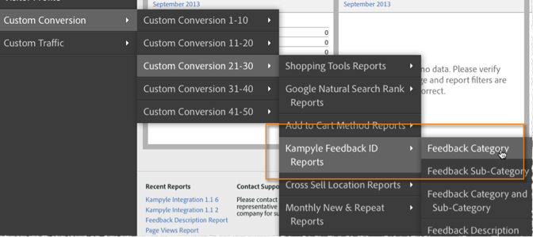

# Distribuera integreringen{#deploying-the-integration}

Att implementera denna integrering är en enkel process som består av att slutföra guiden för integrering av Adobe, distribuera JavaScript-kod och verifiera integreringen.

## Slutför guiden för integrering av Adobe{#complete-the-adobe-integration-wizard}

Om du vill aktivera integreringen slutför du konfigurationsguiden i gränssnittet för Data Connectors.

1. Logga in på [!DNL Adobe Experience Cloud].
1. Klicka på **[!UICONTROL Analytics]** > **[!UICONTROL Admin]** > **[!UICONTROL All admin]** > **[!UICONTROL Data connectors]**.
1. Starta Kampyle-integreringsguiden.
1. Välj önskat rapportpaket och ange ett namn för integreringen.
1. Konfigurera följande objekt:
   1. **[!UICONTROL Email address]**: Den primära kontaktens e-postadress.
   1. **[!UICONTROL Description]** (valfritt): Beskrivning av den här integrationsinställningen.
   1. **[!UICONTROL Kampyle Key]**: Du hittar den här nyckeln i Kampyle-programmet under  **[!UICONTROL Feedback Form]** >  **[!UICONTROL Feedback Form Customization]**.
   1. **[!UICONTROL Tracking Server]**: Spårningsservervärdet som du använder för att spåra Adobe Analytics-data.
   1. **[!UICONTROL Tracking Server Secure]**: Om spårningsservern inte är samma för säker trafik/https-trafik anger du den inställningen här.
1. Konfigurera följande **[!UICONTROL Variable Mappings]**-objekt:
   1. **[!UICONTROL Kampyle Feedback ID]**: Markera en tillgänglig variabel i din rapportserie
   1. **[!UICONTROL Feedback Grade]**: Välj en tillgänglig händelse (skriv &quot;räknare&quot;) i rapportsviten.
   1. **[!UICONTROL Feedback Items]**: Välj en tillgänglig händelse (skriv &quot;räknare&quot;) i rapportsviten.
   1. **[!UICONTROL Feedback with Grade]**: Välj en tillgänglig händelse (skriv &quot;räknare&quot;) i rapportsviten.
1. Markera rutan om du vill att kontrollpanelen Kampyle Integration ska skapas automatiskt (rekommenderas).
1. Granska alla konfigurationsobjekt och klicka på **[!UICONTROL Activate Now]**.

## Distribuera integreringskonfigurationsobjektet{#deploy-the-integration-configuration-object}

Distribuera integreringskonfigurationsobjektet till din webbegenskap när du har slutfört integreringsguiden. I många fall är det enklaste sättet att distribuera integreringskonfigurationsobjektet att inkludera det i din Adobe Analytics-distributionskod.

>[!NOTE]
>
>Om du använder Adobe Experience Platform Launch kan du enkelt lägga till integreringskonfigurationsobjektet med det verktyget.

1. Navigera till fliken **[!UICONTROL Resources]** > **[!UICONTROL Support]** för integreringen.
1. Hämta och spara **[!UICONTROL Kampyle Integration Code (JS)]**-resursen. Koden ser ut ungefär så här:

   ```
   /* Kampyle:  Integration configuration settings */
     window.k_sc_param = { "version":1.1 }
   ```

1. Distribuera koden på något av följande sätt:

   * Använd Adobe Experience Platform Launch.
   * Leverera koden till den organisationsresurs som underhåller din Adobe Analytics-distribution.

## Verifiera integrationen{#verify-the-integration}

Validera att integreringen har överfört data genom att utföra några kontroller.

### Aktivitetslogg för integrering {#section-0472df9180db4f218db5f6040cab07af}

Visa Kampyle-integrationsinställningarna i Adobe Experience Cloud genom att gå till **[!UICONTROL Support]** > **[!UICONTROL Integration Activity Log]**. Under fliken **[!UICONTROL Data In]** ska du se poster som anger att klassificeringsdata har importerats.

>[!NOTE]
>
>Loggposterna visas vanligtvis inom 24 timmar efter att distributionen lyckades.


### Data för Adobe-rapportering {#section-1ae9f0a5e6bc40988478ff55aefd56ac}

Läs dina Kampyle-feedback-rapporter med Adobe Analytics genom att navigera till Kampyle-rapporten i rätt menystruktur.

>[!NOTE]
>
>Rapporteringsdata ska visas inom 24-48 timmar efter att de distribuerats, förutsatt att de integrerade feedbackformulären aktivt tar emot inskickade svar.


