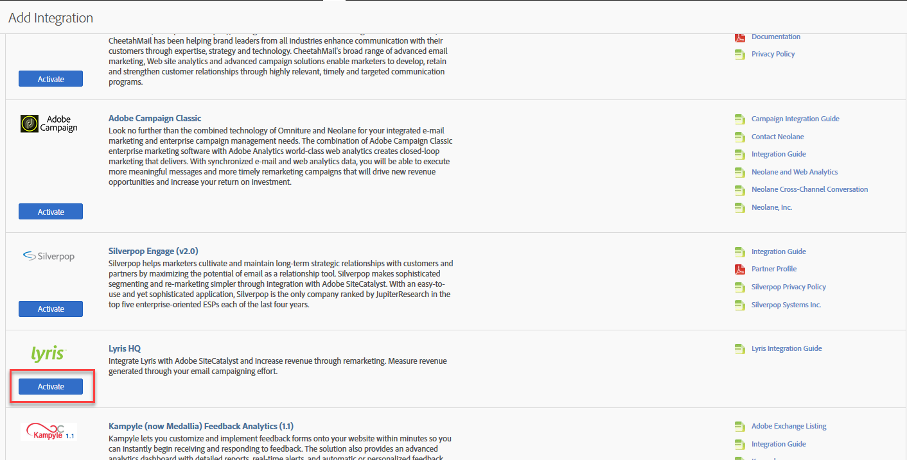

# Distribuera integreringen{#deploying-the-integration}

Beskriver distributionsprocessen i tre steg.

Distribuera den här integreringen är en enkel process som kräver följande åtgärder:

## Slutför integreringsguiden{#completing-the-integration-wizard}

Steg för att använda integreringsguiden.

För att aktivera integreringen måste du slutföra guiden för integrering av Lyris i gränssnittet för Data Connectors.

1. Navigera till området Data Connectors (tidigare Genesis) i Adobe Experience Cloud.

   

1. Under **[!UICONTROL Add Integration]** Lyris HQ klickar du på **[!UICONTROL Activate]**.

   

1. Under **[!UICONTROL General Settings]** väljer du önskad Report Suite och anger ett namn för integreringen.
1. Fyll i all din kontorelaterade information för Lyris under **[!UICONTROL Custom Values]**.

   

1. Välj lämpliga reserverade eVars och händelser i listrutorna.

   

1. Du kan välja egna segment under **[!UICONTROL Your Segments]** - förutom de tre automatiska partnersegmenten.
1. Den här integreringen kan kräva att du hämtar några datapunkter till ditt Lyris-konto. Du kan välja att ge åtkomst till detta under **[!UICONTROL Access Request]**.
1. Under **[!UICONTROL Data Collection]** kan du välja att ha en automatisk eller manuell lösning (JavaScript-plugin) för att samla in frågesträngsparametrar från landningssidans URL. Om du väljer att ha en automatiserad lösning anger du frågesträngsparametern för meddelande-ID och mottagar-ID. Kontakta din Adobe-konsult för ett JavaScript-plugin.

   

1. Du kan välja att låta Lirs Dashboard och bokmärken genereras automatiskt åt dig.

   

1. Granska integrationssammanfattningen och klicka på **[!UICONTROL Activate]**.

## Konfiguration i Lyris EmailLabs{#configuration-within-the-lyris-emaillabs}

Steg som beskriver vad som ska konfigureras i Lyris när guiden har slutförts.

1. När du är klar med integreringsguiden måste du samarbeta med Lyris Professional-teamet för att slutföra integreringen av Lyris HQ-kontot och underlätta testningen.
1. Lägg till URL-frågesträngsparametrar: Kontrollera att URL-tilläggssträngen är korrekt inmatad i organisationsinställningarna i användargränssnittet. Detta ska innehålla kampanjnivå-ID (hq_m) och mottagarens nivå-ID (hq_v).

   Ett exempel på ett sträng-ID är:

   ```
   hq_lid=149&hq_m=96843&hq_l=23&hq_v=7703a51905
   ```

   >[!NOTE]
   >
   >Om du använder Lyris originalanalysverktyg *taggar Click Tracks* alla nödvändiga variabler som läggs till.

## Verifiera integreringen{#verifying-the-integration}

Steg för att verifiera att Lyris-/Adobe Analytics-integreringen lyckades.

När alla distributionssteg har slutförts kan du validera att integreringen har överfört data.

> [!NOTE] Det tar några dagar innan datautbytet börjar. Se till att du kontaktar Lyris när du har aktiverat integreringen.

1. Navigera till Lyris-integrationen i Data Connectors. Under **[!UICONTROL Support]** fliken > **[!UICONTROL Integration Activity Log]** ska du se händelser som **[!UICONTROL Metric data imported successfully]** och/eller **[!UICONTROL Classification data imported successfully]**:

   

1. Nu kan du se era Lyris-rapporter med korrekta mätvärden. I Adobe Experience Cloud väljer du **[!UICONTROL Reports & Analytics]**.
1. Välj lämplig rapportsvit.
1. Under **[!UICONTROL Custom Conversions]** markerar du **[!UICONTROL Message ID Reports]** och väljer **[!UICONTROL Message ID/Message Name]**.

## Frågesträngsparam-plugin-kod{#query-string-param-plug-in-code}

Visar den plugin-kod för Lyris som ska användas med Adobe Analytics.

> [!NOTE] Se till att du reserverade de eVars som behövs i Adobe Analytics Admin Tool innan du börjar arbeta med koden nedan. När du vet vilka eVar du har reserverat ersätter du eVarN med den relevanta eVar. t.ex. eVar10.

```
/* 
  * Plugin: getQueryParam 2.3 
  */ 
s.getQueryParam=new Function("p","d","u","" 
+"var s=this,v='',i,t;d=d?d:'';u=u?u:(s.pageURL?s.pageURL:s.wd.locati" 
+"on);if(u=='f')u=s.gtfs().location;while(p){i=p.indexOf(',');i=i<0?p" 
+".length:i;t=s.p_gpv(p.substring(0,i),u+'');if(t){t=t.indexOf('#')>-" 
+"1?t.substring(0,t.indexOf('#')):t;}if(t)v+=v?d+t:t;p=p.substring(i=" 
+"=p.length?i:i+1)}return v"); 
s.p_gpv=new Function("k","u","" 
+"var s=this,v='',i=u.indexOf('?'),q;if(k&&i>-1){q=u.substring(i+1);v" 
+"=s.pt(q,'&','p_gvf',k)}return v"); 
s.p_gvf=new Function("t","k","" 
+"if(t){var s=this,i=t.indexOf('='),p=i<0?t:t.substring(0,i),v=i<0?'T" 
+"rue':t.substring(i+1);if(p.toLowerCase()==k.toLowerCase())return s." 
+"epa(v)}return ''"); 
 
/*in the s_doPlugins function - Replace N with actual eVar number*/ 
s.eVarN=s.getQueryParam("<insert Lyris QS Param>");  
//places query param value from Message ID in eVarN variable s.eVarN=s.getQueryParam("<insert Lyris QS Param>");  
//places query param value from Recepient ID in eVarN variable 
```
