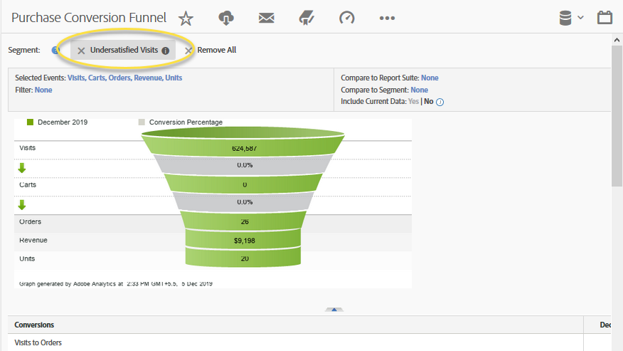

# Använda integreringen{#using-the-integration}

När distributionen är klar kan du börja använda de extrafunktioner som den här integreringen ger.

>[!NOTE]
>
>Det kan ta 24-48 timmar att börja se Qualtrics-svarsdata i din Adobe Analytics-rapportering.

Följande åtgärder kan vidtas för att få ut mer av den här integreringen från Adobe Analytics.

1. Skapa ett segment med hjälp av svarsdata från undersökningar (se [Skapa ett segment](https://docs.adobe.com/content/help/en/analytics/components/segmentation/seg-home.html)).
1. Använd segmentet på nyckelrapporter.

## Exempel {#section-07051d0d60a44408a4e108034586c42f}

Nedan visas hur en analytiker kan definiera ett Adobe Analytics-segment med hjälp av enkätsvarsdata. Det här fallet förutsätter en enkätsvar som&quot;Hur nöjd var du med ditt besök idag?&quot; Med den här frågan kan vi skapa ett segment för att identifiera&quot;underbelåtna&quot; besökare. Ett sådant segment kan användas för att fördjupa sig i alla Adobe Analytics-rapporter, t.ex. Purchase Conversion Trnel, enligt nedan.

 
