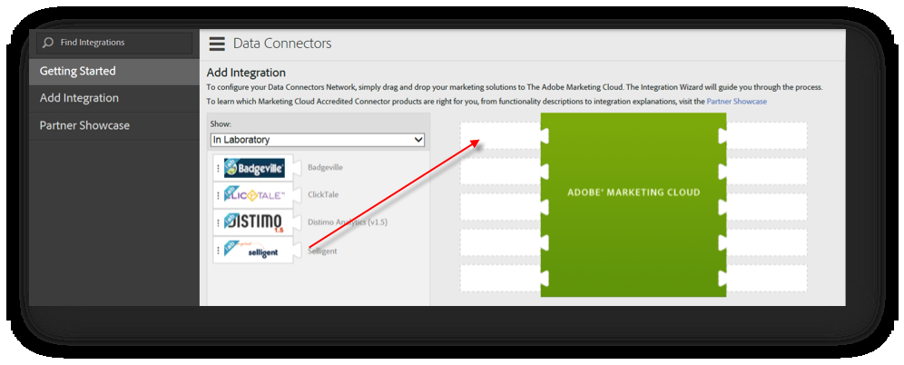

# Distribuera integreringen{#deploying-the-integration}

Det är en enkel process i tre steg att driftsätta den här integreringen.

## Slutför integreringsguiden{#completing-the-integration-wizard}

För att aktivera integreringen måste du slutföra integreringsguiden för Selligent i gränssnittet för Data Connectors.

1. Navigera till Data Connectors-området i Adobe Experience Cloud.

   

1. Under **[!UICONTROL Add Integrations]** drar och släpper du plugin-programmet Selligent i Adobe Experience Cloud.

   

   Detta öppnar integreringen av Selligent Data Connector.

1. **Integrationsinställningar**: Välj önskad Report Suite och ge integreringen ett namn under **[!UICONTROL Integration Settings]**.

1. Under **[!UICONTROL Custom Values]** Fyll i alla dina inloggningsuppgifter.

   

1. **Variabelmappning**: Välj lämplig reserverad eVars och händelse i listrutan:

   

1. **Datainställningar**: Du kan välja egna segment **[!UICONTROL Your Segments]** förutom de tre automatiserade **[!UICONTROL Partner]** segmenten.

1. Den här integreringen kan kräva att du hämtar några datapunkter till ditt Selligent-konto. Du kan välja att ge åtkomst till det under **[!UICONTROL Access Request]**.
1. Under **[!UICONTROL Data Collection]** väljer du en automatisk eller manuell lösning (JavaScript-plugin) för att samla in frågesträngsparametrar från landningssidans URL. Om du väljer en automatiserad lösning anger du frågesträngsparametern för meddelande-ID och mottagar-ID som är MID respektive RID. För JavaScript-plugin kontaktar du Adobe Consultant.
1. **Rapportinställningar**: Under **[!UICONTROL Dashboard Generation]** markerar du kryssrutan så att den särskilda kontrollpanelen genereras automatiskt.

   

1. Granska integrationssammanfattningen och klicka på **[!UICONTROL Activate]**.

## Konfiguration i Selligent{#configuration-within-selligent}

Så snart integreringen är aktiverad i Adobe Analytics aktiveras en automatisk konfiguration på inloggningssidan.

En spårare har skapats som spårar alla e-postmeddelanden. Om du vill begränsa spårningen till en viss domän måste du uppdatera spårningskonfigurationen.

Vi rekommenderar att du flyttar spårningsparametern för Adobe Analytics i URL:en längst fram. Detta säkerställer att Adobes bearbetningsregler hämtar parametrarna från landningssidans URL. Aktivera spårning genom att markera kryssrutan som visas nedan.

## Verifiera integreringen{#verifying-the-integration}

När alla distributionssteg har slutförts kan du validera att integreringen har överfört data.

Det kommer att ta några dagar innan datautbytet börjar. Kontrollera att du kontaktar Selligent när du har aktiverat integreringen.

### Aktivitetslogg för integrering {#section-927e270495db479fba9578915d9ae9c9}

Navigera till din smarta integrering i Data Connectors. Under **[!UICONTROL Support]** fliken ska du se händelser som metriska data importerades och/eller klassificeringsdata importerades:

### Rapporteringsdata {#section-ebd481a162324e66bd6dc8cb4b8d2424}

Visa dina Selligent Message-rapporter med lämpliga mätvärden.

1. Gå till Rapportera och analysera via Adobe Experience Cloud.
1. Välj lämplig rapportsvit.
1. Under **[!UICONTROL Custom Conversion]** markerar du **[!UICONTROL Message ID Reports]** och väljer **[!UICONTROL Message ID/Message Name]**.
