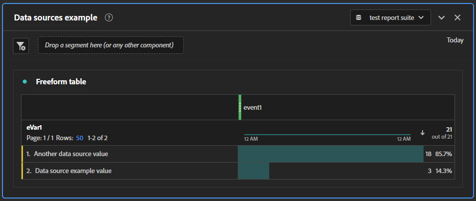

# Komma igång med datakällor

Du kan följa de här stegen för att enkelt överföra exempeldata till en utvecklingsrapportsserie för att se hur arbetsflödet fungerar. När ni har förstått processen kan ni utöka och anpassa den specifikt till er organisations implementering.

>[!IMPORTANT]
>
>Följ de här stegen med hjälp av en utvecklings- eller testrapportsserie. Data som överförs via datakällor är **permanenta**. Det påverkar produktionsrapportens data om de överförs där.

1. Logga in på Adobe Analytics via [https://experience.adobe.com](https://experience.adobe.com).
1. Navigera till **[!UICONTROL Admin]** > **[!UICONTROL All Admin]** > **[!UICONTROL Data sources]**.
1. Välj en utvecklingsrapportsserie i listrutan högst upp till höger.
1. Klicka på knappen **[!UICONTROL Create]** överst till vänster.
1. Under [!UICONTROL Select Category] väljer du [!UICONTROL Generic] och under [!UICONTROL Select Type] väljer du [!UICONTROL Generic Data Source (Summary Data Only)].
1. Klicka på **[!UICONTROL Activate]**. Ett popup-fönster öppnas som visar [!UICONTROL Data Source Activation Wizard].
   1. Steg 1: Ge datakällan ett namn och klicka på kryssrutan Ansvarsfriskrivning.
   1. Steg 2: Det här steget hade mer användning i tidigare versioner av Adobe Analytics. Klicka på en kryssruta och skriv sedan ett värde i textfältet bredvid den.
   1. Steg 3: Välj det mätvärde som ska ingå i datakällans mallfil. Välj Händelse 1 i listrutan.
   1. Steg 4: Det här steget hade mer användning i tidigare versioner av Adobe Analytics. Klicka på en kryssruta och skriv sedan ett värde i textfältet bredvid den.
   1. Steg 5: Välj vilken dimension som ska inkluderas i datakällans mallfil. Välj eVar1 i listrutan.
   1. Steg 6: Granska sammanfattningen och visa de mått och mått som ingår i mallfilen.
   1. Steg 7: Klicka på knappen **[!UICONTROL Download]** för att hämta datakällans mallfil. Observera också inloggningsuppgifterna för FTP-webbplatsen, eftersom de används inom kort.
1. Datakällan skapas nu. Nästa steg är att ge den data som ska bearbetas. Öppna den hämtade filen i textredigeraren.
1. Mallfilen innehåller tre rader, två kommentarsrader (som börjar med `#`) och en rubrikrad:

   ```text
   # Generic Data Source (Summary Data Only) template file (user: 123456789 ds_id: 2)
   #    eVar1    event1
   Date    Evar 1    Event 1
   ```

1. Ange data på flera rader, där varje post avgränsas med en tabb. Använd inte blanksteg eller kommatecken för att avgränsa värden.
   * Den första kolumnen är datumet i följande format: `MM/DD/YYYY/HH/mm/SS`.
   * Den andra kolumnen är textvärdet som du vill ta med i eVar1.
   * Den tredje kolumnen är den mängd som du vill öka händelse 1.

   ```text
   # Generic Data Source (Summary Data Only) template file (user: 123456789 ds_id: 5)
   #    eVar1    event1
   Date    Evar 1    Event 1
   09/07/YYYY/11/23/00    Data source example value    3
   09/07/YYYY/15/59/00    Another data source value    18
   ```

1. Spara filen. Om du vill kan du ge den ett annat filnamn. När filen har sparats kan du stänga textredigeraren.
1. I Utforskaren, Finder eller den FTP-klient du vill använda går du till [ftp://ftp.omniture.com](ftp://ftp.omniture.com).
1. När du uppmanas att ange inloggningsuppgifter använder du det användarnamn och lösenord som anges i det sista steget i guiden Skapa datakälla. Du kan referera till den igen genom att gå till [!UICONTROL Data sources] och klicka på **[!UICONTROL FTP Info]** bredvid datakällan som du skapade.
1. När du har autentiserat drar du filen du redigerade till fönstret för autentiserad FTP.
1. Skapa en tom textfil på valfri plats utanför FTP-fönstret. Ge den samma filnamn som datakällfilen som du överförde till FTP-platsen, med ett undantag. I stället för en `.txt`-filtyp ger du den filtypen `.fin`. Kontrollera att operativsystemets inställningar tillåter dig att se och ändra filtyper.
1. Dra den tomma `.fin`-filen till samma FTP-plats som datakällfilen. Förekomsten av filen `.fin` talar om för Adobe att datakällfilen är helt överförd och klar att importeras.
1. Efter flera minuter försvinner filen från FTP-platsen och visas i rapporter.
1. Uppdatera sidan Datakällor och validera att filen har importerats.
1. Navigera till Analysis Workspace och skapa ett projekt.
1. Dra eVar1 som en dimension till arbetsytan och händelse 1 som ett mått. Kontrollera att Workspace datumintervall innehåller de datum som du angav i datakällan.

   

## Nästa steg

[Filformat](file-format.md): Lär dig mer om hur du skapar en datakällfil som är anpassad till din organisation.
