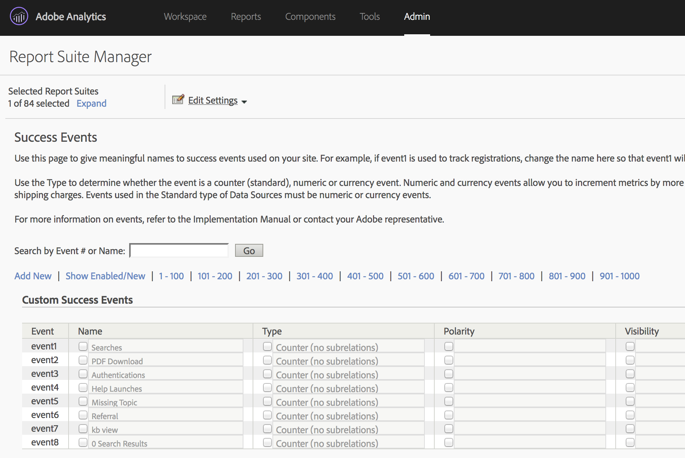
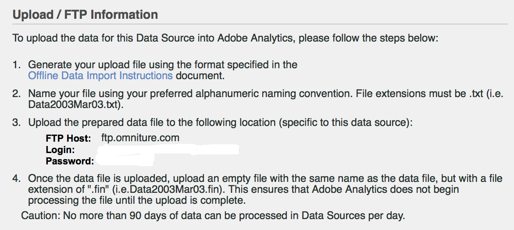

# Importera [!UICONTROL Paid Search] mätvärden med [!UICONTROL Data Sources]

För många marknadsföringsorganisationer är betalsökningar ett av de mest värdefulla och tillförlitliga sätten att både &#x200B; nya kunder och behålla befintliga. The [!UICONTROL Data Sources] i Adobe Analytics gör det enkelt att importera avancerade, betalda sökdata från digitala annonsplattformar som Google AdWords. Ni kan integrera den med resten av era marknadsföringsdata, tillsammans med beteendedata på plats och kundattributdata, för att ni ska få bättre insikter i er organisations betalda sökinsatser.

De här stegen visar hur du konfigurerar en integrering med AdWords för att importera nyckelordsdata samt mätvärden som visningar, klick, kostnad per klick med mera.

Stegen beskriver hur du konfigurerar en engångsimport av Pay-Per-Click-data. Men [!UICONTROL Data Sources] möjliggör kontinuerlig import av data med det filformat som beskrivs här. Beroende på vilken sökplattform du använder kan du eventuellt schemalägga periodiska exporter (varje dag, månad, osv.), konfigurera automatiska processer för att omvandla dessa exporter till det filformat som Adobe Analytics kräver, och överföra dessa filer till Adobe Analytics för betald sökintegreringsrapportering.

## Förutsättningar

* Du har implementerat betalsökningsidentifiering.
* Du hämtar spårningskoddata.
* Du har unika spårningskoder för varje annonsgrupp.

## Konfigurera [!UICONTROL Success Events]

Vårt första steg är att förbereda Adobe Analytics för mätningarna. För att kunna göra detta måste du konfigurera några lyckade händelser.

[!UICONTROL Success events] är åtgärder som kan spåras. Du bestämmer vilken [!UICONTROL success event] är. För spårningsändamål [!UICONTROL paid search] mätvärden, vi vill konfigurera [!UICONTROL success events] runt [!UICONTROL clicks], [!UICONTROL impressions], [!UICONTROL total cost] och aktivera[!UICONTROL tracking codes].

1. Gå till **[!UICONTROL Adobe Analytics > Admin > Report Suites]**.
1. Välja en rapportsvit.
1. Klicka på **[!UICONTROL Edit Settings > Conversion > Success Events]**.

   

1. Använd under Anpassade lyckade händelser **[!UICONTROL Add New]** för att skapa tre anpassade lyckade händelser: [!UICONTROL Clicks] (Räknare), [!UICONTROL Impressions] (Räknare) och [!UICONTROL Total Cost] (Valuta).

   

1. Klicka på Spara.
Du bör få ett meddelande om att dina spara har godkänts.
1. Navigera till **[!UICONTROL Admin > Report Suites > Edit Settings > Conversion > Conversion Variables]**.
1. Aktivera spårningskoder genom att markera kryssrutan bredvid **[!UICONTROL Tracking Code]** under **[!UICONTROL Campaign > Campaign Variable]**.

   

## Ställ in datakällor

[!UICONTROL Data Sources] kan du dela data som inte är klickbara med Adobe Analytics. I det här fallet använder vi Adobe Analytics för att spåra betalda sökvärden. Vi använder spårningskoden som nyckel för att knyta samman de två datamängderna - betalda sökvärden och Adobe Analytics-statistik.

1. Navigera till **[!UICONTROL Adobe Analytics > Admin > All admin > Data sources]**.
1. Välj **[!UICONTROL Create]** för att börja aktivera nya datakällor.
1. Under **[!UICONTROL Select Category]** väljer du **[!UICONTROL Ad Campaign]**.

   

1. Under **[!UICONTROL Select Type]** väljer du **[!UICONTROL Generic Pay-Per-Click Service]**.
1. Klicka på **[!UICONTROL Activate]**.
The [!UICONTROL Data Source Activation Wizard] visar:

   

1. Klicka **[!UICONTROL Next]** och namnge datakällan. Det här namnet visas i Data Source Manager.
1. Godkänn serviceavtalet och klicka på **[!UICONTROL Next]**.
1. Välj tre standardmått: [!UICONTROL Impressions], [!UICONTROL Clicks] och [!UICONTROL Total Cost] och klicka **[!UICONTROL Next]**.
1. Mappa nu den här nya datakällan till anpassade händelser som vi skapade i [Konfigurera lyckade händelser](/help/admin/admin/c-manage-report-suites/c-edit-report-suites/conversion-var-admin/c-success-events/t-success-events.md).

   

1. Välj datamått Markera kryssrutan bredvid Spärra koder och klicka på **[!UICONTROL Next]**.
1. Dimensioner för kartdata.
Mappa den importerade datamängden (attributet) till det Adobe Analytics-attribut som du vill lagra den i. Detta kan vara en standarddimension eller en eVar. När du har klickat **[!UICONTROL Next]**, visas de resulterande mappningarna i sammanfattningen:

   

1. Klicka på **[!UICONTROL Save]**.
1. Klicka **[!UICONTROL Download]** om du vill hämta mallfilen för den här datakällan.
Filnamnet motsvarar den typ av datakälla som du ursprungligen angav, i det här fallet&quot;Allmän mall för betala per klick-tjänst.txt&quot;.
1. Öppna mallen i textredigeraren.
Filen är redan ifylld med mått och dimensioner samt deras mappningar.

## Exportera PPC-data och överföra dem till Analytics

Steg som liknar dessa för Google Adwords, MSN, Yahoo och andra PPC-konton.

### Exportera data

1. Logga in på ditt PPC-konto och skapa en ny rapport eller export.
Kontrollera att exporten innehåller följande fält: datum, mål-URL (landningssida), avtryck, klick och kostnad. Exporten kan innehålla andra fält, men du tar bort dem enligt stegen nedan.
1. Spara rapporten som en `.csv` eller tabbavgränsad fil. Detta gör det enklare att arbeta med i följande steg.
1. Öppna filen i Microsoft Excel.

### Redigera filen i Microsoft Excel

1. I Microsoft Excel tar du bort alla kolumner utom de som nämns ovan.
1. Ta bort eventuella extra rader överst.
1. Så här isolerar du spårningskoderna från mål-URL:erna: a. Kopiera och klistra in data från alla kolumner.
b. Klicka **[!UICONTROL Data > Text to Columns]**.
c. I steg 1 i guiden kontrollerar du att **[!UICONTROL Delimited]** är markerat och klickar **[!UICONTROL Next]**.
d. I steg 2 i guiden anger du avgränsaren beroende på hur du har skapat dina URL-adresser (antingen ? eller &amp;) och klicka på **[!UICONTROL Next]**.
e. Förhandsgranska data i steg 3 i guiden och kontrollera att en av kolumnerna är &quot;trackingcodename=trackingcode&quot;. Om du har ytterligare variabler upprepar du de här stegen (med &amp; som avgränsare).
f. Ta bort alla kolumner utom spårningskoder, visningar, klickningar och kostnader. Lägg till en ny kolumn med namnet Datum och ordna kolumnerna i följande ordning: Datum: Spårningskod: Impressions: Klicka: Kostnad.
1. Lägg till dessa data i mallen som du hämtade under Konfigurera datakällor ovan.
Nu kan du överföra filen.

### Överför filen till Adobe Analytics via FTP

Gå tillbaka till guiden Datakälla för instruktioner och överför filen via FTP:

## Skapa beräknade värden

Det kan vara praktiskt att lägga till beräknade värden när du ska fatta beslut per klick.

Du kan till exempel lägga till dessa [beräknade värden](https://experienceleague.adobe.com/docs/analytics/components/calculated-metrics/calcmetric-workflow/cm-build-metrics.html#calculated-metrics):

| Namn | Formel | Mätningstyp | Beskrivning |
| --- | --- | --- | --- |
| Sidvisningar per besök | Sidvyer/besök | Numeriskt | När det används på en webbplatsnivå: visar det genomsnittliga antalet sidor per besök. När det används i rapporten Populäraste sidor: visar det genomsnittliga antalet gånger en viss sida visats per besök. |
| Genomsnittligt ordervärde | Intäkter/order | Valuta | Visar genomsnittlig intäkt per order. |
| Intäkter per besök | Intäkter/besök | Valuta | Visar genomsnittlig intäkt per besök. |
| Genomklickningshastighet (CTR) | Klick/Impressions | Numeriskt | Mät förhållandet mellan klick och visningar för en online- eller e-postmarknadsföringskampanj. |
| Vinst | Intäkter - kostnad | Valuta | Visar intäkterna från en kampanj minus kostnaden. |
| Resultat per intryck (PPI) | (Intäkter - kostnad)/Impression | Valuta | Visar hur mycket intäkter som genererades varje gång en annons visades, balanserat med kostnaden. |
| Avkastning på annonskostnad (ROAS) | Försäljningsbelopp/annonsutgift | Valuta | (ROI) Representerar de dollar som tjänats in på motsvarande annonsering. |

## Konfigurera och köra rapporter

Det sista steget är att lägga till datakällmått och beräknade värden i Tracking Code-rapporten och fördjupa er i en kampanj för att få en omedelbar bild av hur varje annonsgrupp fungerar.

1. I **[!UICONTROL Adobe Analytics > Reports]** markerar du den rapportserie som du har importerat datakällor till.
1. Navigera till **[!UICONTROL Reports > Campaigns > Tracking Code > Tracking Code]**.
1. Välj datumintervall.
1. Klicka **[!UICONTROL Metrics > Add]** och lägg till dina datakällmått (klick, Impressions, Total Cost) i listan med standardvärden.
1. Gör samma sak för alla beräknade värden som du har lagt till. Rapporten uppdateras när du lägger till mätvärden.
