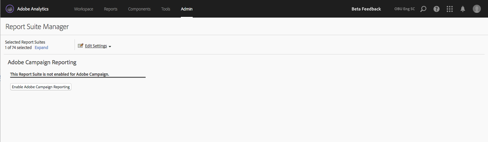

# Adobe Campaign Standard-rapportering

Mer information om hur du konfigurerar den här integreringen finns i [dokumentationen för Adobe Campaign](https://helpx.adobe.com/se/campaign/standard/integrating/using/about-campaign-analytics-integration.html).

>[!IMPORTANT]
>Den här artikeln gäller endast Adobe Campaign **Standard** -rapportering. Se [här](/help/integrate/analytics-to-campaign-classic.md) om du vill lägga till Adobe Campaign **Classic**-rapportering.

Integrationen mellan Adobe Analytics och Adobe Campaign Standard:

* Här kan du dela dina KPI-data (Key Performance Indicator) från Adobe Campaign Standard till Adobe Analytics.
* Förbättrar spårningsformler med Adobe Analytics-parametrar.
* Lägger till en ny rapport under **[!UICONTROL Analytics]** > **[!UICONTROL Reports]** > **[!UICONTROL Adobe Campaign.]**
* Lägger till fem nya Adobe Campaign-klassificeringar.
* Lägger till nio nya Adobe Campaign-mått.
* Lägger till sex nya Adobe Campaign-dimensioner.
* Synkroniserar data till Analytics var 15:e minut via en automatiskt etablerad Data Source.

## Steg 1. Aktivera Adobe Campaign Standard-rapportering {#section_C685EF10505045708A6536BB13F6CD58}

För att kunna visa Campaign Standard-data i Analytics måste ni först aktivera Campaign-rapportering i Report Suite Manager.

1. Navigera till  **[!UICONTROL Analytics]** > **[!UICONTROL Admin]** > **[!UICONTROL Report Suites]** > **`<select report suite>`** > **[!UICONTROL Edit Settings]** > **[!UICONTROL Adobe Campaign]** > **[!UICONTROL Adobe Campaign Reporting]**.
1. Klicka på **[!UICONTROL Enable Campaign Reporting]**.

   

## Steg 2. Visa Adobe Campaign-rapporter {#section_9C18A29F3CC54BD4AC5EA96417F17B33}

Integrationen mellan Adobe Campaign Standard och Adobe Analytics ger följande rapport under **[!UICONTROL Analytics]** > **[!UICONTROL Reports]**

* **[!UICONTROL Adobe Campaign Executed Delivery ID]**: Visar data som importerats från Adobe Campaign om e-postmeddelanden som skickats från Adobe Campaign. |

## Steg 3. Använda Adobe Campaign-klassificeringar {#section_74A28AF3F4CA4091943789DE4D8B2B63}

**[!UICONTROL Analytics]** > **[!UICONTROL Admin]** > **[!UICONTROL Report Suites]** > **`<select report suite>`** > **[!UICONTROL Edit Settings]** > **[!UICONTROL Adobe Campaign]** > **[!UICONTROL Adobe Campaign Classifications]**

När rapportsviten har aktiverats för Adobe Campaign finns följande klassificeringar:

| Klassificering | Beskrivning |
| --- | --- |
| [!UICONTROL Delivery ID] | Namn på intern leverans som visas i Campaign |
| [!UICONTROL Delivery Label] | Leverans i kampanj - enskild leverans/återkommande leverans/transaktionsleverans |
| [!UICONTROL Campaign ID] | Internt kampanjnamn som du ser i Campaign |
| [!UICONTROL Campaign Label] | Campaign i Adobe Campaign |
| [!UICONTROL Executed Delivery Label] | Lista över enskilda utförda leveranser |

## Adobe Campaign Standard mått och mätvärden finns i Adobe Analytics {#section_F33385C9660644AF84172EC39601469B}

Följande **mätvärden** är tillgängliga från Campaign i Adobe Analytics-rapportsviter:

* Adobe Campaign - skickat
* Adobe Campaign - öppnat
* Adobe Campaign - klickat
* Adobe Campaign - levererat
* Adobe Campaign - unikt öppnat
* Adobe Campaign - unikt klickat
* Adobe Campaign - avbeställt
* Adobe Campaign - totala avhopp
* Instanser för leverans-ID som körts i Adobe Campaign

Följande **dimensioner** är tillgängliga från Campaign i rapportsviterna för Adobe Analytics:

| Dimensionsnamn | Definition |
| --- | --- |
| Kampanj-ID | ID för alla kampanjer för vilka KPI har skickats under varaktigheten. |
| Kampanjetikett | Etiketter för kampanj-ID:n |
| Leverans-ID | ID för alla leveranser för vilka KPI har skickats under varaktigheten. Innehåller även ID:n för huvudleveranser av återkommande leveranser och transaktionsleveranser. Exempel: En DM1 med återkommande leverans schemalades och DM2, DM3, DM4 och DM5 var underordnade leveranser för den återkommande leveransen.  Leverans-ID:t visar resultat för alla leveranser, DM1 till DM5. |
| Leveransetikett | Etiketter för leverans-ID |
| Utfört leverans-ID | ID:n för endast utförda leveranser. Inget ID för återkommande/transaktionell huvudleverans. Exempel: En DM1 med återkommande leverans schemalades och DM2, DM3, DM4 och DM5 var underordnade leveranser för den återkommande leveransen. Utfört leverans-ID visar resultat för alla leveranser från DM2 till DM5 - de leveranser som faktiskt har utförts. |
| Etikett för utförd leverans | Etiketter för utförda leverans-ID:n |
