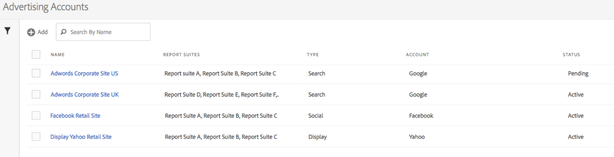

# Konfigurera ett annonskonto

Adobe Analytics-administratörer kan skapa nya annonskonton och mappa flera konton till flera rapportsviter (1:1, 1:Many, Many:Many).

Administratörer kan också [bevilja icke-administratörer](/help/integrate/c-advertising-analytics/overview.md#section_FCC58EB635954A32990D4E67B52B4369) åtkomst för att skapa annonskonton.

1. In Adobe Analytics, navigate to **[!UICONTROL Admin]** > **[!UICONTROL Advertising Accounts]**.
1. (Endast första gången) Godkänn villkoren i slutanvändaravtalet.
1. Klicka på **[!UICONTROL + Add]**.
1. I [!UICONTROL New Search Engine Account] dialogrutan visas:

   

1. Fyll i **[!UICONTROL Search Engine Settings]** följande riktlinjer:

   <table id="table_B3BE66B7D4C54766B8FFD2C6DCD657AF"> 
    <thead> 
      <tr> 
      <th colname="col1" class="entry"> Inställning </th> 
      <th colname="col2" class="entry"> Beskrivning </th> 
      </tr>
    </thead>
    <tbody> 
      <tr> 
      <td colname="col1"> 
Typ 
 </td> 
      <td colname="col2"> 
Du har två alternativ: Google AdWords och Microsoft Bing Ads. 
 
Obs! Yahoo Gemini absorberades av Microsoft Bing den 31 mars 2019. Detta innebär att annonskontoalternativet Yahoo Gemini inte längre är tillgängligt.  
 </td> 
      </tr> 
      <tr> 
      <td colname="col1"> 
Kontonamn 
 </td> 
      <td colname="col2"> 
Du kan ange det här kontonamnet till vilket namn som helst som passar dig. Det här är det egna namnet på kontot som ska visas i användargränssnittet. 
 </td> 
      </tr> 
      <tr> 
      <td colname="col1"> 
OAuth-token 
 </td> 
      <td colname="col2"> 
Obs!  OAuth är en öppen standard för åtkomstdelegering som ofta används som ett sätt att ge webbplatser eller program åtkomst till deras information på andra webbplatser, men utan att ge dem något lösenord. 
 
Obs!  Du kommer att märka att du dirigeras till en URL-adress från tredje part (efrontier.com). Adobe använder efrontier för att driva OAuth-autentiseringsprocessen för alla tre sökmotorer. 
 
Obs!  Om du använder Internet Explorer 11 (eller tidigare) kan du inte hämta Oauth-token för någon av de tre sökmotorerna. Använd i stället andra webbläsare. 
 
När du klickar på Hämta token startas OAuth2-autentiseringsprocessen. Det innebär att du blir ombedd att logga in på ditt Google/Bing-sökkonto med dina inloggningsuppgifter. Beroende på vilken sökmotor du väljer är processen något annorlunda: 
 
        <ul id="ul_FC9B5612F6554495B04C357CB0AB72EB"> 
        <li id="li_CD54231BFF134F83B3B5B14B34A0E1D2">Google Adwords: Ange konto-ID för Google. </li> 
        <li id="li_89B9D54BAA914E5DB2959B193489582E">Microsoft Bing: Ange Bing-konto-ID och Bing-kund-ID. </li> 
        </ul> 
Mer information om dessa ID finns i <a href="/help/integrate/c-advertising-analytics/c-adanalytics-workflow/aa-locate-account-id.md"  > Hitta ditt konto-ID</a> . 
 
När du har loggat in visas OAuth-tokenfältet 
        <systemoutput>
          Hämtat
        </systemoutput>. 
 </td> 
      </tr> 
    </tbody> 
    </table>

1. I det här **[!UICONTROL Tracking]** avsnittet finns information om hur sökmotordata spåras av din Adobe Analytics-implementering. Detta är ett nödvändigt steg för att utöka Adobe Analytics-data med sökmotordata.
Fyll i **[!UICONTROL Tracking Settings]** följande riktlinjer:

   | Inställning | Beskrivning |
   |--- |--- |
   | Typ | <ul><li>**Auto:** Låter Advertising Cloud Engine avgöra hur spårningsparametrarna läggs till i sökmotorns spårningsmallar/mål-URL:er. Detta är det enklaste sättet, men kanske inte ger den bästa integrerade datauppsättningen. **Viktigt:**Om du vill konfigurera ett sökmotorkonto i Automatiskt läge ansvarar du för följande åtgärder: - Parametern s_kwcid och värdet läggs till i kontospårningsmallarna eller URL:erna för landningssidan på kontot som läggs till. Den infogas i slutet av URL:en. Därför kan ytterligare åtgärder krävas från din sida om webbservern kräver ett visst nyckel=värde-par i slutet av URL:en ELLER en uppdatering som stöder ett nytt nyckel=värde-par i URL:en.** Obs!**Läs mer om huruvida du bör lägga till den här parametern i[Content Security Policy](https://docs.adobe.com/content/help/en/id-service/using/reference/csp.html). - Nyckelord kan dessutom infogas i landnings-URL:en som en del av värdet &quot;s_kwcid&quot;, så om de innehåller specialtecken eller symboler måste du bekräfta att webbservern kan hantera dessa tecken (ett exempel på ett vanligt specialtecken är &quot;+&quot; som används i nyckelorden &quot;Bred matchning ändrad&quot;).</li><li>**Manuell:** Gör att du kan hantera hur spårningsparametrarna läggs till i sökmotorns spårningsmallar/mål-URL:er. [Se de här manuella spårningsexemplen för varje sökmotor](/help/integrate/c-advertising-analytics/c-adanalytics-workflow/aa-manual-vs-automatic-tracking.md).</li></ul> |

1. I **[!UICONTROL Mapping]** avsnittet väljer du vilka rapportsviter som ska länkas till det här sökmotorkontot. Du måste ange minst en rapportserie innan du kan spara Advertising Account. Du kan mappa flera konton till flera rapportsviter (1:1, 1:Many, Many:Many). Observera att de data som AMO hämtar från sökmotorn helt enkelt kopieras till en mappad rapportsvit, så att inga data delas upp.

   >[!IMPORTANT]
   >
   >Endast rapportsviter som har [mappats till en Experience Cloud-organisation](https://docs.adobe.com/content/help/sv-SE/core-services/interface/about-core-services/report-suite-mapping.html) kan väljas. Om du inte kan se din rapportsserie läser du i [Felsök Advertising Analytics](/help/integrate/c-advertising-analytics/c-adanalytics-workflow/aa-troubleshooting.md).

   I följande **[!UICONTROL Mapping Settings]** riktlinjer:

   <table id="table_AF876DC40F97403882C0AA528BD204FF"> 
    <thead> 
      <tr> 
      <th colname="col1" class="entry"> Inställning </th> 
      <th colname="col2" class="entry"> Beskrivning </th> 
      </tr>
    </thead>
    <tbody> 
      <tr> 
      <td colname="col1"> 
Rapportsvitsmappning 
 </td> 
      <td colname="col2"> 
Rapportsvitens mappning avgör vilket rapportpaket som länkas till det här sökmotorkontot. Med andra ord avgör den i vilken rapportssvit/vilka rapportsviter sökmotordata skickas. 
 
Om du inte kan se din rapportserie i listan kan du <a href="https://docs.adobe.com/content/help/sv-SE/core-services/interface/about-core-services/report-suite-mapping.html"  > mappa din rapportsvit till en Experience Cloud-organisation</a> med det här verktyget. 
 </td> 
      </tr> 
    </tbody> 
    </table>

1. Klicka på **[!UICONTROL Save]**.
1. När du har sparat en ansvarsfriskrivning visas en lista med undantag. Du ombeds bekräfta att du har läst och att du förstår det här avtalet. Klicka i kryssrutan och klicka sedan på **[!UICONTROL OK]**.

   Du kommer nu till gränssnittet för [kontohantering för annonsering](/help/integrate/c-advertising-analytics/c-adanalytics-workflow/aa-manage-ad-accounts.md), där ditt nya konto ska listas.

>[!NOTE]
>
>Du bör vänta minst 24 timmar innan sökmotordata börjar fylla i dina Analytics-rapporter.

