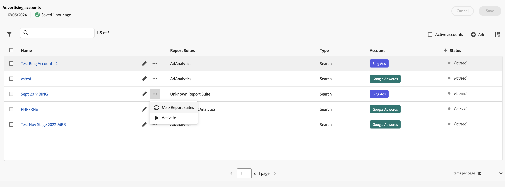

# Hantera annonskonton

Du kommer åt gränssnittet Advertising accounts genom att navigera till **[!UICONTROL Admin]** > **[!UICONTROL Advertising accounts]**.

Du ser en tabell över annonskontona. Om inga annonskonton är tillgängliga väljer du **[!UICONTROL Create new advertising account]**.

Tabellen består av följande kolumner:

| Namn eller element | Beskrivning |
|---|---|
| **[!UICONTROL Name]** | *Kontonamn*. Du kan markera namnet för att redigera inställningarna för sökmotorn. |
|  | Välj om du vill byta namn på annonskontot eller redigera inställningarna för sökmotorn. |
|  | Markera för att öppna en snabbmeny där du kan [kartrapporteringsprogram](#map-reporting-suites), [aktivera eller pausa annonskonton](#activate-or-pause-advertising-accounts). |
| **[!UICONTROL Report suites]** | Visar de rapportsviter som annonskontot är mappat till. |
| **[!UICONTROL Type]** | Visar typen av annonskonto. Som standard är typen [!UICONTROL Search] |
| **[!UICONTROL Account]** | Visa kontotypen, antingen [!UICONTROL Bing Ads] eller [!UICONTROL Google Adwords]. |
| **[!UICONTROL Status]** | Reklamkontots status: *Pausad* eller Aktiv. |

- Om du vill filtrera listan efter rapportsviten, typ och status väljer du 
- Om du vill söka efter ditt annonskonto med  sökfält.
- Markera om du vill välja aktiva konton i registret **[!UICONTROL Active accounts]**.
- Ange vilka kolumner som ska visas för tabellen genom att välja .  I **[!UICONTROL Customize table]** dialog:
   - Markera de kolumner som du vill visa.
   - Välj **[!UICONTROL Apply]**.

När du väljer ett eller flera annonskonton kan du använda ett blått åtgärdsfält baserat på statusen för de valda kontona för att  **[!UICONTROL Rename]**,  **[!UICONTROL Map Report Suites]**,  **[!UICONTROL Activate]** eller  **[!UICONTROL Pause]** era annonskonton.

## Skapa ett annonskonto

Så här skapar du ett nytt annonskonto:

1. Välj  **[!UICONTROL Add]**.
1. Du ser [!UICONTROL Advertising Accounts] > **[!UICONTROL New account]** så att du kan definiera ett nytt annonskonto. Se [Konfigurera ett annonskonto](aa-create-ad-account.md) för mer information.

## Redigera ett annonskonto

Så här redigerar du sökmotorinställningarna för ett annonskonto:

- Välj namnet på annonskontot.
- Välj  bredvid namnet på annonskontot.

## Kartrapporteringsprogram

Så här mappar du ett eller flera annonskonton till rapportsviter:

1. (valfritt) Välj mer än ett annonskonto.
1. Välj  för ett visst annonskonto.
1. Välj  **[!UICONTROL Map Report suites]** på snabbmenyn.
1. Välj en eller flera rapportsviter i listrutan i dialogrutan Kartrapportsviter. Du kan ta bort rapportsviter från mappningen med .
1. Välj **[!UICONTROL Save]** för att spara mappningen.

## Aktivera eller pausa annonskonton

Så här aktiverar du ett eller flera annonskonton:

1. (valfritt) Välj mer än ett annonskonto.
1. Välj  för ett visst annonskonto.
1. Välj  **[!UICONTROL Activate]** på snabbmenyn.

Så här pausar du ett eller flera annonskonton:

1. (valfritt) Välj mer än ett annonskonto.
1. Välj  för ett visst annonskonto.
1. Välj  **[!UICONTROL Pause]** på snabbmenyn.

